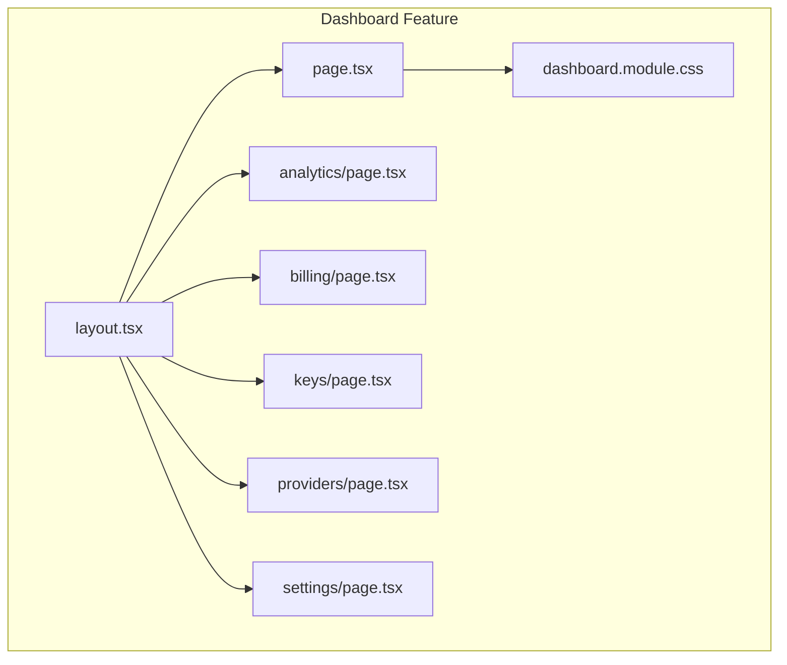
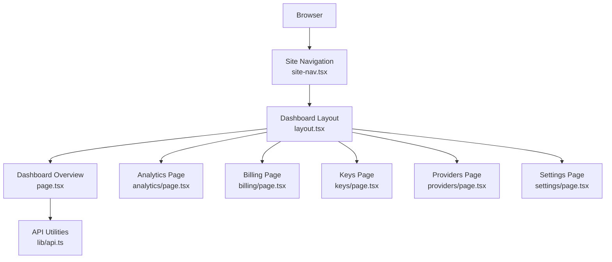
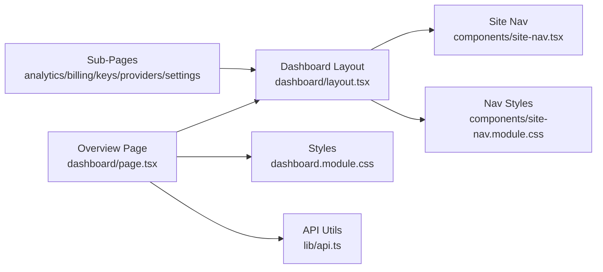

# Dashboard Overview

<cite>
**Referenced Files in This Document**
- [dashboard/page.tsx](file://src/app/dashboard/page.tsx)
- [dashboard/layout.tsx](file://src/app/dashboard/layout.tsx)
- [dashboard/dashboard.module.css](file://src/app/dashboard/dashboard.module.css)
- [analytics/page.tsx](file://src/app/dashboard/analytics/page.tsx)
- [billing/page.tsx](file://src/app/dashboard/billing/page.tsx)
- [keys/page.tsx](file://src/app/dashboard/keys/page.tsx)
- [providers/page.tsx](file://src/app/dashboard/providers/page.tsx)
- [settings/page.tsx](file://src/app/dashboard/settings/page.tsx)
- [site-nav.tsx](file://src/components/site-nav.tsx)
- [site-nav.module.css](file://src/components/site-nav.module.css)
- [api.ts](file://src/lib/api.ts)
</cite>

## Table of Contents
1. [Introduction](#introduction)
2. [Project Structure](#project-structure)
3. [Core Components](#core-components)
4. [Architecture Overview](#architecture-overview)
5. [Detailed Component Analysis](#detailed-component-analysis)
6. [Dependency Analysis](#dependency-analysis)
7. [Performance Considerations](#performance-considerations)
8. [Troubleshooting Guide](#troubleshooting-guide)
9. [Conclusion](#conclusion)
10. [Appendices](#appendices)

## Introduction
This document explains the main dashboard overview page, including its layout structure, navigation components, and key statistics display. It describes how users access different sections from the dashboard, use quick actions, and monitor system status. The guide also covers responsive design considerations, user interface elements, integration points with other features, common workflows, and best practices for efficient usage.

## Project Structure
The dashboard is implemented as a Next.js App Router feature under the dashboard route group. It includes:
- A shared layout that provides consistent chrome (header, sidebar, or top nav) across all dashboard pages
- An overview page that aggregates high-level metrics and quick links to sub-sections
- Sub-pages for analytics, billing, keys, providers, and settings
- Shared UI components and styles for consistency and responsiveness

**Diagram sources**
- [dashboard/layout.tsx](file://src/app/dashboard/layout.tsx)
- [dashboard/page.tsx](file://src/app/dashboard/page.tsx)
- [dashboard/dashboard.module.css](file://src/app/dashboard/dashboard.module.css)
- [analytics/page.tsx](file://src/app/dashboard/analytics/page.tsx)
- [billing/page.tsx](file://src/app/dashboard/billing/page.tsx)
- [keys/page.tsx](file://src/app/dashboard/keys/page.tsx)
- [providers/page.tsx](file://src/app/dashboard/providers/page.tsx)
- [settings/page.tsx](file://src/app/dashboard/settings/page.tsx)

**Section sources**
- [dashboard/layout.tsx](file://src/app/dashboard/layout.tsx)
- [dashboard/page.tsx](file://src/app/dashboard/page.tsx)
- [dashboard/dashboard.module.css](file://src/app/dashboard/dashboard.module.css)
- [analytics/page.tsx](file://src/app/dashboard/analytics/page.tsx)
- [billing/page.tsx](file://src/app/dashboard/billing/page.tsx)
- [keys/page.tsx](file://src/app/dashboard/keys/page.tsx)
- [providers/page.tsx](file://src/app/dashboard/providers/page.tsx)
- [settings/page.tsx](file://src/app/dashboard/settings/page.tsx)

## Core Components
- Dashboard Layout: Provides the shell for all dashboard routes, including navigation and content area. It ensures consistent header/sidebar behavior and responsive breakpoints.
- Dashboard Overview Page: Displays key statistics, recent activity, and quick actions. It serves as the central hub for navigating to analytics, billing, keys, providers, and settings.
- Navigation: Integrated via the site navigation component, enabling quick access to major areas of the application and deep links into dashboard sections.
- Styles: Module-scoped CSS for layout grids, cards, spacing, and responsive rules.

Key responsibilities:
- Render a responsive grid of metric cards and action tiles
- Provide clear entry points to sub-features
- Maintain consistent visual hierarchy and accessibility patterns
- Integrate with global navigation for cross-feature movement

**Section sources**
- [dashboard/layout.tsx](file://src/app/dashboard/layout.tsx)
- [dashboard/page.tsx](file://src/app/dashboard/page.tsx)
- [dashboard/dashboard.module.css](file://src/app/dashboard/dashboard.module.css)
- [site-nav.tsx](file://src/components/site-nav.tsx)
- [site-nav.module.css](file://src/components/site-nav.module.css)

## Architecture Overview
The dashboard follows a layered approach:
- Presentation layer: React components for layout, overview, and sub-pages
- Styling layer: CSS modules for scoped styles and responsive behavior
- Navigation layer: Shared site navigation for cross-app routing
- Data layer: Optional API calls for live metrics and status indicators

**Diagram sources**
- [site-nav.tsx](file://src/components/site-nav.tsx)
- [dashboard/layout.tsx](file://src/app/dashboard/layout.tsx)
- [dashboard/page.tsx](file://src/app/dashboard/page.tsx)
- [analytics/page.tsx](file://src/app/dashboard/analytics/page.tsx)
- [billing/page.tsx](file://src/app/dashboard/billing/page.tsx)
- [keys/page.tsx](file://src/app/dashboard/keys/page.tsx)
- [providers/page.tsx](file://src/app/dashboard/providers/page.tsx)
- [settings/page.tsx](file://src/app/dashboard/settings/page.tsx)
- [api.ts](file://src/lib/api.ts)

## Detailed Component Analysis

### Dashboard Layout
Responsibilities:
- Wraps all dashboard routes with consistent chrome
- Renders navigation and content regions
- Applies responsive breakpoints and layout constraints

User experience:
- Consistent header/sidebar across pages
- Predictable navigation behavior
- Accessible focus management and keyboard support

Integration:
- Uses shared site navigation for cross-feature links
- Can integrate with authentication and theme providers at this level if needed

**Section sources**
- [dashboard/layout.tsx](file://src/app/dashboard/layout.tsx)
- [site-nav.tsx](file://src/components/site-nav.tsx)
- [site-nav.module.css](file://src/components/site-nav.module.css)

### Dashboard Overview Page
Responsibilities:
- Aggregates high-level metrics and quick actions
- Provides direct links to analytics, billing, keys, providers, and settings
- Displays system status indicators where applicable

Layout structure:
- Top bar with title and contextual actions
- Metric cards in a responsive grid
- Quick actions section with prominent buttons
- Status panel for service health or usage summaries

Navigation:
- Links to sub-pages within the dashboard feature
- Integration with global navigation for broader app context

Accessibility:
- Semantic headings and landmarks
- Keyboard navigable controls
- Sufficient color contrast and focus states

**Section sources**
- [dashboard/page.tsx](file://src/app/dashboard/page.tsx)
- [dashboard/dashboard.module.css](file://src/app/dashboard/dashboard.module.css)

### Sub-Pages
- Analytics: Visualizes usage trends and performance metrics
- Billing: Shows plan details, invoices, and payment methods
- Keys: Lists and manages API keys with creation and revocation flows
- Providers: Configures and monitors provider integrations
- Settings: Manages user preferences and account configuration

Each sub-page inherits the dashboard layout and can include additional charts, tables, and forms tailored to their domain.

**Section sources**
- [analytics/page.tsx](file://src/app/dashboard/analytics/page.tsx)
- [billing/page.tsx](file://src/app/dashboard/billing/page.tsx)
- [keys/page.tsx](file://src/app/dashboard/keys/page.tsx)
- [providers/page.tsx](file://src/app/dashboard/providers/page.tsx)
- [settings/page.tsx](file://src/app/dashboard/settings/page.tsx)

### Navigation Integration
The site navigation component provides:
- Global links to core areas (e.g., chat, docs, pricing)
- Contextual links into dashboard sections
- Responsive mobile menu behavior

Best practices:
- Keep primary actions visible and predictable
- Use active state highlighting for current location
- Ensure keyboard and screen reader compatibility

**Section sources**
- [site-nav.tsx](file://src/components/site-nav.tsx)
- [site-nav.module.css](file://src/components/site-nav.module.css)

### Data and Status Indicators
Where applicable, the overview page may fetch lightweight metrics or status signals using shared API utilities. This keeps the dashboard performant while providing up-to-date insights.

Common patterns:
- Lightweight GET requests for summary data
- Error boundaries and fallback states for failed loads
- Debounced refreshes for non-critical metrics

**Section sources**
- [dashboard/page.tsx](file://src/app/dashboard/page.tsx)
- [api.ts](file://src/lib/api.ts)

## Dependency Analysis
High-level dependencies:
- Dashboard Overview depends on the dashboard layout for chrome and navigation
- Sub-pages depend on the layout and may consume API utilities for data
- Site navigation is shared across the app and integrates with dashboard routes
- Styles are module-scoped to avoid global conflicts

**Diagram sources**
- [dashboard/page.tsx](file://src/app/dashboard/page.tsx)
- [dashboard/layout.tsx](file://src/app/dashboard/layout.tsx)
- [dashboard/dashboard.module.css](file://src/app/dashboard/dashboard.module.css)
- [site-nav.tsx](file://src/components/site-nav.tsx)
- [site-nav.module.css](file://src/components/site-nav.module.css)
- [api.ts](file://src/lib/api.ts)
- [analytics/page.tsx](file://src/app/dashboard/analytics/page.tsx)
- [billing/page.tsx](file://src/app/dashboard/billing/page.tsx)
- [keys/page.tsx](file://src/app/dashboard/keys/page.tsx)
- [providers/page.tsx](file://src/app/dashboard/providers/page.tsx)
- [settings/page.tsx](file://src/app/dashboard/settings/page.tsx)

**Section sources**
- [dashboard/page.tsx](file://src/app/dashboard/page.tsx)
- [dashboard/layout.tsx](file://src/app/dashboard/layout.tsx)
- [dashboard/dashboard.module.css](file://src/app/dashboard/dashboard.module.css)
- [site-nav.tsx](file://src/components/site-nav.tsx)
- [site-nav.module.css](file://src/components/site-nav.module.css)
- [api.ts](file://src/lib/api.ts)
- [analytics/page.tsx](file://src/app/dashboard/analytics/page.tsx)
- [billing/page.tsx](file://src/app/dashboard/billing/page.tsx)
- [keys/page.tsx](file://src/app/dashboard/keys/page.tsx)
- [providers/page.tsx](file://src/app/dashboard/providers/page.tsx)
- [settings/page.tsx](file://src/app/dashboard/settings/page.tsx)

## Performance Considerations
- Prefer static or cached data for initial render; lazy-load heavy charts or tables when necessary
- Use lightweight endpoints for overview metrics to reduce payload size
- Avoid unnecessary re-renders by memoizing expensive computations and stable props
- Defer non-critical network calls until after first paint
- Optimize images and assets used in dashboard visuals

[No sources needed since this section provides general guidance]

## Troubleshooting Guide
Common issues and resolutions:
- Metrics not loading: Verify API connectivity and error handling paths; ensure fallback UI is displayed
- Navigation links not working: Confirm route definitions and active link states in the site navigation
- Layout misalignment on small screens: Check CSS media queries and grid/flex configurations in dashboard styles
- Accessibility problems: Validate semantic markup, focus order, and ARIA attributes

Operational tips:
- Inspect network requests for slow or failing endpoints
- Use browser dev tools to test responsive breakpoints
- Add logging around critical user actions for diagnostics

**Section sources**
- [dashboard/page.tsx](file://src/app/dashboard/page.tsx)
- [dashboard/dashboard.module.css](file://src/app/dashboard/dashboard.module.css)
- [site-nav.tsx](file://src/components/site-nav.tsx)
- [api.ts](file://src/lib/api.ts)

## Conclusion
The dashboard overview page acts as the central hub for monitoring system status, accessing key statistics, and navigating to specialized sections. Its modular layout, consistent navigation, and responsive design provide a smooth user experience. By following the recommended workflows and best practices, users can efficiently manage their workspace and quickly reach the features they need.

[No sources needed since this section summarizes without analyzing specific files]

## Appendices

### Common Workflows
- Review usage and performance: Open the overview, check metric cards, then navigate to analytics for detailed charts
- Manage API keys: From the overview, go to keys to create, rotate, or revoke keys
- Configure providers: Navigate to providers to add or update integrations
- Adjust settings: Use settings to update preferences and account details

### Best Practices
- Keep primary actions prominent and accessible
- Use clear labels and concise copy for metric cards and buttons
- Ensure keyboard navigation and screen reader support
- Test responsive layouts across devices and orientations
- Monitor performance and optimize data fetching strategies

[No sources needed since this section provides general guidance]