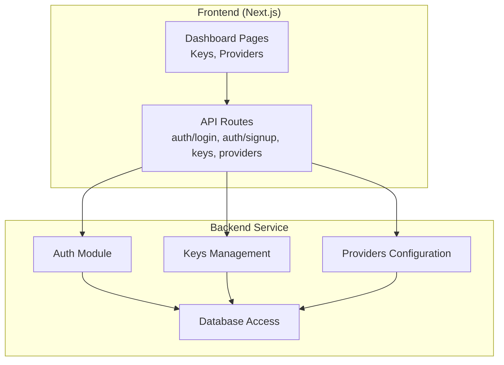
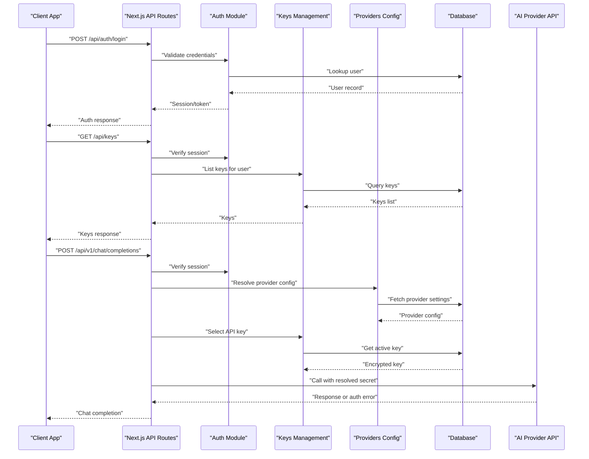
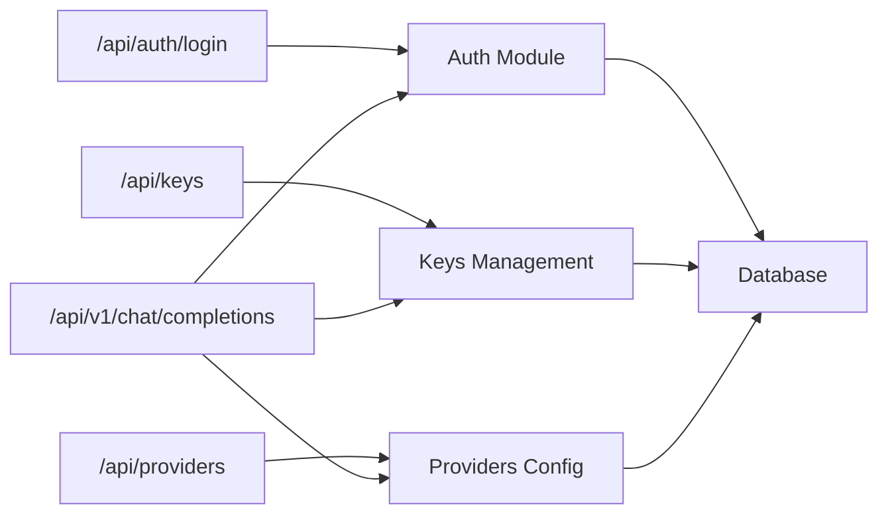

# Authentication Setup

<cite>
**Referenced Files in This Document**
- [backend/src/auth.ts](file://backend/src/auth.ts)
- [backend/src/keys.ts](file://backend/src/keys.ts)
- [backend/src/providers.ts](file://backend/src/providers.ts)
- [src/app/api/auth/login/route.ts](file://src/app/api/auth/login/route.ts)
- [src/app/api/auth/signup/route.ts](file://src/app/api/auth/signup/route.ts)
- [src/app/api/keys/route.ts](file://src/app/api/keys/route.ts)
- [src/app/api/providers/route.ts](file://src/app/api/providers/route.ts)
- [src/app/dashboard/keys/page.tsx](file://src/app/dashboard/keys/page.tsx)
- [src/app/dashboard/providers/page.tsx](file://src/app/dashboard/providers/page.tsx)
- [backend/src/index.ts](file://backend/src/index.ts)
- [backend/src/db.ts](file://backend/src/db.ts)
</cite>

## Table of Contents
1. [Introduction](#introduction)
2. [Project Structure](#project-structure)
3. [Core Components](#core-components)
4. [Architecture Overview](#architecture-overview)
5. [Detailed Component Analysis](#detailed-component-analysis)
6. [Dependency Analysis](#dependency-analysis)
7. [Performance Considerations](#performance-considerations)
8. [Troubleshooting Guide](#troubleshooting-guide)
9. [Conclusion](#conclusion)
10. [Appendices](#appendices)

## Introduction
This document explains how to configure authentication methods across multiple AI providers in the application. It covers API key setup, OAuth flows, environment variable configuration, security best practices (credential storage, rotation, least privilege), provider-specific requirements, error handling for auth failures, and troubleshooting steps. The goal is to help developers and operators set up secure, reliable access to AI providers from both backend services and frontend dashboards.

## Project Structure
The repository includes:
- Backend service modules for authentication, keys management, provider configuration, and database access.
- Next.js API routes for user-facing endpoints such as login, signup, keys, providers, and chat completions.
- Dashboard pages for managing keys and providers.

[No sources needed since this diagram shows conceptual workflow, not actual code structure]

## Core Components
- Authentication module: Handles user sessions, token issuance/validation, and integration points for provider credentials.
- Keys management: CRUD operations for API keys, including creation, listing, revocation, and scoping.
- Providers configuration: Stores provider settings, secrets, and connection metadata; supports per-user or global defaults.
- Database layer: Persists users, keys, provider configurations, and usage metrics.

Key responsibilities:
- Securely store and rotate secrets.
- Enforce least-privilege access to provider APIs.
- Provide consistent error responses for auth failures.
- Expose safe APIs for dashboard and client interactions.

**Section sources**
- [backend/src/auth.ts](file://backend/src/auth.ts)
- [backend/src/keys.ts](file://backend/src/keys.ts)
- [backend/src/providers.ts](file://backend/src/providers.ts)
- [backend/src/db.ts](file://backend/src/db.ts)

## Architecture Overview
Authentication spans three layers:
- Frontend API routes: Validate requests, enforce session checks, and proxy calls to backend services.
- Backend modules: Implement business logic for auth, keys, and providers; interact with the database.
- External AI providers: Require either API keys or OAuth tokens to authorize requests.

**Diagram sources**
- [src/app/api/auth/login/route.ts](file://src/app/api/auth/login/route.ts)
- [src/app/api/keys/route.ts](file://src/app/api/keys/route.ts)
- [src/app/api/providers/route.ts](file://src/app/api/providers/route.ts)
- [src/app/api/v1/chat/completions/route.ts](file://src/app/api/v1/chat/completions/route.ts)
- [backend/src/auth.ts](file://backend/src/auth.ts)
- [backend/src/keys.ts](file://backend/src/keys.ts)
- [backend/src/providers.ts](file://backend/src/providers.ts)
- [backend/src/db.ts](file://backend/src/db.ts)

## Detailed Component Analysis

### Authentication Module
Responsibilities:
- User registration and login flows.
- Session or token issuance and validation.
- Middleware-like guards for protected routes.
- Integration with provider credential resolution.

Security considerations:
- Use strong hashing for passwords.
- Issue short-lived tokens with refresh mechanisms.
- Bind tokens to user context and scopes.
- Reject invalid or expired tokens early.

Error handling:
- Return standardized errors for invalid credentials, expired sessions, and forbidden actions.
- Avoid leaking provider details in error messages.

**Section sources**
- [backend/src/auth.ts](file://backend/src/auth.ts)
- [src/app/api/auth/login/route.ts](file://src/app/api/auth/login/route.ts)
- [src/app/api/auth/signup/route.ts](file://src/app/api/auth/signup/route.ts)

### Keys Management
Responsibilities:
- Create, list, update, and revoke API keys.
- Associate keys with users and optional scopes.
- Encrypt and securely store secrets.
- Rotate keys without downtime.

Operational guidance:
- Support key naming and tagging for auditability.
- Enforce minimum key lifetime policies.
- Log key usage events for monitoring.

Error handling:
- Distinguish between missing keys, revoked keys, and insufficient permissions.
- Provide actionable messages for key rotation.

**Section sources**
- [backend/src/keys.ts](file://backend/src/keys.ts)
- [src/app/api/keys/route.ts](file://src/app/api/keys/route.ts)
- [src/app/dashboard/keys/page.tsx](file://src/app/dashboard/keys/page.tsx)

### Providers Configuration
Responsibilities:
- Store provider settings and secrets (e.g., API keys, OAuth client IDs/secrets).
- Resolve which provider to use for a given request.
- Manage per-user overrides and global defaults.
- Validate provider connectivity and credentials.

Provider-specific notes:
- Some providers require only an API key.
- Others support OAuth client credentials or user-delegated flows.
- Ensure correct endpoint URLs and header formats.

Error handling:
- Surface provider auth failures distinctly (invalid key, unauthorized, rate limited).
- Cache successful validations to reduce overhead.

**Section sources**
- [backend/src/providers.ts](file://backend/src/providers.ts)
- [src/app/api/providers/route.ts](file://src/app/api/providers/route.ts)
- [src/app/dashboard/providers/page.tsx](file://src/app/dashboard/providers/page.tsx)

### Database Layer
Responsibilities:
- Persist users, keys, provider configs, and usage logs.
- Provide transactional guarantees for sensitive updates.
- Support indexing for fast lookups by user and provider.

Security considerations:
- Encrypt secrets at rest.
- Restrict DB access to service accounts with minimal privileges.
- Audit changes to secrets and configurations.

**Section sources**
- [backend/src/db.ts](file://backend/src/db.ts)

### Chat Completions Endpoint
Responsibilities:
- Authenticate the caller.
- Resolve provider and credentials.
- Forward requests to the selected provider.
- Stream or return responses consistently.

Error handling:
- Normalize provider errors into standard responses.
- Include correlation IDs for tracing.

**Section sources**
- [src/app/api/v1/chat/completions/route.ts](file://src/app/api/v1/chat/completions/route.ts)

## Dependency Analysis
High-level dependencies:
- API routes depend on backend modules for auth, keys, and providers.
- Backend modules depend on the database layer for persistence.
- Provider resolution depends on stored configurations and active keys.

**Diagram sources**
- [src/app/api/auth/login/route.ts](file://src/app/api/auth/login/route.ts)
- [src/app/api/keys/route.ts](file://src/app/api/keys/route.ts)
- [src/app/api/providers/route.ts](file://src/app/api/providers/route.ts)
- [src/app/api/v1/chat/completions/route.ts](file://src/app/api/v1/chat/completions/route.ts)
- [backend/src/auth.ts](file://backend/src/auth.ts)
- [backend/src/keys.ts](file://backend/src/keys.ts)
- [backend/src/providers.ts](file://backend/src/providers.ts)
- [backend/src/db.ts](file://backend/src/db.ts)

**Section sources**
- [backend/src/index.ts](file://backend/src/index.ts)

## Performance Considerations
- Cache validated provider configurations and keys where appropriate.
- Minimize round-trips by resolving provider and key once per request.
- Use streaming for long-running provider calls to improve perceived latency.
- Rate-limit auth endpoints to prevent brute-force attempts.
- Monitor and alert on auth failure spikes.

[No sources needed since this section provides general guidance]

## Troubleshooting Guide
Common issues and resolutions:
- Invalid or expired API key: Verify key status and expiration; rotate if necessary.
- Missing provider configuration: Ensure provider is enabled and secrets are set.
- OAuth misconfiguration: Check client ID/secret, redirect URIs, and scopes.
- Permission denied: Confirm user has required scopes and key permissions.
- Network timeouts: Validate provider endpoints and firewall rules.

Diagnostic steps:
- Inspect auth middleware logs for token validity and scope checks.
- Review provider resolution logs for selected provider and key selection.
- Test provider connectivity with a minimal request using stored secrets.
- Enable correlation IDs to trace requests end-to-end.

**Section sources**
- [backend/src/auth.ts](file://backend/src/auth.ts)
- [backend/src/keys.ts](file://backend/src/keys.ts)
- [backend/src/providers.ts](file://backend/src/providers.ts)

## Conclusion
A robust authentication strategy combines secure credential storage, clear separation of concerns, and comprehensive error handling. By centralizing provider configuration, enforcing least privilege, and providing operational tooling for key rotation and monitoring, the system can reliably integrate with multiple AI providers while maintaining strong security posture.

[No sources needed since this section summarizes without analyzing specific files]

## Appendices

### Environment Variables and Secrets
Recommended variables:
- Database connection string and credentials.
- Application signing secret for tokens.
- Provider secrets (API keys, OAuth client IDs/secrets).
- Feature flags for enabling/disabling providers.

Best practices:
- Load secrets from a secure vault or platform secret manager.
- Never commit secrets to version control.
- Use separate environments for development, staging, and production.

[No sources needed since this section provides general guidance]

### Security Best Practices
- Store secrets encrypted at rest and in transit.
- Rotate keys regularly and automate rotation workflows.
- Apply least privilege: restrict keys to minimal scopes and quotas.
- Audit all access to secrets and configuration changes.
- Use short-lived tokens and refresh mechanisms.
- Validate and sanitize all inputs before forwarding to providers.

[No sources needed since this section provides general guidance]

### Provider-Specific Notes
- API Key-only providers: Supply key via provider configuration; ensure it is scoped minimally.
- OAuth-enabled providers: Configure client credentials and redirect URIs; handle token exchange and refresh.
- Regional endpoints: Select correct base URLs per region to avoid latency and compliance issues.

[No sources needed since this section provides general guidance]