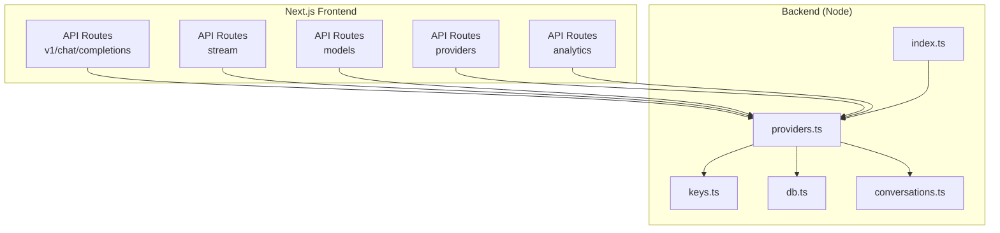
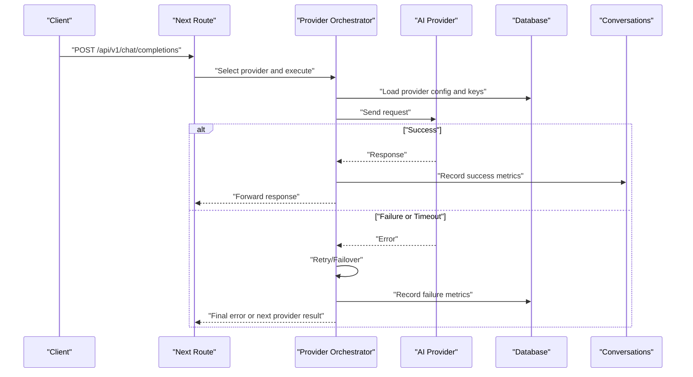
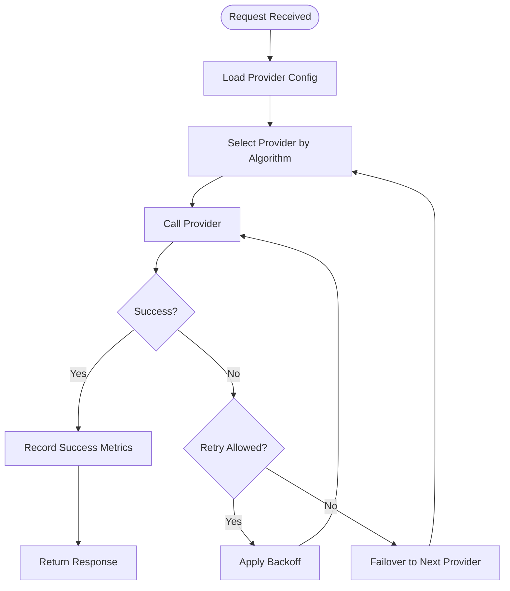
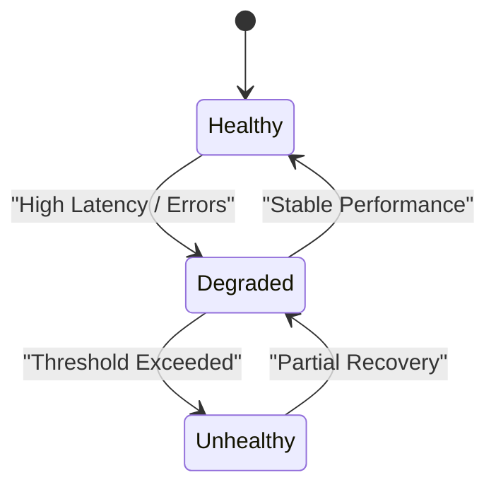
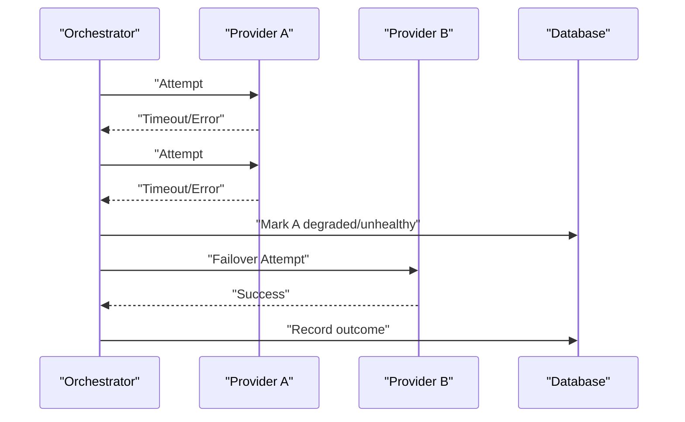
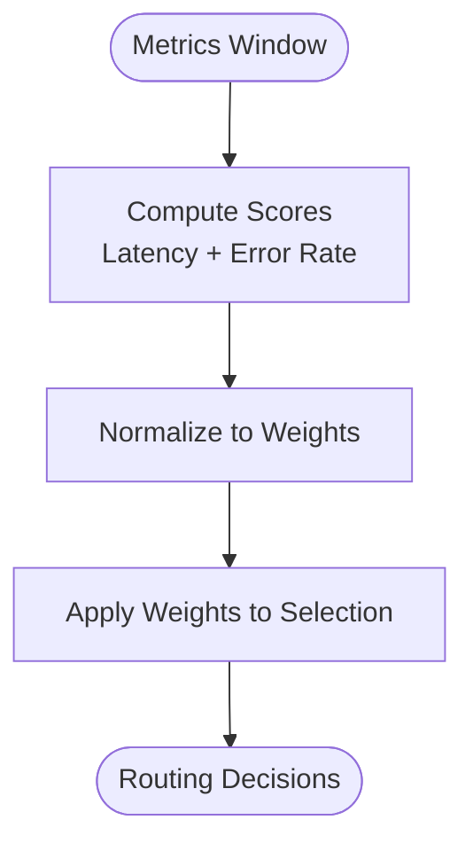
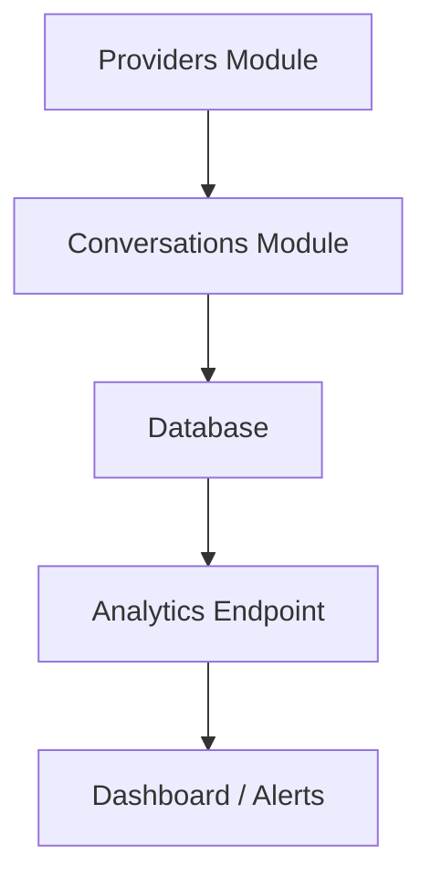
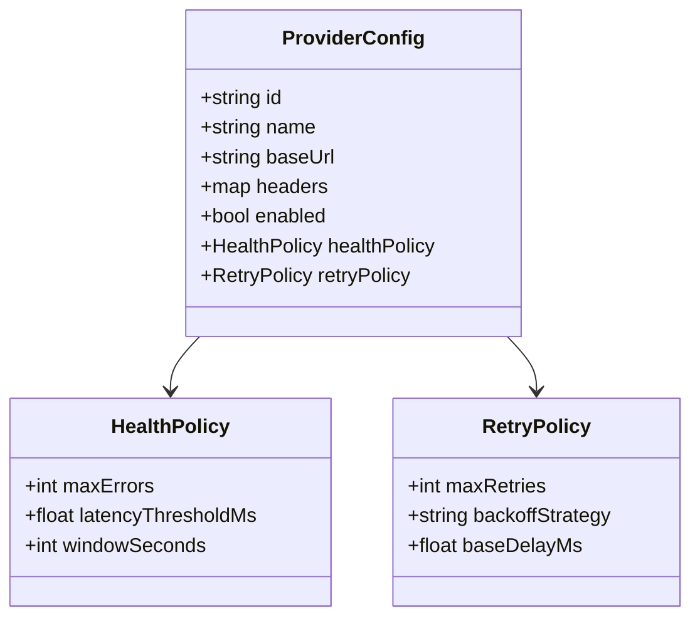
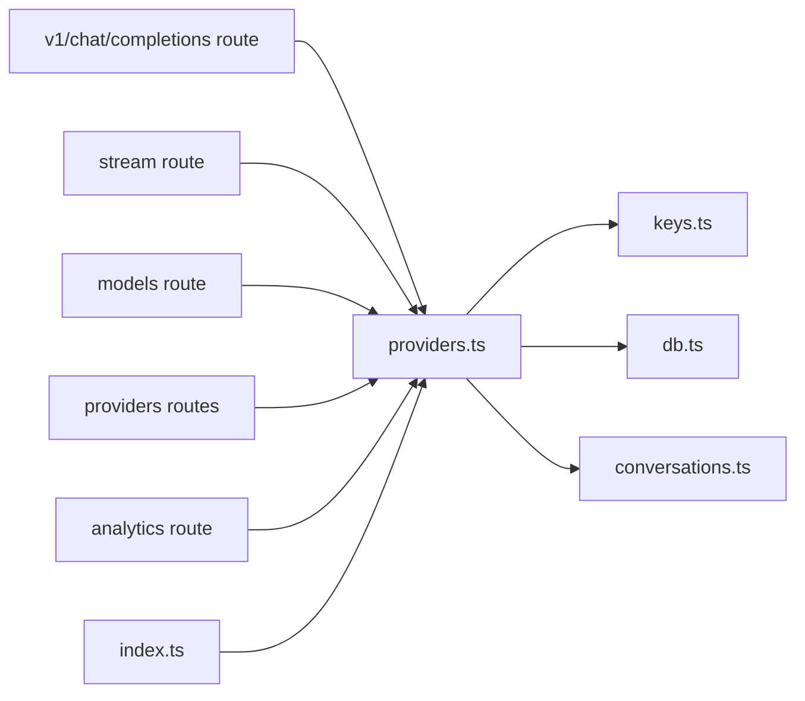

# Load Balancing & Fallback

<cite>
**Referenced Files in This Document**
- [backend/src/providers.ts](file://backend/src/providers.ts)
- [backend/src/index.ts](file://backend/src/index.ts)
- [backend/src/keys.ts](file://backend/src/keys.ts)
- [backend/src/conversations.ts](file://backend/src/conversations.ts)
- [backend/src/db.ts](file://backend/src/db.ts)
- [src/app/api/v1/chat/completions/route.ts](file://src/app/api/v1/chat/completions/route.ts)
- [src/app/api/stream/route.ts](file://src/app/api/stream/route.ts)
- [src/app/api/models/route.ts](file://src/app/api/models/route.ts)
- [src/app/api/providers/route.ts](file://src/app/api/providers/route.ts)
- [src/app/api/providers/[id]/route.ts](file://src/app/api/providers/[id]/route.ts)
- [src/app/api/analytics/route.ts](file://src/app/api/analytics/route.ts)
</cite>

## Table of Contents
1. [Introduction](#introduction)
2. [Project Structure](#project-structure)
3. [Core Components](#core-components)
4. [Architecture Overview](#architecture-overview)
5. [Detailed Component Analysis](#detailed-component-analysis)
6. [Dependency Analysis](#dependency-analysis)
7. [Performance Considerations](#performance-considerations)
8. [Troubleshooting Guide](#troubleshooting-guide)
9. [Conclusion](#conclusion)
10. [Appendices](#appendices)

## Introduction
This document explains how the system supports multiple AI providers with load balancing and fallback mechanisms. It covers request distribution, failover strategies, health checking, automatic provider switching, performance-based routing, retry policies, and monitoring reliability metrics. The goal is to help you configure robust multi-provider orchestration that remains resilient under outages and variable performance.

## Project Structure
The project is a Next.js application with a Node backend. Provider orchestration and routing are implemented primarily in the backend, while API routes expose endpoints for chat completions, streaming, models, providers management, and analytics.

**Diagram sources**
- [backend/src/providers.ts](file://backend/src/providers.ts)
- [backend/src/index.ts](file://backend/src/index.ts)
- [backend/src/keys.ts](file://backend/src/keys.ts)
- [backend/src/db.ts](file://backend/src/db.ts)
- [backend/src/conversations.ts](file://backend/src/conversations.ts)
- [src/app/api/v1/chat/completions/route.ts](file://src/app/api/v1/chat/completions/route.ts)
- [src/app/api/stream/route.ts](file://src/app/api/stream/route.ts)
- [src/app/api/models/route.ts](file://src/app/api/models/route.ts)
- [src/app/api/providers/route.ts](file://src/app/api/providers/route.ts)
- [src/app/api/analytics/route.ts](file://src/app/api/analytics/route.ts)

**Section sources**
- [backend/src/providers.ts](file://backend/src/providers.ts)
- [backend/src/index.ts](file://backend/src/index.ts)
- [src/app/api/v1/chat/completions/route.ts](file://src/app/api/v1/chat/completions/route.ts)
- [src/app/api/stream/route.ts](file://src/app/api/stream/route.ts)
- [src/app/api/models/route.ts](file://src/app/api/models/route.ts)
- [src/app/api/providers/route.ts](file://src/app/api/providers/route.ts)
- [src/app/api/analytics/route.ts](file://src/app/api/analytics/route.ts)

## Core Components
- Provider registry and selection: Centralized logic to discover available providers, select one per request, and route calls accordingly.
- Key management: Secure storage and retrieval of provider credentials used during requests.
- Database integration: Persistence for provider configurations, keys, usage, and conversation history.
- Conversations module: Aggregates request/response data and outcomes for analytics and retries.
- API layer: Exposes REST endpoints for chat completions, streaming, model listing, provider management, and analytics.

Key responsibilities:
- Distribute traffic across providers using configurable algorithms.
- Implement failover by automatically switching to healthy providers on errors or timeouts.
- Track health and performance metrics to inform routing decisions.
- Persist usage and outcomes for observability and billing.

**Section sources**
- [backend/src/providers.ts](file://backend/src/providers.ts)
- [backend/src/keys.ts](file://backend/src/keys.ts)
- [backend/src/db.ts](file://backend/src/db.ts)
- [backend/src/conversations.ts](file://backend/src/conversations.ts)
- [backend/src/index.ts](file://backend/src/index.ts)

## Architecture Overview
The architecture centers around a provider orchestrator that selects a target provider per request, handles retries and fallbacks, and records metrics. API routes delegate to this orchestrator.

**Diagram sources**
- [src/app/api/v1/chat/completions/route.ts](file://src/app/api/v1/chat/completions/route.ts)
- [backend/src/providers.ts](file://backend/src/providers.ts)
- [backend/src/db.ts](file://backend/src/db.ts)
- [backend/src/conversations.ts](file://backend/src/conversations.ts)

## Detailed Component Analysis

### Provider Selection and Routing
- Discovery: Providers are loaded from configuration and persisted in the database.
- Selection algorithm: Supports multiple strategies such as round-robin, least-loaded, latency-weighted, and cost-aware routing.
- Health state: Each provider maintains a health score updated by recent successes/failures and latencies.
- Automatic switching: On repeated failures or high latency, the orchestrator reduces weight or marks a provider unhealthy until recovery.

**Diagram sources**
- [backend/src/providers.ts](file://backend/src/providers.ts)
- [backend/src/conversations.ts](file://backend/src/conversations.ts)

**Section sources**
- [backend/src/providers.ts](file://backend/src/providers.ts)
- [backend/src/conversations.ts](file://backend/src/conversations.ts)

### Health Checking System
- Health signals: Derived from recent request outcomes (success/failure), latency percentiles, and error rates.
- Scoring: Providers receive dynamic weights based on health; unhealthy providers are deprioritized or excluded.
- Recovery: Periodic re-evaluation restores weights when providers recover.

**Diagram sources**
- [backend/src/providers.ts](file://backend/src/providers.ts)
- [backend/src/conversations.ts](file://backend/src/conversations.ts)

**Section sources**
- [backend/src/providers.ts](file://backend/src/providers.ts)
- [backend/src/conversations.ts](file://backend/src/conversations.ts)

### Automatic Failover and Retry Policies
- Retry policy: Configurable maximum retries, backoff strategy (exponential with jitter), and retryable error classification.
- Failover: When retries exhausted or non-retryable error occurs, switch to the next best provider based on current health and weights.
- Circuit breaker: Temporarily stop sending traffic to consistently failing providers to reduce cascading failures.

**Diagram sources**
- [backend/src/providers.ts](file://backend/src/providers.ts)
- [backend/src/conversations.ts](file://backend/src/conversations.ts)
- [backend/src/db.ts](file://backend/src/db.ts)

**Section sources**
- [backend/src/providers.ts](file://backend/src/providers.ts)
- [backend/src/conversations.ts](file://backend/src/conversations.ts)
- [backend/src/db.ts](file://backend/src/db.ts)

### Performance-Based Routing
- Weighting: Weights reflect inverse latency and success rate; higher-performing providers get more traffic.
- Sliding window: Recent metrics influence current weights to adapt quickly to changes.
- Cost-awareness: Optional weighting by cost per token to balance performance and expense.

**Diagram sources**
- [backend/src/providers.ts](file://backend/src/providers.ts)
- [backend/src/conversations.ts](file://backend/src/conversations.ts)

**Section sources**
- [backend/src/providers.ts](file://backend/src/providers.ts)
- [backend/src/conversations.ts](file://backend/src/conversations.ts)

### Custom Load Balancing Algorithms
- Round-robin: Even distribution across all healthy providers.
- Least-loaded: Prefer providers with fewer concurrent requests.
- Latency-weighted: Favor low-latency providers.
- Cost-weighted: Balance cost and performance.
- Hybrid: Combine multiple criteria with tunable coefficients.

Implementation guidance:
- Define an interface for selection strategies.
- Provide pluggable implementations registered at startup.
- Allow runtime toggling via configuration.

**Section sources**
- [backend/src/providers.ts](file://backend/src/providers.ts)

### Monitoring and Reliability Metrics
- Metrics recorded:
  - Request counts per provider
  - Success/failure rates
  - Latency percentiles (p50, p95, p99)
  - Token usage and costs
  - Failover events and retry attempts
- Endpoints:
  - Analytics endpoint aggregates metrics for dashboards.
  - Provider management endpoints allow inspection and tuning.

**Diagram sources**
- [backend/src/providers.ts](file://backend/src/providers.ts)
- [backend/src/conversations.ts](file://backend/src/conversations.ts)
- [backend/src/db.ts](file://backend/src/db.ts)
- [src/app/api/analytics/route.ts](file://src/app/api/analytics/route.ts)

**Section sources**
- [backend/src/providers.ts](file://backend/src/providers.ts)
- [backend/src/conversations.ts](file://backend/src/conversations.ts)
- [backend/src/db.ts](file://backend/src/db.ts)
- [src/app/api/analytics/route.ts](file://src/app/api/analytics/route.ts)

### Configuration and Management
- Provider configuration:
  - Base URLs, authentication schemes, model mappings, and capabilities.
  - Health thresholds and retry parameters.
- Keys management:
  - Secure storage and rotation of API keys.
- API routes:
  - List and update providers.
  - Query models supported by each provider.
  - Stream responses where applicable.

**Diagram sources**
- [backend/src/providers.ts](file://backend/src/providers.ts)
- [backend/src/keys.ts](file://backend/src/keys.ts)
- [src/app/api/providers/route.ts](file://src/app/api/providers/route.ts)
- [src/app/api/providers/[id]/route.ts](file://src/app/api/providers/[id]/route.ts)
- [src/app/api/models/route.ts](file://src/app/api/models/route.ts)

**Section sources**
- [backend/src/providers.ts](file://backend/src/providers.ts)
- [backend/src/keys.ts](file://backend/src/keys.ts)
- [src/app/api/providers/route.ts](file://src/app/api/providers/route.ts)
- [src/app/api/providers/[id]/route.ts](file://src/app/api/providers/[id]/route.ts)
- [src/app/api/models/route.ts](file://src/app/api/models/route.ts)

## Dependency Analysis
The following diagram shows key dependencies among modules involved in load balancing and fallback.

**Diagram sources**
- [src/app/api/v1/chat/completions/route.ts](file://src/app/api/v1/chat/completions/route.ts)
- [src/app/api/stream/route.ts](file://src/app/api/stream/route.ts)
- [src/app/api/models/route.ts](file://src/app/api/models/route.ts)
- [src/app/api/providers/route.ts](file://src/app/api/providers/route.ts)
- [src/app/api/analytics/route.ts](file://src/app/api/analytics/route.ts)
- [backend/src/providers.ts](file://backend/src/providers.ts)
- [backend/src/keys.ts](file://backend/src/keys.ts)
- [backend/src/db.ts](file://backend/src/db.ts)
- [backend/src/conversations.ts](file://backend/src/conversations.ts)
- [backend/src/index.ts](file://backend/src/index.ts)

**Section sources**
- [backend/src/providers.ts](file://backend/src/providers.ts)
- [backend/src/index.ts](file://backend/src/index.ts)
- [backend/src/keys.ts](file://backend/src/keys.ts)
- [backend/src/db.ts](file://backend/src/db.ts)
- [backend/src/conversations.ts](file://backend/src/conversations.ts)
- [src/app/api/v1/chat/completions/route.ts](file://src/app/api/v1/chat/completions/route.ts)
- [src/app/api/stream/route.ts](file://src/app/api/stream/route.ts)
- [src/app/api/models/route.ts](file://src/app/api/models/route.ts)
- [src/app/api/providers/route.ts](file://src/app/api/providers/route.ts)
- [src/app/api/analytics/route.ts](file://src/app/api/analytics/route.ts)

## Performance Considerations
- Use sliding windows for health scoring to react quickly to changes.
- Tune retry backoff and max retries to avoid amplifying load during outages.
- Prefer latency-weighted routing to minimize user-perceived delays.
- Cache provider metadata and model lists where appropriate.
- Monitor p95/p99 latencies and error rates; set alerts for degradation.

## Troubleshooting Guide
Common issues and resolutions:
- Provider returns consistent errors:
  - Check health thresholds and circuit breaker behavior.
  - Inspect retry policy and backoff settings.
  - Review analytics for error patterns and spike detection.
- High latency spikes:
  - Validate network connectivity and provider quotas.
  - Adjust weights to favor faster providers temporarily.
- Key rotation failures:
  - Ensure keys are correctly stored and accessible.
  - Verify provider authentication requirements and header formats.

Operational checks:
- Use analytics endpoint to review recent metrics.
- Confirm provider status via provider management endpoints.
- Validate model availability through models endpoint.

**Section sources**
- [backend/src/providers.ts](file://backend/src/providers.ts)
- [backend/src/conversations.ts](file://backend/src/conversations.ts)
- [backend/src/keys.ts](file://backend/src/keys.ts)
- [src/app/api/analytics/route.ts](file://src/app/api/analytics/route.ts)
- [src/app/api/providers/route.ts](file://src/app/api/providers/route.ts)
- [src/app/api/models/route.ts](file://src/app/api/models/route.ts)

## Conclusion
The system provides a robust foundation for multi-provider orchestration with configurable load balancing, automatic failover, health-driven routing, and comprehensive metrics. By tuning selection algorithms, retry policies, and health thresholds, operators can achieve high availability and optimal performance even under provider outages.

## Appendices

### Example Configuration Patterns
- Round-robin with health gating:
  - Enable all providers, set moderate health thresholds, use round-robin selection.
- Latency-weighted with aggressive failover:
  - Set lower latency thresholds, enable exponential backoff with jitter, prefer fastest providers.
- Cost-aware hybrid:
  - Combine latency and cost into a composite score; adjust coefficients based on budget constraints.

[No sources needed since this section provides general guidance]