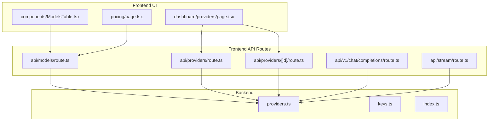
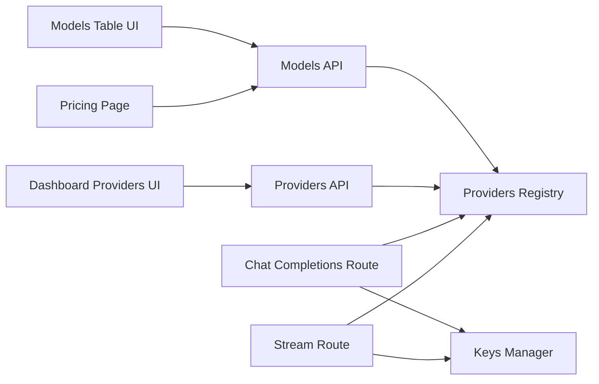

# Model Configuration

<cite>
**Referenced Files in This Document**
- [backend/src/providers.ts](file://backend/src/providers.ts)
- [backend/src/keys.ts](file://backend/src/keys.ts)
- [backend/src/index.ts](file://backend/src/index.ts)
- [src/app/api/models/route.ts](file://src/app/api/models/route.ts)
- [src/app/api/providers/route.ts](file://src/app/api/providers/route.ts)
- [src/app/api/providers/[id]/route.ts](file://src/app/api/providers/[id]/route.ts)
- [src/app/api/v1/chat/completions/route.ts](file://src/app/api/v1/chat/completions/route.ts)
- [src/app/api/stream/route.ts](file://src/app/api/stream/route.ts)
- [src/components/ModelsTable.tsx](file://src/components/ModelsTable.tsx)
- [src/app/dashboard/providers/page.tsx](file://src/app/dashboard/providers/page.tsx)
- [src/app/pricing/page.tsx](file://src/app/pricing/page.tsx)
</cite>

## Table of Contents
1. [Introduction](#introduction)
2. [Project Structure](#project-structure)
3. [Core Components](#core-components)
4. [Architecture Overview](#architecture-overview)
5. [Detailed Component Analysis](#detailed-component-analysis)
6. [Dependency Analysis](#dependency-analysis)
7. [Performance Considerations](#performance-considerations)
8. [Troubleshooting Guide](#troubleshooting-guide)
9. [Conclusion](#conclusion)
10. [Appendices](#appendices)

## Introduction
This document explains how model selection and configuration work within providers in this project. It covers:
- Discovering available models per provider
- Configuring model parameters and defaults
- Understanding capabilities, pricing tiers, and performance characteristics
- Implementing model switching strategies, fallbacks, and cost optimization techniques

The goal is to help you select the right model for your use case, configure it efficiently, and optimize for cost and reliability.

## Project Structure
Model-related functionality spans both backend and frontend:
- Backend: Provider definitions, key management, and API entry points
- Frontend: API routes for listing models and providers, dashboard UI for managing providers, and a table component for browsing models



**Diagram sources**
- [backend/src/providers.ts](file://backend/src/providers.ts)
- [backend/src/keys.ts](file://backend/src/keys.ts)
- [backend/src/index.ts](file://backend/src/index.ts)
- [src/app/api/models/route.ts](file://src/app/api/models/route.ts)
- [src/app/api/providers/route.ts](file://src/app/api/providers/route.ts)
- [src/app/api/providers/[id]/route.ts](file://src/app/api/providers/[id]/route.ts)
- [src/app/api/v1/chat/completions/route.ts](file://src/app/api/v1/chat/completions/route.ts)
- [src/app/api/stream/route.ts](file://src/app/api/stream/route.ts)
- [src/components/ModelsTable.tsx](file://src/components/ModelsTable.tsx)
- [src/app/dashboard/providers/page.tsx](file://src/app/dashboard/providers/page.tsx)
- [src/app/pricing/page.tsx](file://src/app/pricing/page.tsx)

**Section sources**
- [backend/src/providers.ts](file://backend/src/providers.ts)
- [backend/src/keys.ts](file://backend/src/keys.ts)
- [backend/src/index.ts](file://backend/src/index.ts)
- [src/app/api/models/route.ts](file://src/app/api/models/route.ts)
- [src/app/api/providers/route.ts](file://src/app/api/providers/route.ts)
- [src/app/api/providers/[id]/route.ts](file://src/app/api/providers/[id]/route.ts)
- [src/app/api/v1/chat/completions/route.ts](file://src/app/api/v1/chat/completions/route.ts)
- [src/app/api/stream/route.ts](file://src/app/api/stream/route.ts)
- [src/components/ModelsTable.tsx](file://src/components/ModelsTable.tsx)
- [src/app/dashboard/providers/page.tsx](file://src/app/dashboard/providers/page.tsx)
- [src/app/pricing/page.tsx](file://src/app/pricing/page.tsx)

## Core Components
- Providers registry: Central source of truth for supported providers and their models
- Keys manager: Secure storage and retrieval of provider credentials
- Models API: Exposes available models and metadata (capabilities, pricing)
- Providers API: CRUD operations for provider configurations
- Chat completions route: Orchestrates model selection and request routing
- Stream route: Handles streaming responses for long-running or token-by-token outputs
- Models table UI: Displays models with filters and sorting
- Dashboard providers page: Manages provider settings and default model selection
- Pricing page: Presents pricing tiers and helps compare costs across models

Key responsibilities:
- Discovery: List all models and their attributes
- Configuration: Set provider keys, choose default models, and tune parameters
- Routing: Select the best model based on strategy and constraints
- Observability: Track usage and costs for optimization

**Section sources**
- [backend/src/providers.ts](file://backend/src/providers.ts)
- [backend/src/keys.ts](file://backend/src/keys.ts)
- [src/app/api/models/route.ts](file://src/app/api/models/route.ts)
- [src/app/api/providers/route.ts](file://src/app/api/providers/route.ts)
- [src/app/api/providers/[id]/route.ts](file://src/app/api/providers/[id]/route.ts)
- [src/app/api/v1/chat/completions/route.ts](file://src/app/api/v1/chat/completions/route.ts)
- [src/app/api/stream/route.ts](file://src/app/api/stream/route.ts)
- [src/components/ModelsTable.tsx](file://src/components/ModelsTable.tsx)
- [src/app/dashboard/providers/page.tsx](file://src/app/dashboard/providers/page.tsx)
- [src/app/pricing/page.tsx](file://src/app/pricing/page.tsx)

## Architecture Overview
The system exposes REST endpoints for model discovery and chat completions. The chat route selects a model using configured strategies and forwards requests to the appropriate provider implementation. Streaming is supported via a dedicated endpoint.

```mermaid
sequenceDiagram
participant Client as "Client"
participant ModelsAPI as "Models API"
participant ProvidersAPI as "Providers API"
participant ChatRoute as "Chat Completions Route"
as StreamRoute as "Stream Route"
participant Registry as "Providers Registry"
participant Keys as "Keys Manager"
Client->>ModelsAPI : GET /api/models
ModelsAPI-->>Client : Available models + metadata
Client->>ProvidersAPI : GET/POST/PUT/DELETE /api/providers
ProvidersAPI-->>Client : Provider configs
Client->>ChatRoute : POST /api/v1/chat/completions {model?, params}
ChatRoute->>Registry : Resolve provider/model
ChatRoute->>Keys : Load provider keys
ChatRoute->>Registry : Forward request to selected provider
Registry-->>ChatRoute : Response
ChatRoute-->>Client : Completion result
Client->>StreamRoute : POST /api/stream {model?, params}
StreamRoute->>Registry : Resolve provider/model
StreamRoute->>Keys : Load provider keys
StreamRoute->>Registry : Stream response from provider
Registry-->>StreamRoute : Tokens stream
StreamRoute-->>Client : Streaming tokens
```

**Diagram sources**
- [src/app/api/models/route.ts](file://src/app/api/models/route.ts)
- [src/app/api/providers/route.ts](file://src/app/api/providers/route.ts)
- [src/app/api/providers/[id]/route.ts](file://src/app/api/providers/[id]/route.ts)
- [src/app/api/v1/chat/completions/route.ts](file://src/app/api/v1/chat/completions/route.ts)
- [src/app/api/stream/route.ts](file://src/app/api/stream/route.ts)
- [backend/src/providers.ts](file://backend/src/providers.ts)
- [backend/src/keys.ts](file://backend/src/keys.ts)

## Detailed Component Analysis

### Providers Registry
Responsibilities:
- Define supported providers and their model catalogs
- Provide capability metadata (e.g., streaming, function calling, context length)
- Offer selection helpers (e.g., by cost, latency, quality)

Configuration aspects:
- Default model per provider
- Parameter overrides (temperature, max tokens, top_p)
- Capability flags used by routing logic

Selection strategies:
- Explicit model name
- Best-cost under budget
- Lowest-latency target
- Quality-first with fallbacks

**Section sources**
- [backend/src/providers.ts](file://backend/src/providers.ts)

### Keys Manager
Responsibilities:
- Store and retrieve provider API keys securely
- Validate presence before forwarding requests
- Support rotation without downtime

Integration:
- Called during model resolution to ensure credentials are present
- Used by both chat and stream routes

**Section sources**
- [backend/src/keys.ts](file://backend/src/keys.ts)

### Models API
Responsibilities:
- Expose list of available models
- Return metadata such as capabilities, pricing tiers, and performance hints
- Support filtering by provider and features

Usage:
- Frontend models table fetches data here
- Pricing page references model pricing information

**Section sources**
- [src/app/api/models/route.ts](file://src/app/api/models/route.ts)
- [src/components/ModelsTable.tsx](file://src/components/ModelsTable.tsx)
- [src/app/pricing/page.tsx](file://src/app/pricing/page.tsx)

### Providers API
Responsibilities:
- Manage provider configurations (create, update, delete, list)
- Persist default model selection per provider
- Validate inputs and enforce security policies

Usage:
- Dashboard providers page uses these endpoints to manage settings

**Section sources**
- [src/app/api/providers/route.ts](file://src/app/api/providers/route.ts)
- [src/app/api/providers/[id]/route.ts](file://src/app/api/providers/[id]/route.ts)
- [src/app/dashboard/providers/page.tsx](file://src/app/dashboard/providers/page.tsx)

### Chat Completions Route
Responsibilities:
- Accept chat completion requests
- Determine target model using explicit selection or strategy
- Load keys and forward to provider
- Handle errors and retries

Flow:
- Parse request body
- Resolve model/provider
- Validate keys
- Call provider implementation
- Return structured response

**Section sources**
- [src/app/api/v1/chat/completions/route.ts](file://src/app/api/v1/chat/completions/route.ts)
- [backend/src/providers.ts](file://backend/src/providers.ts)
- [backend/src/keys.ts](file://backend/src/keys.ts)

### Stream Route
Responsibilities:
- Handle streaming responses for real-time token delivery
- Mirror chat route’s selection logic but return a stream
- Ensure proper backpressure handling

**Section sources**
- [src/app/api/stream/route.ts](file://src/app/api/stream/route.ts)
- [backend/src/providers.ts](file://backend/src/providers.ts)
- [backend/src/keys.ts](file://backend/src/keys.ts)

### Models Table UI
Responsibilities:
- Display models with filters (provider, capability, price range)
- Allow quick selection and copying of model identifiers
- Integrate with pricing insights

**Section sources**
- [src/components/ModelsTable.tsx](file://src/components/ModelsTable.tsx)
- [src/app/api/models/route.ts](file://src/app/api/models/route.ts)

### Dashboard Providers Page
Responsibilities:
- Configure provider keys
- Set default model per provider
- Toggle feature flags and parameter presets

**Section sources**
- [src/app/dashboard/providers/page.tsx](file://src/app/dashboard/providers/page.tsx)
- [src/app/api/providers/route.ts](file://src/app/api/providers/route.ts)
- [src/app/api/providers/[id]/route.ts](file://src/app/api/providers/[id]/route.ts)

### Pricing Page
Responsibilities:
- Present pricing tiers and comparisons
- Help users choose cost-effective models

**Section sources**
- [src/app/pricing/page.tsx](file://src/app/pricing/page.tsx)
- [src/app/api/models/route.ts](file://src/app/api/models/route.ts)

## Dependency Analysis
High-level dependencies among components:



**Diagram sources**
- [src/app/api/models/route.ts](file://src/app/api/models/route.ts)
- [src/app/api/providers/route.ts](file://src/app/api/providers/route.ts)
- [src/app/api/providers/[id]/route.ts](file://src/app/api/providers/[id]/route.ts)
- [src/app/api/v1/chat/completions/route.ts](file://src/app/api/v1/chat/completions/route.ts)
- [src/app/api/stream/route.ts](file://src/app/api/stream/route.ts)
- [backend/src/providers.ts](file://backend/src/providers.ts)
- [backend/src/keys.ts](file://backend/src/keys.ts)
- [src/components/ModelsTable.tsx](file://src/components/ModelsTable.tsx)
- [src/app/dashboard/providers/page.tsx](file://src/app/dashboard/providers/page.tsx)
- [src/app/pricing/page.tsx](file://src/app/pricing/page.tsx)

**Section sources**
- [backend/src/providers.ts](file://backend/src/providers.ts)
- [backend/src/keys.ts](file://backend/src/keys.ts)
- [src/app/api/models/route.ts](file://src/app/api/models/route.ts)
- [src/app/api/providers/route.ts](file://src/app/api/providers/route.ts)
- [src/app/api/providers/[id]/route.ts](file://src/app/api/providers/[id]/route.ts)
- [src/app/api/v1/chat/completions/route.ts](file://src/app/api/v1/chat/completions/route.ts)
- [src/app/api/stream/route.ts](file://src/app/api/stream/route.ts)
- [src/components/ModelsTable.tsx](file://src/components/ModelsTable.tsx)
- [src/app/dashboard/providers/page.tsx](file://src/app/dashboard/providers/page.tsx)
- [src/app/pricing/page.tsx](file://src/app/pricing/page.tsx)

## Performance Considerations
- Prefer smaller or faster models for low-latency needs; reserve larger models for complex tasks
- Use streaming for long outputs to improve perceived responsiveness
- Cache frequently accessed model metadata at the edge or client when safe
- Batch requests where possible to reduce overhead
- Monitor error rates and adjust fallback thresholds dynamically
- Tune temperature and max tokens to balance quality and cost

[No sources needed since this section provides general guidance]

## Troubleshooting Guide
Common issues and resolutions:
- Missing provider keys: Ensure keys are set via the providers API and validated before routing
- Unsupported model: Verify model availability through the models API and check capability flags
- Rate limits or quota exceeded: Implement retry with exponential backoff and switch to a cheaper or less constrained model
- High latency: Switch to a lower-latency model or enable streaming
- Cost spikes: Review usage logs, adjust default models, and apply budget-aware selection strategies

Operational checks:
- Confirm provider health and key validity
- Inspect model metadata for capability mismatches
- Validate request payloads against model constraints

**Section sources**
- [backend/src/keys.ts](file://backend/src/keys.ts)
- [src/app/api/models/route.ts](file://src/app/api/models/route.ts)
- [src/app/api/providers/route.ts](file://src/app/api/providers/route.ts)
- [src/app/api/v1/chat/completions/route.ts](file://src/app/api/v1/chat/completions/route.ts)
- [src/app/api/stream/route.ts](file://src/app/api/stream/route.ts)

## Conclusion
Effective model configuration hinges on clear discovery, robust provider setup, and intelligent selection strategies. By leveraging the models and providers APIs, setting sensible defaults, and applying fallback and cost-aware strategies, you can achieve reliable performance while optimizing costs.

[No sources needed since this section summarizes without analyzing specific files]

## Appendices

### Model Selection Strategies
- Explicit selection: Choose a specific model by identifier
- Budget-aware: Pick the cheapest model meeting minimum capability requirements
- Latency-aware: Choose the fastest model within acceptable quality bounds
- Quality-first: Start with the highest-quality model and fall back to cheaper alternatives on failure

### Fallback Configuration Patterns
- Primary model with secondary fallback
- Multi-provider redundancy for critical paths
- Dynamic switching based on error rates or latency thresholds

### Cost Optimization Techniques
- Right-size models per task complexity
- Use streaming to reduce idle time
- Apply caching for repeated prompts or templates
- Monitor and alert on cost anomalies

[No sources needed since this section provides general guidance]