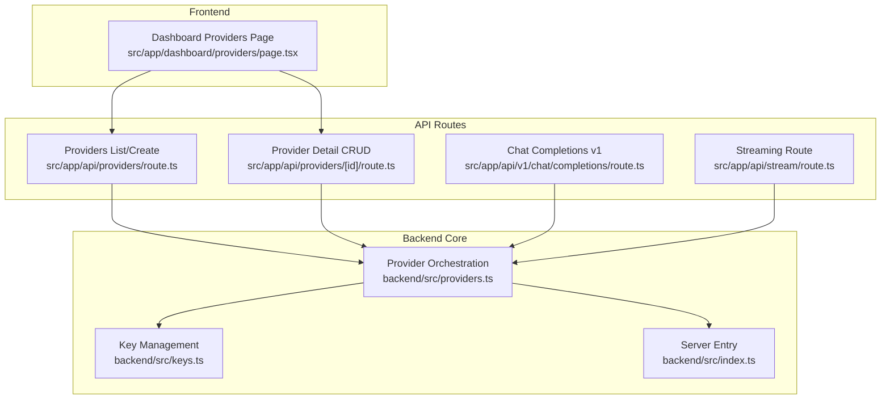
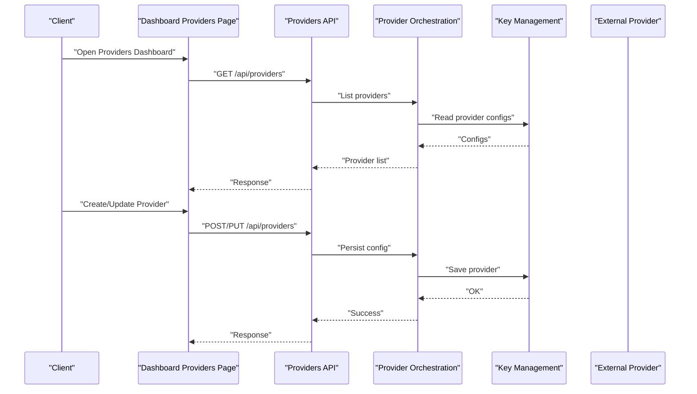
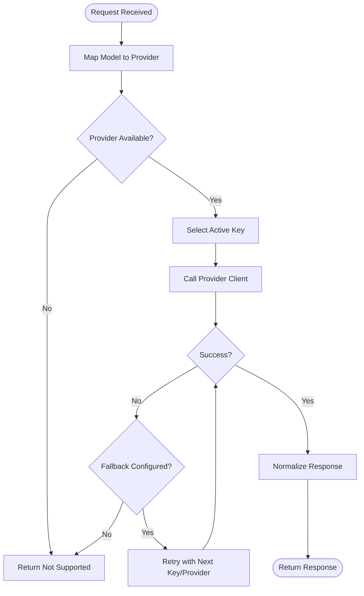
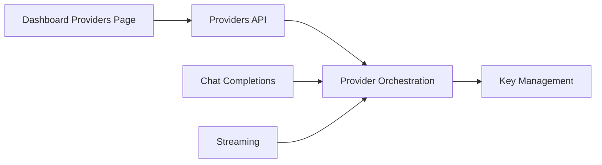

# Provider Configuration

<cite>
**Referenced Files in This Document**
- [backend/src/providers.ts](file://backend/src/providers.ts)
- [backend/src/keys.ts](file://backend/src/keys.ts)
- [backend/src/index.ts](file://backend/src/index.ts)
- [src/app/api/providers/route.ts](file://src/app/api/providers/route.ts)
- [src/app/api/providers/[id]/route.ts](file://src/app/api/providers/[id]/route.ts)
- [src/app/dashboard/providers/page.tsx](file://src/app/dashboard/providers/page.tsx)
- [src/app/api/v1/chat/completions/route.ts](file://src/app/api/v1/chat/completions/route.ts)
- [src/app/api/stream/route.ts](file://src/app/api/stream/route.ts)
</cite>

## Table of Contents
1. [Introduction](#introduction)
2. [Project Structure](#project-structure)
3. [Core Components](#core-components)
4. [Architecture Overview](#architecture-overview)
5. [Detailed Component Analysis](#detailed-component-analysis)
6. [Dependency Analysis](#dependency-analysis)
7. [Performance Considerations](#performance-considerations)
8. [Troubleshooting Guide](#troubleshooting-guide)
9. [Conclusion](#conclusion)
10. [Appendices](#appendices)

## Introduction
This document explains how to add, configure, and manage AI service providers (such as OpenAI and Anthropic) within the application. It covers provider-specific settings, authentication methods, model selection, provider switching, fallback configurations, and load balancing features. It also includes guidance for custom provider setup, troubleshooting connection issues, and optimizing performance.

## Project Structure
The provider configuration spans both backend and frontend:
- Backend provider orchestration and key management
- API routes for listing, creating, updating, and deleting providers
- Dashboard UI for managing providers
- Chat completion and streaming endpoints that consume configured providers

**Diagram sources**
- [src/app/dashboard/providers/page.tsx](file://src/app/dashboard/providers/page.tsx)
- [src/app/api/providers/route.ts](file://src/app/api/providers/route.ts)
- [src/app/api/providers/[id]/route.ts](file://src/app/api/providers/[id]/route.ts)
- [src/app/api/v1/chat/completions/route.ts](file://src/app/api/v1/chat/completions/route.ts)
- [src/app/api/stream/route.ts](file://src/app/api/stream/route.ts)
- [backend/src/providers.ts](file://backend/src/providers.ts)
- [backend/src/keys.ts](file://backend/src/keys.ts)
- [backend/src/index.ts](file://backend/src/index.ts)

**Section sources**
- [backend/src/providers.ts](file://backend/src/providers.ts)
- [backend/src/keys.ts](file://backend/src/keys.ts)
- [backend/src/index.ts](file://backend/src/index.ts)
- [src/app/api/providers/route.ts](file://src/app/api/providers/route.ts)
- [src/app/api/providers/[id]/route.ts](file://src/app/api/providers/[id]/route.ts)
- [src/app/dashboard/providers/page.tsx](file://src/app/dashboard/providers/page.tsx)
- [src/app/api/v1/chat/completions/route.ts](file://src/app/api/v1/chat/completions/route.ts)
- [src/app/api/stream/route.ts](file://src/app/api/stream/route.ts)

## Core Components
- Provider orchestration module: centralizes provider registration, routing, and request dispatching.
- Key management module: stores and retrieves provider credentials securely.
- API routes: expose REST endpoints to list, create, update, and delete providers.
- Dashboard page: provides a user interface to manage providers.
- Chat completions and streaming endpoints: consume the provider orchestration layer to route requests to selected providers.

Key responsibilities:
- Define supported providers and their capabilities
- Validate and persist provider configurations
- Select a provider based on model or policy
- Handle retries/fallbacks and load balancing across keys
- Expose APIs for CRUD operations on providers

**Section sources**
- [backend/src/providers.ts](file://backend/src/providers.ts)
- [backend/src/keys.ts](file://backend/src/keys.ts)
- [src/app/api/providers/route.ts](file://src/app/api/providers/route.ts)
- [src/app/api/providers/[id]/route.ts](file://src/app/api/providers/[id]/route.ts)
- [src/app/dashboard/providers/page.tsx](file://src/app/dashboard/providers/page.tsx)
- [src/app/api/v1/chat/completions/route.ts](file://src/app/api/v1/chat/completions/route.ts)
- [src/app/api/stream/route.ts](file://src/app/api/stream/route.ts)

## Architecture Overview
The system uses a layered architecture:
- Frontend dashboard manages provider records via API routes
- API routes delegate to the backend provider orchestration layer
- The orchestration layer selects a provider and key, then forwards requests
- Streaming and chat endpoints integrate with the same orchestration layer

**Diagram sources**
- [src/app/dashboard/providers/page.tsx](file://src/app/dashboard/providers/page.tsx)
- [src/app/api/providers/route.ts](file://src/app/api/providers/route.ts)
- [backend/src/providers.ts](file://backend/src/providers.ts)
- [backend/src/keys.ts](file://backend/src/keys.ts)

## Detailed Component Analysis

### Provider Orchestration Layer
Responsibilities:
- Maintain registry of supported providers and their capabilities
- Resolve a provider instance based on requested model and policy
- Manage key rotation and fallback behavior
- Normalize request/response formats across providers

Operational flow:
- On incoming request, determine target provider by model mapping
- Select an active key from the key store
- Dispatch request to the provider client
- Apply retry/fallback logic if needed
- Return normalized response to caller

**Diagram sources**
- [backend/src/providers.ts](file://backend/src/providers.ts)
- [backend/src/keys.ts](file://backend/src/keys.ts)

**Section sources**
- [backend/src/providers.ts](file://backend/src/providers.ts)
- [backend/src/keys.ts](file://backend/src/keys.ts)

### Key Management Module
Responsibilities:
- Store provider credentials securely
- Provide read/write access for provider configurations
- Support multiple keys per provider for rotation and load balancing

Operations:
- Create, update, delete keys
- List active keys
- Retrieve key by provider and usage context

**Section sources**
- [backend/src/keys.ts](file://backend/src/keys.ts)

### Providers API Routes
Endpoints:
- List providers
- Create provider
- Update provider
- Delete provider

Behavior:
- Validate inputs
- Persist changes via orchestration layer
- Return standardized responses

**Section sources**
- [src/app/api/providers/route.ts](file://src/app/api/providers/route.ts)
- [src/app/api/providers/[id]/route.ts](file://src/app/api/providers/[id]/route.ts)

### Dashboard Providers Page
Features:
- View existing providers
- Add new providers
- Edit provider settings
- Remove providers

User interactions are translated into API calls to the providers endpoints.

**Section sources**
- [src/app/dashboard/providers/page.tsx](file://src/app/dashboard/providers/page.tsx)

### Chat Completions and Streaming Endpoints
Integration points:
- Chat completions endpoint consumes the provider orchestration layer to route requests
- Streaming endpoint supports real-time responses using the same orchestration

These endpoints rely on provider configuration to select models and keys.

**Section sources**
- [src/app/api/v1/chat/completions/route.ts](file://src/app/api/v1/chat/completions/route.ts)
- [src/app/api/stream/route.ts](file://src/app/api/stream/route.ts)

## Dependency Analysis
High-level dependencies:
- API routes depend on the provider orchestration layer
- Orchestration depends on key management for credentials
- Dashboard UI depends on API routes for CRUD operations
- Chat and streaming endpoints depend on orchestration for execution

**Diagram sources**
- [src/app/dashboard/providers/page.tsx](file://src/app/dashboard/providers/page.tsx)
- [src/app/api/providers/route.ts](file://src/app/api/providers/route.ts)
- [src/app/api/providers/[id]/route.ts](file://src/app/api/providers/[id]/route.ts)
- [backend/src/providers.ts](file://backend/src/providers.ts)
- [backend/src/keys.ts](file://backend/src/keys.ts)
- [src/app/api/v1/chat/completions/route.ts](file://src/app/api/v1/chat/completions/route.ts)
- [src/app/api/stream/route.ts](file://src/app/api/stream/route.ts)

**Section sources**
- [backend/src/providers.ts](file://backend/src/providers.ts)
- [backend/src/keys.ts](file://backend/src/keys.ts)
- [src/app/api/providers/route.ts](file://src/app/api/providers/route.ts)
- [src/app/api/providers/[id]/route.ts](file://src/app/api/providers/[id]/route.ts)
- [src/app/dashboard/providers/page.tsx](file://src/app/dashboard/providers/page.tsx)
- [src/app/api/v1/chat/completions/route.ts](file://src/app/api/v1/chat/completions/route.ts)
- [src/app/api/stream/route.ts](file://src/app/api/stream/route.ts)

## Performance Considerations
- Prefer streaming endpoints for long-running generations to reduce latency perception
- Use multiple keys per provider to distribute load and mitigate rate limits
- Configure fallback providers to improve resilience under failures
- Cache provider capability metadata where appropriate to avoid repeated lookups
- Monitor error rates and adjust key rotation policies dynamically

[No sources needed since this section provides general guidance]

## Troubleshooting Guide
Common issues and resolutions:
- Authentication failures: verify stored keys and ensure correct provider format
- Model not found: confirm model-to-provider mapping is configured
- Rate limit errors: rotate keys or enable fallback providers
- Connection timeouts: check network connectivity and provider status
- Inconsistent responses: normalize payloads and validate schema at boundaries

Diagnostic steps:
- Inspect provider list and key status via API
- Test individual provider connectivity through minimal requests
- Enable detailed logging around provider dispatch and retries
- Review fallback chain configuration and success paths

**Section sources**
- [backend/src/providers.ts](file://backend/src/providers.ts)
- [backend/src/keys.ts](file://backend/src/keys.ts)
- [src/app/api/providers/route.ts](file://src/app/api/providers/route.ts)
- [src/app/api/providers/[id]/route.ts](file://src/app/api/providers/[id]/route.ts)

## Conclusion
The provider configuration interface enables flexible management of multiple AI services. By centralizing orchestration and key management, the system supports robust provider switching, fallbacks, and load balancing. Proper configuration and monitoring ensure reliable performance and resilience across diverse provider ecosystems.

[No sources needed since this section summarizes without analyzing specific files]

## Appendices

### Adding a New Provider
Steps:
- Register the provider in the orchestration layer with its capabilities and client implementation
- Ensure key storage supports the new provider’s credential format
- Update model-to-provider mappings if applicable
- Verify API routes return the new provider in listings
- Test chat and streaming endpoints against the new provider

**Section sources**
- [backend/src/providers.ts](file://backend/src/providers.ts)
- [backend/src/keys.ts](file://backend/src/keys.ts)
- [src/app/api/providers/route.ts](file://src/app/api/providers/route.ts)
- [src/app/api/v1/chat/completions/route.ts](file://src/app/api/v1/chat/completions/route.ts)
- [src/app/api/stream/route.ts](file://src/app/api/stream/route.ts)

### Provider-Specific Settings and Authentication
Guidance:
- Store provider-specific secrets securely in the key store
- Map environment variables or secret fields to provider clients
- Validate required fields before persisting provider configuration
- Support multiple keys per provider for rotation and failover

**Section sources**
- [backend/src/keys.ts](file://backend/src/keys.ts)
- [backend/src/providers.ts](file://backend/src/providers.ts)

### Model Selection Options
Guidance:
- Define model-to-provider mappings in the orchestration layer
- Allow overriding model selection via API parameters when appropriate
- Validate model availability per provider before dispatch

**Section sources**
- [backend/src/providers.ts](file://backend/src/providers.ts)

### Provider Switching Mechanism
Guidance:
- Implement deterministic selection based on model or policy
- Integrate randomization or weighted distribution for load balancing
- Respect explicit overrides from API requests

**Section sources**
- [backend/src/providers.ts](file://backend/src/providers.ts)

### Fallback Configurations
Guidance:
- Configure ordered fallback chains per provider or globally
- Apply exponential backoff and jitter for retries
- Track failure reasons for observability

**Section sources**
- [backend/src/providers.ts](file://backend/src/providers.ts)

### Load Balancing Features
Guidance:
- Distribute requests across multiple keys per provider
- Monitor per-key health and throttle underperforming keys
- Adjust weights dynamically based on latency and error rates

**Section sources**
- [backend/src/keys.ts](file://backend/src/keys.ts)
- [backend/src/providers.ts](file://backend/src/providers.ts)