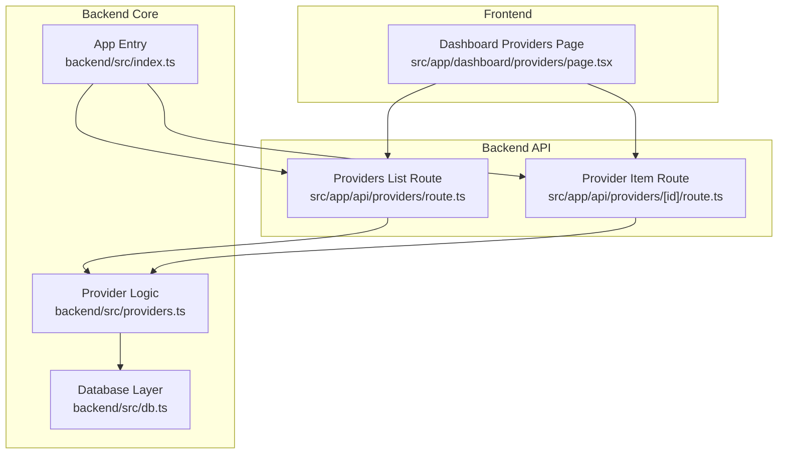
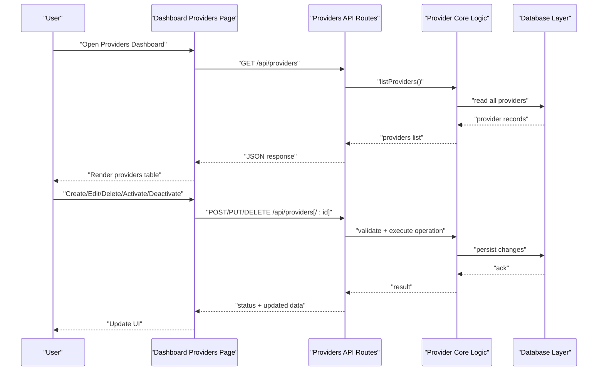
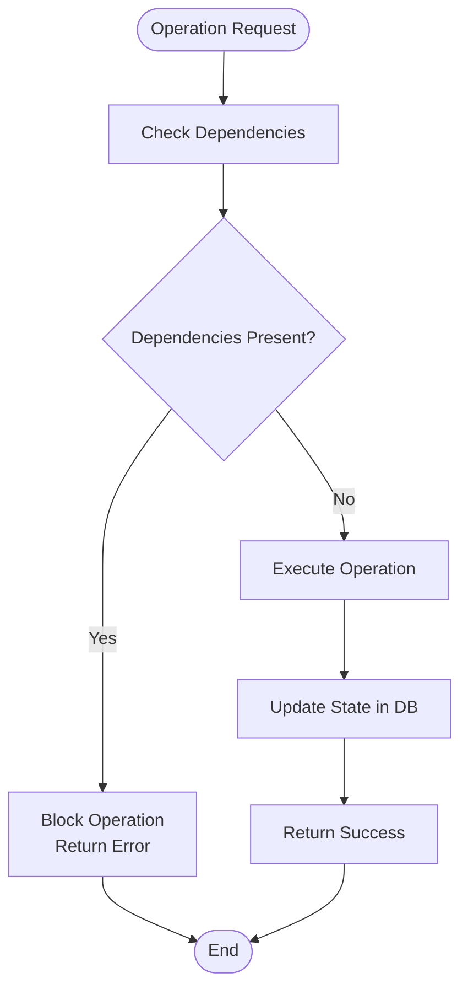

# Provider Management

<cite>
**Referenced Files in This Document**
- [providers.ts](file://backend/src/providers.ts)
- [db.ts](file://backend/src/db.ts)
- [index.ts](file://backend/src/index.ts)
- [route.ts](file://src/app/api/providers/route.ts)
- [route.ts](file://src/app/api/providers/[id]/route.ts)
- [page.tsx](file://src/app/dashboard/providers/page.tsx)
</cite>

## Table of Contents
1. [Introduction](#introduction)
2. [Project Structure](#project-structure)
3. [Core Components](#core-components)
4. [Architecture Overview](#architecture-overview)
5. [Detailed Component Analysis](#detailed-component-analysis)
6. [Dependency Analysis](#dependency-analysis)
7. [Performance Considerations](#performance-considerations)
8. [Troubleshooting Guide](#troubleshooting-guide)
9. [Conclusion](#conclusion)
10. [Appendices](#appendices)

## Introduction
This document explains the provider management system for adding, editing, and deleting AI service providers through the dashboard interface. It covers the provider registration process, validation rules, configuration storage mechanisms, lifecycle management (activation/deactivation), dependency tracking, bulk operations, provider templates, and migration between different provider configurations. The goal is to help both technical and non-technical users understand how providers are managed end-to-end.

## Project Structure
The provider management feature spans backend API routes, a database layer, and a Next.js dashboard page:
- Backend API routes handle CRUD operations for providers.
- A database module persists provider records and related metadata.
- The dashboard UI provides forms and actions for managing providers.

**Diagram sources**
- [route.ts](file://src/app/api/providers/route.ts)
- [route.ts](file://src/app/api/providers/[id]/route.ts)
- [providers.ts](file://backend/src/providers.ts)
- [db.ts](file://backend/src/db.ts)
- [index.ts](file://backend/src/index.ts)
- [page.tsx](file://src/app/dashboard/providers/page.tsx)

**Section sources**
- [route.ts](file://src/app/api/providers/route.ts)
- [route.ts](file://src/app/api/providers/[id]/route.ts)
- [providers.ts](file://backend/src/providers.ts)
- [db.ts](file://backend/src/db.ts)
- [index.ts](file://backend/src/index.ts)
- [page.tsx](file://src/app/dashboard/providers/page.tsx)

## Core Components
- Dashboard Providers Page: Provides the user interface for listing, creating, editing, and deleting providers. It calls the appropriate API endpoints and renders provider status and configuration fields.
- Providers API Routes: Expose REST-like endpoints for provider list and item operations. They validate inputs, enforce business rules, and delegate to core provider logic.
- Provider Core Logic: Encapsulates provider registration, updates, deletion, activation/deactivation, and dependency checks. It coordinates with the database layer for persistence.
- Database Layer: Persists provider records and associated metadata such as keys, settings, and lifecycle state.

Key responsibilities:
- Input validation and sanitization at the route layer.
- Business rule enforcement in the provider core (e.g., required fields, uniqueness).
- State transitions for activation/deactivation.
- Dependency tracking to prevent unsafe deletions or deactivations.

**Section sources**
- [page.tsx](file://src/app/dashboard/providers/page.tsx)
- [route.ts](file://src/app/api/providers/route.ts)
- [route.ts](file://src/app/api/providers/[id]/route.ts)
- [providers.ts](file://backend/src/providers.ts)
- [db.ts](file://backend/src/db.ts)

## Architecture Overview
The provider management architecture follows a layered approach:
- Presentation Layer: Dashboard page handles user interactions and displays provider data.
- API Layer: Route handlers parse requests, validate payloads, and call core logic.
- Core Layer: Provider business logic orchestrates operations and enforces constraints.
- Persistence Layer: Database module stores provider entities and relationships.

**Diagram sources**
- [route.ts](file://src/app/api/providers/route.ts)
- [route.ts](file://src/app/api/providers/[id]/route.ts)
- [providers.ts](file://backend/src/providers.ts)
- [db.ts](file://backend/src/db.ts)
- [page.tsx](file://src/app/dashboard/providers/page.tsx)

## Detailed Component Analysis

### Dashboard Providers Page
Responsibilities:
- Fetches provider lists and individual provider details via API calls.
- Renders forms for creating and editing providers.
- Triggers actions like activate, deactivate, delete, and bulk operations.
- Displays validation errors and success feedback.

Operational flow:
- On mount, request the provider list from the API.
- When submitting a form, send a create or update request with validated payload.
- For destructive actions, confirm before calling delete or deactivation endpoints.
- For bulk operations, aggregate selected items and call batch endpoints if available.

Best practices:
- Debounce search/filter inputs.
- Show optimistic updates where safe, then reconcile with server state.
- Provide clear error messages mapped to specific fields.

**Section sources**
- [page.tsx](file://src/app/dashboard/providers/page.tsx)

### Providers API Routes
Endpoints:
- GET /api/providers: Returns the list of providers.
- POST /api/providers: Creates a new provider.
- PUT /api/providers/:id: Updates an existing provider.
- DELETE /api/providers/:id: Deletes a provider.
- PATCH /api/providers/:id/status: Activates or deactivates a provider.

Validation and security:
- Validate presence and format of required fields (e.g., provider name, type, base URL).
- Enforce unique constraints on identifiers.
- Sanitize inputs to prevent injection.
- Return standardized error responses with actionable messages.

Error handling:
- Map database errors to user-friendly messages.
- Handle concurrency conflicts during updates.
- Ensure idempotency for critical operations when possible.

**Section sources**
- [route.ts](file://src/app/api/providers/route.ts)
- [route.ts](file://src/app/api/providers/[id]/route.ts)

### Provider Core Logic
Functions typically include:
- registerProvider(data): Validates and creates a new provider record.
- updateProvider(id, data): Applies partial updates with validation.
- deleteProvider(id): Removes a provider after checking dependencies.
- toggleActivation(id, active): Switches activation state with dependency checks.
- getProviderById(id): Retrieves a single provider.
- listProviders(filters): Lists providers with optional filtering.

Business rules:
- Required fields must be present and valid.
- Activation requires that dependent services are configured and healthy.
- Deletion is blocked if other resources depend on the provider.
- Template-based creation can pre-populate common configurations.

State transitions:
- New -> Active
- Active -> Inactive
- Inactive -> Active
- Any -> Deleted (with dependency clearance)

**Section sources**
- [providers.ts](file://backend/src/providers.ts)

### Database Layer
Responsibilities:
- Persist provider records and related metadata.
- Manage indexes for efficient queries.
- Support transactions for multi-step operations.
- Provide consistent read/write semantics.

Schema considerations:
- Provider entity includes fields such as identifier, name, type, base URL, configuration object, activation state, timestamps, and dependency references.
- Separate tables or documents for keys and settings may be used to normalize sensitive data.

Operations:
- Create, read, update, delete provider records.
- Query by filters (e.g., activation state, type).
- Atomic updates for state transitions.

**Section sources**
- [db.ts](file://backend/src/db.ts)

### Application Entry
Role:
- Initializes the application and registers API routes.
- Sets up middleware for logging, authentication, and rate limiting.
- Ensures database connections are established before serving requests.

**Section sources**
- [index.ts](file://backend/src/index.ts)

## Dependency Analysis
Provider dependencies are tracked to ensure safe lifecycle transitions:
- Activation depends on configured keys and connectivity checks.
- Deletion depends on absence of referencing resources (e.g., models, integrations).
- Bulk operations must respect per-item dependencies.

**Diagram sources**
- [providers.ts](file://backend/src/providers.ts)
- [db.ts](file://backend/src/db.ts)

**Section sources**
- [providers.ts](file://backend/src/providers.ts)
- [db.ts](file://backend/src/db.ts)

## Performance Considerations
- Use pagination and filtering for large provider lists.
- Cache frequently accessed provider metadata where appropriate.
- Avoid N+1 queries by batching reads and writes.
- Prefer partial updates to reduce payload size.
- Implement retry logic for transient failures during activation checks.

## Troubleshooting Guide
Common issues and resolutions:
- Validation errors: Ensure all required fields are provided and correctly formatted.
- Uniqueness conflicts: Change conflicting identifiers to unique values.
- Activation failures: Verify keys and connectivity; check logs for upstream errors.
- Deletion blocked: Remove or reassign dependent resources before deletion.
- Concurrency conflicts: Refresh the provider data and retry the update.

Diagnostic steps:
- Inspect API response bodies for detailed error messages.
- Review database logs for constraint violations.
- Enable request tracing to identify slow operations.

**Section sources**
- [route.ts](file://src/app/api/providers/route.ts)
- [route.ts](file://src/app/api/providers/[id]/route.ts)
- [providers.ts](file://backend/src/providers.ts)
- [db.ts](file://backend/src/db.ts)

## Conclusion
The provider management system offers a robust, layered architecture for managing AI service providers. Through the dashboard, users can perform full lifecycle operations while the backend enforces validation, dependency tracking, and secure persistence. Following the guidelines here will help you add, edit, and delete providers safely, manage activation states, and plan for bulk operations and migrations.

## Appendices

### Provider Registration Process
Steps:
- Open the Providers dashboard.
- Click “Add Provider”.
- Fill in required fields (name, type, base URL, configuration).
- Submit the form; the system validates and persists the provider.
- Activate the provider if needed; the system checks dependencies and connectivity.

Validation rules:
- Required fields must be present and non-empty.
- Identifier must be unique across providers.
- Base URL must be a valid URI.
- Configuration must conform to expected schema for the chosen provider type.

Configuration storage:
- Provider metadata stored in the database with normalized fields.
- Sensitive keys stored securely and referenced by provider records.

**Section sources**
- [page.tsx](file://src/app/dashboard/providers/page.tsx)
- [route.ts](file://src/app/api/providers/route.ts)
- [providers.ts](file://backend/src/providers.ts)
- [db.ts](file://backend/src/db.ts)

### Lifecycle Management
States:
- New: Created but not activated.
- Active: Ready to use.
- Inactive: Disabled temporarily.
- Deleted: Removed after dependency clearance.

Transitions:
- Activate: Requires valid configuration and successful dependency checks.
- Deactivate: Can be performed without dependency checks.
- Delete: Blocked if dependent resources exist.

**Section sources**
- [providers.ts](file://backend/src/providers.ts)
- [db.ts](file://backend/src/db.ts)

### Bulk Operations
Examples:
- Select multiple providers and toggle activation state.
- Export provider configurations for backup.
- Import provider templates to create multiple providers at once.

Implementation notes:
- Aggregate selected IDs and call batch endpoints.
- Respect per-item dependencies and report per-item results.
- Provide progress indicators and error summaries.

**Section sources**
- [route.ts](file://src/app/api/providers/route.ts)
- [route.ts](file://src/app/api/providers/[id]/route.ts)
- [page.tsx](file://src/app/dashboard/providers/page.tsx)

### Provider Templates
Concept:
- Predefined configurations for common provider types.
- Include default fields, recommended settings, and example keys placeholders.

Usage:
- Choose a template when creating a provider.
- Customize fields as needed before submission.

**Section sources**
- [providers.ts](file://backend/src/providers.ts)
- [page.tsx](file://src/app/dashboard/providers/page.tsx)

### Migration Between Configurations
Scenarios:
- Switching provider types while preserving historical usage data.
- Updating base URLs or credentials across multiple providers.
- Normalizing configuration schemas across versions.

Approach:
- Create a migration script that reads current provider records.
- Transform configurations according to target schema.
- Validate transformed records before applying updates.
- Roll back on failure and log detailed diffs.

**Section sources**
- [providers.ts](file://backend/src/providers.ts)
- [db.ts](file://backend/src/db.ts)