# User Settings & Preferences

<cite>
**Referenced Files in This Document**
- [settings/page.tsx](file://src/app/dashboard/settings/page.tsx)
- [dashboard/layout.tsx](file://src/app/dashboard/layout.tsx)
- [auth-provider.tsx](file://src/components/auth-provider.tsx)
- [theme-provider.tsx](file://src/components/theme-provider.tsx)
- [theme-toggle.tsx](file://src/components/theme-toggle.tsx)
- [config/theme.ts](file://src/config/theme.ts)
- [api/me/route.ts](file://src/app/api/me/route.ts)
- [api/auth/login/route.ts](file://src/app/api/auth/login/route.ts)
- [api/auth/signup/route.ts](file://src/app/api/auth/signup/route.ts)
- [api/keys/route.ts](file://src/app/api/keys/route.ts)
- [api/providers/route.ts](file://src/app/api/providers/route.ts)
- [providers/[id]/route.ts](file://src/app/api/providers/[id]/route.ts)
- [keys/[id]/route.ts](file://src/app/api/keys/[id]/route.ts)
- [backend/src/index.ts](file://backend/src/index.ts)
- [backend/src/auth.ts](file://backend/src/auth.ts)
- [backend/src/db.ts](file://backend/src/db.ts)
- [backend/src/providers.ts](file://backend/src/providers.ts)
- [backend/src/keys.ts](file://backend/src/keys.ts)
- [lib/api.ts](file://src/lib/api.ts)
- [lib/db.ts](file://src/lib/db.ts)
- [components.json](file://components.json)
</cite>

## Table of Contents
1. [Introduction](#introduction)
2. [Project Structure](#project-structure)
3. [Core Components](#core-components)
4. [Architecture Overview](#architecture-overview)
5. [Detailed Component Analysis](#detailed-component-analysis)
6. [Dependency Analysis](#dependency-analysis)
7. [Performance Considerations](#performance-considerations)
8. [Troubleshooting Guide](#troubleshooting-guide)
9. [Conclusion](#conclusion)
10. [Appendices](#appendices)

## Introduction
This document explains how user settings and preferences are managed across the application, including profile configuration, theme customization, notification preferences, account security settings, language localization options, accessibility features, privacy controls, session management, two-factor authentication setup, and account recovery procedures. It also covers bulk user management, policy enforcement, and integration with identity providers. The documentation maps these capabilities to concrete files in the codebase and provides diagrams for clarity.

## Project Structure
The project is a Next.js application with a backend API layer. User-facing settings are primarily under the dashboard routes, while authentication and provider integrations are implemented via API routes and backend modules. Theme and UI components are provided through dedicated providers and utilities.

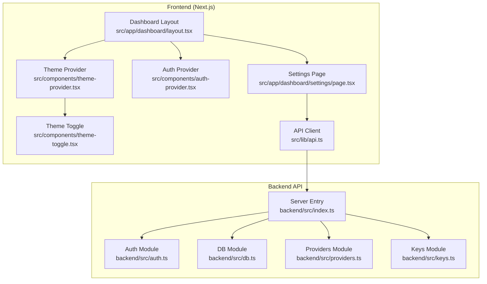

**Diagram sources**
- [dashboard/layout.tsx](file://src/app/dashboard/layout.tsx)
- [settings/page.tsx](file://src/app/dashboard/settings/page.tsx)
- [auth-provider.tsx](file://src/components/auth-provider.tsx)
- [theme-provider.tsx](file://src/components/theme-provider.tsx)
- [theme-toggle.tsx](file://src/components/theme-toggle.tsx)
- [api/me/route.ts](file://src/app/api/me/route.ts)
- [api/auth/login/route.ts](file://src/app/api/auth/login/route.ts)
- [api/auth/signup/route.ts](file://src/app/api/auth/signup/route.ts)
- [api/keys/route.ts](file://src/app/api/keys/route.ts)
- [api/providers/route.ts](file://src/app/api/providers/route.ts)
- [providers/[id]/route.ts](file://src/app/api/providers/[id]/route.ts)
- [keys/[id]/route.ts](file://src/app/api/keys/[id]/route.ts)
- [backend/src/index.ts](file://backend/src/index.ts)
- [backend/src/auth.ts](file://backend/src/auth.ts)
- [backend/src/db.ts](file://backend/src/db.ts)
- [backend/src/providers.ts](file://backend/src/providers.ts)
- [backend/src/keys.ts](file://backend/src/keys.ts)
- [lib/api.ts](file://src/lib/api.ts)

**Section sources**
- [dashboard/layout.tsx](file://src/app/dashboard/layout.tsx)
- [settings/page.tsx](file://src/app/dashboard/settings/page.tsx)
- [auth-provider.tsx](file://src/components/auth-provider.tsx)
- [theme-provider.tsx](file://src/components/theme-provider.tsx)
- [theme-toggle.tsx](file://src/components/theme-toggle.tsx)
- [api/me/route.ts](file://src/app/api/me/route.ts)
- [api/auth/login/route.ts](file://src/app/api/auth/login/route.ts)
- [api/auth/signup/route.ts](file://src/app/api/auth/signup/route.ts)
- [api/keys/route.ts](file://src/app/api/keys/route.ts)
- [api/providers/route.ts](file://src/app/api/providers/route.ts)
- [providers/[id]/route.ts](file://src/app/api/providers/[id]/route.ts)
- [keys/[id]/route.ts](file://src/app/api/keys/[id]/route.ts)
- [backend/src/index.ts](file://backend/src/index.ts)
- [backend/src/auth.ts](file://backend/src/auth.ts)
- [backend/src/db.ts](file://backend/src/db.ts)
- [backend/src/providers.ts](file://backend/src/providers.ts)
- [backend/src/keys.ts](file://backend/src/keys.ts)
- [lib/api.ts](file://src/lib/api.ts)

## Core Components
- Dashboard layout: Provides authenticated context and wraps pages with providers for auth and theming.
- Settings page: Central place for user preferences such as profile, theme, notifications, security, and privacy.
- Auth provider: Supplies current user state and session handling to the UI.
- Theme provider and toggle: Manage theme selection and persistence.
- API client: Encapsulates HTTP calls to backend endpoints for settings and account operations.

Key responsibilities:
- Profile configuration: Read/update user profile via API.
- Theme customization: Persist theme preference and apply at runtime.
- Notification preferences: Store and sync notification toggles.
- Account security: Manage keys and integrate with identity providers.
- Language localization: Select and persist locale.
- Accessibility: Respect system preferences and provide toggles where applicable.
- Privacy controls: Configure data visibility and retention.

**Section sources**
- [dashboard/layout.tsx](file://src/app/dashboard/layout.tsx)
- [settings/page.tsx](file://src/app/dashboard/settings/page.tsx)
- [auth-provider.tsx](file://src/components/auth-provider.tsx)
- [theme-provider.tsx](file://src/components/theme-provider.tsx)
- [theme-toggle.tsx](file://src/components/theme-toggle.tsx)
- [lib/api.ts](file://src/lib/api.ts)

## Architecture Overview
The settings flow involves the frontend calling API routes that delegate to backend modules for authentication, database access, provider integrations, and key management.

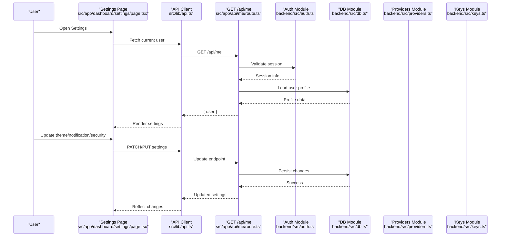

**Diagram sources**
- [settings/page.tsx](file://src/app/dashboard/settings/page.tsx)
- [api/me/route.ts](file://src/app/api/me/route.ts)
- [backend/src/auth.ts](file://backend/src/auth.ts)
- [backend/src/db.ts](file://backend/src/db.ts)
- [backend/src/providers.ts](file://backend/src/providers.ts)
- [backend/src/keys.ts](file://backend/src/keys.ts)
- [lib/api.ts](file://src/lib/api.ts)

## Detailed Component Analysis

### Profile Configuration
- Purpose: Allow users to view and update their profile information.
- Flow:
  - Load current profile from /api/me.
  - Submit updates via appropriate API route.
  - Persist changes in the database.
- Security:
  - Requires authenticated session.
  - Validates inputs before persistence.

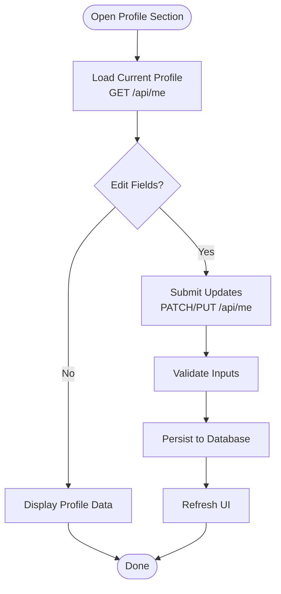

**Diagram sources**
- [api/me/route.ts](file://src/app/api/me/route.ts)
- [backend/src/db.ts](file://backend/src/db.ts)
- [settings/page.tsx](file://src/app/dashboard/settings/page.tsx)

**Section sources**
- [api/me/route.ts](file://src/app/api/me/route.ts)
- [backend/src/db.ts](file://backend/src/db.ts)
- [settings/page.tsx](file://src/app/dashboard/settings/page.tsx)

### Theme Customization
- Purpose: Let users choose and persist a theme (e.g., light/dark).
- Implementation:
  - ThemeProvider manages theme state.
  - ThemeToggle component switches themes.
  - Preference persisted via local storage or server-side settings.
- Integration:
  - Applied globally by Dashboard layout.

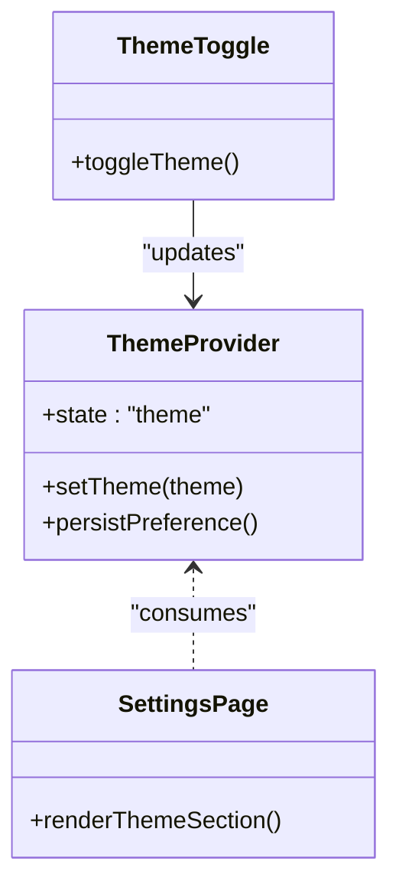

**Diagram sources**
- [theme-provider.tsx](file://src/components/theme-provider.tsx)
- [theme-toggle.tsx](file://src/components/theme-toggle.tsx)
- [settings/page.tsx](file://src/app/dashboard/settings/page.tsx)

**Section sources**
- [theme-provider.tsx](file://src/components/theme-provider.tsx)
- [theme-toggle.tsx](file://src/components/theme-toggle.tsx)
- [config/theme.ts](file://src/config/theme.ts)
- [settings/page.tsx](file://src/app/dashboard/settings/page.tsx)

### Notification Preferences
- Purpose: Control notification channels and frequencies.
- Behavior:
  - Toggles stored per user.
  - Synced with backend on change.
- Persistence:
  - Saved via API and loaded on next session.

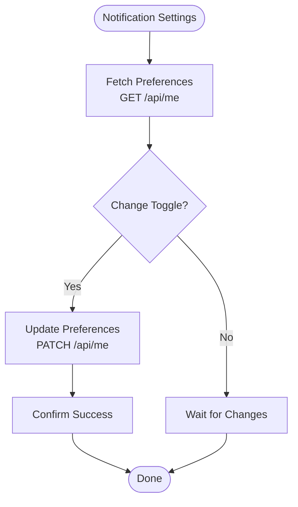

**Diagram sources**
- [api/me/route.ts](file://src/app/api/me/route.ts)
- [settings/page.tsx](file://src/app/dashboard/settings/page.tsx)

**Section sources**
- [api/me/route.ts](file://src/app/api/me/route.ts)
- [settings/page.tsx](file://src/app/dashboard/settings/page.tsx)

### Account Security Settings
- Purpose: Manage API keys and identity provider connections.
- Key Management:
  - Create, list, rotate, and delete keys via /api/keys.
  - Scoped permissions enforced at request time.
- Identity Providers:
  - Connect/disconnect providers via /api/providers.
  - Provider-specific flows handled by backend module.

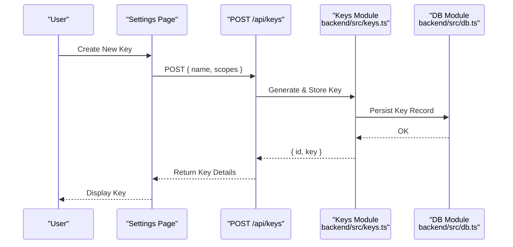

**Diagram sources**
- [api/keys/route.ts](file://src/app/api/keys/route.ts)
- [backend/src/keys.ts](file://backend/src/keys.ts)
- [backend/src/db.ts](file://backend/src/db.ts)
- [settings/page.tsx](file://src/app/dashboard/settings/page.tsx)

**Section sources**
- [api/keys/route.ts](file://src/app/api/keys/route.ts)
- [keys/[id]/route.ts](file://src/app/api/keys/[id]/route.ts)
- [backend/src/keys.ts](file://backend/src/keys.ts)
- [backend/src/db.ts](file://backend/src/db.ts)
- [settings/page.tsx](file://src/app/dashboard/settings/page.tsx)

### Language Localization Options
- Purpose: Allow users to select preferred language/locale.
- Behavior:
  - Locale persisted in user settings.
  - UI re-renders with selected locale.
- Storage:
  - Server-side preference synced via API.

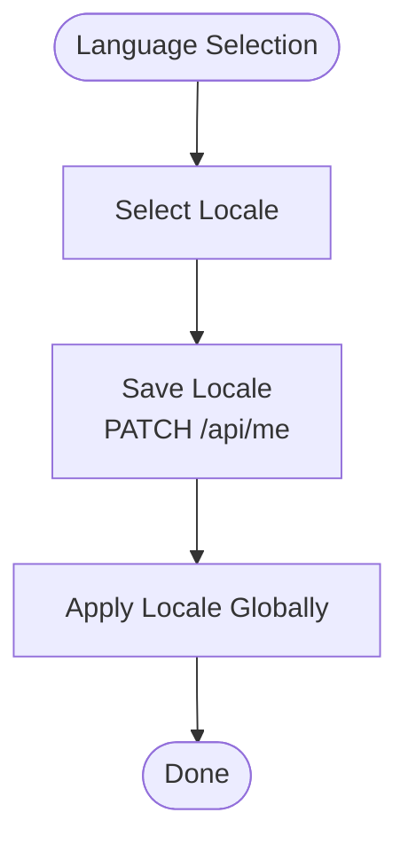

**Diagram sources**
- [api/me/route.ts](file://src/app/api/me/route.ts)
- [settings/page.tsx](file://src/app/dashboard/settings/page.tsx)

**Section sources**
- [api/me/route.ts](file://src/app/api/me/route.ts)
- [settings/page.tsx](file://src/app/dashboard/settings/page.tsx)

### Accessibility Features
- Purpose: Ensure usability for all users.
- Features:
  - Respect system color scheme and reduced motion preferences.
  - Provide keyboard navigation and screen reader support.
- Implementation:
  - Theme provider integrates with system preferences.
  - UI components follow accessible patterns.

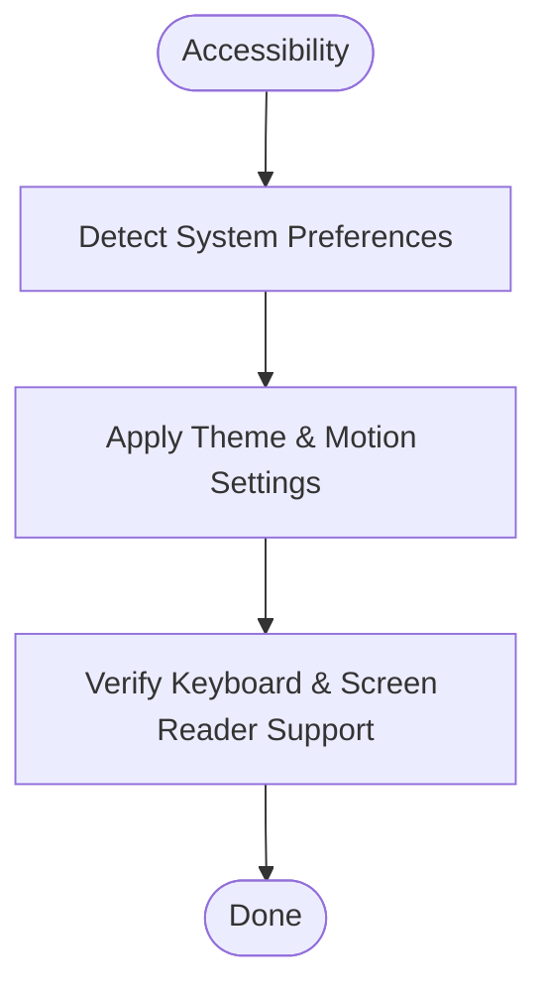

**Diagram sources**
- [theme-provider.tsx](file://src/components/theme-provider.tsx)
- [settings/page.tsx](file://src/app/dashboard/settings/page.tsx)

**Section sources**
- [theme-provider.tsx](file://src/components/theme-provider.tsx)
- [settings/page.tsx](file://src/app/dashboard/settings/page.tsx)

### Privacy Controls
- Purpose: Manage data visibility and retention policies.
- Behavior:
  - Toggle data sharing and analytics opt-in/out.
  - Enforce policy checks on API requests.
- Enforcement:
  - Backend validates privacy flags before processing.

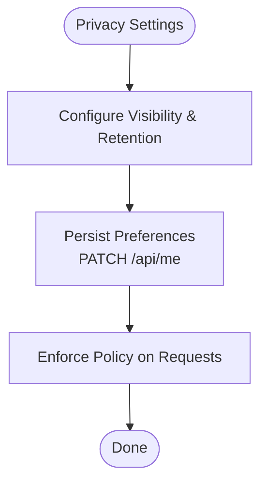

**Diagram sources**
- [api/me/route.ts](file://src/app/api/me/route.ts)
- [backend/src/auth.ts](file://backend/src/auth.ts)
- [settings/page.tsx](file://src/app/dashboard/settings/page.tsx)

**Section sources**
- [api/me/route.ts](file://src/app/api/me/route.ts)
- [backend/src/auth.ts](file://backend/src/auth.ts)
- [settings/page.tsx](file://src/app/dashboard/settings/page.tsx)

### Session Management
- Purpose: Maintain secure user sessions across requests.
- Mechanism:
  - Authentication middleware validates tokens/sessions.
  - Dashboard layout ensures protected routes.
- Recovery:
  - Logout invalidates session; login refreshes it.

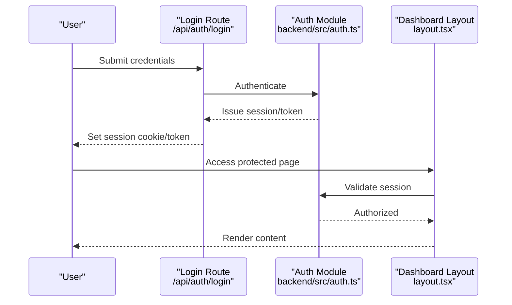

**Diagram sources**
- [api/auth/login/route.ts](file://src/app/api/auth/login/route.ts)
- [backend/src/auth.ts](file://backend/src/auth.ts)
- [dashboard/layout.tsx](file://src/app/dashboard/layout.tsx)

**Section sources**
- [api/auth/login/route.ts](file://src/app/api/auth/login/route.ts)
- [api/auth/signup/route.ts](file://src/app/api/auth/signup/route.ts)
- [backend/src/auth.ts](file://backend/src/auth.ts)
- [dashboard/layout.tsx](file://src/app/dashboard/layout.tsx)

### Two-Factor Authentication Setup
- Purpose: Add an extra layer of security during login.
- Flow:
  - Enable 2FA in security settings.
  - Generate secret and QR code for authenticator app.
  - Verify code on subsequent logins.
- Integration:
  - Stored securely in user profile.
  - Validated by auth module.

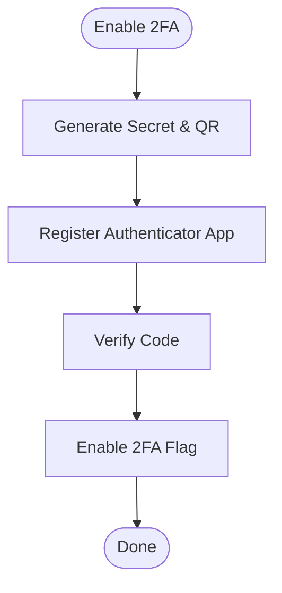

**Diagram sources**
- [backend/src/auth.ts](file://backend/src/auth.ts)
- [settings/page.tsx](file://src/app/dashboard/settings/page.tsx)

**Section sources**
- [backend/src/auth.ts](file://backend/src/auth.ts)
- [settings/page.tsx](file://src/app/dashboard/settings/page.tsx)

### Account Recovery Procedures
- Purpose: Allow users to recover access if compromised.
- Steps:
  - Initiate recovery via email link.
  - Reset password securely.
  - Invalidate old sessions.
- Security:
  - Time-limited tokens.
  - Rate limiting and audit logging.

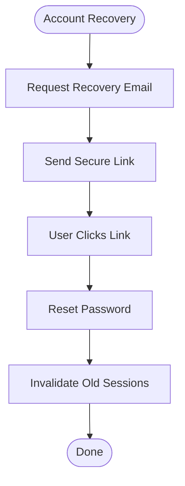

**Diagram sources**
- [api/auth/login/route.ts](file://src/app/api/auth/login/route.ts)
- [backend/src/auth.ts](file://backend/src/auth.ts)

**Section sources**
- [api/auth/login/route.ts](file://src/app/api/auth/login/route.ts)
- [backend/src/auth.ts](file://backend/src/auth.ts)

### Bulk User Management
- Purpose: Admin operations for managing multiple users.
- Capabilities:
  - Import/export users.
  - Batch update roles and permissions.
  - Enforce policies at scale.
- Implementation:
  - Dedicated admin endpoints (conceptual).
  - Policy engine integrated with auth module.

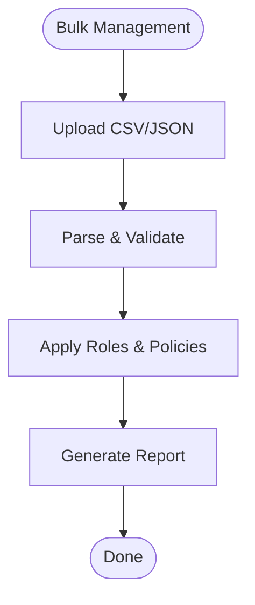

[No sources needed since this section describes conceptual bulk management without specific file mappings]

### Policy Enforcement
- Purpose: Ensure compliance with organizational rules.
- Mechanisms:
  - Middleware checks user attributes and flags.
  - Feature gates based on subscription or role.
- Examples:
  - Restrict sensitive actions unless verified.
  - Limit resource usage per tier.

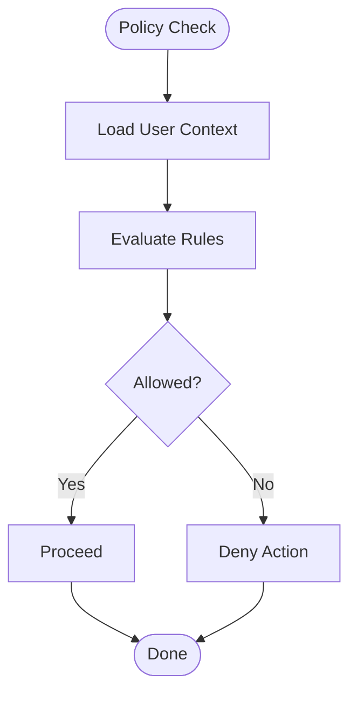

**Diagram sources**
- [backend/src/auth.ts](file://backend/src/auth.ts)
- [backend/src/index.ts](file://backend/src/index.ts)

**Section sources**
- [backend/src/auth.ts](file://backend/src/auth.ts)
- [backend/src/index.ts](file://backend/src/index.ts)

### Integration with Identity Providers
- Purpose: Allow sign-in via external providers (e.g., OAuth).
- Flow:
  - Configure provider in settings.
  - Redirect to provider for authorization.
  - Exchange token and create/update user record.
- Endpoints:
  - List providers and manage connections.

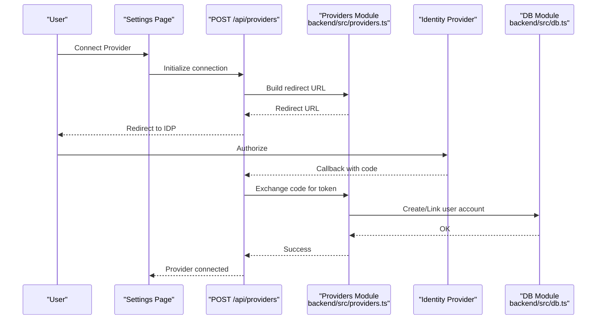

**Diagram sources**
- [api/providers/route.ts](file://src/app/api/providers/route.ts)
- [providers/[id]/route.ts](file://src/app/api/providers/[id]/route.ts)
- [backend/src/providers.ts](file://backend/src/providers.ts)
- [backend/src/db.ts](file://backend/src/db.ts)
- [settings/page.tsx](file://src/app/dashboard/settings/page.tsx)

**Section sources**
- [api/providers/route.ts](file://src/app/api/providers/route.ts)
- [providers/[id]/route.ts](file://src/app/api/providers/[id]/route.ts)
- [backend/src/providers.ts](file://backend/src/providers.ts)
- [backend/src/db.ts](file://backend/src/db.ts)
- [settings/page.tsx](file://src/app/dashboard/settings/page.tsx)

## Dependency Analysis
The following diagram shows core dependencies between frontend settings components and backend modules.

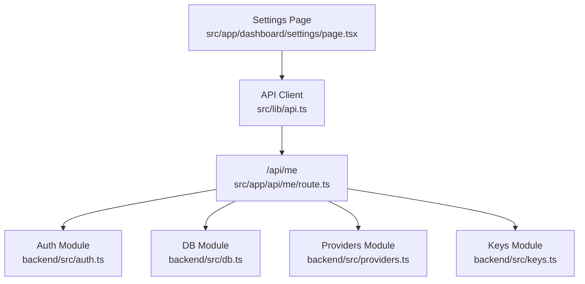

**Diagram sources**
- [settings/page.tsx](file://src/app/dashboard/settings/page.tsx)
- [api/me/route.ts](file://src/app/api/me/route.ts)
- [backend/src/auth.ts](file://backend/src/auth.ts)
- [backend/src/db.ts](file://backend/src/db.ts)
- [backend/src/providers.ts](file://backend/src/providers.ts)
- [backend/src/keys.ts](file://backend/src/keys.ts)
- [lib/api.ts](file://src/lib/api.ts)

**Section sources**
- [settings/page.tsx](file://src/app/dashboard/settings/page.tsx)
- [api/me/route.ts](file://src/app/api/me/route.ts)
- [backend/src/auth.ts](file://backend/src/auth.ts)
- [backend/src/db.ts](file://backend/src/db.ts)
- [backend/src/providers.ts](file://backend/src/providers.ts)
- [backend/src/keys.ts](file://backend/src/keys.ts)
- [lib/api.ts](file://src/lib/api.ts)

## Performance Considerations
- Minimize network calls by batching settings updates.
- Cache frequently accessed settings locally and invalidate on changes.
- Use optimistic UI updates for better responsiveness.
- Implement pagination and filtering for large datasets (e.g., keys, providers).
- Leverage server-side validation to reduce round-trips.

[No sources needed since this section provides general guidance]

## Troubleshooting Guide
Common issues and resolutions:
- Session expired: Re-authenticate via login route; ensure cookies/tokens are set correctly.
- Provider connection fails: Verify callback URLs and secrets; check provider logs.
- Keys not appearing: Confirm creation endpoint returns success; inspect database records.
- Theme not persisting: Check local storage or server-side preference sync.
- 2FA verification errors: Ensure time synchronization and correct code entry.

**Section sources**
- [api/auth/login/route.ts](file://src/app/api/auth/login/route.ts)
- [api/providers/route.ts](file://src/app/api/providers/route.ts)
- [api/keys/route.ts](file://src/app/api/keys/route.ts)
- [theme-provider.tsx](file://src/components/theme-provider.tsx)
- [backend/src/auth.ts](file://backend/src/auth.ts)

## Conclusion
The application’s user settings and preferences are implemented through a cohesive set of frontend components and backend modules. The architecture supports profile configuration, theme customization, notification preferences, security settings, localization, accessibility, privacy controls, session management, two-factor authentication, and identity provider integrations. Bulk user management and policy enforcement can be extended using existing auth and database modules.

[No sources needed since this section summarizes without analyzing specific files]

## Appendices

### Configuration Reference
- Components configuration:
  - [components.json](file://components.json)

**Section sources**
- [components.json](file://components.json)