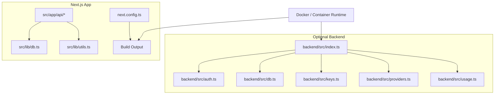
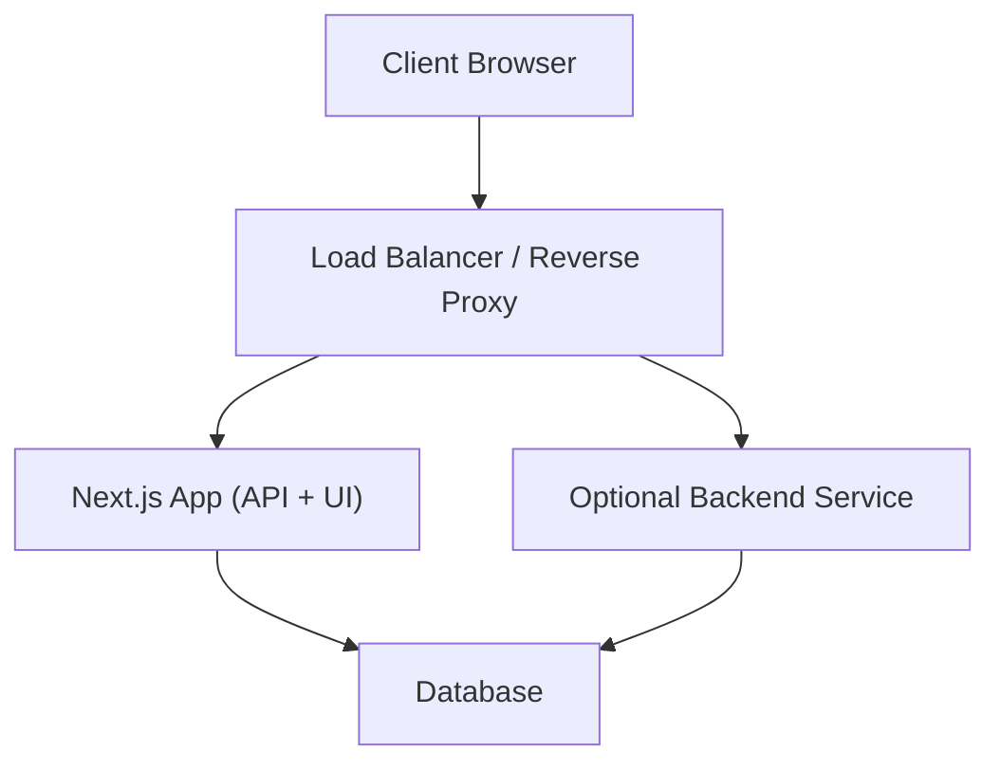
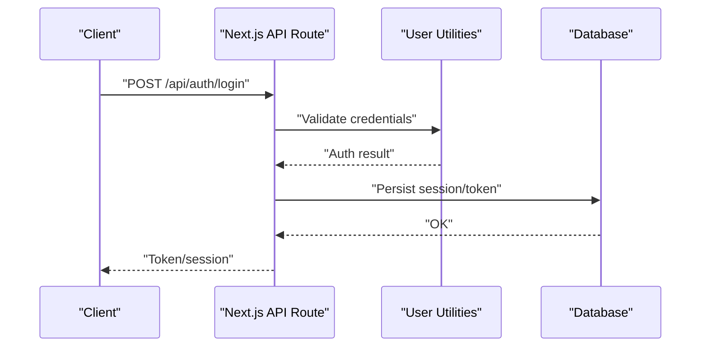
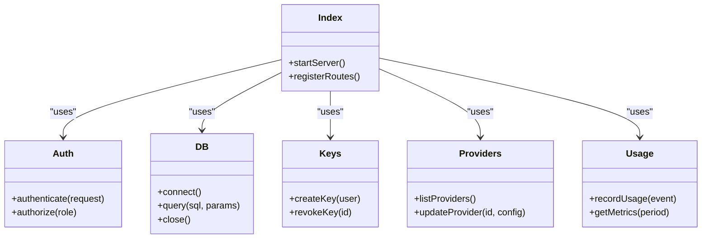
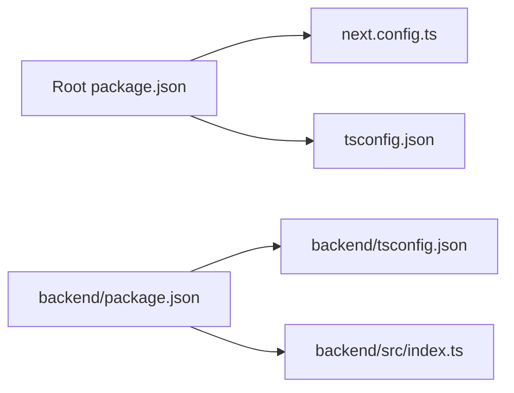

# Deployment

<cite>
**Referenced Files in This Document**
- [package.json](file://package.json)
- [next.config.ts](file://next.config.ts)
- [tsconfig.json](file://tsconfig.json)
- [backend/package.json](file://backend/package.json)
- [backend/tsconfig.json](file://backend/tsconfig.json)
- [backend/src/index.ts](file://backend/src/index.ts)
- [backend/src/auth.ts](file://backend/src/auth.ts)
- [backend/src/db.ts](file://backend/src/db.ts)
- [backend/src/keys.ts](file://backend/src/keys.ts)
- [backend/src/providers.ts](file://backend/src/providers.ts)
- [backend/src/usage.ts](file://backend/src/usage.ts)
- [src/app/api/auth/login/route.ts](file://src/app/api/auth/login/route.ts)
- [src/app/api/auth/signup/route.ts](file://src/app/api/auth/signup/route.ts)
- [src/app/api/me/route.ts](file://src/app/api/me/route.ts)
- [src/app/api/models/route.ts](file://src/app/api/models/route.ts)
- [src/app/api/providers/route.ts](file://src/app/api/providers/route.ts)
- [src/app/api/stream/route.ts](file://src/app/api/stream/route.ts)
- [src/app/api/v1/chat/completions/route.ts](file://src/app/api/v1/chat/completions/route.ts)
- [src/lib/db.ts](file://src/lib/db.ts)
- [src/lib/utils.ts](file://src/lib/utils.ts)
</cite>

## Table of Contents
1. [Introduction](#introduction)
2. [Project Structure](#project-structure)
3. [Core Components](#core-components)
4. [Architecture Overview](#architecture-overview)
5. [Detailed Component Analysis](#detailed-component-analysis)
6. [Dependency Analysis](#dependency-analysis)
7. [Performance Considerations](#performance-considerations)
8. [Troubleshooting Guide](#troubleshooting-guide)
9. [Conclusion](#conclusion)
10. [Appendices](#appendices)

## Introduction
This document provides production-grade deployment guidance for a Next.js application with an optional backend service. It covers environment setup, configuration management, security considerations, containerization, CI/CD pipelines, automated testing, monitoring and logging, backup and disaster recovery, scaling, load balancing, and performance tuning. The content is tailored to the repository structure and runtime characteristics inferred from the project files.

## Project Structure
The repository contains:
- A Next.js frontend (App Router) with API routes under src/app/api
- An optional backend service under backend/
- Shared libraries under src/lib
- Build and type configuration at the root and backend level

**Diagram sources**
- [next.config.ts](file://next.config.ts)
- [src/app/api/auth/login/route.ts](file://src/app/api/auth/login/route.ts)
- [src/app/api/auth/signup/route.ts](file://src/app/api/auth/signup/route.ts)
- [src/app/api/me/route.ts](file://src/app/api/me/route.ts)
- [src/app/api/models/route.ts](file://src/app/api/models/route.ts)
- [src/app/api/providers/route.ts](file://src/app/api/providers/route.ts)
- [src/app/api/stream/route.ts](file://src/app/api/stream/route.ts)
- [src/app/api/v1/chat/completions/route.ts](file://src/app/api/v1/chat/completions/route.ts)
- [src/lib/db.ts](file://src/lib/db.ts)
- [src/lib/utils.ts](file://src/lib/utils.ts)
- [backend/src/index.ts](file://backend/src/index.ts)
- [backend/src/auth.ts](file://backend/src/auth.ts)
- [backend/src/db.ts](file://backend/src/db.ts)
- [backend/src/keys.ts](file://backend/src/keys.ts)
- [backend/src/providers.ts](file://backend/src/providers.ts)
- [backend/src/usage.ts](file://backend/src/usage.ts)

**Section sources**
- [package.json](file://package.json)
- [next.config.ts](file://next.config.ts)
- [tsconfig.json](file://tsconfig.json)
- [backend/package.json](file://backend/package.json)
- [backend/tsconfig.json](file://backend/tsconfig.json)

## Core Components
- Next.js API Routes: Authentication endpoints, user profile access, model/provider management, streaming chat, and OpenAI-compatible completions.
- Database Access: Centralized database utilities used by API routes and optionally by the backend.
- Optional Backend Service: Separate server process exposing auth, keys, providers, usage tracking, and DB operations.

Key responsibilities:
- API routes handle HTTP requests, orchestrate business logic, and interact with data stores.
- Database utilities encapsulate connection handling and queries.
- Backend modules provide additional services or integrations if deployed independently.

**Section sources**
- [src/app/api/auth/login/route.ts](file://src/app/api/auth/login/route.ts)
- [src/app/api/auth/signup/route.ts](file://src/app/api/auth/signup/route.ts)
- [src/app/api/me/route.ts](file://src/app/api/me/route.ts)
- [src/app/api/models/route.ts](file://src/app/api/models/route.ts)
- [src/app/api/providers/route.ts](file://src/app/api/providers/route.ts)
- [src/app/api/stream/route.ts](file://src/app/api/stream/route.ts)
- [src/app/api/v1/chat/completutions/route.ts](file://src/app/api/v1/chat/completions/route.ts)
- [src/lib/db.ts](file://src/lib/db.ts)
- [backend/src/index.ts](file://backend/src/index.ts)
- [backend/src/auth.ts](file://backend/src/auth.ts)
- [backend/src/db.ts](file://backend/src/db.ts)
- [backend/src/keys.ts](file://backend/src/keys.ts)
- [backend/src/providers.ts](file://backend/src/providers.ts)
- [backend/src/usage.ts](file://backend/src/usage.ts)

## Architecture Overview
Two primary deployment patterns are supported:
- All-in-one: Run the Next.js app as a single process serving both UI and API routes.
- Split: Run the Next.js app alongside the optional backend service behind a reverse proxy/load balancer.

[No sources needed since this diagram shows conceptual architecture]

## Detailed Component Analysis

### Next.js API Routes
Authentication and user endpoints:
- Login and signup flows
- Current user info retrieval
- Model and provider management
- Streaming chat endpoint
- OpenAI-compatible completions endpoint

**Diagram sources**
- [src/app/api/auth/login/route.ts](file://src/app/api/auth/login/route.ts)
- [src/lib/db.ts](file://src/lib/db.ts)
- [src/lib/utils.ts](file://src/lib/utils.ts)

**Section sources**
- [src/app/api/auth/login/route.ts](file://src/app/api/auth/login/route.ts)
- [src/app/api/auth/signup/route.ts](file://src/app/api/auth/signup/route.ts)
- [src/app/api/me/route.ts](file://src/app/api/me/route.ts)
- [src/app/api/models/route.ts](file://src/app/api/models/route.ts)
- [src/app/api/providers/route.ts](file://src/app/api/providers/route.ts)
- [src/app/api/stream/route.ts](file://src/app/api/stream/route.ts)
- [src/app/api/v1/chat/completions/route.ts](file://src/app/api/v1/chat/completions/route.ts)
- [src/lib/db.ts](file://src/lib/db.ts)
- [src/lib/utils.ts](file://src/lib/utils.ts)

### Optional Backend Service
Modules include authentication helpers, database access, key management, provider configuration, and usage tracking.

**Diagram sources**
- [backend/src/index.ts](file://backend/src/index.ts)
- [backend/src/auth.ts](file://backend/src/auth.ts)
- [backend/src/db.ts](file://backend/src/db.ts)
- [backend/src/keys.ts](file://backend/src/keys.ts)
- [backend/src/providers.ts](file://backend/src/providers.ts)
- [backend/src/usage.ts](file://backend/src/usage.ts)

**Section sources**
- [backend/src/index.ts](file://backend/src/index.ts)
- [backend/src/auth.ts](file://backend/src/auth.ts)
- [backend/src/db.ts](file://backend/src/db.ts)
- [backend/src/keys.ts](file://backend/src/keys.ts)
- [backend/src/providers.ts](file://backend/src/providers.ts)
- [backend/src/usage.ts](file://backend/src/usage.ts)

### Configuration Management
Environment variables should be provided via platform secrets or a .env file during development. Typical categories:
- Application settings: port, host, base URL, feature flags
- Database: connection string, pool size, SSL options
- Authentication: secret keys, token lifetimes
- External services: API keys for providers, analytics, logging

Recommendations:
- Use typed configuration loaders that validate required variables at startup.
- Separate per-environment values (dev, staging, prod).
- Avoid committing secrets; use platform secret managers.

**Section sources**
- [next.config.ts](file://next.config.ts)
- [package.json](file://package.json)
- [backend/package.json](file://backend/package.json)

### Security Considerations
- Enforce HTTPS everywhere using TLS termination at the load balancer or reverse proxy.
- Validate and sanitize all inputs on API routes and backend handlers.
- Implement rate limiting on sensitive endpoints (auth, keys, streaming).
- Use short-lived tokens and secure cookie attributes when applicable.
- Restrict CORS origins and methods to known domains.
- Rotate secrets regularly and store them in a secure vault.
- Apply least privilege to database accounts and external service keys.

**Section sources**
- [src/app/api/auth/login/route.ts](file://src/app/api/auth/login/route.ts)
- [src/app/api/auth/signup/route.ts](file://src/app/api/auth/signup/route.ts)
- [src/app/api/keys/route.ts](file://src/app/api/keys/route.ts)
- [src/app/api/stream/route.ts](file://src/app/api/stream/route.ts)
- [backend/src/auth.ts](file://backend/src/auth.ts)
- [backend/src/keys.ts](file://backend/src/keys.ts)

### Deployment Strategies

#### All-in-One (Next.js Only)
- Build the Next.js app and run the production server.
- Place behind a reverse proxy (e.g., NGINX, Cloudflare, managed platform edge).
- Configure environment variables through the hosting platform’s secret manager.

#### Split (Next.js + Backend)
- Deploy Next.js and the backend as separate processes/services.
- Use a reverse proxy to route paths to the appropriate service.
- Ensure consistent versioning and coordinated rollouts.

#### Platform-Specific Guidance
- Serverless/Edge: Prefer Next.js API routes for stateless functions; offload heavy tasks to queues.
- Containers: Package Next.js and backend into images; orchestrate with Kubernetes or ECS.
- PaaS: Use built-in environment variable injection and health checks.

[No sources needed since this section provides general guidance]

### Docker Containerization Examples
- Multi-stage build for Next.js: install dependencies, build assets, then run a minimal runtime image.
- Backend image: compile TypeScript, copy artifacts, set environment variables, and expose the correct port.
- Use non-root users and read-only filesystems where possible.
- Pass secrets via runtime environment or mounted volumes.

[No sources needed since this section provides general guidance]

### CI/CD Pipeline Configurations
Recommended pipeline stages:
- Install dependencies and cache node_modules
- Lint and type-check
- Unit and integration tests
- Build Next.js and backend artifacts
- Push container images to a registry
- Deploy to staging, run smoke tests, promote to production

Include:
- Secret masking for sensitive values
- Artifact retention policies
- Rollback strategies and blue/green deployments

[No sources needed since this section provides general guidance]

### Automated Testing Setups
- Unit tests for utility functions and business logic
- Integration tests for API routes against a test database
- End-to-end tests for critical user journeys (login, create key, stream chat)
- Seeders/fixtures for deterministic test data
- Parallelize tests across workers for speed

[No sources needed since this section provides general guidance]

### Monitoring and Logging Strategies
- Structured JSON logs with correlation IDs
- Centralized log aggregation (e.g., cloud logging or ELK)
- Metrics collection for request rates, latency percentiles, error rates, and resource utilization
- Health check endpoints for readiness and liveness probes
- Distributed tracing for cross-service calls (if split deployment)

[No sources needed since this section provides general guidance]

### Backup Procedures and Disaster Recovery
- Schedule regular backups of the database and any persistent storage
- Encrypt backups at rest and in transit
- Test restore procedures periodically
- Define RPO/RTO targets and automate failover where feasible
- Maintain runbooks for common failure scenarios

[No sources needed since this section provides general guidance]

### Scaling, Load Balancing, and Performance Tuning
- Horizontal scaling of Next.js and backend instances behind a load balancer
- Connection pooling and query optimization for databases
- Cache frequently accessed data (e.g., provider configs, models)
- Tune worker threads and memory limits based on workload
- Enable compression and HTTP/2 at the reverse proxy
- Use CDN for static assets and edge caching for read-heavy endpoints

[No sources needed since this section provides general guidance]

## Dependency Analysis
Runtime and build dependencies are defined in package manifests. Ensure consistent Node.js versions across environments and lock dependency trees.

**Diagram sources**
- [package.json](file://package.json)
- [next.config.ts](file://next.config.ts)
- [tsconfig.json](file://tsconfig.json)
- [backend/package.json](file://backend/package.json)
- [backend/tsconfig.json](file://backend/tsconfig.json)
- [backend/src/index.ts](file://backend/src/index.ts)

**Section sources**
- [package.json](file://package.json)
- [next.config.ts](file://next.config.ts)
- [tsconfig.json](file://tsconfig.json)
- [backend/package.json](file://backend/package.json)
- [backend/tsconfig.json](file://backend/tsconfig.json)

## Performance Considerations
- Minimize cold starts by keeping runtime images lean and pre-warming instances
- Use streaming responses judiciously and backpressure-aware processing
- Batch database writes and leverage transactions appropriately
- Profile CPU and memory hotspots; adjust concurrency settings
- Monitor tail latencies and optimize slow queries

[No sources needed since this section provides general guidance]

## Troubleshooting Guide
Common issues and resolutions:
- Missing environment variables: Validate required variables at startup and surface clear errors
- Database connectivity failures: Check connection strings, network policies, and SSL settings
- Authentication errors: Inspect token validation and secret rotation status
- Rate limiting triggers: Review thresholds and client behavior
- High memory usage: Analyze heap dumps and reduce allocations

Operational checks:
- Verify health endpoints respond correctly
- Confirm logs contain structured entries with correlation IDs
- Validate metrics dashboards show expected baselines

**Section sources**
- [src/lib/db.ts](file://src/lib/db.ts)
- [src/lib/utils.ts](file://src/lib/utils.ts)
- [backend/src/db.ts](file://backend/src/db.ts)
- [backend/src/auth.ts](file://backend/src/auth.ts)

## Conclusion
Adopt a consistent configuration and security posture across environments. Prefer containerized deployments orchestrated by a robust platform. Implement comprehensive observability, automated testing, and reliable backup/restore procedures. Scale horizontally with load balancing and tune performance based on real-world metrics.

## Appendices

### Environment Variables Checklist
- Application: PORT, HOST, BASE_URL, NODE_ENV
- Database: DATABASE_URL, POOL_SIZE, SSL_MODE
- Authentication: JWT_SECRET, TOKEN_EXPIRY
- External Services: PROVIDER_API_KEYS, ANALYTICS_KEY
- Logging/Monitoring: LOG_LEVEL, METRICS_ENDPOINT

[No sources needed since this section provides general guidance]