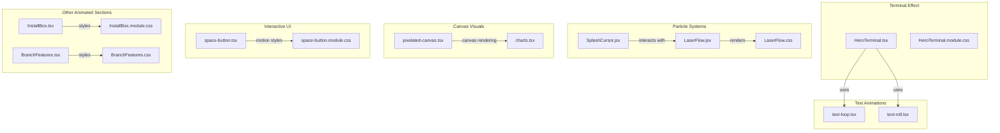
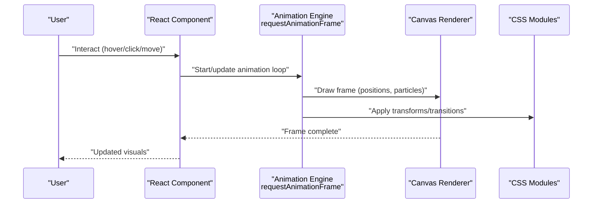
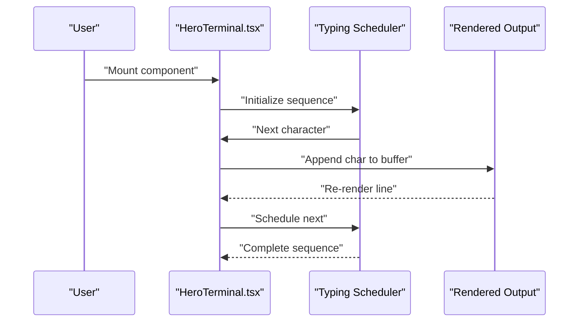
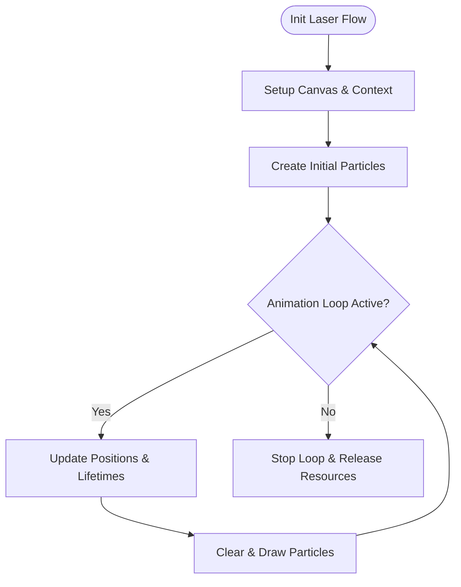
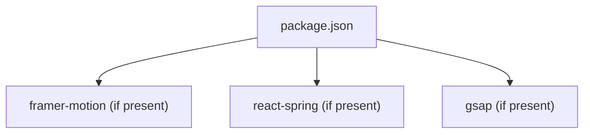

# Animated Components

<cite>
**Referenced Files in This Document**
- [HeroTerminal.tsx](file://src/components/HeroTerminal.tsx)
- [HeroTerminal.module.css](file://src/components/HeroTerminal.module.css)
- [LaserFlow.jsx](file://src/components/LaserFlow.jsx)
- [LaserFlow.css](file://src/components/LaserFlow.css)
- [SplashCursor.jsx](file://src/components/SplashCursor.jsx)
- [text-loop.tsx](file://src/components/core/text-loop.tsx)
- [text-roll.tsx](file://src/components/core/text-roll.tsx)
- [pixelated-canvas.tsx](file://src/components/ui/pixelated-canvas.tsx)
- [charts.tsx](file://src/components/ui/charts.tsx)
- [space-button.tsx](file://src/components/ui/space-button.tsx)
- [space-button.module.css](file://src/components/ui/space-button.module.css)
- [InstallBox.tsx](file://src/components/InstallBox.tsx)
- [InstallBox.module.css](file://src/components/InstallBox.module.css)
- [BranchFeatures.tsx](file://src/components/BranchFeatures.tsx)
- [BranchFeatures.css](file://src/components/BranchFeatures.css)
- [package.json](file://package.json)
</cite>

## Table of Contents
1. [Introduction](#introduction)
2. [Project Structure](#project-structure)
3. [Core Components](#core-components)
4. [Architecture Overview](#architecture-overview)
5. [Detailed Component Analysis](#detailed-component-analysis)
6. [Dependency Analysis](#dependency-analysis)
7. [Performance Considerations](#performance-considerations)
8. [Troubleshooting Guide](#troubleshooting-guide)
9. [Conclusion](#conclusion)
10. [Appendices](#appendices)

## Introduction
This document provides a comprehensive guide to the custom animated components and interactive visual elements used across the application. It focuses on:
- Text animation components (looping and rolling text)
- Terminal simulation effects (hero terminal)
- Particle systems and cursor interactions (laser flow, splash cursor)
- Canvas-based visuals (pixelated canvas, charts)
- Interactive UI primitives with motion (space button)
- Integration patterns for smooth user experiences

The goal is to explain how these components are implemented, which libraries they rely on, performance optimization techniques, and best practices for creating engaging animations without sacrificing responsiveness.

## Project Structure
Animated and interactive components are primarily located under src/components, organized by feature or type:
- Core text animations: core/text-loop.tsx, core/text-roll.tsx
- Hero terminal effect: HeroTerminal.tsx + HeroTerminal.module.css
- Laser flow particle system: LaserFlow.jsx + LaserFlow.css
- Cursor interaction particles: SplashCursor.jsx
- Canvas-based visuals: ui/pixelated-canvas.tsx, ui/charts.tsx
- Motion-enhanced UI: ui/space-button.tsx + space-button.module.css
- Additional animated sections: InstallBox.tsx + InstallBox.module.css, BranchFeatures.tsx + BranchFeatures.css

**Diagram sources**
- [HeroTerminal.tsx](file://src/components/HeroTerminal.tsx)
- [HeroTerminal.module.css](file://src/components/HeroTerminal.module.css)
- [LaserFlow.jsx](file://src/components/LaserFlow.jsx)
- [LaserFlow.css](file://src/components/LaserFlow.css)
- [SplashCursor.jsx](file://src/components/SplashCursor.jsx)
- [text-loop.tsx](file://src/components/core/text-loop.tsx)
- [text-roll.tsx](file://src/components/core/text-roll.tsx)
- [pixelated-canvas.tsx](file://src/components/ui/pixelated-canvas.tsx)
- [charts.tsx](file://src/components/ui/charts.tsx)
- [space-button.tsx](file://src/components/ui/space-button.tsx)
- [space-button.module.css](file://src/components/ui/space-button.module.css)
- [InstallBox.tsx](file://src/components/InstallBox.tsx)
- [InstallBox.module.css](file://src/components/InstallBox.module.css)
- [BranchFeatures.tsx](file://src/components/BranchFeatures.tsx)
- [BranchFeatures.css](file://src/components/BranchFeatures.css)

**Section sources**
- [HeroTerminal.tsx](file://src/components/HeroTerminal.tsx)
- [LaserFlow.jsx](file://src/components/LaserFlow.jsx)
- [SplashCursor.jsx](file://src/components/SplashCursor.jsx)
- [text-loop.tsx](file://src/components/core/text-loop.tsx)
- [text-roll.tsx](file://src/components/core/text-roll.tsx)
- [pixelated-canvas.tsx](file://src/components/ui/pixelated-canvas.tsx)
- [charts.tsx](file://src/components/ui/charts.tsx)
- [space-button.tsx](file://src/components/ui/space-button.tsx)
- [InstallBox.tsx](file://src/components/InstallBox.tsx)
- [BranchFeatures.tsx](file://src/components/BranchFeatures.tsx)

## Core Components
This section summarizes the primary animated components and their responsibilities:
- Text Loop: Cycles through an array of phrases with transitions, suitable for hero taglines or dynamic labels.
- Text Roll: Provides a vertical roll transition between items, useful for showcasing features or steps.
- Hero Terminal: Simulates a terminal interface with typing effects, command prompts, and styled output.
- Laser Flow: A canvas-based particle system that renders flowing laser-like trails.
- Splash Cursor: Adds interactive particle bursts following the mouse cursor.
- Pixelated Canvas: Renders pixel-art style visuals using a low-resolution canvas scaled up.
- Charts: Animated chart components built on top of canvas for data visualization.
- Space Button: A motion-enhanced button with hover and press states.
- Install Box: Animated installation instructions with copy-to-clipboard behavior and subtle motion cues.
- Branch Features: Animated feature highlights with scroll-triggered reveals.

Key implementation notes:
- Many components use requestAnimationFrame for smooth updates.
- CSS modules provide scoped styling and transitions.
- Canvas-based components manage their own render loops and resize handling.
- Text animations leverage React state and timers for sequencing.

**Section sources**
- [text-loop.tsx](file://src/components/core/text-loop.tsx)
- [text-roll.tsx](file://src/components/core/text-roll.tsx)
- [HeroTerminal.tsx](file://src/components/HeroTerminal.tsx)
- [LaserFlow.jsx](file://src/components/LaserFlow.jsx)
- [SplashCursor.jsx](file://src/components/SplashCursor.jsx)
- [pixelated-canvas.tsx](file://src/components/ui/pixelated-canvas.tsx)
- [charts.tsx](file://src/components/ui/charts.tsx)
- [space-button.tsx](file://src/components/ui/space-button.tsx)
- [InstallBox.tsx](file://src/components/InstallBox.tsx)
- [BranchFeatures.tsx](file://src/components/BranchFeatures.tsx)

## Architecture Overview
The animation architecture separates concerns into three layers:
- Presentation layer: React components orchestrate state and lifecycle.
- Animation engine: requestAnimationFrame-driven loops update positions, colors, and frames.
- Styling layer: CSS modules handle transitions, transforms, and layout.

[No sources needed since this diagram shows conceptual workflow, not actual code structure]

## Detailed Component Analysis

### Text Loop Component
Purpose:
- Cycles through a list of strings with fade or slide transitions.
- Ideal for hero headings or rotating value propositions.

Implementation highlights:
- Uses React state to track current index and visibility flags.
- Timers schedule next phrase after a delay.
- Transitions are driven by CSS classes toggled via state.

Optimization tips:
- Debounce rapid re-renders if the loop is controlled externally.
- Use CSS opacity and transform for GPU-accelerated transitions.

**Section sources**
- [text-loop.tsx](file://src/components/core/text-loop.tsx)

### Text Roll Component
Purpose:
- Displays a vertical rolling transition between items.
- Useful for step-by-step flows or feature lists.

Implementation highlights:
- Manages active item index and transition direction.
- Applies translateY transforms to simulate rolling.
- Integrates with CSS keyframes for smooth easing.

Optimization tips:
- Avoid heavy DOM operations during roll; prefer transform changes.
- Pause roll when component is off-screen to save CPU/GPU.

**Section sources**
- [text-roll.tsx](file://src/components/core/text-roll.tsx)

### Hero Terminal Effect
Purpose:
- Simulates a terminal window with typed commands and outputs.
- Enhances storytelling and developer-centric messaging.

Implementation highlights:
- Typewriter effect using incremental character insertion.
- Styled prompt and output blocks with monospace fonts.
- Optional auto-scroll to keep latest output visible.

Sequence overview:

**Diagram sources**
- [HeroTerminal.tsx](file://src/components/HeroTerminal.tsx)
- [HeroTerminal.module.css](file://src/components/HeroTerminal.module.css)

**Section sources**
- [HeroTerminal.tsx](file://src/components/HeroTerminal.tsx)
- [HeroTerminal.module.css](file://src/components/HeroTerminal.module.css)

### Laser Flow Particle System
Purpose:
- Renders flowing laser-like trails using canvas.
- Creates immersive background effects.

Implementation highlights:
- Maintains a pool of particles with position, velocity, color, and lifetime.
- Updates positions per frame and redraws canvas.
- Resizes canvas on viewport changes.

Flowchart overview:

**Diagram sources**
- [LaserFlow.jsx](file://src/components/LaserFlow.jsx)
- [LaserFlow.css](file://src/components/LaserFlow.css)

**Section sources**
- [LaserFlow.jsx](file://src/components/LaserFlow.jsx)
- [LaserFlow.css](file://src/components/LaserFlow.css)

### Splash Cursor Interaction
Purpose:
- Adds interactive particle bursts following the mouse cursor.
- Enhances micro-interactions and delight.

Implementation highlights:
- Listens to pointermove events.
- Spawns short-lived particles at cursor location.
- Integrates with global animation loop to avoid multiple rAF instances.

Best practices:
- Throttle event handlers to reduce overhead.
- Limit max particles to prevent memory spikes.

**Section sources**
- [SplashCursor.jsx](file://src/components/SplashCursor.jsx)

### Pixelated Canvas Visuals
Purpose:
- Renders pixel-art style visuals by drawing on a small canvas and scaling up.
- Useful for retro aesthetics and performance-friendly graphics.

Implementation highlights:
- Low-resolution internal canvas size.
- Upscaling via CSS transform or canvas drawImage scaling.
- Optimized draw calls for static or infrequent updates.

**Section sources**
- [pixelated-canvas.tsx](file://src/components/ui/pixelated-canvas.tsx)

### Charts Component
Purpose:
- Provides animated chart visuals using canvas.
- Suitable for dashboards and analytics pages.

Implementation highlights:
- Data-driven rendering with smooth transitions.
- Handles responsive resizing and theme-aware colors.

**Section sources**
- [charts.tsx](file://src/components/ui/charts.tsx)

### Space Button
Purpose:
- A motion-enhanced button with hover and press states.
- Encourages interaction with tactile feedback.

Implementation highlights:
- CSS transitions for scale and shadow.
- Keyboard accessibility and focus styles.

**Section sources**
- [space-button.tsx](file://src/components/ui/space-button.tsx)
- [space-button.module.css](file://src/components/ui/space-button.module.css)

### Install Box
Purpose:
- Displays installation commands with copy-to-clipboard functionality.
- Includes subtle motion cues for better UX.

Implementation highlights:
- Clipboard API integration with fallback messages.
- Animated success feedback.

**Section sources**
- [InstallBox.tsx](file://src/components/InstallBox.tsx)
- [InstallBox.module.css](file://src/components/InstallBox.module.css)

### Branch Features
Purpose:
- Highlights features with scroll-triggered animations.
- Improves content discoverability.

Implementation highlights:
- IntersectionObserver for reveal-on-scroll.
- Staggered entrance animations.

**Section sources**
- [BranchFeatures.tsx](file://src/components/BranchFeatures.tsx)
- [BranchFeatures.css](file://src/components/BranchFeatures.css)

## Dependency Analysis
External dependencies relevant to animations:
- Check package.json for animation libraries such as framer-motion, react-spring, or similar.
- Ensure consistent versioning to avoid conflicts.

**Diagram sources**
- [package.json](file://package.json)

**Section sources**
- [package.json](file://package.json)

## Performance Considerations
General guidance for smooth animations:
- Prefer transform and opacity over layout-affecting properties.
- Use requestAnimationFrame for continuous updates.
- Throttle high-frequency events (pointermove, scroll).
- Limit particle counts and lifetimes to control memory usage.
- Pause animations when components are off-screen.
- Leverage CSS modules for GPU-accelerated transitions.
- Debounce expensive computations triggered by animations.

[No sources needed since this section provides general guidance]

## Troubleshooting Guide
Common issues and resolutions:
- Jittery animations: Ensure rAF loop is stable and avoid heavy work inside the loop.
- Memory leaks: Stop loops and remove event listeners on unmount.
- Resize glitches: Debounce resize handlers and recalculate dimensions once.
- High CPU usage: Reduce particle count, lower frame rate, or pause when hidden.
- Accessibility: Provide reduced motion preferences support and keyboard alternatives.

[No sources needed since this section provides general guidance]

## Conclusion
The application’s animated components combine React state management, canvas rendering, and CSS transitions to deliver engaging user experiences. By adhering to performance best practices—such as efficient loops, throttling, and GPU-friendly transforms—you can maintain smoothness even with complex visuals. The modular design allows easy extension and reuse across pages while keeping maintenance straightforward.

[No sources needed since this section summarizes without analyzing specific files]

## Appendices
- For further customization, adjust timing functions and easing curves in CSS modules.
- To integrate new particle behaviors, extend the particle pool and update the draw routine accordingly.
- When adding new text animations, follow the pattern of state-driven transitions and timer scheduling.

[No sources needed since this section provides general guidance]