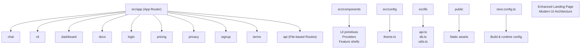
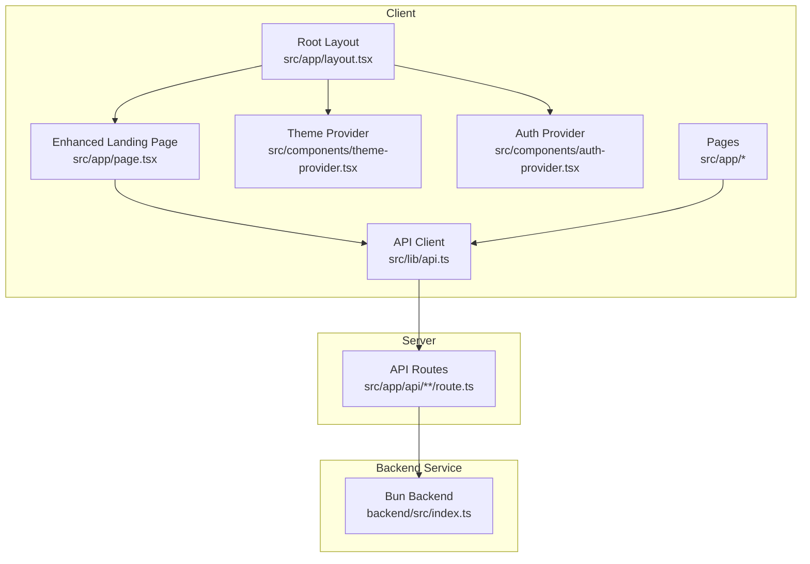
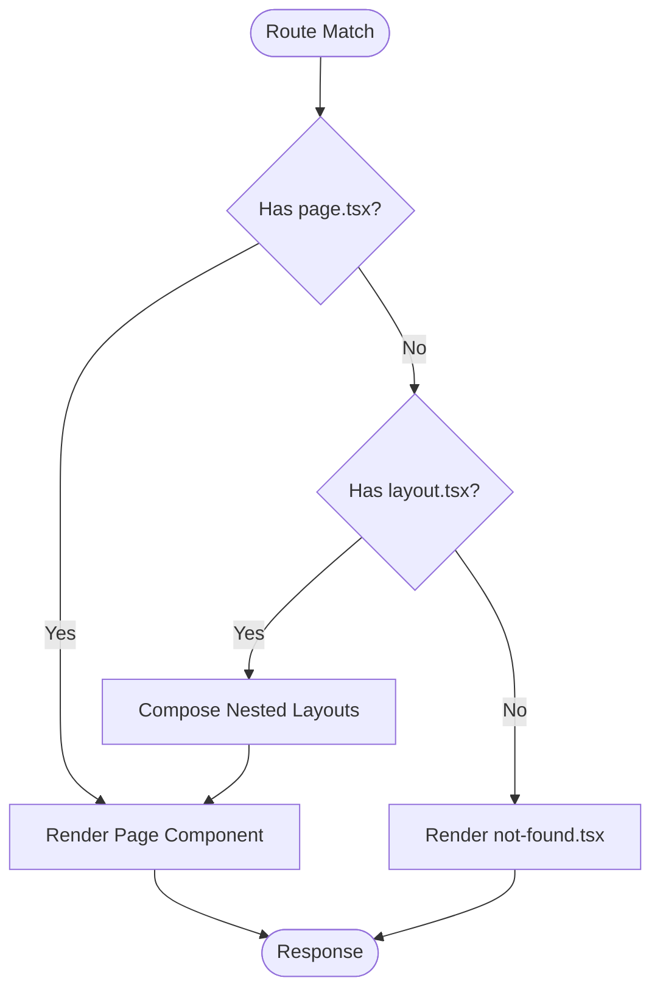
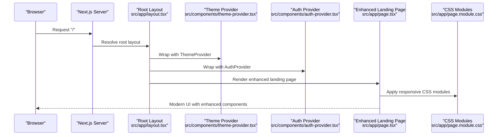
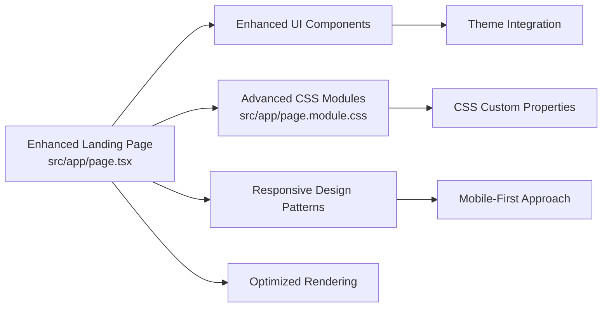
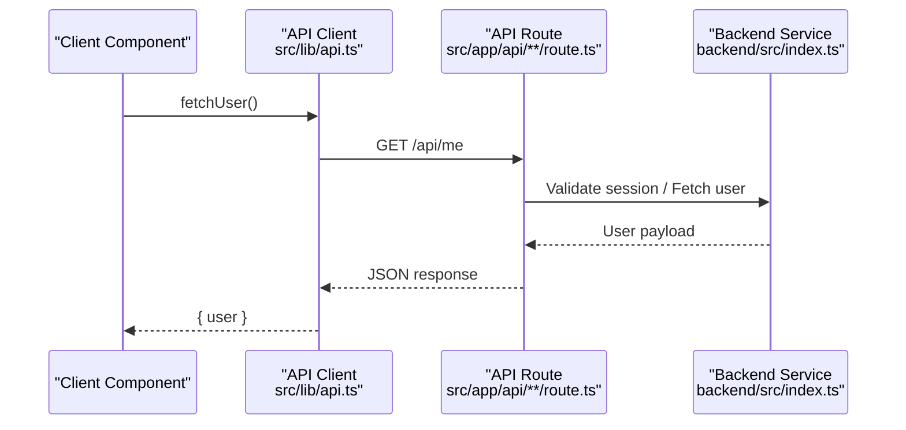
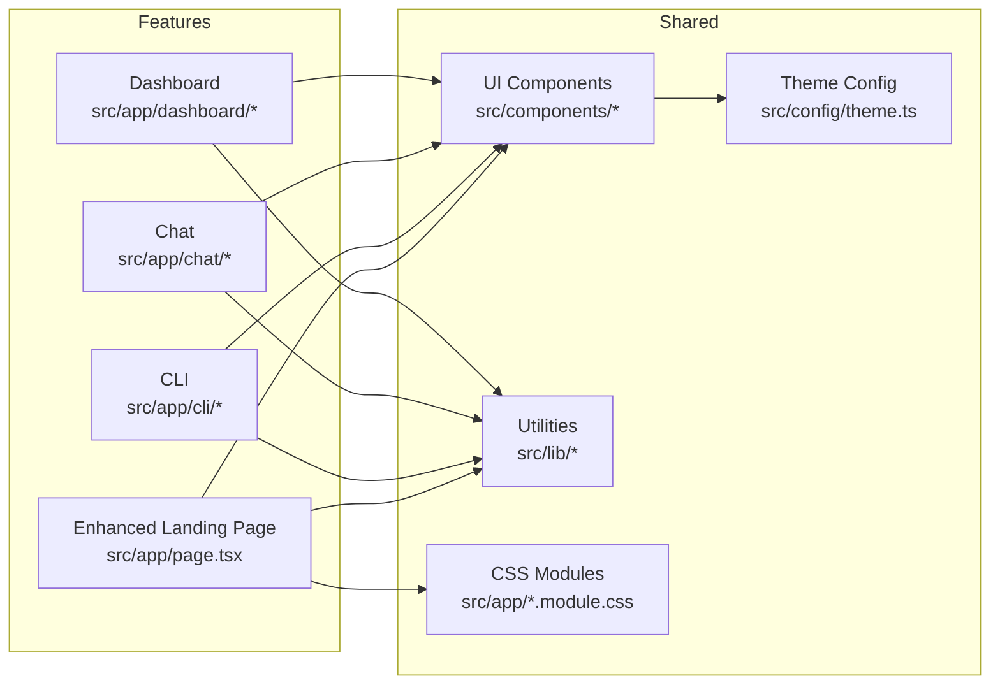
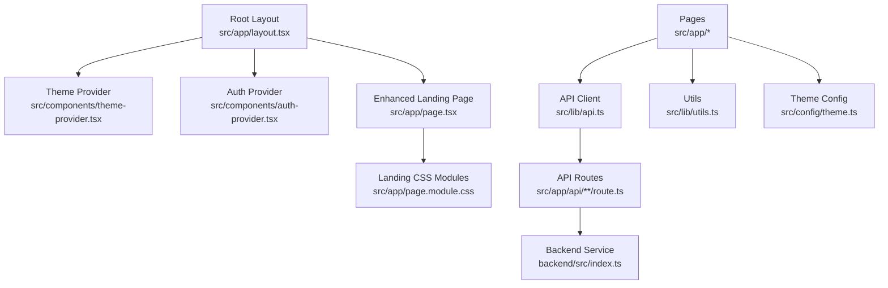

# Application Structure

<cite>
**Referenced Files in This Document**
- [next.config.ts](file://next.config.ts)
- [package.json](file://package.json)
- [tsconfig.json](file://tsconfig.json)
- [src/app/layout.tsx](file://src/app/layout.tsx)
- [src/app/page.tsx](file://src/app/page.tsx)
- [src/app/page.module.css](file://src/app/page.module.css)
- [src/app/globals.css](file://src/app/globals.css)
- [src/app/not-found.tsx](file://src/app/not-found.tsx)
- [src/app/chat/page.tsx](file://src/app/chat/page.tsx)
- [src/app/cli/page.tsx](file://src/app/cli/page.tsx)
- [src/app/dashboard/layout.tsx](file://src/app/dashboard/layout.tsx)
- [src/app/dashboard/page.tsx](file://src/app/dashboard/page.tsx)
- [src/app/dashboard/analytics/page.tsx](file://src/app/dashboard/analytics/page.tsx)
- [src/app/dashboard/billing/page.tsx](file://src/app/dashboard/billing/page.tsx)
- [src/app/dashboard/keys/page.tsx](file://src/app/dashboard/keys/page.tsx)
- [src/app/dashboard/providers/page.tsx](file://src/app/dashboard/providers/page.tsx)
- [src/app/dashboard/settings/page.tsx](file://src/app/dashboard/settings/page.tsx)
- [src/app/docs/page.tsx](file://src/app/docs/page.tsx)
- [src/app/login/page.tsx](file://src/app/login/page.tsx)
- [src/app/pricing/page.tsx](file://src/app/pricing/page.tsx)
- [src/app/privacy/page.tsx](file://src/app/privacy/page.tsx)
- [src/app/signup/page.tsx](file://src/app/signup/page.tsx)
- [src/app/terms/page.tsx](file://src/app/terms/page.tsx)
- [src/app/api/auth/login/route.ts](file://src/app/api/auth/login/route.ts)
- [src/app/api/auth/signup/route.ts](file://src/app/api/auth/signup/route.ts)
- [src/app/api/me/route.ts](file://src/app/api/me/route.ts)
- [src/app/api/models/route.ts](file://src/app/api/models/route.ts)
- [src/app/api/providers/route.ts](file://src/app/api/providers/route.ts)
- [src/app/api/providers/[id]/route.ts](file://src/app/api/providers/[id]/route.ts)
- [src/app/api/keys/route.ts](file://src/app/api/keys/route.ts)
- [src/app/api/keys/[id]/route.ts](file://src/app/api/keys/[id]/route.ts)
- [src/app/api/stream/route.ts](file://src/app/api/stream/route.ts)
- [src/app/api/v1/chat/completions/route.ts](file://src/app/api/v1/chat/completions/route.ts)
- [src/app/api/analytics/route.ts](file://src/app/api/analytics/route.ts)
- [src/components/theme-provider.tsx](file://src/components/theme-provider.tsx)
- [src/components/auth-provider.tsx](file://src/components/auth-provider.tsx)
- [src/config/theme.ts](file://src/config/theme.ts)
- [src/lib/api.ts](file://src/lib/api.ts)
- [src/lib/db.ts](file://src/lib/db.ts)
- [src/lib/utils.ts](file://src/lib/utils.ts)
</cite>

## Update Summary
**Changes Made**
- Updated landing page architecture section to reflect major UI overhaul with enhanced components and responsive design
- Added documentation for modernized visual architecture patterns in the root page component
- Enhanced CSS module usage examples with new styling approaches
- Updated component composition patterns to reflect improved modular structure

## Table of Contents
1. [Introduction](#introduction)
2. [Project Structure](#project-structure)
3. [Core Components](#core-components)
4. [Architecture Overview](#architecture-overview)
5. [Detailed Component Analysis](#detailed-component-analysis)
6. [Dependency Analysis](#dependency-analysis)
7. [Performance Considerations](#performance-considerations)
8. [Troubleshooting Guide](#troubleshooting-guide)
9. [Conclusion](#conclusion)

## Introduction
This document explains the Next.js application structure with a focus on the App Router organization, layout composition patterns, and global configuration. It covers how pages are structured under src/app, the root layout hierarchy, global styles management, and the integration between frontend and backend services. It also documents environment configuration, build process setup, and the modular architecture used to organize features within the app directory. The landing page has undergone a major overhaul with enhanced UI components, improved responsive design, and modernized visual architecture.

## Project Structure
The project follows the Next.js App Router convention with feature-based directories under src/app. The top-level routes include chat, cli, dashboard, docs, login, pricing, privacy, signup, and terms. API endpoints are colocated under src/app/api using file-based routing. Shared UI components live under src/components, theme configuration under src/config, and shared utilities under src/lib.

**Diagram sources**
- [next.config.ts](file://next.config.ts)
- [src/app/layout.tsx](file://src/app/layout.tsx)
- [src/app/page.tsx](file://src/app/page.tsx)
- [src/app/page.module.css](file://src/app/page.module.css)
- [src/app/chat/page.tsx](file://src/app/chat/page.tsx)
- [src/app/cli/page.tsx](file://src/app/cli/page.tsx)
- [src/app/dashboard/layout.tsx](file://src/app/dashboard/layout.tsx)
- [src/app/dashboard/page.tsx](file://src/app/dashboard/page.tsx)
- [src/app/docs/page.tsx](file://src/app/docs/page.tsx)
- [src/app/login/page.tsx](file://src/app/login/page.tsx)
- [src/app/pricing/page.tsx](file://src/app/pricing/page.tsx)
- [src/app/privacy/page.tsx](file://src/app/privacy/page.tsx)
- [src/app/signup/page.tsx](file://src/app/signup/page.tsx)
- [src/app/terms/page.tsx](file://src/app/terms/page.tsx)
- [src/app/api/auth/login/route.ts](file://src/app/api/auth/login/route.ts)
- [src/app/api/auth/signup/route.ts](file://src/app/api/auth/signup/route.ts)
- [src/app/api/me/route.ts](file://src/app/api/me/route.ts)
- [src/app/api/models/route.ts](file://src/app/api/models/route.ts)
- [src/app/api/providers/route.ts](file://src/app/api/providers/route.ts)
- [src/app/api/providers/[id]/route.ts](file://src/app/api/providers/[id]/route.ts)
- [src/app/api/keys/route.ts](file://src/app/api/keys/route.ts)
- [src/app/api/keys/[id]/route.ts](file://src/app/api/keys/[id]/route.ts)
- [src/app/api/stream/route.ts](file://src/app/api/stream/route.ts)
- [src/app/api/v1/chat/completions/route.ts](file://src/app/api/v1/chat/completions/route.ts)
- [src/app/api/analytics/route.ts](file://src/app/api/analytics/route.ts)
- [src/components/theme-provider.tsx](file://src/components/theme-provider.tsx)
- [src/components/auth-provider.tsx](file://src/components/auth-provider.tsx)
- [src/config/theme.ts](file://src/config/theme.ts)
- [src/lib/api.ts](file://src/lib/api.ts)
- [src/lib/db.ts](file://src/lib/db.ts)
- [src/lib/utils.ts](file://src/lib/utils.ts)

**Section sources**
- [next.config.ts](file://next.config.ts)
- [src/app/layout.tsx](file://src/app/layout.tsx)
- [src/app/page.tsx](file://src/app/page.tsx)
- [src/app/page.module.css](file://src/app/page.module.css)
- [src/app/chat/page.tsx](file://src/app/chat/page.tsx)
- [src/app/cli/page.tsx](file://src/app/cli/page.tsx)
- [src/app/dashboard/layout.tsx](file://src/app/dashboard/layout.tsx)
- [src/app/dashboard/page.tsx](file://src/app/dashboard/page.tsx)
- [src/app/docs/page.tsx](file://src/app/docs/page.tsx)
- [src/app/login/page.tsx](file://src/app/login/page.tsx)
- [src/app/pricing/page.tsx](file://src/app/pricing/page.tsx)
- [src/app/privacy/page.tsx](file://src/app/privacy/page.tsx)
- [src/app/signup/page.tsx](file://src/app/signup/page.tsx)
- [src/app/terms/page.tsx](file://src/app/terms/page.tsx)
- [src/app/api/auth/login/route.ts](file://src/app/api/auth/login/route.ts)
- [src/app/api/auth/signup/route.ts](file://src/app/api/auth/signup/route.ts)
- [src/app/api/me/route.ts](file://src/app/api/me/route.ts)
- [src/app/api/models/route.ts](file://src/app/api/models/route.ts)
- [src/app/api/providers/route.ts](file://src/app/api/providers/route.ts)
- [src/app/api/providers/[id]/route.ts](file://src/app/api/providers/[id]/route.ts)
- [src/app/api/keys/route.ts](file://src/app/api/keys/route.ts)
- [src/app/api/keys/[id]/route.ts](file://src/app/api/keys/[id]/route.ts)
- [src/app/api/stream/route.ts](file://src/app/api/stream/route.ts)
- [src/app/api/v1/chat/completions/route.ts](file://src/app/api/v1/chat/completions/route.ts)
- [src/app/api/analytics/route.ts](file://src/app/api/analytics/route.ts)
- [src/components/theme-provider.tsx](file://src/components/theme-provider.tsx)
- [src/components/auth-provider.tsx](file://src/components/auth-provider.tsx)
- [src/config/theme.ts](file://src/config/theme.ts)
- [src/lib/api.ts](file://src/lib/api.ts)
- [src/lib/db.ts](file://src/lib/db.ts)
- [src/lib/utils.ts](file://src/lib/utils.ts)

## Core Components
- Root layout: Provides the base HTML shell and global providers for the entire application.
- Global styles: Centralized CSS imported at the root level to apply site-wide styles.
- Providers: Theme and authentication context providers are composed at the root to be available across all routes.
- Utilities and libraries: Shared logic for API calls, database access, and common helpers is centralized under src/lib.
- Configuration: Theme definitions and Next.js build/runtime settings are defined in src/config/theme.ts and next.config.ts respectively.
- **Enhanced Landing Page**: Modernized visual architecture with improved responsive design and enhanced UI components.

Key responsibilities:
- Layout composition: Root layout composes providers and global styles; nested layouts (e.g., dashboard) add route-specific chrome.
- Feature modules: Each feature folder under src/app contains its own page(s) and optional local styles.
- API routes: File-based server routes under src/app/api implement REST endpoints consumed by client components.
- **Responsive Design**: Enhanced CSS modules provide adaptive layouts across different screen sizes and devices.

**Section sources**
- [src/app/layout.tsx](file://src/app/layout.tsx)
- [src/app/globals.css](file://src/app/globals.css)
- [src/app/page.tsx](file://src/app/page.tsx)
- [src/app/page.module.css](file://src/app/page.module.css)
- [src/components/theme-provider.tsx](file://src/components/theme-provider.tsx)
- [src/components/auth-provider.tsx](file://src/components/auth-provider.tsx)
- [src/config/theme.ts](file://src/config/theme.ts)
- [src/lib/api.ts](file://src/lib/api.ts)
- [src/lib/db.ts](file://src/lib/db.ts)
- [src/lib/utils.ts](file://src/lib/utils.ts)
- [next.config.ts](file://next.config.ts)

## Architecture Overview
The application uses the Next.js App Router for both client-side pages and server-side API routes. Client pages import providers from src/components and consume APIs via src/lib/api.ts. Server routes under src/app/api handle business logic and communicate with the backend service or data layer as needed. The landing page now employs a modernized visual architecture with enhanced component composition patterns.

**Diagram sources**
- [src/app/layout.tsx](file://src/app/layout.tsx)
- [src/app/page.tsx](file://src/app/page.tsx)
- [src/app/page.module.css](file://src/app/page.module.css)
- [src/components/theme-provider.tsx](file://src/components/theme-provider.tsx)
- [src/components/auth-provider.tsx](file://src/components/auth-provider.tsx)
- [src/lib/api.ts](file://src/lib/api.ts)
- [src/app/api/auth/login/route.ts](file://src/app/api/auth/login/route.ts)
- [src/app/api/auth/signup/route.ts](file://src/app/api/auth/signup/route.ts)
- [src/app/api/me/route.ts](file://src/app/api/me/route.ts)
- [src/app/api/models/route.ts](file://src/app/api/models/route.ts)
- [src/app/api/providers/route.ts](file://src/app/api/providers/route.ts)
- [src/app/api/providers/[id]/route.ts](file://src/app/api/providers/[id]/route.ts)
- [src/app/api/keys/route.ts](file://src/app/api/keys/route.ts)
- [src/app/api/keys/[id]/route.ts](file://src/app/api/keys/[id]/route.ts)
- [src/app/api/stream/route.ts](file://src/app/api/stream/route.ts)
- [src/app/api/v1/chat/completions/route.ts](file://src/app/api/v1/chat/completions/route.ts)
- [src/app/api/analytics/route.ts](file://src/app/api/analytics/route.ts)
- [backend/src/index.ts](file://backend/src/index.ts)

## Detailed Component Analysis

### App Router Organization and Page Structure
- Top-level routes: chat, cli, docs, login, pricing, privacy, signup, terms each expose a page.tsx.
- Dashboard feature: Contains a nested layout.tsx and multiple subpages (analytics, billing, keys, providers, settings).
- Not found handling: A dedicated not-found.tsx provides a custom fallback for unmatched routes.
- **Enhanced Landing Page**: Major overhaul with modernized visual architecture, improved responsive design, and enhanced UI components.

**Diagram sources**
- [src/app/chat/page.tsx](file://src/app/chat/page.tsx)
- [src/app/cli/page.tsx](file://src/app/cli/page.tsx)
- [src/app/dashboard/layout.tsx](file://src/app/dashboard/layout.tsx)
- [src/app/dashboard/page.tsx](file://src/app/dashboard/page.tsx)
- [src/app/dashboard/analytics/page.tsx](file://src/app/dashboard/analytics/page.tsx)
- [src/app/dashboard/billing/page.tsx](file://src/app/dashboard/billing/page.tsx)
- [src/app/dashboard/keys/page.tsx](file://src/app/dashboard/keys/page.tsx)
- [src/app/dashboard/providers/page.tsx](file://src/app/dashboard/providers/page.tsx)
- [src/app/dashboard/settings/page.tsx](file://src/app/dashboard/settings/page.tsx)
- [src/app/docs/page.tsx](file://src/app/docs/page.tsx)
- [src/app/login/page.tsx](file://src/app/login/page.tsx)
- [src/app/pricing/page.tsx](file://src/app/pricing/page.tsx)
- [src/app/privacy/page.tsx](file://src/app/privacy/page.tsx)
- [src/app/signup/page.tsx](file://src/app/signup/page.tsx)
- [src/app/terms/page.tsx](file://src/app/terms/page.tsx)
- [src/app/not-found.tsx](file://src/app/not-found.tsx)

**Section sources**
- [src/app/chat/page.tsx](file://src/app/chat/page.tsx)
- [src/app/cli/page.tsx](file://src/app/cli/page.tsx)
- [src/app/dashboard/layout.tsx](file://src/app/dashboard/layout.tsx)
- [src/app/dashboard/page.tsx](file://src/app/dashboard/page.tsx)
- [src/app/dashboard/analytics/page.tsx](file://src/app/dashboard/analytics/page.tsx)
- [src/app/dashboard/billing/page.tsx](file://src/app/dashboard/billing/page.tsx)
- [src/app/dashboard/keys/page.tsx](file://src/app/dashboard/keys/page.tsx)
- [src/app/dashboard/providers/page.tsx](file://src/app/dashboard/providers/page.tsx)
- [src/app/dashboard/settings/page.tsx](file://src/app/dashboard/settings/page.tsx)
- [src/app/docs/page.tsx](file://src/app/docs/page.tsx)
- [src/app/login/page.tsx](file://src/app/login/page.tsx)
- [src/app/pricing/page.tsx](file://src/app/pricing/page.tsx)
- [src/app/privacy/page.tsx](file://src/app/privacy/page.tsx)
- [src/app/signup/page.tsx](file://src/app/signup/page.tsx)
- [src/app/terms/page.tsx](file://src/app/terms/page.tsx)
- [src/app/not-found.tsx](file://src/app/not-found.tsx)

### Root Layout Composition and Global Styles
- Root layout composes providers (theme and auth) and imports global styles.
- Global styles are applied once at the root to ensure consistent theming and typography across the app.
- Providers wrap children to make context available to all pages and components.
- **Enhanced Styling**: The landing page utilizes advanced CSS modules with responsive design patterns and modern visual architecture.

**Diagram sources**
- [src/app/layout.tsx](file://src/app/layout.tsx)
- [src/app/globals.css](file://src/app/globals.css)
- [src/app/page.tsx](file://src/app/page.tsx)
- [src/app/page.module.css](file://src/app/page.module.css)
- [src/components/theme-provider.tsx](file://src/components/theme-provider.tsx)
- [src/components/auth-provider.tsx](file://src/components/auth-provider.tsx)

**Section sources**
- [src/app/layout.tsx](file://src/app/layout.tsx)
- [src/app/globals.css](file://src/app/globals.css)
- [src/app/page.tsx](file://src/app/page.tsx)
- [src/app/page.module.css](file://src/app/page.module.css)
- [src/components/theme-provider.tsx](file://src/components/theme-provider.tsx)
- [src/components/auth-provider.tsx](file://src/components/auth-provider.tsx)

### Enhanced Landing Page Architecture
**Updated** The landing page has undergone a major overhaul featuring enhanced UI components, improved responsive design, and modernized visual architecture.

Key architectural improvements:
- **Component Composition**: Enhanced modular structure with reusable UI components
- **Responsive Design**: Advanced CSS modules providing adaptive layouts across devices
- **Visual Architecture**: Modernized design patterns with improved user experience
- **Performance Optimization**: Optimized rendering and asset loading strategies

**Diagram sources**
- [src/app/page.tsx](file://src/app/page.tsx)
- [src/app/page.module.css](file://src/app/page.module.css)

**Section sources**
- [src/app/page.tsx](file://src/app/page.tsx)
- [src/app/page.module.css](file://src/app/page.module.css)

### API Integration and Data Flow
- Client code uses src/lib/api.ts to call server routes under src/app/api.
- Server routes implement handlers for authentication, user info, models, providers, keys, streaming, analytics, and OpenAI-compatible completions.
- These routes may forward requests to the backend service or interact with the database layer.

**Diagram sources**
- [src/lib/api.ts](file://src/lib/api.ts)
- [src/app/api/me/route.ts](file://src/app/api/me/route.ts)
- [src/app/api/auth/login/route.ts](file://src/app/api/auth/login/route.ts)
- [src/app/api/auth/signup/route.ts](file://src/app/api/auth/signup/route.ts)
- [src/app/api/models/route.ts](file://src/app/api/models/route.ts)
- [src/app/api/providers/route.ts](file://src/app/api/providers/route.ts)
- [src/app/api/providers/[id]/route.ts](file://src/app/api/providers/[id]/route.ts)
- [src/app/api/keys/route.ts](file://src/app/api/keys/route.ts)
- [src/app/api/keys/[id]/route.ts](file://src/app/api/keys/[id]/route.ts)
- [src/app/api/stream/route.ts](file://src/app/api/stream/route.ts)
- [src/app/api/v1/chat/completions/route.ts](file://src/app/api/v1/chat/completions/route.ts)
- [src/app/api/analytics/route.ts](file://src/app/api/analytics/route.ts)
- [backend/src/index.ts](file://backend/src/index.ts)

**Section sources**
- [src/lib/api.ts](file://src/lib/api.ts)
- [src/app/api/me/route.ts](file://src/app/api/me/route.ts)
- [src/app/api/auth/login/route.ts](file://src/app/api/auth/login/route.ts)
- [src/app/api/auth/signup/route.ts](file://src/app/api/auth/signup/route.ts)
- [src/app/api/models/route.ts](file://src/app/api/models/route.ts)
- [src/app/api/providers/route.ts](file://src/app/api/providers/route.ts)
- [src/app/api/providers/[id]/route.ts](file://src/app/api/providers/[id]/route.ts)
- [src/app/api/keys/route.ts](file://src/app/api/keys/route.ts)
- [src/app/api/keys/[id]/route.ts](file://src/app/api/keys/[id]/route.ts)
- [src/app/api/stream/route.ts](file://src/app/api/stream/route.ts)
- [src/app/api/v1/chat/completions/route.ts](file://src/app/api/v1/chat/completions/route.ts)
- [src/app/api/analytics/route.ts](file://src/app/api/analytics/route.ts)
- [backend/src/index.ts](file://backend/src/index.ts)

### Environment Configuration and Build Process
- Build and runtime configuration is managed through next.config.ts.
- TypeScript configuration is defined in tsconfig.json.
- Dependencies and scripts are declared in package.json.

Typical concerns covered by these files:
- Path aliases and module resolution
- Asset handling and static file serving
- Environment variables usage in server routes and client code
- Optimization flags for production builds

**Section sources**
- [next.config.ts](file://next.config.ts)
- [tsconfig.json](file://tsconfig.json)
- [package.json](file://package.json)

### Modular Architecture and Feature Organization
- Features are organized by domain under src/app (e.g., dashboard, chat, cli).
- Shared UI components live under src/components, including primitives and feature shells.
- Theme configuration is centralized in src/config/theme.ts.
- Cross-cutting utilities are grouped under src/lib (API client, DB access, helpers).
- **Enhanced Landing Page**: Demonstrates modern modular architecture with improved component composition.

**Diagram sources**
- [src/app/dashboard/layout.tsx](file://src/app/dashboard/layout.tsx)
- [src/app/dashboard/page.tsx](file://src/app/dashboard/page.tsx)
- [src/app/chat/page.tsx](file://src/app/chat/page.tsx)
- [src/app/cli/page.tsx](file://src/app/cli/page.tsx)
- [src/app/page.tsx](file://src/app/page.tsx)
- [src/app/page.module.css](file://src/app/page.module.css)
- [src/components/theme-provider.tsx](file://src/components/theme-provider.tsx)
- [src/components/auth-provider.tsx](file://src/components/auth-provider.tsx)
- [src/config/theme.ts](file://src/config/theme.ts)
- [src/lib/api.ts](file://src/lib/api.ts)
- [src/lib/db.ts](file://src/lib/db.ts)
- [src/lib/utils.ts](file://src/lib/utils.ts)

**Section sources**
- [src/app/dashboard/layout.tsx](file://src/app/dashboard/layout.tsx)
- [src/app/dashboard/page.tsx](file://src/app/dashboard/page.tsx)
- [src/app/chat/page.tsx](file://src/app/chat/page.tsx)
- [src/app/cli/page.tsx](file://src/app/cli/page.tsx)
- [src/app/page.tsx](file://src/app/page.tsx)
- [src/app/page.module.css](file://src/app/page.module.css)
- [src/components/theme-provider.tsx](file://src/components/theme-provider.tsx)
- [src/components/auth-provider.tsx](file://src/components/auth-provider.tsx)
- [src/config/theme.ts](file://src/config/theme.ts)
- [src/lib/api.ts](file://src/lib/api.ts)
- [src/lib/db.ts](file://src/lib/db.ts)
- [src/lib/utils.ts](file://src/lib/utils.ts)

## Dependency Analysis
The following diagram shows key dependencies among core modules and their roles in the application.

**Diagram sources**
- [src/app/layout.tsx](file://src/app/layout.tsx)
- [src/app/page.tsx](file://src/app/page.tsx)
- [src/app/page.module.css](file://src/app/page.module.css)
- [src/components/theme-provider.tsx](file://src/components/theme-provider.tsx)
- [src/components/auth-provider.tsx](file://src/components/auth-provider.tsx)
- [src/lib/api.ts](file://src/lib/api.ts)
- [src/lib/utils.ts](file://src/lib/utils.ts)
- [src/config/theme.ts](file://src/config/theme.ts)
- [src/app/api/auth/login/route.ts](file://src/app/api/auth/login/route.ts)
- [src/app/api/auth/signup/route.ts](file://src/app/api/auth/signup/route.ts)
- [src/app/api/me/route.ts](file://src/app/api/me/route.ts)
- [src/app/api/models/route.ts](file://src/app/api/models/route.ts)
- [src/app/api/providers/route.ts](file://src/app/api/providers/route.ts)
- [src/app/api/providers/[id]/route.ts](file://src/app/api/providers/[id]/route.ts)
- [src/app/api/keys/route.ts](file://src/app/api/keys/route.ts)
- [src/app/api/keys/[id]/route.ts](file://src/app/api/keys/[id]/route.ts)
- [src/app/api/stream/route.ts](file://src/app/api/stream/route.ts)
- [src/app/api/v1/chat/completions/route.ts](file://src/app/api/v1/chat/completions/route.ts)
- [src/app/api/analytics/route.ts](file://src/app/api/analytics/route.ts)
- [backend/src/index.ts](file://backend/src/index.ts)

**Section sources**
- [src/app/layout.tsx](file://src/app/layout.tsx)
- [src/app/page.tsx](file://src/app/page.tsx)
- [src/app/page.module.css](file://src/app/page.module.css)
- [src/components/theme-provider.tsx](file://src/components/theme-provider.tsx)
- [src/components/auth-provider.tsx](file://src/components/auth-provider.tsx)
- [src/lib/api.ts](file://src/lib/api.ts)
- [src/lib/utils.ts](file://src/lib/utils.ts)
- [src/config/theme.ts](file://src/config/theme.ts)
- [src/app/api/auth/login/route.ts](file://src/app/api/auth/login/route.ts)
- [src/app/api/auth/signup/route.ts](file://src/app/api/auth/signup/route.ts)
- [src/app/api/me/route.ts](file://src/app/api/me/route.ts)
- [src/app/api/models/route.ts](file://src/app/api/models/route.ts)
- [src/app/api/providers/route.ts](file://src/app/api/providers/route.ts)
- [src/app/api/providers/[id]/route.ts](file://src/app/api/providers/[id]/route.ts)
- [src/app/api/keys/route.ts](file://src/app/api/keys/route.ts)
- [src/app/api/keys/[id]/route.ts](file://src/app/api/keys/[id]/route.ts)
- [src/app/api/stream/route.ts](file://src/app/api/stream/route.ts)
- [src/app/api/v1/chat/completions/route.ts](file://src/app/api/v1/chat/completions/route.ts)
- [src/app/api/analytics/route.ts](file://src/app/api/analytics/route.ts)
- [backend/src/index.ts](file://backend/src/index.ts)

## Performance Considerations
- Prefer server components where possible to reduce client bundle size.
- Use route-level code splitting by placing heavy components inside feature pages.
- Cache frequently accessed data in server routes or use Next.js caching strategies.
- Minimize global CSS footprint and leverage component-scoped styles when appropriate.
- Stream responses for long-running operations via streaming API routes.
- **Enhanced Landing Page**: Optimized rendering with modern CSS modules and efficient component composition patterns.

[No sources needed since this section provides general guidance]

## Troubleshooting Guide
Common issues and checks:
- Missing providers: Ensure theme and auth providers are wrapped in the root layout so contexts are available globally.
- API route errors: Verify that server routes return proper HTTP status codes and JSON payloads.
- Environment variables: Confirm that required variables are present in the runtime environment and accessible to server routes.
- Build failures: Review next.config.ts and tsconfig.json for misconfiguration and validate dependency versions in package.json.
- **Landing Page Issues**: Check CSS module imports and responsive design breakpoints if the enhanced landing page displays incorrectly.

**Section sources**
- [src/app/layout.tsx](file://src/app/layout.tsx)
- [src/app/page.tsx](file://src/app/page.tsx)
- [src/app/page.module.css](file://src/app/page.module.css)
- [src/components/theme-provider.tsx](file://src/components/theme-provider.tsx)
- [src/components/auth-provider.tsx](file://src/components/auth-provider.tsx)
- [src/app/api/auth/login/route.ts](file://src/app/api/auth/login/route.ts)
- [src/app/api/auth/signup/route.ts](file://src/app/api/auth/signup/route.ts)
- [src/app/api/me/route.ts](file://src/app/api/me/route.ts)
- [next.config.ts](file://next.config.ts)
- [tsconfig.json](file://tsconfig.json)
- [package.json](file://package.json)

## Conclusion
The application leverages the Next.js App Router to organize features, compose layouts, and manage global configuration. Providers and global styles are centralized at the root, while feature modules remain cohesive and self-contained. The enhanced landing page demonstrates modern UI architecture with improved responsive design and component composition patterns. API routes provide a clear integration point between the frontend and backend services. With thoughtful use of server components, caching, streaming, and modern CSS modules, the app can scale efficiently while maintaining a clean and modular architecture.

[No sources needed since this section summarizes without analyzing specific files]