# Component Library

<cite>
**Referenced Files in This Document**
- [primitives.tsx](file://src/components/ui/primitives.tsx)
- [primitives.module.css](file://src/components/ui/primitives.module.css)
- [toast.tsx](file://src/components/ui/toast.tsx)
- [toast.module.css](file://src/components/ui/toast.module.css)
- [space-button.tsx](file://src/components/ui/space-button.tsx)
- [space-button.module.css](file://src/components/ui/space-button.module.css)
- [charts.tsx](file://src/components/ui/charts.tsx)
- [pixelated-canvas.tsx](file://src/components/ui/pixelated-canvas.tsx)
- [HeroTerminal.tsx](file://src/components/HeroTerminal.tsx)
- [HeroTerminal.module.css](file://src/components/HeroTerminal.module.css)
- [theme-provider.tsx](file://src/components/theme-provider.tsx)
- [theme-toggle.tsx](file://src/components/theme-toggle.tsx)
- [auth-provider.tsx](file://src/components/auth-provider.tsx)
- [config/theme.ts](file://src/config/theme.ts)
- [components.json](file://components.json)
- [app/globals.css](file://src/app/globals.css)
</cite>

## Update Summary
**Changes Made**
- Updated Space Button component documentation to reflect spacing improvements
- Added HeroTerminal component documentation for terminal-style hero sections
- Enhanced supporting UI components section with recent styling refinements
- Updated component examples to showcase improved spacing and visual consistency

## Table of Contents
1. [Introduction](#introduction)
2. [Project Structure](#project-structure)
3. [Core Components](#core-components)
4. [Authentication Context](#authentication-context)
5. [Theme System](#theme-system)
6. [Architecture Overview](#architecture-overview)
7. [Detailed Component Analysis](#detailed-component-analysis)
8. [Dependency Analysis](#dependency-analysis)
9. [Performance Considerations](#performance-considerations)
10. [Troubleshooting Guide](#troubleshooting-guide)
11. [Conclusion](#conclusion)
12. [Appendices](#appendices)

## Introduction
This document describes the expanded UI component library built with Shadcn/ui and Tailwind CSS. The library now includes primitive components, authentication context, theme switching capabilities, charting components, a comprehensive toast notification system, and enhanced supporting UI components including refined HeroTerminal styling and improved space-button spacing. It focuses on primitive components, their props, styling patterns, customization options, composition approach, theme integration, accessibility features, and usage examples for buttons, forms, notifications, charts, terminal components, and other reusable elements. It also explains how to register new components into the library and maintain consistency across the application.

## Project Structure
The UI library is organized under src/components/ui for primitives and shared UI building blocks, with theme configuration centralized in src/config/theme.ts and global styles in src/app/globals.css. Authentication context is provided through src/components/auth-provider.tsx, and theme switching through src/components/theme-toggle.tsx. Supporting UI components like HeroTerminal are located in src/components/. The Shadcn/ui configuration lives in components.json.

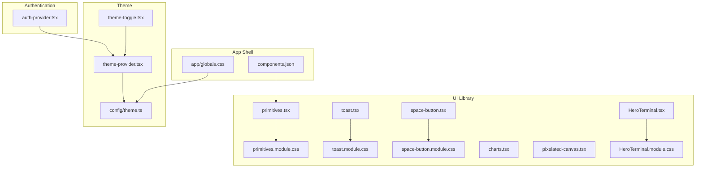

**Diagram sources**
- [primitives.tsx:1-200](file://src/components/ui/primitives.tsx#L1-L200)
- [primitives.module.css:1-200](file://src/components/ui/primitives.module.css#L1-L200)
- [toast.tsx:1-200](file://src/components/ui/toast.tsx#L1-L200)
- [toast.module.css:1-200](file://src/components/ui/toast.module.css#L1-L200)
- [space-button.tsx:1-200](file://src/components/ui/space-button.tsx#L1-L200)
- [space-button.module.css:1-200](file://src/components/ui/space-button.module.css#L1-L200)
- [charts.tsx:1-200](file://src/components/ui/charts.tsx#L1-L200)
- [pixelated-canvas.tsx:1-200](file://src/components/ui/pixelated-canvas.tsx#L1-L200)
- [HeroTerminal.tsx:1-200](file://src/components/HeroTerminal.tsx#L1-L200)
- [HeroTerminal.module.css:1-200](file://src/components/HeroTerminal.module.css#L1-L200)
- [auth-provider.tsx:1-200](file://src/components/auth-provider.tsx#L1-L200)
- [theme-provider.tsx:1-200](file://src/components/theme-provider.tsx#L1-L200)
- [theme-toggle.tsx:1-200](file://src/components/theme-toggle.tsx#L1-L200)
- [config/theme.ts:1-200](file://src/config/theme.ts#L1-L200)
- [app/globals.css:1-200](file://src/app/globals.css#L1-L200)
- [components.json:1-200](file://components.json#L1-L200)

**Section sources**
- [primitives.tsx:1-200](file://src/components/ui/primitives.tsx#L1-L200)
- [primitives.module.css:1-200](file://src/components/ui/primitives.module.css#L1-L200)
- [toast.tsx:1-200](file://src/components/ui/toast.tsx#L1-L200)
- [toast.module.css:1-200](file://src/components/ui/toast.module.css#L1-L200)
- [space-button.tsx:1-200](file://src/components/ui/space-button.tsx#L1-L200)
- [space-button.module.css:1-200](file://src/components/ui/space-button.module.css#L1-L200)
- [charts.tsx:1-200](file://src/components/ui/charts.tsx#L1-L200)
- [pixelated-canvas.tsx:1-200](file://src/components/ui/pixelated-canvas.tsx#L1-L200)
- [HeroTerminal.tsx:1-200](file://src/components/HeroTerminal.tsx#L1-L200)
- [HeroTerminal.module.css:1-200](file://src/components/HeroTerminal.module.css#L1-L200)
- [auth-provider.tsx:1-200](file://src/components/auth-provider.tsx#L1-L200)
- [theme-provider.tsx:1-200](file://src/components/theme-provider.tsx#L1-L200)
- [theme-toggle.tsx:1-200](file://src/components/theme-toggle.tsx#L1-L200)
- [config/theme.ts:1-200](file://src/config/theme.ts#L1-L200)
- [app/globals.css:1-200](file://src/app/globals.css#L1-L200)
- [components.json:1-200](file://components.json#L1-L200)

## Core Components
This section documents the primitive components that form the foundation of the UI library. Each component exposes a focused API surface, composes well with others, and follows consistent styling and accessibility patterns.

- Primitives (Button, Input, Label, Text, Card, Badge, etc.)
  - Props: variant, size, disabled, className, style, aria attributes as needed.
  - Styling: Tailwind utility classes layered over Shadcn/ui base styles; optional CSS modules for complex states.
  - Composition: Accepts children and forwards ref/attributes to underlying HTML elements.
  - Accessibility: Semantic HTML, focus management, ARIA roles where appropriate.
  - Customization: Theme tokens via CSS variables; className overrides; variant/size prop combinations.

- Toast (Notifications)
  - Props: message, type (info, success, warning, error), duration, position, onClose, action.
  - Styling: Consistent color palette per type; animation transitions; responsive positioning.
  - Composition: Can be mounted globally or per-page; supports stacking and auto-dismiss.
  - Accessibility: Live region announcements, keyboard dismissible, focus trapping when interactive.
  - Customization: Theme-aware colors, durations, and positions via config.

- Space Button
  - Props: label, onClick, variant, size, disabled, icon, loading.
  - Styling: Themed background and border; hover/focus states; icon alignment; **updated spacing improvements for better visual hierarchy**.
  - Composition: Wraps content and icons; forwards events and attributes.
  - Accessibility: Keyboard support, focus ring, aria-disabled when disabled.
  - Customization: Variant and size scale; icon slot; custom className; **enhanced spacing controls**.

- Charts
  - Props: data, type, height, width, theme, tooltip, legend.
  - Styling: Responsive sizing; theme-aware colors; accessible legends and tooltips.
  - Composition: Encapsulates charting logic; exposes simple data interface.
  - Accessibility: Alt text, keyboard navigation for legends, screen reader labels.
  - Customization: Theme tokens, color palettes, and layout options.

- Pixelated Canvas
  - Props: width, height, pixels, colorMap, animate, onPixelClick.
  - Styling: Canvas-based rendering; crisp pixel grid; theme-aware palette.
  - Composition: Interactive drawing surface; event forwarding.
  - Accessibility: Focusable canvas, keyboard controls, descriptive labels.
  - Customization: Palette mapping, animation toggles, interaction callbacks.

- Hero Terminal
  - Props: title, commands, outputLines, typingSpeed, showCursor, theme.
  - Styling: Terminal-inspired design with monospace fonts; syntax highlighting; **refined styling adjustments for better visual presentation**.
  - Composition: Simulates terminal interface with command input and output display.
  - Accessibility: Screen reader support for terminal content, keyboard navigation.
  - Customization: Command themes, output formatting, animation speeds, cursor behavior.

**Section sources**
- [primitives.tsx:1-200](file://src/components/ui/primitives.tsx#L1-L200)
- [primitives.module.css:1-200](file://src/components/ui/primitives.module.css#L1-L200)
- [toast.tsx:1-200](file://src/components/ui/toast.tsx#L1-L200)
- [toast.module.css:1-200](file://src/components/ui/toast.module.css#L1-L200)
- [space-button.tsx:1-200](file://src/components/ui/space-button.tsx#L1-L200)
- [space-button.module.css:1-200](file://src/components/ui/space-button.module.css#L1-L200)
- [charts.tsx:1-200](file://src/components/ui/charts.tsx#L1-L200)
- [pixelated-canvas.tsx:1-200](file://src/components/ui/pixelated-canvas.tsx#L1-L200)
- [HeroTerminal.tsx:1-200](file://src/components/HeroTerminal.tsx#L1-L200)
- [HeroTerminal.module.css:1-200](file://src/components/HeroTerminal.module.css#L1-L200)

## Authentication Context
The authentication context provides user state management and authentication methods throughout the application. It integrates seamlessly with the theme system and UI components.

- AuthProvider
  - Props: children, initialUser, authConfig
  - State: currentUser, isAuthenticated, isLoading, error
  - Methods: login, logout, register, updateUser
  - Integration: Works with theme provider and toast notifications
  - Security: Handles token storage, session management, and error handling

- Usage Patterns
  - Wrap application root with AuthProvider
  - Access auth state via useContext(AuthContext)
  - Use authentication hooks for common operations
  - Integrate with protected routes and conditional rendering

**Section sources**
- [auth-provider.tsx:1-200](file://src/components/auth-provider.tsx#L1-L200)

## Theme System
The theme system provides comprehensive theming capabilities with light/dark mode support, custom color palettes, and dynamic theme switching.

- ThemeProvider
  - Props: children, defaultTheme, themeStorageKey
  - State: currentTheme, themes, isDarkMode
  - Methods: setTheme, toggleTheme, addCustomTheme
  - Storage: Local storage persistence and system preference detection

- ThemeToggle
  - Props: showIcon, iconPosition, className
  - Features: Animated transitions, keyboard navigation, screen reader support
  - Integration: Works with all themed components automatically

- Theme Configuration
  - Color palettes: Primary, secondary, accent, neutral colors
  - Typography: Font families, sizes, weights, line heights
  - Spacing: Consistent spacing scale
  - Breakpoints: Mobile-first responsive design tokens

**Section sources**
- [theme-provider.tsx:1-200](file://src/components/theme-provider.tsx#L1-L200)
- [theme-toggle.tsx:1-200](file://src/components/theme-toggle.tsx#L1-L200)
- [config/theme.ts:1-200](file://src/config/theme.ts#L1-L200)

## Architecture Overview
The UI library integrates with Shadcn/ui and Tailwind CSS through a theme provider and global styles. Components are composed from primitives and styled using CSS variables exposed by the theme. The registration system centralizes component metadata and paths for discovery and import. Authentication context provides user state management across the application. Supporting components like HeroTerminal enhance the visual experience with specialized styling.

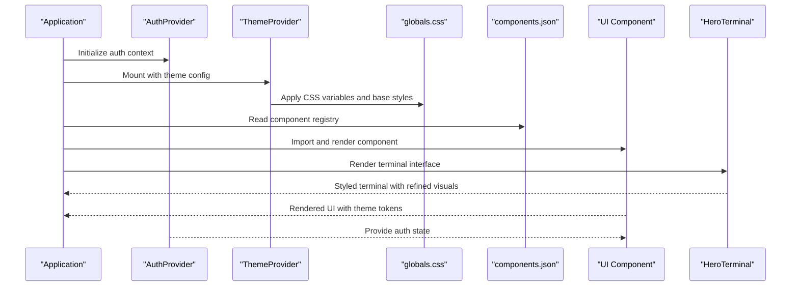

**Diagram sources**
- [auth-provider.tsx:1-200](file://src/components/auth-provider.tsx#L1-L200)
- [theme-provider.tsx:1-200](file://src/components/theme-provider.tsx#L1-L200)
- [app/globals.css:1-200](file://src/app/globals.css#L1-L200)
- [components.json:1-200](file://components.json#L1-L200)
- [HeroTerminal.tsx:1-200](file://src/components/HeroTerminal.tsx#L1-L200)

## Detailed Component Analysis

### Primitives
Primitives provide foundational UI building blocks such as Button, Input, Label, Text, Card, and Badge. They follow a consistent prop pattern and integrate with the theme system.

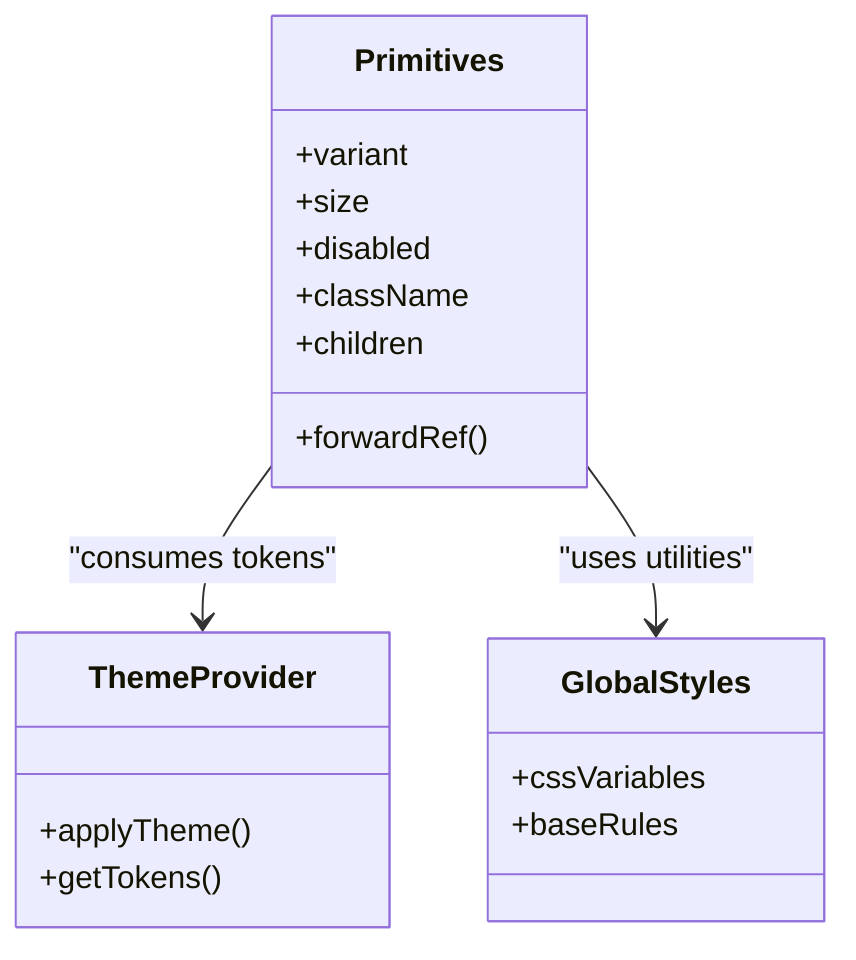

**Diagram sources**
- [primitives.tsx:1-200](file://src/components/ui/primitives.tsx#L1-L200)
- [primitives.module.css:1-200](file://src/components/ui/primitives.module.css#L1-L200)
- [theme-provider.tsx:1-200](file://src/components/theme-provider.tsx#L1-L200)
- [app/globals.css:1-200](file://src/app/globals.css#L1-L200)

**Section sources**
- [primitives.tsx:1-200](file://src/components/ui/primitives.tsx#L1-L200)
- [primitives.module.css:1-200](file://src/components/ui/primitives.module.css#L1-L200)

### Toast Notifications
Toast provides contextual feedback messages with types, durations, and positions. It composes with the theme provider for consistent colors and typography.

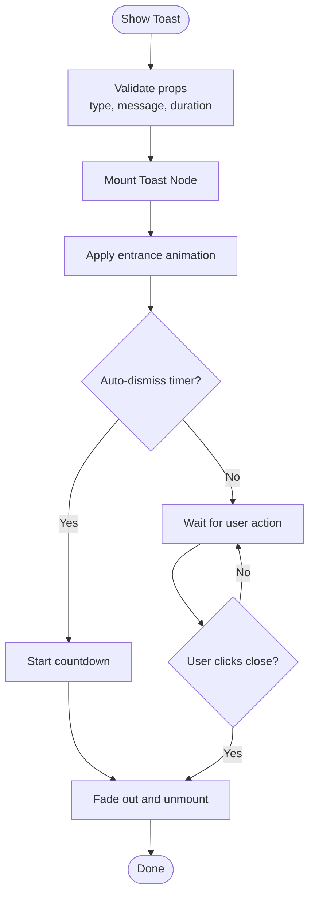

**Diagram sources**
- [toast.tsx:1-200](file://src/components/ui/toast.tsx#L1-L200)
- [toast.module.css:1-200](file://src/components/ui/toast.module.css#L1-L200)

**Section sources**
- [toast.tsx:1-200](file://src/components/ui/toast.tsx#L1-L200)
- [toast.module.css:1-200](file://src/components/ui/toast.module.css#L1-L200)

### Space Button
Space Button is a themed button component with variants, sizes, and icon support. It forwards events and attributes to the underlying element. **Recent improvements include enhanced spacing for better visual hierarchy and consistent alignment across different button states.**

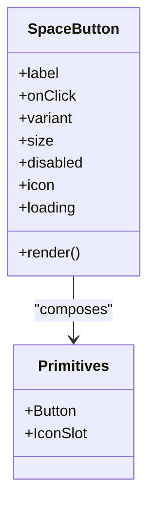

**Diagram sources**
- [space-button.tsx:1-200](file://src/components/ui/space-button.tsx#L1-L200)
- [space-button.module.css:1-200](file://src/components/ui/space-button.module.css#L1-L200)
- [primitives.tsx:1-200](file://src/components/ui/primitives.tsx#L1-L200)

**Section sources**
- [space-button.tsx:1-200](file://src/components/ui/space-button.tsx#L1-L200)
- [space-button.module.css:1-200](file://src/components/ui/space-button.module.css#L1-L200)

### Charts
Charts encapsulate visualization logic and expose a simple data interface. It uses theme tokens for colors and ensures accessible legends and tooltips.

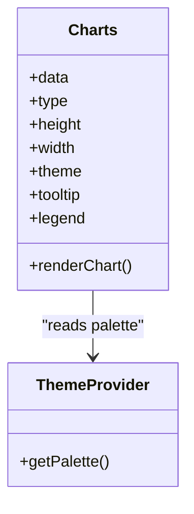

**Diagram sources**
- [charts.tsx:1-200](file://src/components/ui/charts.tsx#L1-L200)
- [theme-provider.tsx:1-200](file://src/components/theme-provider.tsx#L1-L200)

**Section sources**
- [charts.tsx:1-200](file://src/components/ui/charts.tsx#L1-L200)

### Pixelated Canvas
Pixelated Canvas renders an interactive pixel grid with configurable palettes and animations. It supports keyboard interactions and descriptive labels.

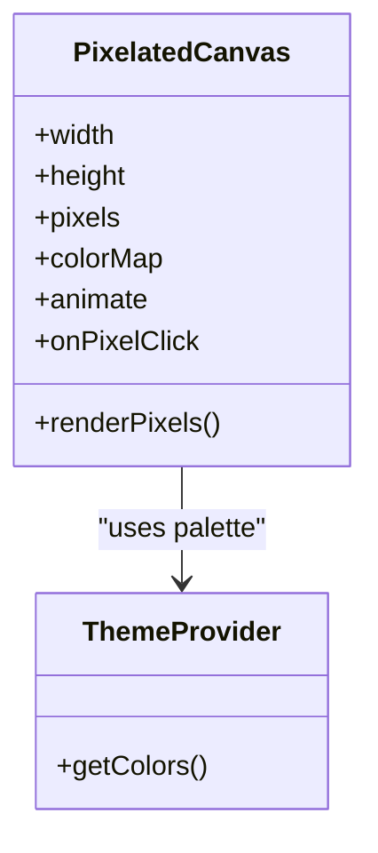

**Diagram sources**
- [pixelated-canvas.tsx:1-200](file://src/components/ui/pixelated-canvas.tsx#L1-L200)
- [theme-provider.tsx:1-200](file://src/components/theme-provider.tsx#L1-L200)

**Section sources**
- [pixelated-canvas.tsx:1-200](file://src/components/ui/pixelated-canvas.tsx#L1-L200)

### Hero Terminal
Hero Terminal provides a terminal-inspired interface for showcasing code examples, commands, and interactive demonstrations. **Recent styling adjustments improve visual clarity and ensure consistent appearance across different themes and screen sizes.**

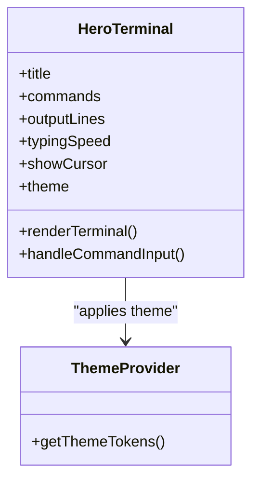

**Diagram sources**
- [HeroTerminal.tsx:1-200](file://src/components/HeroTerminal.tsx#L1-L200)
- [HeroTerminal.module.css:1-200](file://src/components/HeroTerminal.module.css#L1-L200)
- [theme-provider.tsx:1-200](file://src/components/theme-provider.tsx#L1-L200)

**Section sources**
- [HeroTerminal.tsx:1-200](file://src/components/HeroTerminal.tsx#L1-L200)
- [HeroTerminal.module.css:1-200](file://src/components/HeroTerminal.module.css#L1-L200)

### Authentication Provider
The authentication provider manages user state, authentication methods, and session persistence throughout the application.

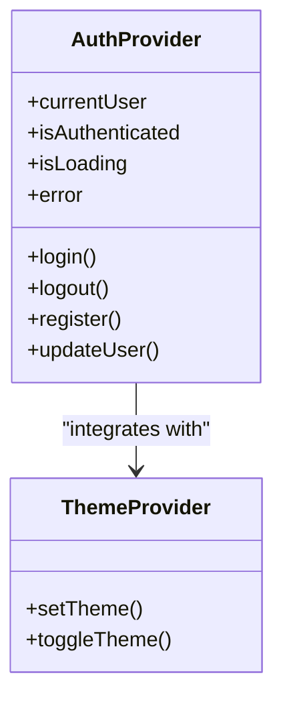

**Diagram sources**
- [auth-provider.tsx:1-200](file://src/components/auth-provider.tsx#L1-L200)
- [theme-provider.tsx:1-200](file://src/components/theme-provider.tsx#L1-L200)

**Section sources**
- [auth-provider.tsx:1-200](file://src/components/auth-provider.tsx#L1-L200)

### Conceptual Overview
The following conceptual diagram shows how pages consume the UI library through the theme provider, authentication context, and global styles.

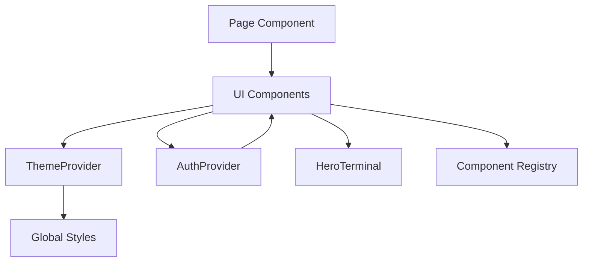

[No sources needed since this diagram shows conceptual workflow, not actual code structure]

## Dependency Analysis
The UI library depends on Shadcn/ui primitives and Tailwind CSS utilities. The theme provider injects CSS variables consumed by components. The authentication provider manages user state and integrates with the theme system. The component registry in components.json maps logical names to file paths for consistent imports. Supporting components like HeroTerminal extend the visual capabilities with specialized styling.

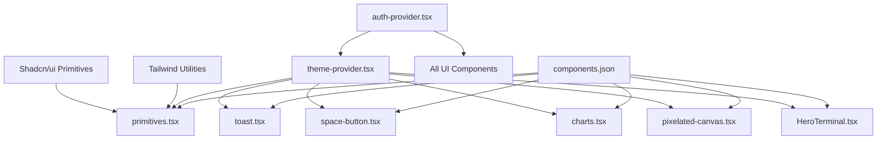

**Diagram sources**
- [primitives.tsx:1-200](file://src/components/ui/primitives.tsx#L1-L200)
- [toast.tsx:1-200](file://src/components/ui/toast.tsx#L1-L200)
- [space-button.tsx:1-200](file://src/components/ui/space-button.tsx#L1-L200)
- [charts.tsx:1-200](file://src/components/ui/charts.tsx#L1-L200)
- [pixelated-canvas.tsx:1-200](file://src/components/ui/pixelated-canvas.tsx#L1-L200)
- [HeroTerminal.tsx:1-200](file://src/components/HeroTerminal.tsx#L1-L200)
- [auth-provider.tsx:1-200](file://src/components/auth-provider.tsx#L1-L200)
- [theme-provider.tsx:1-200](file://src/components/theme-provider.tsx#L1-L200)
- [components.json:1-200](file://components.json#L1-L200)

**Section sources**
- [components.json:1-200](file://components.json#L1-L200)
- [theme-provider.tsx:1-200](file://src/components/theme-provider.tsx#L1-L200)
- [auth-provider.tsx:1-200](file://src/components/auth-provider.tsx#L1-L200)
- [primitives.tsx:1-200](file://src/components/ui/primitives.tsx#L1-L200)
- [HeroTerminal.tsx:1-200](file://src/components/HeroTerminal.tsx#L1-L200)

## Performance Considerations
- Prefer memoization for expensive components like charts and pixelated canvas to avoid unnecessary re-renders.
- Use lazy loading for heavy visualizations and defer initialization until visible.
- Minimize DOM mutations in canvas rendering by batching updates and using requestAnimationFrame.
- Keep CSS modules scoped and avoid large global overrides; leverage Tailwind utilities for performance.
- Debounce user interactions (e.g., pixel click handlers) to reduce overhead.
- Implement authentication state caching to prevent unnecessary re-authentication.
- Use React.memo for frequently used UI components to optimize rendering performance.
- Optimize HeroTerminal rendering by virtualizing long command outputs and limiting active animations.

## Troubleshooting Guide
Common issues and resolutions:
- Theme not applied: Ensure ThemeProvider wraps the app and CSS variables are present in globals.css.
- Toast not dismissing: Verify duration and auto-dismiss flags; check timers and unmount lifecycle.
- Button not responding: Confirm onClick handler is passed and disabled state is not set unintentionally.
- Chart colors incorrect: Check theme palette configuration and ensure tokens match expected keys.
- Canvas not interactive: Validate focus management and keyboard event bindings.
- Authentication state lost: Check local storage permissions and session persistence configuration.
- Theme toggle not working: Verify theme provider is properly wrapped around the application.
- HeroTerminal styling issues: Check CSS module imports and theme token availability for terminal-specific styles.
- Space button spacing problems: Verify spacing tokens and ensure proper CSS class application.

**Section sources**
- [theme-provider.tsx:1-200](file://src/components/theme-provider.tsx#L1-L200)
- [auth-provider.tsx:1-200](file://src/components/auth-provider.tsx#L1-L200)
- [toast.tsx:1-200](file://src/components/ui/toast.tsx#L1-L200)
- [space-button.tsx:1-200](file://src/components/ui/space-button.tsx#L1-L200)
- [charts.tsx:1-200](file://src/components/ui/charts.tsx#L1-L200)
- [pixelated-canvas.tsx:1-200](file://src/components/ui/pixelated-canvas.tsx#L1-L200)
- [HeroTerminal.tsx:1-200](file://src/components/HeroTerminal.tsx#L1-L200)

## Conclusion
The expanded UI component library provides a cohesive set of primitives, authentication context, theme switching capabilities, charting components, toast notifications, and enhanced supporting UI components including refined HeroTerminal styling and improved space-button spacing. Through centralized providers for theming and authentication, components remain customizable, accessible, and state-aware. The registration system simplifies discovery and import, while composition patterns encourage reuse and consistency across the application. Recent refinements to supporting components demonstrate ongoing commitment to visual polish and user experience.

## Appendices

### Usage Examples

- Buttons
  - Basic button: use the primitive Button with label and onClick.
  - Variants and sizes: select variant and size props to match design tokens.
  - Disabled state: set disabled to prevent interaction and update focus behavior.
  - Icon support: compose with an icon slot for enhanced affordance.
  - **Enhanced spacing**: utilize improved spacing properties for better visual hierarchy.

- Forms
  - Inputs and Labels: pair Input with Label for semantics and accessibility.
  - Validation: integrate client-side validation and display errors via Toast.
  - Submit flow: handle submit events, show success/error toasts, and reset state.

- Notifications
  - Show toast: call the toast API with message and type.
  - Duration control: configure auto-dismiss timing based on context.
  - Positioning: choose top-right, bottom-left, or center placement.

- Charts
  - Data binding: pass structured data arrays and specify chart type.
  - Theming: rely on theme tokens for colors and fonts.
  - Interactions: enable tooltips and legends for richer exploration.

- Pixelated Canvas
  - Initialization: define width, height, and initial pixel map.
  - Interaction: handle pixel clicks and toggle colors via colorMap.
  - Animation: toggle animate flag for dynamic effects.

- Hero Terminal
  - Setup: configure title, commands array, and output lines for demonstration.
  - Customization: adjust typing speed, cursor visibility, and theme settings.
  - Styling: leverage refined styling for consistent terminal appearance.
  - Integration: embed in landing pages or documentation sections.

- Authentication
  - Setup: wrap application with AuthProvider at the root level.
  - State access: use useContext(AuthContext) to access user state.
  - Protected routes: implement route guards based on authentication state.
  - User actions: use provided methods for login, logout, and user updates.

- Theme Switching
  - Toggle component: use ThemeToggle for user-initiated theme changes.
  - Programmatic control: access theme methods through ThemeProvider context.
  - Custom themes: extend theme configuration with custom color palettes.
  - Persistence: themes automatically persist to local storage.

### Component Registration System
To add a new component to the library:
- Create the component file under src/components/ui with a clear API surface.
- Register the component in components.json with its path and metadata.
- Ensure it consumes theme tokens via the theme provider.
- Add global styles if necessary and keep CSS modules scoped.
- Export the component for consumption by pages and feature modules.
- If the component requires authentication context, integrate with AuthProvider.
- Test the component with both light and dark themes for consistency.
- **For supporting components**: place in src/components/ and ensure proper styling isolation.

**Section sources**
- [components.json:1-200](file://components.json#L1-L200)
- [theme-provider.tsx:1-200](file://src/components/theme-provider.tsx#L1-L200)
- [auth-provider.tsx:1-200](file://src/components/auth-provider.tsx#L1-L200)
- [app/globals.css:1-200](file://src/app/globals.css#L1-L200)
- [HeroTerminal.tsx:1-200](file://src/components/HeroTerminal.tsx#L1-L200)