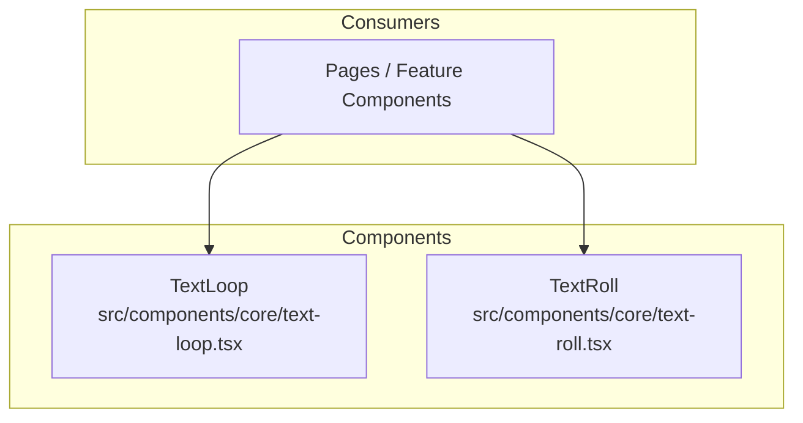
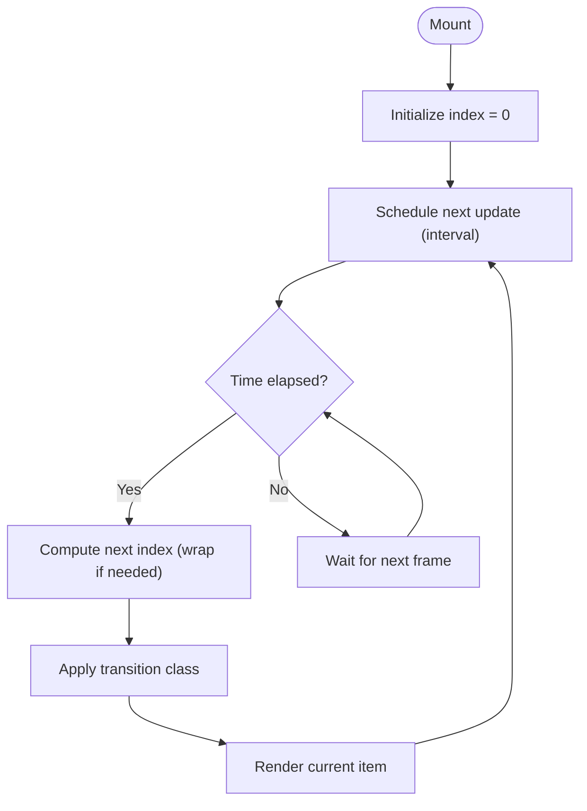
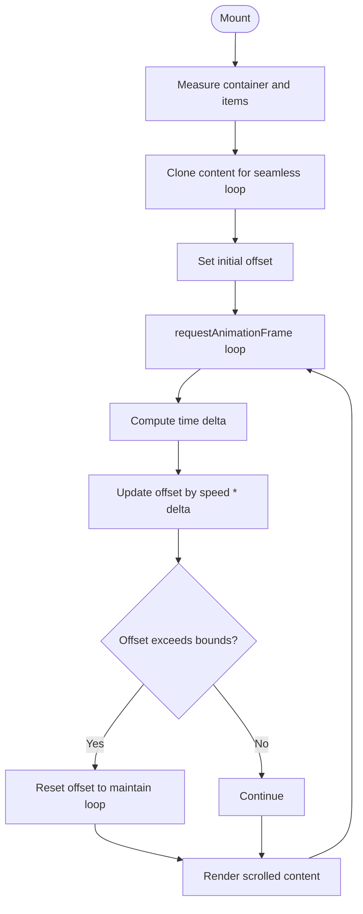
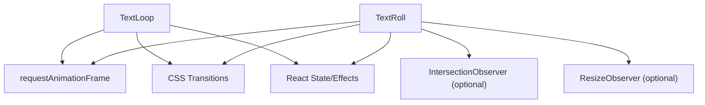

# Core Animation Components

<cite>
**Referenced Files in This Document**
- [text-loop.tsx](file://src/components/core/text-loop.tsx)
- [text-roll.tsx](file://src/components/core/text-roll.tsx)
</cite>

## Table of Contents
1. [Introduction](#introduction)
2. [Project Structure](#project-structure)
3. [Core Components](#core-components)
4. [Architecture Overview](#architecture-overview)
5. [Detailed Component Analysis](#detailed-component-analysis)
6. [Dependency Analysis](#dependency-analysis)
7. [Performance Considerations](#performance-considerations)
8. [Troubleshooting Guide](#troubleshooting-guide)
9. [Conclusion](#conclusion)

## Introduction
This document explains the core animation components that provide text looping and rolling effects. It covers the underlying animation algorithms, performance optimizations, customization options, props interfaces, integration with React state, dynamic content updates, responsive behavior, and browser compatibility strategies. The goal is to help developers implement smooth, efficient text animations across different screen sizes and environments.

## Project Structure
The animation components are implemented as reusable React components under a dedicated core directory:
- src/components/core/text-loop.tsx
- src/components/core/text-roll.tsx

These components encapsulate animation logic and expose a simple props interface for controlling speed, direction, and content. They can be composed within pages or other UI components to create dynamic text experiences.



[No sources needed since this diagram shows conceptual structure]

## Core Components
- TextLoop: Cycles through an array of text items with configurable timing and direction. Ideal for hero sections, banners, and status messages.
- TextRoll: Displays a continuous scrolling effect (horizontal or vertical) for long lists or marquee-style content.

Key responsibilities:
- Manage animation lifecycle using requestAnimationFrame or CSS transitions/animations
- Handle item transitions and wrapping
- Expose props for speed, direction, pause-on-hover, and content
- Provide accessibility-friendly behaviors where applicable

Props interface overview:
- Common props
  - items: Array of strings or JSX elements to display
  - speed: Number controlling animation duration per step or scroll rate
  - direction: Enum or string indicating forward/backward or horizontal/vertical
  - loop: Boolean to enable infinite cycling
  - pauseOnHover: Boolean to pause on hover/focus
  - className: String for styling hooks
  - style: Object for inline styles
  - ariaLabel: Accessible label for screen readers
- TextLoop-specific props
  - interval: Time between item changes (ms)
  - transitionDuration: Duration of fade/slide transitions
  - stagger: Optional delay between characters if character-level animation is supported
- TextRoll-specific props
  - axis: "horizontal" | "vertical"
  - gap: Spacing between items
  - autoPlay: Boolean to start automatically
  - reverse: Boolean to reverse scroll direction
  - threshold: Visibility threshold to pause when off-screen

Examples of usage patterns:
- Dynamic text from React state by updating the items prop
- Integrating with async data sources and loading states
- Responsive adjustments via media queries or container queries

**Section sources**
- [text-loop.tsx](file://src/components/core/text-loop.tsx)
- [text-roll.tsx](file://src/components/core/text-roll.tsx)

## Architecture Overview
The components follow a unidirectional data flow pattern typical of React:
- Parent component provides items and configuration via props
- Child animation component manages internal state for current index or scroll position
- Animation engine drives updates at optimal frame rates
- Accessibility attributes are updated based on current content

```mermaid
sequenceDiagram
participant Parent as "Parent Component"
participant Loop as "TextLoop"
participant Roll as "TextRoll"
participant Engine as "Animation Engine"
Parent->>Loop : "Provide items, speed, direction"
Loop->>Engine : "Start cycle with interval"
Engine-->>Loop : "Next item index"
Loop-->>Parent : "Render current item"
Parent->>Roll : "Provide items, axis, gap"
Roll->>Engine : "Start scroll with speed"
Engine-->>Roll : "Update scroll offset"
Roll-->>Parent : "Render scrolled content"
```

[No sources needed since this diagram shows conceptual workflow]

## Detailed Component Analysis

### TextLoop Component
Responsibilities:
- Maintain current item index
- Advance index based on interval
- Apply transitions between items
- Support pause/resume on user interaction
- Wrap around to first item when reaching the end

Algorithm highlights:
- Interval-based scheduling with requestAnimationFrame for smooth rendering
- Transition management using CSS classes toggled by React state
- Debounced updates to avoid unnecessary re-renders

Customization options:
- Speed control via interval and transitionDuration
- Direction control for forward/backward cycling
- Pause on hover/focus for accessibility
- Custom class names and inline styles

Integration examples:
- Sync with React state to reflect real-time updates
- Combine with API responses to animate incoming data
- Use conditional rendering to handle empty or loading states

Accessibility considerations:
- Update aria-live regions when content changes
- Respect prefers-reduced-motion settings



**Section sources**
- [text-loop.tsx](file://src/components/core/text-loop.tsx)

### TextRoll Component
Responsibilities:
- Continuously scroll content along a specified axis
- Maintain consistent speed regardless of content length
- Pause when off-screen or paused by user
- Duplicate content for seamless looping

Algorithm highlights:
- Scroll offset driven by requestAnimationFrame
- Velocity calculation based on speed and time delta
- Seamless wrap by cloning initial segment and resetting offset

Customization options:
- Axis selection (horizontal/vertical)
- Gap between items
- Reverse direction
- Auto-play toggle
- Threshold-based pausing for visibility

Integration examples:
- Render large lists efficiently with virtualization if needed
- Integrate with window resize events to recalculate metrics
- Combine with IntersectionObserver to pause when not visible

Accessibility considerations:
- Provide controls to pause or stop scrolling
- Ensure keyboard navigation for manual control



**Section sources**
- [text-roll.tsx](file://src/components/core/text-roll.tsx)

## Dependency Analysis
Both components are self-contained and do not rely on external animation libraries. They use standard web APIs:
- requestAnimationFrame for smooth animation loops
- CSS transitions/animations for visual effects
- DOM measurement APIs for layout calculations

Potential dependencies:
- React state and effects for lifecycle management
- Optional IntersectionObserver for visibility-based pausing
- Optional ResizeObserver for responsive recalculations



[No sources needed since this diagram shows conceptual relationships]

## Performance Considerations
- Prefer requestAnimationFrame over setInterval for smoother animations
- Minimize layout thrashing by batching DOM reads and writes
- Use CSS transforms and opacity for GPU-accelerated transitions
- Avoid heavy computations inside animation frames; precompute values when possible
- Debounce or throttle event handlers for resize and scroll
- Leverage IntersectionObserver to pause animations when off-screen
- Implement virtualization for very long lists in TextRoll
- Respect prefers-reduced-motion to disable animations for users who prefer reduced motion

[No sources needed since this section provides general guidance]

## Troubleshooting Guide
Common issues and resolutions:
- Jittery animations: Ensure all measurements occur before writes; batch DOM operations
- Stuttering on low-end devices: Reduce complexity of transitions; consider disabling animations for reduced motion
- Incorrect sizing after content change: Recalculate dimensions on content updates; use ResizeObserver
- Pausing not working: Verify intersection thresholds and event listeners are attached correctly
- Accessibility concerns: Add aria-live regions and ensure focus management for interactive controls

**Section sources**
- [text-loop.tsx](file://src/components/core/text-loop.tsx)
- [text-roll.tsx](file://src/components/core/text-roll.tsx)

## Conclusion
The TextLoop and TextRoll components provide robust, customizable text animation capabilities. By leveraging modern web APIs and following performance best practices, they deliver smooth experiences across devices and browsers. Developers can integrate these components with React state for dynamic content, optimize for responsiveness, and implement fallbacks for older browsers to ensure broad compatibility.

[No sources needed since this section summarizes without analyzing specific files]