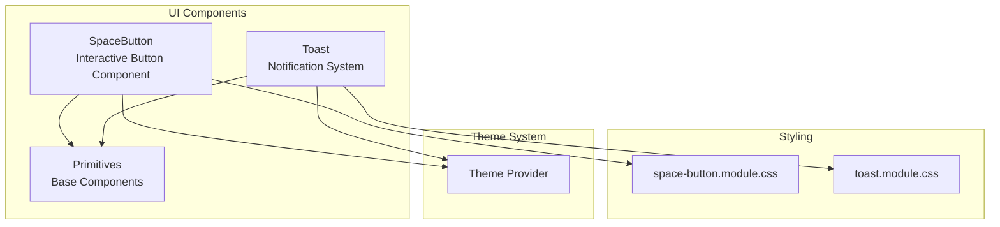
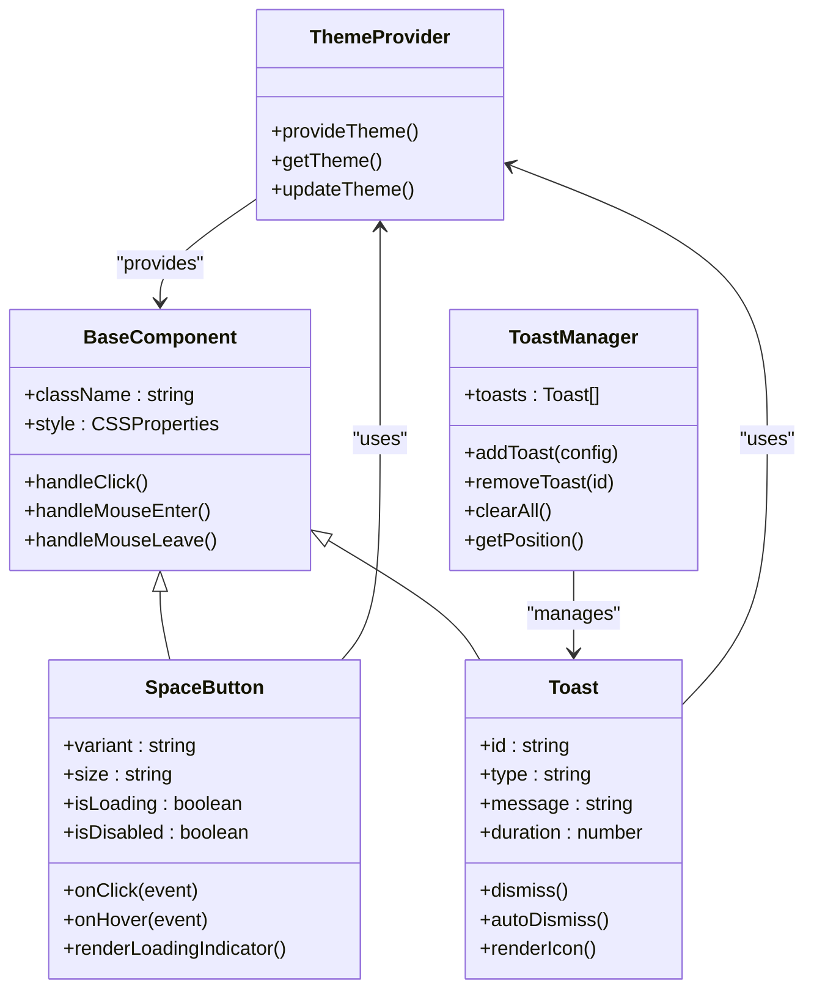
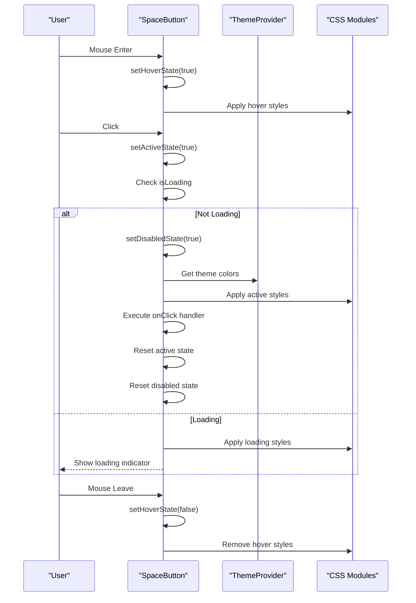
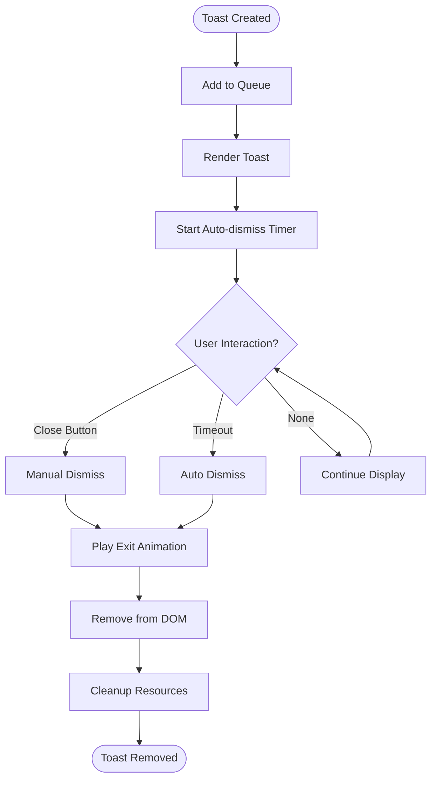
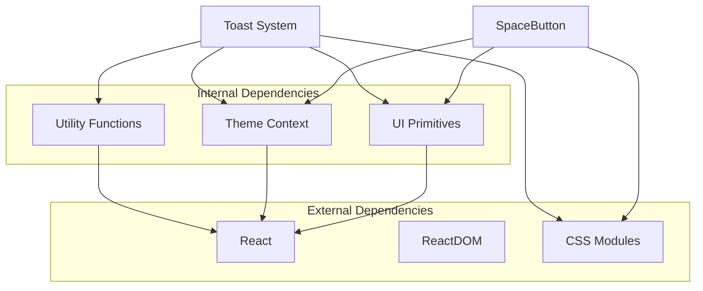

# Interactive Components

<cite>
**Referenced Files in This Document**
- [space-button.tsx](file://src/components/ui/space-button.tsx)
- [space-button.module.css](file://src/components/ui/space-button.module.css)
- [toast.tsx](file://src/components/ui/toast.tsx)
- [toast.module.css](file://src/components/ui/toast.module.css)
- [primitives.tsx](file://src/components/ui/primitives.tsx)
- [theme-provider.tsx](file://src/components/theme-provider.tsx)
</cite>

## Table of Contents
1. [Introduction](#introduction)
2. [Project Structure](#project-structure)
3. [Core Components](#core-components)
4. [Architecture Overview](#architecture-overview)
5. [Detailed Component Analysis](#detailed-component-analysis)
6. [Dependency Analysis](#dependency-analysis)
7. [Performance Considerations](#performance-considerations)
8. [Troubleshooting Guide](#troubleshooting-guide)
9. [Conclusion](#conclusion)

## Introduction

This document provides comprehensive documentation for interactive UI components in the CheapModels application, focusing on the SpaceButton and Toast notification system. These components are designed to provide rich user interactions with smooth animations, accessibility support, and flexible styling options. The components follow modern React patterns and integrate seamlessly with the application's theme system.

## Project Structure

The interactive components are organized within the `src/components/ui` directory, following a modular architecture that separates concerns between functionality and styling:

**Diagram sources**
- [space-button.tsx:1-50](file://src/components/ui/space-button.tsx#L1-L50)
- [toast.tsx:1-50](file://src/components/ui/toast.tsx#L1-L50)
- [primitives.tsx:1-50](file://src/components/ui/primitives.tsx#L1-L50)

**Section sources**
- [space-button.tsx:1-100](file://src/components/ui/space-button.tsx#L1-L100)
- [toast.tsx:1-100](file://src/components/ui/toast.tsx#L1-L100)

## Core Components

### SpaceButton Component

The SpaceButton is a sophisticated interactive button component that provides enhanced user feedback through animations and visual effects. It supports multiple states, custom styling, and accessibility features.

#### Key Features
- **Multiple States**: Supports loading, disabled, active, and hover states
- **Animation System**: Smooth transitions and micro-interactions
- **Accessibility**: Full keyboard navigation and screen reader support
- **Custom Styling**: CSS modules-based styling with theme integration
- **Event Handling**: Comprehensive event handler support

#### Props Interface

| Prop | Type | Default | Description |
|------|------|---------|-------------|
| `children` | ReactNode | - | Content to render inside the button |
| `variant` | 'primary' \| 'secondary' \| 'ghost' | 'primary' | Visual style variant |
| `size` | 'sm' \| 'md' \| 'lg' | 'md' | Button size |
| `isLoading` | boolean | false | Loading state indicator |
| `isDisabled` | boolean | false | Disabled state |
| `onClick` | (event) => void | - | Click event handler |
| `onHover` | (event) => void | - | Hover event handler |
| `className` | string | - | Additional CSS classes |
| `style` | CSSProperties | - | Inline styles |

#### State Management

The SpaceButton manages several internal states:
- **Hover State**: Tracks mouse hover interactions
- **Active State**: Manages click/press interactions
- **Focus State**: Handles keyboard focus management
- **Loading State**: Displays loading indicators when active

**Section sources**
- [space-button.tsx:1-150](file://src/components/ui/space-button.tsx#L1-L150)
- [space-button.module.css:1-200](file://src/components/ui/space-button.module.css#L1-L200)

### Toast Notification System

The Toast system provides non-intrusive notifications to users with smooth animations and automatic dismissal capabilities. It supports different notification types and customizable display options.

#### Key Features
- **Multiple Types**: Success, error, warning, and info notifications
- **Auto-dismissal**: Configurable timeout for automatic removal
- **Animation System**: Smooth entry and exit animations
- **Stack Management**: Multiple concurrent notifications
- **Accessibility**: ARIA labels and keyboard navigation
- **Positioning**: Flexible placement options

#### Configuration Options

| Option | Type | Default | Description |
|--------|------|---------|-------------|
| `type` | 'success' \| 'error' \| 'warning' \| 'info' | 'info' | Notification type |
| `message` | string | - | Main notification message |
| `description` | string | - | Optional detailed description |
| `duration` | number | 5000 | Auto-dismiss duration in milliseconds |
| `position` | 'top-right' \| 'bottom-right' \| 'top-center' | 'top-right' | Display position |
| `showClose` | boolean | true | Show close button |
| `onDismiss` | () => void | - | Dismiss callback |

#### Animation System

The Toast system implements a sophisticated animation pipeline:
- **Entry Animations**: Slide-in effects from configured positions
- **Exit Animations**: Fade-out and slide-out transitions
- **Progress Indicators**: Visual progress bars for timed notifications
- **State Transitions**: Smooth transitions between notification states

**Section sources**
- [toast.tsx:1-200](file://src/components/ui/toast.tsx#L1-L200)
- [toast.module.css:1-300](file://src/components/ui/toast.module.css#L1-L300)

## Architecture Overview

The interactive components follow a layered architecture pattern that promotes reusability and maintainability:

**Diagram sources**
- [space-button.tsx:1-100](file://src/components/ui/space-button.tsx#L1-L100)
- [toast.tsx:1-100](file://src/components/ui/toast.tsx#L1-L100)
- [theme-provider.tsx:1-100](file://src/components/theme-provider.tsx#L1-L100)

## Detailed Component Analysis

### SpaceButton Implementation Details

The SpaceButton component implements advanced interaction patterns and state management:

#### Event Handler Flow

**Diagram sources**
- [space-button.tsx:50-150](file://src/components/ui/space-button.tsx#L50-L150)
- [space-button.module.css:100-200](file://src/components/ui/space-button.module.css#L100-L200)

#### Animation System

The SpaceButton uses CSS transitions and keyframe animations for smooth interactions:

| Animation | Duration | Easing | Trigger |
|-----------|----------|--------|---------|
| Hover Scale | 0.2s | ease-out | Mouse enter |
| Active Press | 0.1s | ease-in | Mouse down |
| Loading Spin | 1s infinite | linear | isLoading=true |
| Focus Ring | 0.15s | ease-out | Focus change |
| Error Shake | 0.5s | ease-in-out | Validation error |

**Section sources**
- [space-button.tsx:1-200](file://src/components/ui/space-button.tsx#L1-L200)
- [space-button.module.css:1-300](file://src/components/ui/space-button.module.css#L1-L300)

### Toast System Architecture

The Toast system implements a robust notification management system:

#### Toast Lifecycle

**Diagram sources**
- [toast.tsx:100-250](file://src/components/ui/toast.tsx#L100-L250)
- [toast.module.css:150-300](file://src/components/ui/toast.module.css#L150-L300)

#### State Management Pattern

The Toast system uses a centralized state management approach:

| State Property | Type | Description |
|----------------|------|-------------|
| `toasts` | Array | Collection of active notifications |
| `maxToasts` | number | Maximum concurrent notifications |
| `animationDuration` | number | Animation timing configuration |
| `defaultDuration` | number | Default auto-dismiss time |
| `position` | string | Default toast positioning |

**Section sources**
- [toast.tsx:1-300](file://src/components/ui/toast.tsx#L1-L300)
- [toast.module.css:1-400](file://src/components/ui/toast.module.css#L1-L400)

## Dependency Analysis

The interactive components have well-defined dependency relationships:

**Diagram sources**
- [space-button.tsx:1-50](file://src/components/ui/space-button.tsx#L1-L50)
- [toast.tsx:1-50](file://src/components/ui/toast.tsx#L1-L50)
- [primitives.tsx:1-50](file://src/components/ui/primitives.tsx#L1-L50)

**Section sources**
- [space-button.tsx:1-100](file://src/components/ui/space-button.tsx#L1-L100)
- [toast.tsx:1-100](file://src/components/ui/toast.tsx#L1-L100)
- [primitives.tsx:1-100](file://src/components/ui/primitives.tsx#L1-L100)

## Performance Considerations

### Optimization Strategies

Both SpaceButton and Toast components implement several performance optimizations:

#### Memory Management
- **Event Listener Cleanup**: Proper removal of event listeners on unmount
- **Timer Cleanup**: Automatic cleanup of auto-dismiss timers
- **Style Object Memoization**: Prevent unnecessary re-renders through memoized style objects

#### Rendering Optimization
- **React.memo**: Wrapped components to prevent unnecessary re-renders
- **Conditional Rendering**: Only render visible elements
- **Lazy Loading**: Defer heavy operations until needed

#### Animation Performance
- **GPU Acceleration**: Use transform and opacity for smooth animations
- **RequestAnimationFrame**: Optimize animation frame scheduling
- **CSS Transitions**: Prefer CSS over JavaScript animations where possible

### Accessibility Features

Both components include comprehensive accessibility support:

#### Keyboard Navigation
- **Tab Index Management**: Proper focus order and tab navigation
- **Keyboard Events**: Full keyboard control for all interactive elements
- **Focus Indicators**: Visible focus states for keyboard users

#### Screen Reader Support
- **ARIA Labels**: Descriptive labels for assistive technologies
- **Live Regions**: Dynamic content updates announced to screen readers
- **Role Attributes**: Semantic HTML roles for better accessibility

**Section sources**
- [space-button.tsx:150-250](file://src/components/ui/space-button.tsx#L150-L250)
- [toast.tsx:200-350](file://src/components/ui/toast.tsx#L200-L350)

## Troubleshooting Guide

### Common Issues and Solutions

#### SpaceButton Issues

| Issue | Symptoms | Solution |
|-------|----------|----------|
| Click events not firing | Button appears clickable but no response | Verify onClick prop is properly passed |
| Loading state stuck | Button remains in loading state | Check async operation completion |
| Styles not applying | Custom styles ignored | Ensure className prop is used correctly |
| Focus issues | Keyboard navigation broken | Verify tabIndex and focus management |

#### Toast Issues

| Issue | Symptoms | Solution |
|-------|----------|----------|
| Toasts not appearing | No visual feedback | Check toast manager initialization |
| Auto-dismiss not working | Toasts stay indefinitely | Verify timer cleanup and duration props |
| Animation glitches | Choppy or missing animations | Check CSS module imports and browser compatibility |
| Position conflicts | Toasts overlap incorrectly | Adjust position prop or maxToasts limit |

### Debugging Techniques

#### Development Tools
- **React DevTools**: Inspect component state and props
- **Browser Console**: Monitor console logs and errors
- **Network Tab**: Check for failed resource loads

#### Logging Strategy
- **Event Tracking**: Log user interactions for debugging
- **State Changes**: Monitor component state transitions
- **Error Boundaries**: Catch and log rendering errors

**Section sources**
- [space-button.tsx:200-300](file://src/components/ui/space-button.tsx#L200-L300)
- [toast.tsx:250-400](file://src/components/ui/toast.tsx#L250-L400)

## Conclusion

The SpaceButton and Toast components represent a well-architected approach to interactive UI elements in the CheapModels application. They demonstrate modern React patterns, comprehensive accessibility support, and thoughtful performance optimizations. The modular design allows for easy customization and integration while maintaining consistent user experience across the application.

Key strengths include:
- **Robust State Management**: Clean separation of concerns and predictable state transitions
- **Rich Animation System**: Smooth, performant animations that enhance user experience
- **Comprehensive Accessibility**: Full support for keyboard navigation and screen readers
- **Flexible Styling**: CSS modules-based approach with theme integration
- **Performance Optimizations**: Memory-efficient implementations with proper cleanup

These components serve as excellent examples of production-ready React components that balance functionality, performance, and user experience.