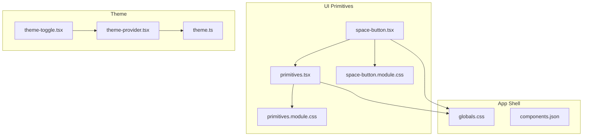
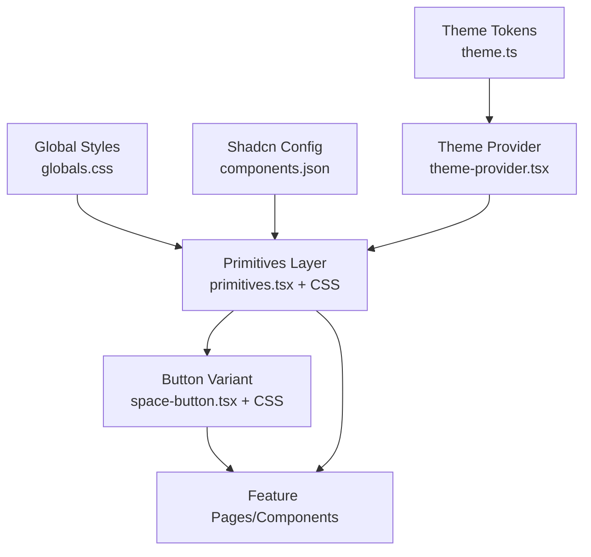
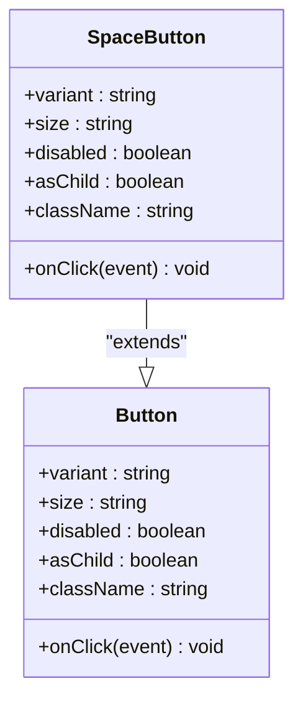
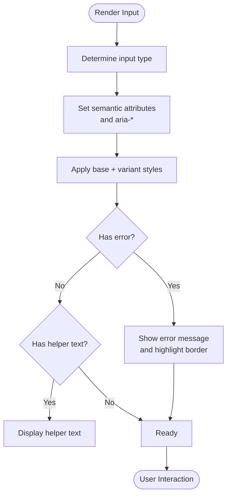
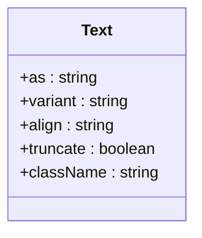
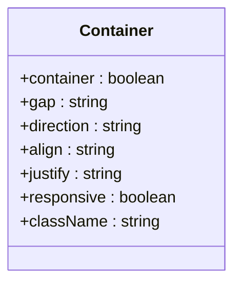
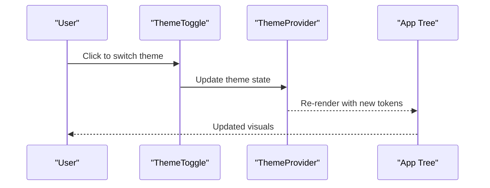
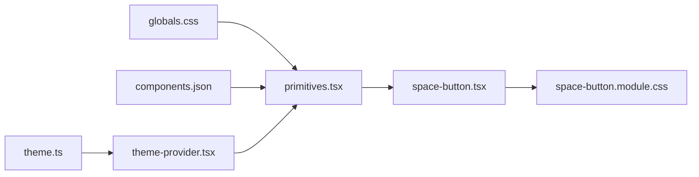

# UI Primitives

<cite>
**Referenced Files in This Document**
- [primitives.tsx](file://src/components/ui/primitives.tsx)
- [primitives.module.css](file://src/components/ui/primitives.module.css)
- [space-button.tsx](file://src/components/ui/space-button.tsx)
- [space-button.module.css](file://src/components/ui/space-button.module.css)
- [theme-provider.tsx](file://src/components/theme-provider.tsx)
- [theme-toggle.tsx](file://src/components/theme-toggle.tsx)
- [theme.ts](file://src/config/theme.ts)
- [components.json](file://components.json)
- [globals.css](file://src/app/globals.css)
</cite>

## Table of Contents
1. [Introduction](#introduction)
2. [Project Structure](#project-structure)
3. [Core Components](#core-components)
4. [Architecture Overview](#architecture-overview)
5. [Detailed Component Analysis](#detailed-component-analysis)
6. [Dependency Analysis](#dependency-analysis)
7. [Performance Considerations](#performance-considerations)
8. [Troubleshooting Guide](#troubleshooting-guide)
9. [Conclusion](#conclusion)
10. [Appendices](#appendices)

## Introduction
This document describes the core UI primitive components built with Shadcn/ui and how they are organized, styled, themed, and extended within the project. It focuses on:
- Base component architecture and prop interfaces
- Styling patterns and customization options
- How primitives compose higher-level components
- Examples for buttons, form inputs, typography, and layout primitives
- Accessibility features, responsive behavior, and theme integration
- Guidelines for extending primitives and maintaining consistency

## Project Structure
The UI primitives live under src/components/ui and are composed into feature-specific components elsewhere in src/components. The configuration for Shadcn/ui is defined at the repository root.

**Diagram sources**
- [primitives.tsx](file://src/components/ui/primitives.tsx)
- [primitives.module.css](file://src/components/ui/primitives.module.css)
- [space-button.tsx](file://src/components/ui/space-button.tsx)
- [space-button.module.css](file://src/components/ui/space-button.module.css)
- [theme-provider.tsx](file://src/components/theme-provider.tsx)
- [theme-toggle.tsx](file://src/components/theme-toggle.tsx)
- [theme.ts](file://src/config/theme.ts)
- [globals.css](file://src/app/globals.css)
- [components.json](file://components.json)

**Section sources**
- [primitives.tsx](file://src/components/ui/primitives.tsx)
- [primitives.module.css](file://src/components/ui/primitives.module.css)
- [space-button.tsx](file://src/components/ui/space-button.tsx)
- [space-button.module.css](file://src/components/ui/space-button.module.css)
- [theme-provider.tsx](file://src/components/theme-provider.tsx)
- [theme-toggle.tsx](file://src/components/theme-toggle.tsx)
- [theme.ts](file://src/config/theme.ts)
- [globals.css](file://src/app/globals.css)
- [components.json](file://components.json)

## Core Components
- Primitive base layer: Provides foundational elements (e.g., button, input, typography, layout containers) with consistent props and styling hooks.
- Styled variants: CSS modules encapsulate variant styles (size, color, shape) to keep logic and presentation separated.
- Theme integration: A provider supplies theme tokens and state; a toggle exposes user-driven switching.
- Higher-level composition: Feature components build on primitives to deliver domain-specific UX.

Key responsibilities:
- Consistent prop contracts across primitives
- Accessible defaults and keyboard navigation
- Responsive design via CSS utilities and media queries
- Themed colors, spacing, and typography tokens

**Section sources**
- [primitives.tsx](file://src/components/ui/primitives.tsx)
- [primitives.module.css](file://src/components/ui/primitives.module.css)
- [theme-provider.tsx](file://src/components/theme-provider.tsx)
- [theme.ts](file://src/config/theme.ts)
- [globals.css](file://src/app/globals.css)

## Architecture Overview
The primitives follow a layered approach:
- Tokens and global styles define the visual system.
- Primitives implement accessible, composable building blocks.
- Variants and themes are applied through CSS modules and context.
- Higher-level components compose primitives to implement business features.

**Diagram sources**
- [theme.ts](file://src/config/theme.ts)
- [globals.css](file://src/app/globals.css)
- [components.json](file://components.json)
- [theme-provider.tsx](file://src/components/theme-provider.tsx)
- [primitives.tsx](file://src/components/ui/primitives.tsx)
- [primitives.module.css](file://src/components/ui/primitives.module.css)
- [space-button.tsx](file://src/components/ui/space-button.tsx)
- [space-button.module.css](file://src/components/ui/space-button.module.css)

## Detailed Component Analysis

### Button Primitives
- Purpose: Provide a consistent, accessible button surface with multiple variants (primary, secondary, ghost, danger), sizes, and states.
- Prop interface highlights:
  - variant: string enum controlling style set
  - size: string enum controlling dimensions and typography scale
  - disabled: boolean to disable interaction and update aria attributes
  - asChild: boolean to render as a child element when needed
  - className: string for additional overrides
  - onClick: event handler
- Styling pattern:
  - Shared base styles from primitives
  - Variant-specific rules in CSS module
  - Theme-aware colors and focus rings
- Accessibility:
  - Semantic <button> by default
  - Proper aria-disabled when disabled
  - Keyboard support and visible focus indicators
- Responsive behavior:
  - Size and padding adapt to breakpoints
  - Touch-friendly minimum hit area on mobile
- Example usage patterns:
  - Primary action in forms
  - Secondary actions in toolbars
  - Danger actions for destructive operations

**Diagram sources**
- [primitives.tsx](file://src/components/ui/primitives.tsx)
- [space-button.tsx](file://src/components/ui/space-button.tsx)

**Section sources**
- [primitives.tsx](file://src/components/ui/primitives.tsx)
- [primitives.module.css](file://src/components/ui/primitives.module.css)
- [space-button.tsx](file://src/components/ui/space-button.tsx)
- [space-button.module.css](file://src/components/ui/space-button.module.css)

### Form Input Primitives
- Purpose: Provide accessible text inputs, textareas, selects, and checkboxes with consistent validation feedback and theming.
- Prop interface highlights:
  - type: string for input kind
  - value / defaultValue: controlled or uncontrolled value
  - onChange: event handler for updates
  - placeholder: hint text
  - disabled: boolean to disable interaction
  - required: boolean for accessibility and validation
  - error: boolean or string for validation messaging
  - helperText: string for contextual help
  - className: string for overrides
- Styling pattern:
  - Base input styles from primitives
  - Error and helper text styles via CSS module
  - Focus ring and hover states aligned with theme
- Accessibility:
  - Associated labels via htmlFor/id
  - aria-describedby for helper/error text
  - Proper role and semantics for specialized inputs
- Responsive behavior:
  - Full-width on small screens
  - Adaptive font sizes and line heights

**Diagram sources**
- [primitives.tsx](file://src/components/ui/primitives.tsx)
- [primitives.module.css](file://src/components/ui/primitives.module.css)

**Section sources**
- [primitives.tsx](file://src/components/ui/primitives.tsx)
- [primitives.module.css](file://src/components/ui/primitives.module.css)

### Typography Primitives
- Purpose: Provide consistent headings, paragraphs, captions, and emphasis with clear hierarchy and readability.
- Prop interface highlights:
  - as: tag name override
  - variant: heading level or semantic role
  - align: text alignment
  - truncate: boolean for single-line truncation
  - className: string for overrides
- Styling pattern:
  - Token-driven font sizes, weights, and line heights
  - Global baseline rhythm via CSS variables
- Accessibility:
  - Correct heading levels for document outline
  - Sufficient contrast ratios per theme
- Responsive behavior:
  - Fluid typography scaling across breakpoints

**Diagram sources**
- [primitives.tsx](file://src/components/ui/primitives.tsx)

**Section sources**
- [primitives.tsx](file://src/components/ui/primitives.tsx)

### Layout Primitives
- Purpose: Provide containers, grids, stacks, and dividers to structure content consistently.
- Prop interface highlights:
  - container: boolean to constrain width
  - gap: spacing token
  - direction: row/column
  - align: cross-axis alignment
  - justify: main-axis alignment
  - responsive: boolean to enable responsive stacking
- Styling pattern:
  - CSS Grid/Flexbox utilities
  - Spacing tokens from theme
- Accessibility:
  - Logical order and focus flow preserved
  - No reliance on color alone for meaning

**Diagram sources**
- [primitives.tsx](file://src/components/ui/primitives.tsx)

**Section sources**
- [primitives.tsx](file://src/components/ui/primitives.tsx)

### Theme Integration
- Theme provider: Supplies theme tokens and current mode to the component tree.
- Toggle: Switches between light/dark modes and persists preference.
- Tokens: Centralized definitions for colors, spacing, radius, and typography.

**Diagram sources**
- [theme-provider.tsx](file://src/components/theme-provider.tsx)
- [theme-toggle.tsx](file://src/components/theme-toggle.tsx)
- [theme.ts](file://src/config/theme.ts)

**Section sources**
- [theme-provider.tsx](file://src/components/theme-provider.tsx)
- [theme-toggle.tsx](file://src/components/theme-toggle.tsx)
- [theme.ts](file://src/config/theme.ts)
- [globals.css](file://src/app/globals.css)

## Dependency Analysis
- Primitives depend on:
  - Global CSS for base resets and tokens
  - Shadcn/ui configuration for class names and conventions
  - Theme provider for dynamic tokens
- Buttons extend primitives and add variant-specific CSS modules
- Feature components depend on primitives and theme context

**Diagram sources**
- [globals.css](file://src/app/globals.css)
- [components.json](file://components.json)
- [theme.ts](file://src/config/theme.ts)
- [theme-provider.tsx](file://src/components/theme-provider.tsx)
- [primitives.tsx](file://src/components/ui/primitives.tsx)
- [space-button.tsx](file://src/components/ui/space-button.tsx)
- [space-button.module.css](file://src/components/ui/space-button.module.css)

**Section sources**
- [components.json](file://components.json)
- [globals.css](file://src/app/globals.css)
- [theme.ts](file://src/config/theme.ts)
- [theme-provider.tsx](file://src/components/theme-provider.tsx)
- [primitives.tsx](file://src/components/ui/primitives.tsx)
- [space-button.tsx](file://src/components/ui/space-button.tsx)
- [space-button.module.css](file://src/components/ui/space-button.module.css)

## Performance Considerations
- Prefer CSS modules for variant styles to avoid runtime branching where possible.
- Use React.memo for heavy primitives if they receive frequent re-renders.
- Keep prop interfaces minimal to reduce unnecessary re-renders.
- Leverage theme tokens instead of inline styles for better caching and reduced churn.
- Avoid deep nesting in layout primitives; prefer flat structures with gap and alignment props.

## Troubleshooting Guide
Common issues and resolutions:
- Theme not applying:
  - Ensure the theme provider wraps the application tree.
  - Verify tokens exist in the theme definition and are consumed by primitives.
- Variant styles not taking effect:
  - Confirm the correct variant prop is passed and that the corresponding CSS module rule exists.
  - Check for conflicting className overrides.
- Accessibility regressions:
  - Validate aria attributes and label associations for inputs.
  - Ensure focus indicators remain visible in both light and dark themes.
- Responsive misbehavior:
  - Inspect breakpoint usage in CSS modules and ensure tokens are applied consistently.

**Section sources**
- [theme-provider.tsx](file://src/components/theme-provider.tsx)
- [theme.ts](file://src/config/theme.ts)
- [primitives.tsx](file://src/components/ui/primitives.tsx)
- [primitives.module.css](file://src/components/ui/primitives.module.css)
- [space-button.tsx](file://src/components/ui/space-button.tsx)
- [space-button.module.css](file://src/components/ui/space-button.module.css)

## Conclusion
The primitives layer establishes a consistent, accessible, and themeable foundation for the UI. By composing these building blocks, higher-level components achieve uniformity, maintainability, and scalability. Adhering to the documented prop contracts, styling patterns, and accessibility guidelines ensures a cohesive experience across the application.

## Appendices

### Extending Primitives: Best Practices
- Create new variants by adding entries to the variant prop and corresponding CSS module rules.
- Introduce new tokens in the theme file and consume them in primitives.
- Keep prop interfaces focused; derive complex behaviors from composition rather than prop explosion.
- Maintain backward compatibility by deprecating props gradually and providing migration notes.
- Test variants across themes and screen sizes to ensure consistent behavior.

[No sources needed since this section provides general guidance]