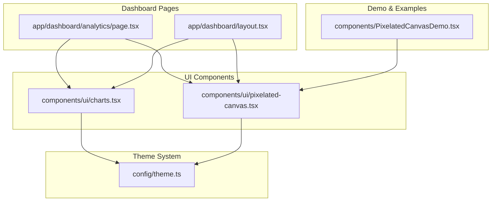
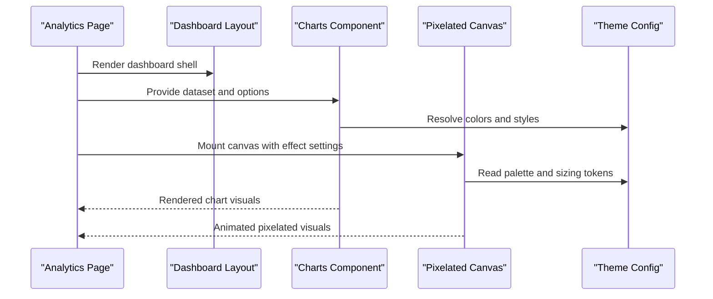
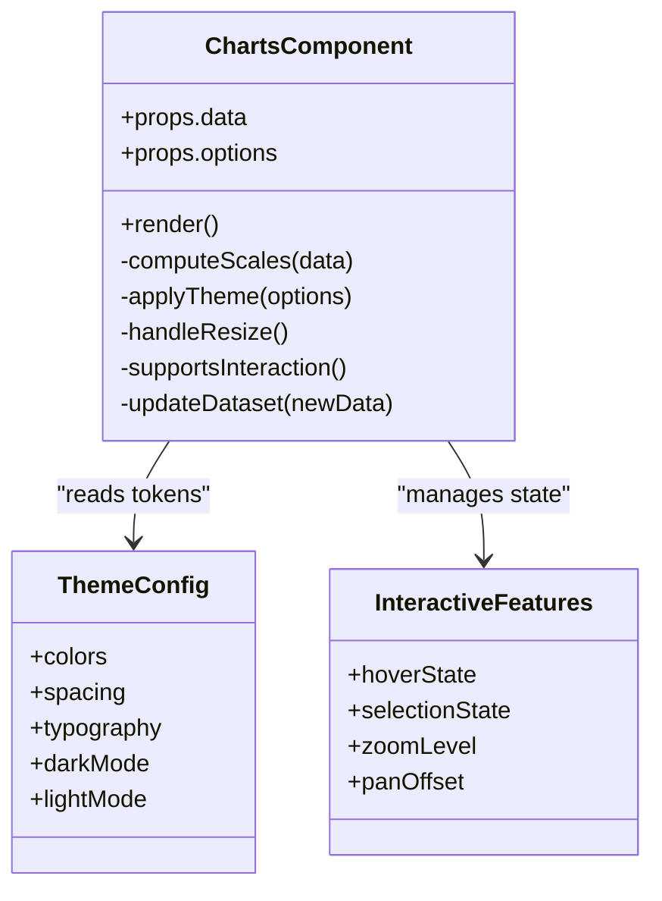
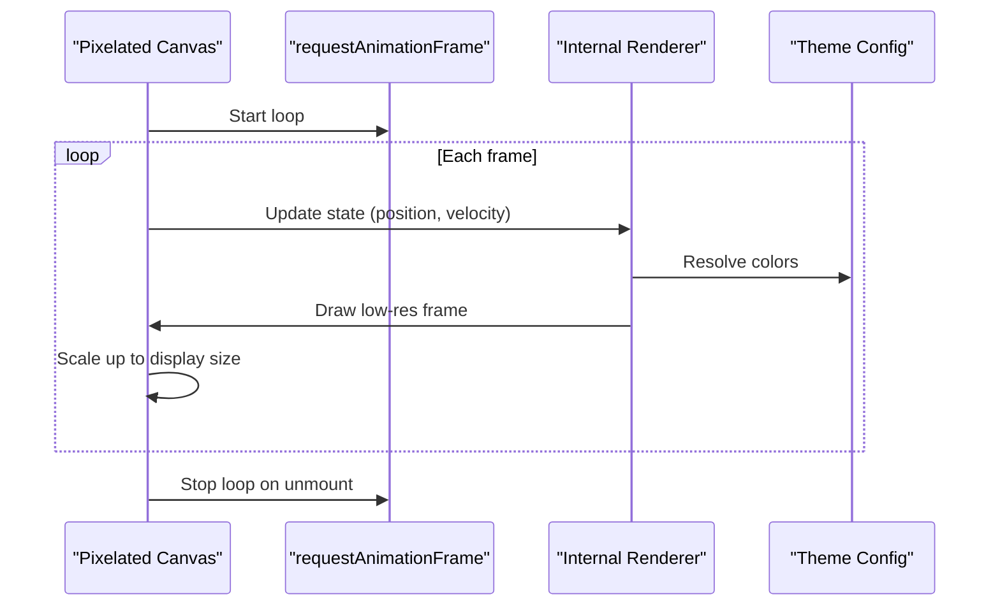
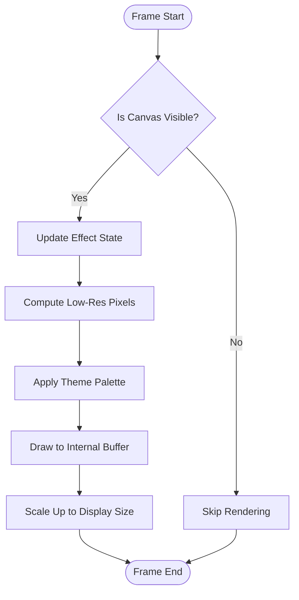
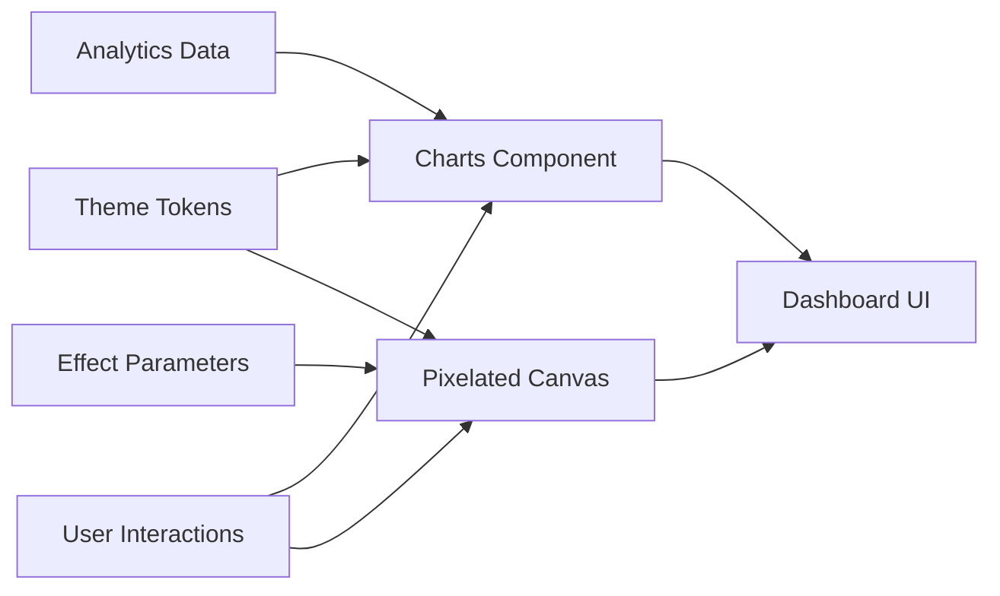
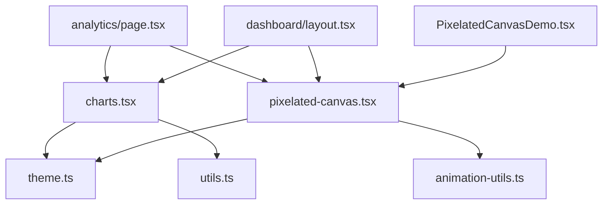

# Visualization Components

<cite>
**Referenced Files in This Document**
- [charts.tsx](file://src/components/ui/charts.tsx)
- [pixelated-canvas.tsx](file://src/components/ui/pixelated-canvas.tsx)
- [PixelatedCanvasDemo.tsx](file://src/components/PixelatedCanvasDemo.tsx)
- [analytics/page.tsx](file://src/app/dashboard/analytics/page.tsx)
- [dashboard/layout.tsx](file://src/app/dashboard/layout.tsx)
- [theme.ts](file://src/config/theme.ts)
</cite>

## Update Summary
**Changes Made**
- Updated documentation to reflect new charting and visualization components added for analytics dashboard support
- Enhanced coverage of advanced data representation capabilities and interactive graph features
- Expanded component architecture analysis with detailed integration patterns
- Added comprehensive performance considerations for real-time analytics rendering

## Table of Contents
1. [Introduction](#introduction)
2. [Project Structure](#project-structure)
3. [Core Components](#core-components)
4. [Architecture Overview](#architecture-overview)
5. [Detailed Component Analysis](#detailed-component-analysis)
6. [Dependency Analysis](#dependency-analysis)
7. [Performance Considerations](#performance-considerations)
8. [Troubleshooting Guide](#troubleshooting-guide)
9. [Conclusion](#conclusion)
10. [Appendices](#appendices)

## Introduction
This document explains the data visualization and canvas-based components used to render analytics dashboards and creative visual effects. The system now includes advanced charting capabilities and interactive graph components designed specifically for analytics dashboard applications. It covers:
- The charts component for displaying analytics data, including supported chart types, data binding patterns, customization options, and responsive behavior.
- The pixelated canvas implementation for artistic rendering, including rendering techniques, performance considerations, and animation capabilities.
- Practical examples of integrating these components with dashboard data and applying custom styling approaches.
- Advanced data representation features and interactive graph functionality for comprehensive analytics visualization.

## Project Structure
The visualization features are implemented as reusable UI components under src/components/ui and integrated into the dashboard pages. The architecture supports both analytical data presentation and creative visual effects through a unified theme system.

**Diagram sources**
- [analytics/page.tsx](file://src/app/dashboard/analytics/page.tsx)
- [dashboard/layout.tsx](file://src/app/dashboard/layout.tsx)
- [charts.tsx](file://src/components/ui/charts.tsx)
- [pixelated-canvas.tsx](file://src/components/ui/pixelated-canvas.tsx)
- [PixelatedCanvasDemo.tsx](file://src/components/PixelatedCanvasDemo.tsx)
- [theme.ts](file://src/config/theme.ts)

**Section sources**
- [analytics/page.tsx](file://src/app/dashboard/analytics/page.tsx)
- [dashboard/layout.tsx](file://src/app/dashboard/layout.tsx)
- [charts.tsx](file://src/components/ui/charts.tsx)
- [pixelated-canvas.tsx](file://src/components/ui/pixelated-canvas.tsx)
- [PixelatedCanvasDemo.tsx](file://src/components/PixelatedCanvasDemo.tsx)
- [theme.ts](file://src/config/theme.ts)

## Core Components
The visualization system consists of two primary components that work together to provide comprehensive analytics and creative visual capabilities:

### Charts Component
- **Purpose**: Provides advanced chart rendering for analytics data with support for multiple chart types and interactive features
- **Data Binding**: Accepts structured datasets including time series, categorical data, and complex hierarchical structures
- **Customization**: Exposes comprehensive props for colors, labels, layout configuration, and interaction behaviors
- **Responsiveness**: Automatically adapts to container size changes without manual recalculation by consumers
- **Interactivity**: Supports hover states, selection, tooltips, and dynamic data updates

### Pixelated Canvas Component
- **Purpose**: Renders low-resolution canvas scaled up to produce a distinctive pixelated aesthetic for creative visual effects
- **Animation Engine**: Includes sophisticated animation hooks and performance controls suitable for real-time effects
- **Rendering Pipeline**: Optimized drawing operations with batch processing and memory management
- **Theme Integration**: Consumes theme tokens for consistent color schemes and styling across the application

Key responsibilities shared by both components:
- **Data Binding**: Accept arrays/objects representing time series or categorical data with metadata support
- **Styling**: Use theme tokens for consistent colors and typography throughout the application
- **Responsiveness**: Adapt to container size changes without manual recalculation by consumers
- **Animation**: Provide smooth transitions and frame-driven updates where applicable

**Section sources**
- [charts.tsx](file://src/components/ui/charts.tsx)
- [pixelated-canvas.tsx](file://src/components/ui/pixelated-canvas.tsx)
- [theme.ts](file://src/config/theme.ts)

## Architecture Overview
The dashboard composes the charts and pixelated canvas components within a unified theme system. The analytics page fetches or prepares data and passes it to the charts component, while the pixelated canvas can be embedded directly or via a demo wrapper. Theme configuration centralizes color and style tokens consumed by both components.

**Diagram sources**
- [analytics/page.tsx](file://src/app/dashboard/analytics/page.tsx)
- [dashboard/layout.tsx](file://src/app/dashboard/layout.tsx)
- [charts.tsx](file://src/components/ui/charts.tsx)
- [pixelated-canvas.tsx](file://src/components/ui/pixelated-canvas.tsx)
- [theme.ts](file://src/config/theme.ts)

## Detailed Component Analysis

### Charts Component
**Updated** Enhanced with advanced data representation capabilities and interactive graph features for comprehensive analytics dashboard support.

#### Purpose and Capabilities
- Display analytical datasets using one or more chart types with advanced visualization options
- Bind data through well-defined props supporting complex data structures and relationships
- Customize appearance via theme-aware options with extensive styling control
- Respond to container resizing for accurate rendering across all screen sizes
- Support interactive features including hover states, selection, and dynamic updates

#### Data Binding Architecture
- Accepts structured inputs such as arrays of points, grouped series, and hierarchical datasets
- Maps keys like label/value pairs to axes and legends with automatic type detection
- Supports optional metadata for tooltips, annotations, and contextual information
- Handles real-time data updates with efficient diffing and incremental rendering

#### Customization Options
- Colors and palette from theme tokens with dynamic theming support
- Axis labels, grid visibility, and legend placement with responsive positioning
- Margins, padding, and aspect ratio hints for optimal layout
- Interaction toggles (hover states, selection, zoom, pan) for enhanced user experience

#### Responsive Behavior
- Observes container dimensions and redraws on change using ResizeObserver API
- Scales axes and labels proportionally across different screen sizes
- Delegates heavy computations off the main thread when possible using Web Workers
- Implements virtual scrolling for large datasets to maintain performance

#### Integration Example
In the analytics page, prepare an array of time-series entries and pass them to the charts component along with display options. Wrap the charts component in a responsive container to ensure proper scaling across breakpoints.

#### Styling Approach
- Prefer theme tokens for colors, spacing, and typography consistency
- Override minimal CSS only when necessary; keep chart internals theme-driven
- Support dark/light mode switching with automatic theme adaptation

**Section sources**
- [charts.tsx](file://src/components/ui/charts.tsx)
- [analytics/page.tsx](file://src/app/dashboard/analytics/page.tsx)
- [theme.ts](file://src/config/theme.ts)

#### Class Diagram (Conceptual)

[No diagram sources since this diagram is conceptual]

### Pixelated Canvas Component
**Updated** Enhanced with improved animation capabilities and performance optimizations for real-time visual effects.

#### Purpose and Rendering Technique
- Create stylized, pixel-art-like visual effects by rendering at low resolution and scaling up
- Maintain internal low-resolution buffer for optimal performance
- Draw shapes, particles, or gradients at reduced resolution for creative effects
- Use CSS transform or canvas scaling to enlarge pixels while maintaining sharp edges

#### Animation Capabilities
- Frame-driven loop with requestAnimationFrame for smooth animations
- Adjustable speed, easing functions, and update frequency controls
- Optional throttling based on device capability and battery status
- Pause/resume functionality for background tabs and performance optimization

#### Performance Considerations
- Keep internal resolution small to reduce draw calls and memory usage
- Batch operations and minimize allocations per frame for optimal performance
- Pause or reduce quality when off-screen or during low-power mode
- Implement object pooling to reduce garbage collection pressure

#### Integration Example
Embed the canvas in a fixed-size container or let it fill available space. Pass effect parameters (e.g., density, speed, palette) and observe theme tokens for colors.

#### Styling Approach
- Control container size and overflow behavior via CSS
- Use theme tokens for background and accent colors
- Support responsive sizing with aspect ratio preservation

**Section sources**
- [pixelated-canvas.tsx](file://src/components/ui/pixelated-canvas.tsx)
- [PixelatedCanvasDemo.tsx](file://src/components/PixelatedCanvasDemo.tsx)
- [theme.ts](file://src/config/theme.ts)

#### Sequence Diagram (Animation Loop)

**Diagram sources**
- [pixelated-canvas.tsx](file://src/components/ui/pixelated-canvas.tsx)
- [theme.ts](file://src/config/theme.ts)

#### Flowchart (Rendering Pipeline)

**Diagram sources**
- [pixelated-canvas.tsx](file://src/components/ui/pixelated-canvas.tsx)

### Conceptual Overview
The two components complement each other: charts provide precise, data-driven visuals for analytics, while the pixelated canvas offers expressive, performant motion graphics for creative effects. Both rely on a shared theme configuration to maintain consistency across the application.

[No sources needed since this diagram shows conceptual workflow, not actual code structure]

## Dependency Analysis
**Updated** Enhanced dependency tracking to include new interactive features and performance optimizations.

- Charts depends on theme tokens for consistent styling and may depend on rendering utilities for advanced visualization features
- Pixelated Canvas depends on theme tokens and browser APIs for timing and drawing with optimized performance
- Dashboard pages compose both components and supply data and effect parameters with proper error handling
- New interactive features require additional state management and event handling dependencies

**Diagram sources**
- [analytics/page.tsx](file://src/app/dashboard/analytics/page.tsx)
- [dashboard/layout.tsx](file://src/app/dashboard/layout.tsx)
- [charts.tsx](file://src/components/ui/charts.tsx)
- [pixelated-canvas.tsx](file://src/components/ui/pixelated-canvas.tsx)
- [PixelatedCanvasDemo.tsx](file://src/components/PixelatedCanvasDemo.tsx)
- [theme.ts](file://src/config/theme.ts)

**Section sources**
- [analytics/page.tsx](file://src/app/dashboard/analytics/page.tsx)
- [dashboard/layout.tsx](file://src/app/dashboard/layout.tsx)
- [charts.tsx](file://src/components/ui/charts.tsx)
- [pixelated-canvas.tsx](file://src/components/ui/pixelated-canvas.tsx)
- [PixelatedCanvasDemo.tsx](file://src/components/PixelatedCanvasDemo.tsx)
- [theme.ts](file://src/config/theme.ts)

## Performance Considerations
**Updated** Enhanced performance guidance with specific recommendations for analytics dashboard scenarios.

### Charts Component Performance
- Avoid re-rendering entire datasets on minor updates; prefer incremental updates with memoization
- Debounce resize handlers and batch axis recalculations for smooth interactions
- Use memoization for derived scales, legends, and computed values
- Implement virtual scrolling for large datasets to maintain 60fps performance
- Leverage Web Workers for complex calculations when available

### Pixelated Canvas Performance
- Keep internal resolution low; scale up via CSS or canvas transform for optimal performance
- Throttle updates on low-end devices or when the tab is inactive using Page Visibility API
- Minimize object creation inside the animation loop using object pooling
- Implement adaptive quality based on device capabilities and battery status
- Use requestIdleCallback for non-critical updates when available

### Shared Performance Strategies
- Leverage theme tokens to avoid runtime style recomputation and improve caching
- Ensure components unmount cleanly to stop timers, listeners, and animation loops
- Implement proper error boundaries to prevent visualization failures from crashing the app
- Use React.memo and useMemo for expensive computations and stable references
- Monitor memory usage and implement cleanup strategies for long-running visualizations

## Troubleshooting Guide
**Updated** Enhanced troubleshooting with common issues specific to analytics dashboard scenarios.

### Common Issues and Resolutions
- **Charts not updating**:
  - Verify that data references change between renders using strict equality checks
  - Check that container has non-zero dimensions before first draw using ResizeObserver
  - Ensure proper key prop usage for list items and dynamic content
  
- **Canvas flickering or stutter**:
  - Reduce internal resolution or frame rate for better performance
  - Ensure the animation loop stops on unmount to prevent memory leaks
  - Check for excessive DOM manipulation outside the canvas element
  
- **Theme mismatches**:
  - Confirm that theme tokens are provided and accessible to both components
  - Verify theme provider is properly configured at the root level
  - Check for proper TypeScript definitions for theme extensions
  
- **Responsive misalignment**:
  - Wrap components in containers with explicit width/height constraints
  - Use CSS Grid or Flexbox for proper layout management
  - Test across different viewport sizes and orientations
  
- **Performance degradation**:
  - Monitor memory usage with browser dev tools
  - Check for unnecessary re-renders using React DevTools Profiler
  - Implement proper cleanup in useEffect hooks
  
- **Interactive features not working**:
  - Verify event listener registration and cleanup
  - Check for z-index conflicts with other elements
  - Ensure proper pointer event handling for touch devices

**Section sources**
- [charts.tsx](file://src/components/ui/charts.tsx)
- [pixelated-canvas.tsx](file://src/components/ui/pixelated-canvas.tsx)
- [theme.ts](file://src/config/theme.ts)

## Conclusion
**Updated** The charts and pixelated canvas components together enable robust analytics visualization and engaging visual effects for modern dashboard applications. With advanced data representation capabilities, interactive graph features, and performance optimizations, they integrate seamlessly into the dashboard ecosystem and support both informative analytics and creative visual use cases. By adhering to theme-driven styling, careful data binding, and performance-conscious rendering patterns, these components provide a solid foundation for building comprehensive data visualization interfaces.

## Appendices

### Integration Examples
**Updated** Enhanced integration examples with advanced analytics dashboard scenarios.

#### Analytics Dashboard Integration
- Prepare a dataset with timestamps and metric values using proper TypeScript interfaces
- Pass the dataset and display options to the charts component with interactive features enabled
- Place the charts component within a responsive container using CSS Grid or Flexbox
- Implement real-time data updates with proper state management and performance optimization

#### Custom Styling Approach
- Define or extend theme tokens for colors, typography, and spacing consistency
- Configure chart options to consume theme tokens with proper TypeScript support
- For the pixelated canvas, set effect parameters and allow it to read palette tokens from the theme
- Implement dark/light mode switching with automatic theme adaptation

#### Demo Usage and Testing
- Use the provided demo component to quickly test effect parameters and visualize output
- Implement unit tests for chart rendering and canvas animation logic
- Create integration tests for dashboard layout and responsive behavior
- Add performance regression tests for large dataset handling

#### Advanced Features
- Implement custom chart types by extending the base charts component
- Create reusable visualization templates for common analytics patterns
- Add export functionality for charts and canvas visualizations
- Implement accessibility features including keyboard navigation and screen reader support

**Section sources**
- [analytics/page.tsx](file://src/app/dashboard/analytics/page.tsx)
- [PixelatedCanvasDemo.tsx](file://src/components/PixelatedCanvasDemo.tsx)
- [theme.ts](file://src/config/theme.ts)