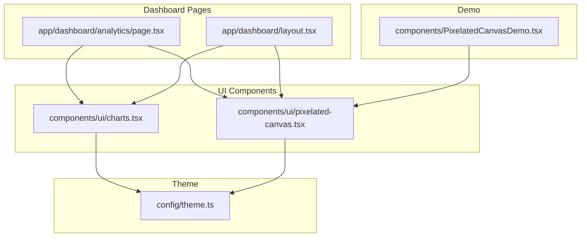
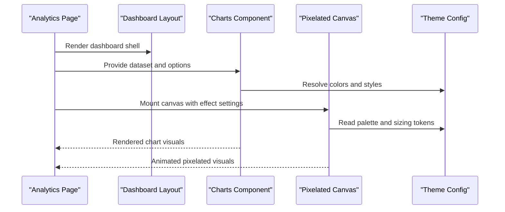
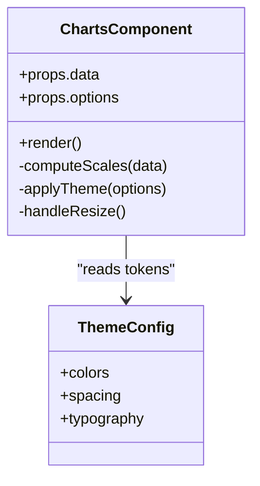
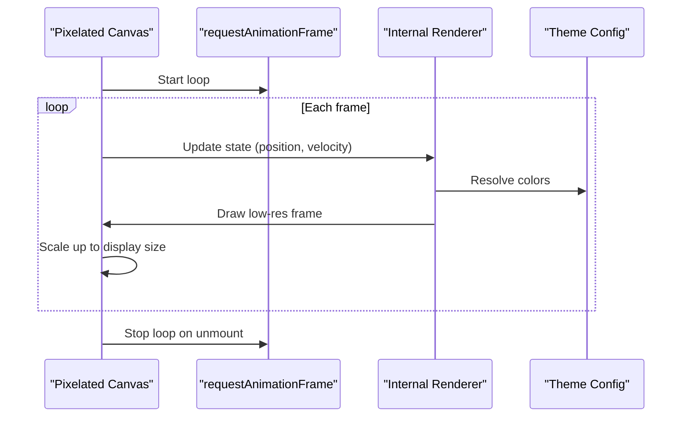
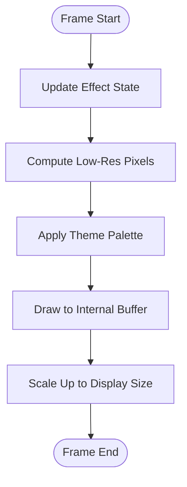
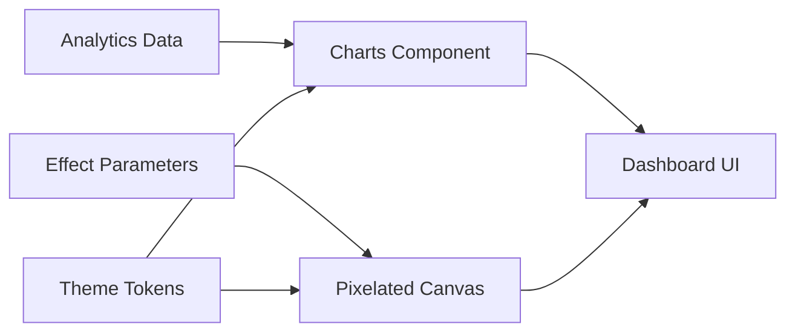

# Visualization Components

<cite>
**Referenced Files in This Document**
- [charts.tsx](file://src/components/ui/charts.tsx)
- [pixelated-canvas.tsx](file://src/components/ui/pixelated-canvas.tsx)
- [PixelatedCanvasDemo.tsx](file://src/components/PixelatedCanvasDemo.tsx)
- [analytics/page.tsx](file://src/app/dashboard/analytics/page.tsx)
- [dashboard/layout.tsx](file://src/app/dashboard/layout.tsx)
- [theme.ts](file://src/config/theme.ts)
</cite>

## Table of Contents
1. [Introduction](#introduction)
2. [Project Structure](#project-structure)
3. [Core Components](#core-components)
4. [Architecture Overview](#architecture-overview)
5. [Detailed Component Analysis](#detailed-component-analysis)
6. [Dependency Analysis](#dependency-analysis)
7. [Performance Considerations](#performance-considerations)
8. [Troubleshooting Guide](#troubleshooting-guide)
9. [Conclusion](#conclusion)
10. [Appendices](#appendices)

## Introduction
This document explains the data visualization and canvas-based components used to render analytics dashboards and creative visual effects. It covers:
- The charts component for displaying analytics data, including supported chart types, data binding patterns, customization options, and responsive behavior.
- The pixelated canvas implementation for artistic rendering, including rendering techniques, performance considerations, and animation capabilities.
- Practical examples of integrating these components with dashboard data and applying custom styling approaches.

## Project Structure
The visualization features are implemented as reusable UI components under src/components/ui and integrated into the dashboard pages.

**Diagram sources**
- [analytics/page.tsx](file://src/app/dashboard/analytics/page.tsx)
- [dashboard/layout.tsx](file://src/app/dashboard/layout.tsx)
- [charts.tsx](file://src/components/ui/charts.tsx)
- [pixelated-canvas.tsx](file://src/components/ui/pixelated-canvas.tsx)
- [PixelatedCanvasDemo.tsx](file://src/components/PixelatedCanvasDemo.tsx)
- [theme.ts](file://src/config/theme.ts)

**Section sources**
- [analytics/page.tsx](file://src/app/dashboard/analytics/page.tsx)
- [dashboard/layout.tsx](file://src/app/dashboard/layout.tsx)
- [charts.tsx](file://src/components/ui/charts.tsx)
- [pixelated-canvas.tsx](file://src/components/ui/pixelated-canvas.tsx)
- [PixelatedCanvasDemo.tsx](file://src/components/PixelatedCanvasDemo.tsx)
- [theme.ts](file://src/config/theme.ts)

## Core Components
- Charts component: Provides chart rendering for analytics data, supports multiple chart types, accepts structured datasets, and exposes customization props for colors, labels, and layout. It is designed to be responsive within its container.
- Pixelated Canvas component: Renders a low-resolution canvas scaled up to produce a pixelated aesthetic. It includes animation hooks and performance controls suitable for real-time effects.

Key responsibilities:
- Data binding: Accept arrays/objects representing time series or categorical data.
- Styling: Use theme tokens for consistent colors and typography.
- Responsiveness: Adapt to container size changes without manual recalculation by consumers.
- Animation: Provide smooth transitions and frame-driven updates where applicable.

**Section sources**
- [charts.tsx](file://src/components/ui/charts.tsx)
- [pixelated-canvas.tsx](file://src/components/ui/pixelated-canvas.tsx)
- [theme.ts](file://src/config/theme.ts)

## Architecture Overview
The dashboard composes the charts and pixelated canvas components. The analytics page fetches or prepares data and passes it to the charts component. The pixelated canvas can be embedded directly or via a demo wrapper. Theme configuration centralizes color and style tokens consumed by both components.

**Diagram sources**
- [analytics/page.tsx](file://src/app/dashboard/analytics/page.tsx)
- [dashboard/layout.tsx](file://src/app/dashboard/layout.tsx)
- [charts.tsx](file://src/components/ui/charts.tsx)
- [pixelated-canvas.tsx](file://src/components/ui/pixelated-canvas.tsx)
- [theme.ts](file://src/config/theme.ts)

## Detailed Component Analysis

### Charts Component
Purpose:
- Display analytical datasets using one or more chart types.
- Bind data through well-defined props (e.g., series, labels, values).
- Customize appearance via theme-aware options.
- Respond to container resizing for accurate rendering.

Data binding:
- Accepts structured inputs such as arrays of points or grouped series.
- Maps keys like label/value pairs to axes and legends.
- Supports optional metadata for tooltips and annotations.

Customization options:
- Colors and palette from theme tokens.
- Axis labels, grid visibility, and legend placement.
- Margins, padding, and aspect ratio hints.
- Interaction toggles (hover states, selection).

Responsive behavior:
- Observes container dimensions and redraws on change.
- Scales axes and labels proportionally.
- Delegates heavy computations off the main thread when possible.

Integration example:
- In the analytics page, prepare an array of time-series entries and pass them to the charts component along with display options.
- Wrap the charts component in a responsive container to ensure proper scaling across breakpoints.

Styling approach:
- Prefer theme tokens for colors, spacing, and typography.
- Override minimal CSS only when necessary; keep chart internals theme-driven.

**Section sources**
- [charts.tsx](file://src/components/ui/charts.tsx)
- [analytics/page.tsx](file://src/app/dashboard/analytics/page.tsx)
- [theme.ts](file://src/config/theme.ts)

#### Class Diagram (Conceptual)

[No diagram sources since this diagram is conceptual]

### Pixelated Canvas Component
Purpose:
- Create a stylized, pixel-art-like visual effect by rendering at a low resolution and scaling up.
- Support animations and interactive parameters.

Rendering technique:
- Maintains an internal low-resolution buffer.
- Draws shapes, particles, or gradients at reduced resolution.
- Uses CSS transform or canvas scaling to enlarge pixels.

Animation capabilities:
- Frame-driven loop with requestAnimationFrame.
- Adjustable speed, easing, and update frequency.
- Optional throttling based on device capability.

Performance considerations:
- Keep internal resolution small to reduce draw calls.
- Batch operations and minimize allocations per frame.
- Pause or reduce quality when off-screen or during low-power mode.

Integration example:
- Embed the canvas in a fixed-size container or let it fill available space.
- Pass effect parameters (e.g., density, speed, palette) and observe theme tokens for colors.

Styling approach:
- Control container size and overflow behavior via CSS.
- Use theme tokens for background and accent colors.

**Section sources**
- [pixelated-canvas.tsx](file://src/components/ui/pixelated-canvas.tsx)
- [PixelatedCanvasDemo.tsx](file://src/components/PixelatedCanvasDemo.tsx)
- [theme.ts](file://src/config/theme.ts)

#### Sequence Diagram (Animation Loop)

**Diagram sources**
- [pixelated-canvas.tsx](file://src/components/ui/pixelated-canvas.tsx)
- [theme.ts](file://src/config/theme.ts)

#### Flowchart (Rendering Pipeline)

**Diagram sources**
- [pixelated-canvas.tsx](file://src/components/ui/pixelated-canvas.tsx)

### Conceptual Overview
The two components complement each other: charts provide precise, data-driven visuals, while the pixelated canvas offers expressive, performant motion graphics. Both rely on a shared theme configuration to maintain consistency across the application.

[No sources needed since this diagram shows conceptual workflow, not actual code structure]

## Dependency Analysis
- Charts depends on theme tokens for consistent styling and may depend on a rendering utility if present.
- Pixelated Canvas depends on theme tokens and browser APIs for timing and drawing.
- Dashboard pages compose both components and supply data and effect parameters.

```mermaid
graph TB
Analytics["analytics/page.tsx"] --> Charts["charts.tsx"]
Analytics --> Canvas["pixelated-canvas.tsx"]
Layout["dashboard/layout.tsx"] --> Charts
Layout --> Canvas
Demo["PixelatedCanvasDemo.tsx"] --> Canvas
Charts --> Theme["theme.ts"]
Canvas --> Theme
```

**Diagram sources**
- [analytics/page.tsx](file://src/app/dashboard/analytics/page.tsx)
- [dashboard/layout.tsx](file://src/app/dashboard/layout.tsx)
- [charts.tsx](file://src/components/ui/charts.tsx)
- [pixelated-canvas.tsx](file://src/components/ui/pixelated-canvas.tsx)
- [PixelatedCanvasDemo.tsx](file://src/components/PixelatedCanvasDemo.tsx)
- [theme.ts](file://src/config/theme.ts)

**Section sources**
- [analytics/page.tsx](file://src/app/dashboard/analytics/page.tsx)
- [dashboard/layout.tsx](file://src/app/dashboard/layout.tsx)
- [charts.tsx](file://src/components/ui/charts.tsx)
- [pixelated-canvas.tsx](file://src/components/ui/pixelated-canvas.tsx)
- [PixelatedCanvasDemo.tsx](file://src/components/PixelatedCanvasDemo.tsx)
- [theme.ts](file://src/config/theme.ts)

## Performance Considerations
- Charts:
  - Avoid re-rendering entire datasets on minor updates; prefer incremental updates.
  - Debounce resize handlers and batch axis recalculations.
  - Use memoization for derived scales and legends.
- Pixelated Canvas:
  - Keep internal resolution low; scale up via CSS or canvas transform.
  - Throttle updates on low-end devices or when the tab is inactive.
  - Minimize object creation inside the animation loop.
- Shared:
  - Leverage theme tokens to avoid runtime style recomputation.
  - Ensure components unmount cleanly to stop timers and listeners.

[No sources needed since this section provides general guidance]

## Troubleshooting Guide
Common issues and resolutions:
- Charts not updating:
  - Verify that data references change between renders.
  - Check that container has non-zero dimensions before first draw.
- Canvas flickering or stutter:
  - Reduce internal resolution or frame rate.
  - Ensure the animation loop stops on unmount.
- Theme mismatches:
  - Confirm that theme tokens are provided and accessible to both components.
- Responsive misalignment:
  - Wrap components in containers with explicit width/height constraints.

**Section sources**
- [charts.tsx](file://src/components/ui/charts.tsx)
- [pixelated-canvas.tsx](file://src/components/ui/pixelated-canvas.tsx)
- [theme.ts](file://src/config/theme.ts)

## Conclusion
The charts and pixelated canvas components together enable robust analytics visualization and engaging visual effects. By adhering to theme-driven styling, careful data binding, and performance-conscious rendering, they integrate seamlessly into the dashboard and support both informative and creative use cases.

[No sources needed since this section summarizes without analyzing specific files]

## Appendices

### Integration Examples

- Analytics dashboard integration:
  - Prepare a dataset with timestamps and metric values.
  - Pass the dataset and display options to the charts component.
  - Place the charts component within a responsive container.

- Custom styling approach:
  - Define or extend theme tokens for colors and typography.
  - Configure chart options to consume theme tokens.
  - For the pixelated canvas, set effect parameters and allow it to read palette tokens from the theme.

- Demo usage:
  - Use the provided demo component to quickly test effect parameters and visualize output.

**Section sources**
- [analytics/page.tsx](file://src/app/dashboard/analytics/page.tsx)
- [PixelatedCanvasDemo.tsx](file://src/components/PixelatedCanvasDemo.tsx)
- [theme.ts](file://src/config/theme.ts)