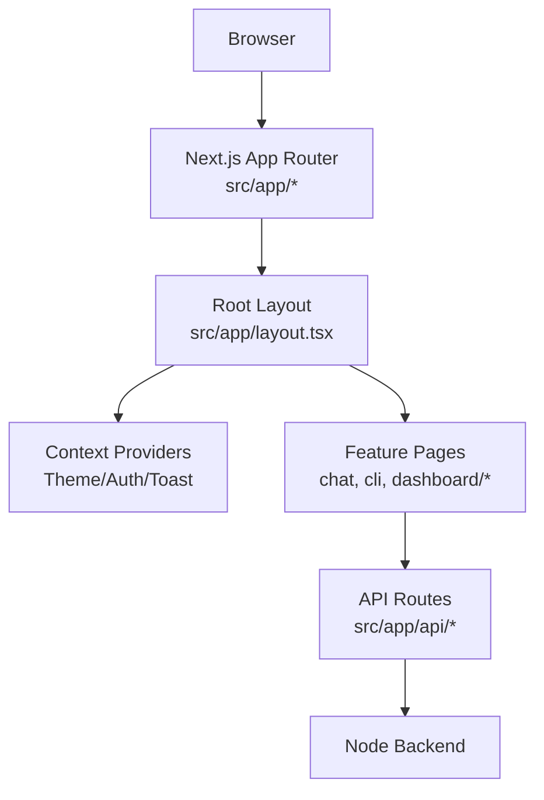
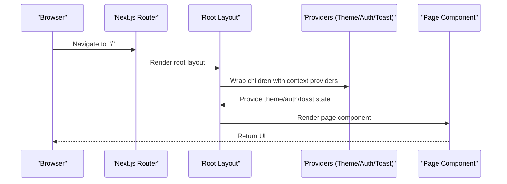
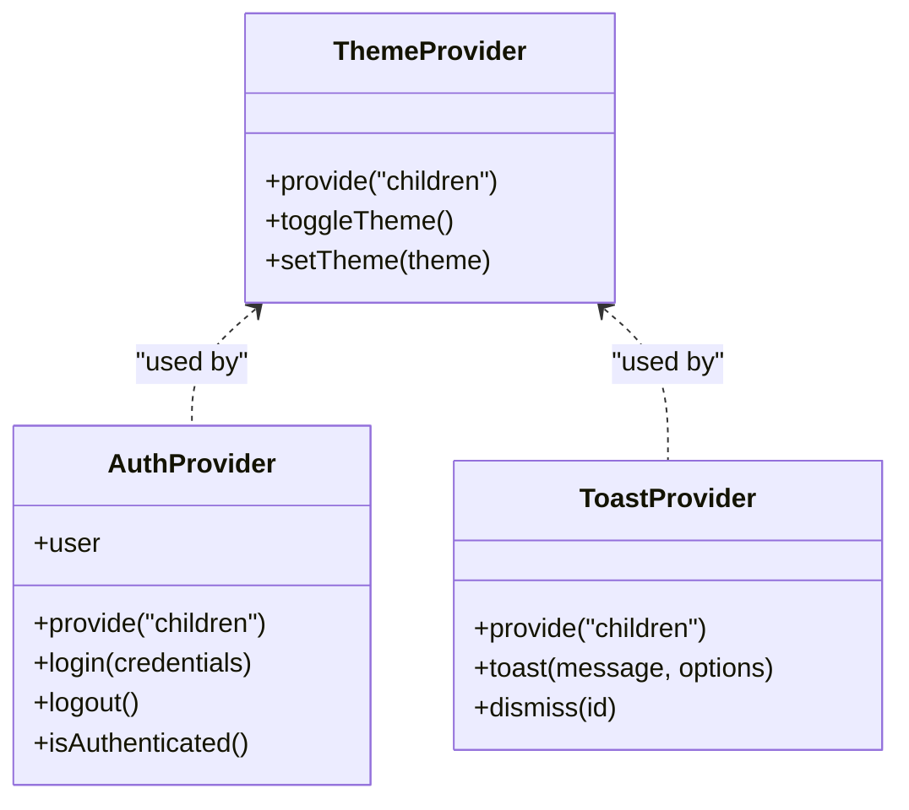
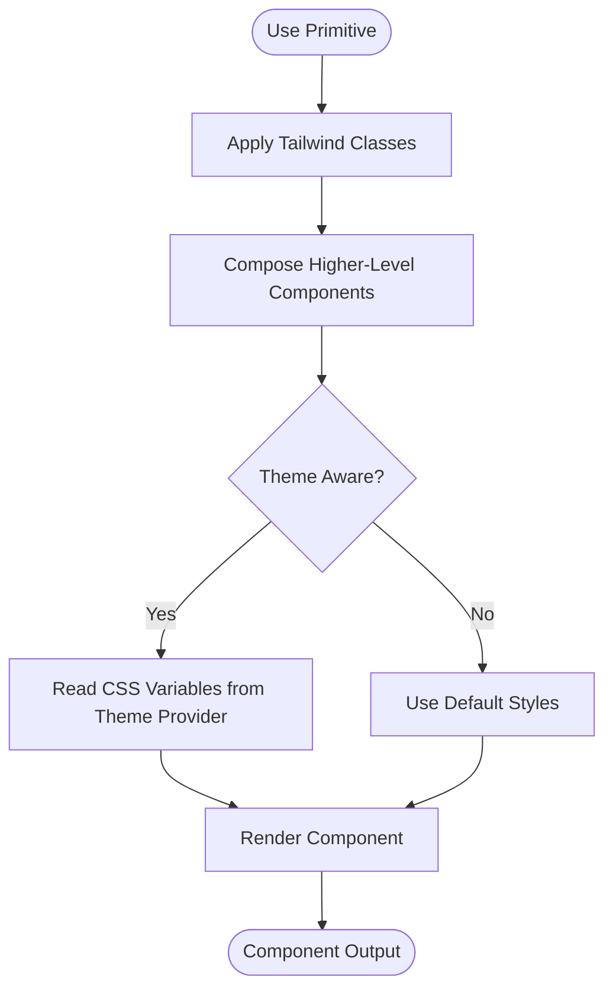
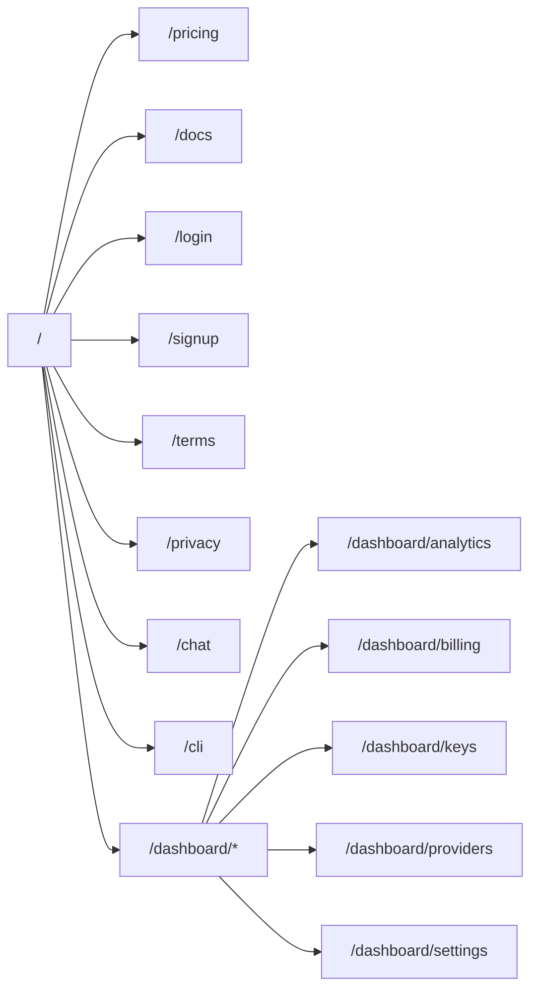
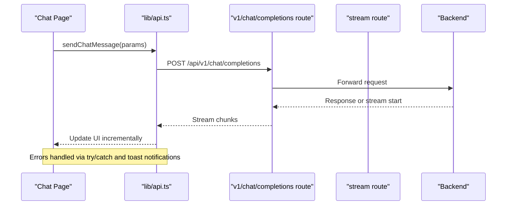
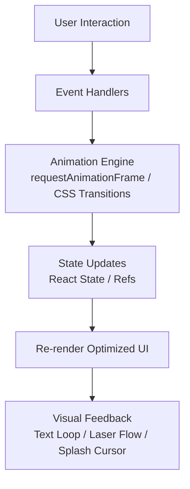
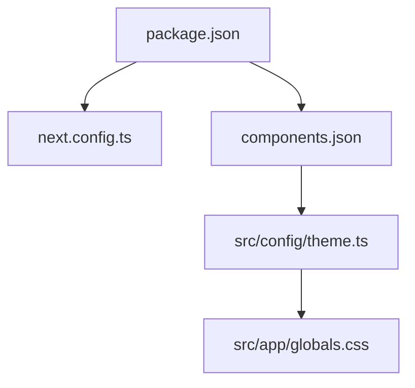

# Frontend Architecture

<cite>
**Referenced Files in This Document**
- [next.config.ts](file://next.config.ts)
- [package.json](file://package.json)
- [components.json](file://components.json)
- [src/app/layout.tsx](file://src/app/layout.tsx)
- [src/app/page.tsx](file://src/app/page.tsx)
- [src/app/globals.css](file://src/app/globals.css)
- [src/app/not-found.tsx](file://src/app/not-found.tsx)
- [src/app/auth.module.css](file://src/app/auth.module.css)
- [src/app/chat/page.tsx](file://src/app/chat/page.tsx)
- [src/app/cli/page.tsx](file://src/app/cli/page.tsx)
- [src/app/dashboard/layout.tsx](file://src/app/dashboard/layout.tsx)
- [src/app/dashboard/page.tsx](file://src/app/dashboard/page.tsx)
- [src/app/dashboard/analytics/page.tsx](file://src/app/dashboard/analytics/page.tsx)
- [src/app/dashboard/billing/page.tsx](file://src/app/dashboard/billing/page.tsx)
- [src/app/dashboard/keys/page.tsx](file://src/app/dashboard/keys/page.tsx)
- [src/app/dashboard/providers/page.tsx](file://src/app/dashboard/providers/page.tsx)
- [src/app/dashboard/settings/page.tsx](file://src/app/dashboard/settings/page.tsx)
- [src/app/docs/page.tsx](file://src/app/docs/page.tsx)
- [src/app/login/page.tsx](file://src/app/login/page.tsx)
- [src/app/pricing/page.tsx](file://src/app/pricing/page.tsx)
- [src/app/privacy/page.tsx](file://src/app/privacy/page.tsx)
- [src/app/signup/page.tsx](file://src/app/signup/page.tsx)
- [src/app/terms/page.tsx](file://src/app/terms/page.tsx)
- [src/components/theme-provider.tsx](file://src/components/theme-provider.tsx)
- [src/components/theme-toggle.tsx](file://src/components/theme-toggle.tsx)
- [src/components/auth-provider.tsx](file://src/components/auth-provider.tsx)
- [src/components/site-nav.tsx](file://src/components/site-nav.tsx)
- [src/components/legal-shell.tsx](file://src/components/legal-shell.tsx)
- [src/components/logo.tsx](file://src/components/logo.tsx)
- [src/components/ui/primitives.tsx](file://src/components/ui/primitives.tsx)
- [src/components/ui/space-button.tsx](file://src/components/ui/space-button.tsx)
- [src/components/ui/toast.tsx](file://src/components/ui/toast.tsx)
- [src/components/ui/charts.tsx](file://src/components/ui/charts.tsx)
- [src/components/ui/pixelated-canvas.tsx](file://src/components/ui/pixelated-canvas.tsx)
- [src/components/core/text-loop.tsx](file://src/components/core/text-loop.tsx)
- [src/components/core/text-roll.tsx](file://src/components/core/text-roll.tsx)
- [src/components/HeroTerminal.tsx](file://src/components/HeroTerminal.tsx)
- [src/components/BranchFeatures.tsx](file://src/components/BranchFeatures.tsx)
- [src/components/InstallBox.tsx](file://src/components/InstallBox.tsx)
- [src/components/LaserFlow.jsx](file://src/components/LaserFlow.jsx)
- [src/components/SplashCursor.jsx](file://src/components/SplashCursor.jsx)
- [src/components/PixelatedCanvasDemo.tsx](file://src/components/PixelatedCanvasDemo.tsx)
- [src/config/theme.ts](file://src/config/theme.ts)
- [src/lib/api.ts](file://src/lib/api.ts)
- [src/app/api/v1/chat/completions/route.ts](file://src/app/api/v1/chat/completions/route.ts)
- [src/app/api/stream/route.ts](file://src/app/api/stream/route.ts)
- [src/app/api/models/route.ts](file://src/app/api/models/route.ts)
- [src/app/api/providers/route.ts](file://src/app/api/providers/route.ts)
- [src/app/api/providers/[id]/route.ts](file://src/app/api/providers/[id]/route.ts)
- [src/app/api/keys/route.ts](file://src/app/api/keys/route.ts)
- [src/app/api/keys/[id]/route.ts](file://src/app/api/keys/[id]/route.ts)
- [src/app/api/me/route.ts](file://src/app/api/me/route.ts)
- [src/app/api/auth/login/route.ts](file://src/app/api/auth/login/route.ts)
- [src/app/api/auth/signup/route.ts](file://src/app/api/auth/signup/route.ts)
- [src/app/api/analytics/route.ts](file://src/app/api/analytics/route.ts)
</cite>

## Table of Contents
1. [Introduction](#introduction)
2. [Project Structure](#project-structure)
3. [Core Components](#core-components)
4. [Architecture Overview](#architecture-overview)
5. [Detailed Component Analysis](#detailed-component-analysis)
6. [Dependency Analysis](#dependency-analysis)
7. [Performance Considerations](#performance-considerations)
8. [Troubleshooting Guide](#troubleshooting-guide)
9. [Conclusion](#conclusion)
10. [Appendices](#appendices)

## Introduction
This document describes the frontend architecture of a Next.js 14+ application using the App Router, React Context providers for state management, and a UI component library built with Shadcn/ui and Tailwind CSS. It explains routing structure, layout composition, feature organization, API integration patterns, error handling, responsive design, and custom animated components.

## Project Structure
The project follows Next.js App Router conventions:
- src/app holds routes, layouts, and global styles.
- src/components contains shared UI primitives, domain-specific components, and interactive elements.
- src/config defines theme configuration.
- src/lib provides utilities and API helpers.
- Backend API routes are proxied under src/app/api to integrate with the Node backend.

```mermaid
graph TB
subgraph "App Router"
RootLayout["src/app/layout.tsx"]
HomePage["src/app/page.tsx"]
NotFound["src/app/not-found.tsx"]
ChatPage["src/app/chat/page.tsx"]
CliPage["src/app/cli/page.tsx"]
DashboardLayout["src/app/dashboard/layout.tsx"]
DashboardHome["src/app/dashboard/page.tsx"]
AnalyticsPage["src/app/dashboard/analytics/page.tsx"]
BillingPage["src/app/dashboard/billing/page.tsx"]
KeysPage["src/app/dashboard/keys/page.tsx"]
ProvidersPage["src/app/dashboard/providers/page.tsx"]
SettingsPage["src/app/dashboard/settings/page.tsx"]
end
subgraph "Components"
ThemeProvider["src/components/theme-provider.tsx"]
AuthProvider["src/components/auth-provider.tsx"]
SiteNav["src/components/site-nav.tsx"]
LegalShell["src/components/legal-shell.tsx"]
Logo["src/components/logo.tsx"]
Primitives["src/components/ui/primitives.tsx"]
SpaceButton["src/components/ui/space-button.tsx"]
ToastUI["src/components/ui/toast.tsx"]
ChartsUI["src/components/ui/charts.tsx"]
PixelatedCanvas["src/components/ui/pixelated-canvas.tsx"]
TextLoop["src/components/core/text-loop.tsx"]
TextRoll["src/components/core/text-roll.tsx"]
HeroTerminal["src/components/HeroTerminal.tsx"]
BranchFeatures["src/components/BranchFeatures.tsx"]
InstallBox["src/components/InstallBox.tsx"]
LaserFlow["src/components/LaserFlow.jsx"]
SplashCursor["src/components/SplashCursor.jsx"]
PixelatedCanvasDemo["src/components/PixelatedCanvasDemo.tsx"]
end
subgraph "Config & Lib"
ThemeConfig["src/config/theme.ts"]
ApiLib["src/lib/api.ts"]
end
RootLayout --> ThemeProvider
RootLayout --> AuthProvider
RootLayout --> SiteNav
RootLayout --> Logo
RootLayout --> Primitives
RootLayout --> ThemeConfig
RootLayout --> ApiLib
HomePage --> HeroTerminal
HomePage --> BranchFeatures
HomePage --> InstallBox
HomePage --> LaserFlow
HomePage --> SplashCursor
HomePage --> TextLoop
HomePage --> TextRoll
DashboardLayout --> SiteNav
DashboardLayout --> Primitives
DashboardLayout --> ToastUI
DashboardLayout --> ChartsUI
DashboardLayout --> PixelatedCanvas
AnalyticsPage --> ChartsUI
BillingPage --> SpaceButton
KeysPage --> ToastUI
ProvidersPage --> ToastUI
SettingsPage --> ToastUI
```

**Diagram sources**
- [src/app/layout.tsx](file://src/app/layout.tsx)
- [src/app/page.tsx](file://src/app/page.tsx)
- [src/app/not-found.tsx](file://src/app/not-found.tsx)
- [src/app/chat/page.tsx](file://src/app/chat/page.tsx)
- [src/app/cli/page.tsx](file://src/app/cli/page.tsx)
- [src/app/dashboard/layout.tsx](file://src/app/dashboard/layout.tsx)
- [src/app/dashboard/page.tsx](file://src/app/dashboard/page.tsx)
- [src/app/dashboard/analytics/page.tsx](file://src/app/dashboard/analytics/page.tsx)
- [src/app/dashboard/billing/page.tsx](file://src/app/dashboard/billing/page.tsx)
- [src/app/dashboard/keys/page.tsx](file://src/app/dashboard/keys/page.tsx)
- [src/app/dashboard/providers/page.tsx](file://src/app/dashboard/providers/page.tsx)
- [src/app/dashboard/settings/page.tsx](file://src/app/dashboard/settings/page.tsx)
- [src/components/theme-provider.tsx](file://src/components/theme-provider.tsx)
- [src/components/auth-provider.tsx](file://src/components/auth-provider.tsx)
- [src/components/site-nav.tsx](file://src/components/site-nav.tsx)
- [src/components/legal-shell.tsx](file://src/components/legal-shell.tsx)
- [src/components/logo.tsx](file://src/components/logo.tsx)
- [src/components/ui/primitives.tsx](file://src/components/ui/primitives.tsx)
- [src/components/ui/space-button.tsx](file://src/components/ui/space-button.tsx)
- [src/components/ui/toast.tsx](file://src/components/ui/toast.tsx)
- [src/components/ui/charts.tsx](file://src/components/ui/charts.tsx)
- [src/components/ui/pixelated-canvas.tsx](file://src/components/ui/pixelated-canvas.tsx)
- [src/components/core/text-loop.tsx](file://src/components/core/text-loop.tsx)
- [src/components/core/text-roll.tsx](file://src/components/core/text-roll.tsx)
- [src/components/HeroTerminal.tsx](file://src/components/HeroTerminal.tsx)
- [src/components/BranchFeatures.tsx](file://src/components/BranchFeatures.tsx)
- [src/components/InstallBox.tsx](file://src/components/InstallBox.tsx)
- [src/components/LaserFlow.jsx](file://src/components/LaserFlow.jsx)
- [src/components/SplashCursor.jsx](file://src/components/SplashCursor.jsx)
- [src/components/PixelatedCanvasDemo.tsx](file://src/components/PixelatedCanvasDemo.tsx)
- [src/config/theme.ts](file://src/config/theme.ts)
- [src/lib/api.ts](file://src/lib/api.ts)

**Section sources**
- [next.config.ts](file://next.config.ts)
- [package.json](file://package.json)
- [components.json](file://components.json)
- [src/app/layout.tsx](file://src/app/layout.tsx)
- [src/app/page.tsx](file://src/app/page.tsx)
- [src/app/globals.css](file://src/app/globals.css)
- [src/app/not-found.tsx](file://src/app/not-found.tsx)

## Core Components
- Theme provider: Wraps the app to manage light/dark themes via React Context and applies them at the root.
- Auth provider: Centralizes authentication state and actions (login/logout/session checks) using React Context.
- Site navigation: Shared navigation shell used across public pages and dashboard.
- Legal shell: Reusable wrapper for legal pages (terms, privacy).
- UI primitives: Base styled components from Shadcn/ui (buttons, inputs, cards, etc.) composed with Tailwind classes.
- Toast system: Global notifications via a context-driven toast manager.
- Charts: Charting components integrated into dashboard analytics.
- Animated components: Text loop/roll effects, laser flow, splash cursor, pixelated canvas demo.

Key responsibilities:
- Provide cross-cutting concerns (theme, auth, toasts).
- Encapsulate reusable UI building blocks.
- Offer interactive and animated experiences consistently.

**Section sources**
- [src/components/theme-provider.tsx](file://src/components/theme-provider.tsx)
- [src/components/auth-provider.tsx](file://src/components/auth-provider.tsx)
- [src/components/site-nav.tsx](file://src/components/site-nav.tsx)
- [src/components/legal-shell.tsx](file://src/components/legal-shell.tsx)
- [src/components/ui/primitives.tsx](file://src/components/ui/primitives.tsx)
- [src/components/ui/space-button.tsx](file://src/components/ui/space-button.tsx)
- [src/components/ui/toast.tsx](file://src/components/ui/toast.tsx)
- [src/components/ui/charts.tsx](file://src/components/ui/charts.tsx)
- [src/components/ui/pixelated-canvas.tsx](file://src/components/ui/pixelated-canvas.tsx)
- [src/components/core/text-loop.tsx](file://src/components/core/text-loop.tsx)
- [src/components/core/text-roll.tsx](file://src/components/core/text-roll.tsx)
- [src/components/HeroTerminal.tsx](file://src/components/HeroTerminal.tsx)
- [src/components/BranchFeatures.tsx](file://src/components/BranchFeatures.tsx)
- [src/components/InstallBox.tsx](file://src/components/InstallBox.tsx)
- [src/components/LaserFlow.jsx](file://src/components/LaserFlow.jsx)
- [src/components/SplashCursor.jsx](file://src/components/SplashCursor.jsx)
- [src/components/PixelatedCanvasDemo.tsx](file://src/components/PixelatedCanvasDemo.tsx)

## Architecture Overview
High-level architecture:
- App Router organizes pages and layouts.
- Root layout composes providers (theme, auth), global styles, and shared navigation.
- Feature areas (dashboard, chat, CLI) compose their own layouts and pages.
- API routes under src/app/api proxy or forward requests to the backend.
- UI layer uses Shadcn/ui primitives and Tailwind CSS; theme is configured centrally.

**Diagram sources**
- [src/app/layout.tsx](file://src/app/layout.tsx)
- [src/components/theme-provider.tsx](file://src/components/theme-provider.tsx)
- [src/components/auth-provider.tsx](file://src/components/auth-provider.tsx)
- [src/components/ui/toast.tsx](file://src/components/ui/toast.tsx)
- [src/app/chat/page.tsx](file://src/app/chat/page.tsx)
- [src/app/cli/page.tsx](file://src/app/cli/page.tsx)
- [src/app/dashboard/layout.tsx](file://src/app/dashboard/layout.tsx)
- [src/app/api/v1/chat/completions/route.ts](file://src/app/api/v1/chat/completions/route.ts)
- [src/app/api/stream/route.ts](file://src/app/api/stream/route.ts)

## Detailed Component Analysis

### App Router and Layout Composition
- Root layout sets up global HTML structure, imports global styles, and wraps content with providers.
- Dashboard layout adds a nested shell for authenticated features.
- Public pages (home, pricing, docs, login, signup, terms, privacy) compose minimal layouts.
- Error page handles not-found scenarios.

**Diagram sources**
- [src/app/layout.tsx](file://src/app/layout.tsx)
- [src/app/page.tsx](file://src/app/page.tsx)
- [src/app/not-found.tsx](file://src/app/not-found.tsx)
- [src/app/dashboard/layout.tsx](file://src/app/dashboard/layout.tsx)

**Section sources**
- [src/app/layout.tsx](file://src/app/layout.tsx)
- [src/app/page.tsx](file://src/app/page.tsx)
- [src/app/not-found.tsx](file://src/app/not-found.tsx)
- [src/app/dashboard/layout.tsx](file://src/app/dashboard/layout.tsx)

### State Management with React Context
- Theme provider manages color scheme and applies it globally.
- Auth provider centralizes session state and exposes login/logout methods.
- Toast provider surfaces a global notification API for user feedback.

**Diagram sources**
- [src/components/theme-provider.tsx](file://src/components/theme-provider.tsx)
- [src/components/auth-provider.tsx](file://src/components/auth-provider.tsx)
- [src/components/ui/toast.tsx](file://src/components/ui/toast.tsx)

**Section sources**
- [src/components/theme-provider.tsx](file://src/components/theme-provider.tsx)
- [src/components/auth-provider.tsx](file://src/components/auth-provider.tsx)
- [src/components/ui/toast.tsx](file://src/components/ui/toast.tsx)

### UI Component Library (Shadcn/ui + Tailwind)
- Primitives define base components (button, input, card, dialog, etc.) styled with Tailwind.
- Space button demonstrates a themed, accessible button variant.
- Toast system integrates with the provider to show messages.
- Charts provide data visualization primitives for dashboards.
- Pixelated canvas offers a performant canvas-based visual primitive.

**Diagram sources**
- [src/components/ui/primitives.tsx](file://src/components/ui/primitives.tsx)
- [src/components/ui/space-button.tsx](file://src/components/ui/space-button.tsx)
- [src/components/ui/toast.tsx](file://src/components/ui/toast.tsx)
- [src/components/ui/charts.tsx](file://src/components/ui/charts.tsx)
- [src/components/ui/pixelated-canvas.tsx](file://src/components/ui/pixelated-canvas.tsx)
- [src/config/theme.ts](file://src/config/theme.ts)

**Section sources**
- [src/components/ui/primitives.tsx](file://src/components/ui/primitives.tsx)
- [src/components/ui/space-button.tsx](file://src/components/ui/space-button.tsx)
- [src/components/ui/toast.tsx](file://src/components/ui/toast.tsx)
- [src/components/ui/charts.tsx](file://src/components/ui/charts.tsx)
- [src/components/ui/pixelated-canvas.tsx](file://src/components/ui/pixelated-canvas.tsx)
- [src/config/theme.ts](file://src/config/theme.ts)

### Routing Structure and Feature Organization
- Public routes: home, pricing, docs, login, signup, terms, privacy.
- Product routes: chat, cli.
- Dashboard routes: analytics, billing, keys, providers, settings, each with dedicated pages and a shared dashboard layout.

**Diagram sources**
- [src/app/page.tsx](file://src/app/page.tsx)
- [src/app/pricing/page.tsx](file://src/app/pricing/page.tsx)
- [src/app/docs/page.tsx](file://src/app/docs/page.tsx)
- [src/app/login/page.tsx](file://src/app/login/page.tsx)
- [src/app/signup/page.tsx](file://src/app/signup/page.tsx)
- [src/app/terms/page.tsx](file://src/app/terms/page.tsx)
- [src/app/privacy/page.tsx](file://src/app/privacy/page.tsx)
- [src/app/chat/page.tsx](file://src/app/chat/page.tsx)
- [src/app/cli/page.tsx](file://src/app/cli/page.tsx)
- [src/app/dashboard/layout.tsx](file://src/app/dashboard/layout.tsx)
- [src/app/dashboard/analytics/page.tsx](file://src/app/dashboard/analytics/page.tsx)
- [src/app/dashboard/billing/page.tsx](file://src/app/dashboard/billing/page.tsx)
- [src/app/dashboard/keys/page.tsx](file://src/app/dashboard/keys/page.tsx)
- [src/app/dashboard/providers/page.tsx](file://src/app/dashboard/providers/page.tsx)
- [src/app/dashboard/settings/page.tsx](file://src/app/dashboard/settings/page.tsx)

**Section sources**
- [src/app/page.tsx](file://src/app/page.tsx)
- [src/app/chat/page.tsx](file://src/app/chat/page.tsx)
- [src/app/cli/page.tsx](file://src/app/cli/page.tsx)
- [src/app/dashboard/layout.tsx](file://src/app/dashboard/layout.tsx)
- [src/app/dashboard/analytics/page.tsx](file://src/app/dashboard/analytics/page.tsx)
- [src/app/dashboard/billing/page.tsx](file://src/app/dashboard/billing/page.tsx)
- [src/app/dashboard/keys/page.tsx](file://src/app/dashboard/keys/page.tsx)
- [src/app/dashboard/providers/page.tsx](file://src/app/dashboard/providers/page.tsx)
- [src/app/dashboard/settings/page.tsx](file://src/app/dashboard/settings/page.tsx)

### API Integration and Error Handling
- API routes under src/app/api expose endpoints for models, providers, keys, auth, analytics, streaming, and chat completions.
- Frontend lib/api centralizes HTTP calls and common error handling.
- Streaming route supports server-sent events or similar streaming patterns.

**Diagram sources**
- [src/app/chat/page.tsx](file://src/app/chat/page.tsx)
- [src/lib/api.ts](file://src/lib/api.ts)
- [src/app/api/v1/chat/completions/route.ts](file://src/app/api/v1/chat/completions/route.ts)
- [src/app/api/stream/route.ts](file://src/app/api/stream/route.ts)

**Section sources**
- [src/lib/api.ts](file://src/lib/api.ts)
- [src/app/api/v1/chat/completions/route.ts](file://src/app/api/v1/chat/completions/route.ts)
- [src/app/api/stream/route.ts](file://src/app/api/stream/route.ts)
- [src/app/api/models/route.ts](file://src/app/api/models/route.ts)
- [src/app/api/providers/route.ts](file://src/app/api/providers/route.ts)
- [src/app/api/providers/[id]/route.ts](file://src/app/api/providers/[id]/route.ts)
- [src/app/api/keys/route.ts](file://src/app/api/keys/route.ts)
- [src/app/api/keys/[id]/route.ts](file://src/app/api/keys/[id]/route.ts)
- [src/app/api/me/route.ts](file://src/app/api/me/route.ts)
- [src/app/api/auth/login/route.ts](file://src/app/api/auth/login/route.ts)
- [src/app/api/auth/signup/route.ts](file://src/app/api/auth/signup/route.ts)
- [src/app/api/analytics/route.ts](file://src/app/api/analytics/route.ts)

### Responsive Design Approaches
- Global styles and theme variables enable consistent theming across breakpoints.
- Tailwind utility classes drive responsive behavior (e.g., mobile-first spacing, grid/flex adjustments).
- Components use semantic markup and accessible attributes to ensure robust UX on all devices.

[No sources needed since this section provides general guidance]

### Custom Animated Components and Interactive Elements
- Text loop and text roll create dynamic typographic effects.
- Laser flow and splash cursor add pointer-driven animations.
- Pixelated canvas demo showcases efficient canvas rendering.
- Hero terminal and install box enhance landing page interactivity.

**Diagram sources**
- [src/components/core/text-loop.tsx](file://src/components/core/text-loop.tsx)
- [src/components/core/text-roll.tsx](file://src/components/core/text-roll.tsx)
- [src/components/LaserFlow.jsx](file://src/components/LaserFlow.jsx)
- [src/components/SplashCursor.jsx](file://src/components/SplashCursor.jsx)
- [src/components/ui/pixelated-canvas.tsx](file://src/components/ui/pixelated-canvas.tsx)
- [src/components/PixelatedCanvasDemo.tsx](file://src/components/PixelatedCanvasDemo.tsx)
- [src/components/HeroTerminal.tsx](file://src/components/HeroTerminal.tsx)
- [src/components/InstallBox.tsx](file://src/components/InstallBox.tsx)

**Section sources**
- [src/components/core/text-loop.tsx](file://src/components/core/text-loop.tsx)
- [src/components/core/text-roll.tsx](file://src/components/core/text-roll.tsx)
- [src/components/LaserFlow.jsx](file://src/components/LaserFlow.jsx)
- [src/components/SplashCursor.jsx](file://src/components/SplashCursor.jsx)
- [src/components/ui/pixelated-canvas.tsx](file://src/components/ui/pixelated-canvas.tsx)
- [src/components/PixelatedCanvasDemo.tsx](file://src/components/PixelatedCanvasDemo.tsx)
- [src/components/HeroTerminal.tsx](file://src/components/HeroTerminal.tsx)
- [src/components/InstallBox.tsx](file://src/components/InstallBox.tsx)

## Dependency Analysis
Frontend dependencies include Next.js, React, Tailwind CSS, and Shadcn/ui primitives. The components.json configures Shadcn/ui paths and aliases.

**Diagram sources**
- [package.json](file://package.json)
- [next.config.ts](file://next.config.ts)
- [components.json](file://components.json)
- [src/config/theme.ts](file://src/config/theme.ts)
- [src/app/globals.css](file://src/app/globals.css)

**Section sources**
- [package.json](file://package.json)
- [next.config.ts](file://next.config.ts)
- [components.json](file://components.json)
- [src/config/theme.ts](file://src/config/theme.ts)
- [src/app/globals.css](file://src/app/globals.css)

## Performance Considerations
- Prefer client-side interactivity only where necessary; keep heavy logic off the critical render path.
- Use memoization and refs for animation-heavy components to avoid unnecessary re-renders.
- Leverage streaming API routes for long-running operations to improve perceived performance.
- Optimize images and assets; defer non-critical scripts.

[No sources needed since this section provides general guidance]

## Troubleshooting Guide
Common issues and strategies:
- Authentication failures: Verify auth provider state and API responses; surface errors via toast notifications.
- Theme mismatches: Ensure theme provider wraps the root layout and CSS variables are applied globally.
- API timeouts: Implement retries and user-friendly error messages; log detailed context for debugging.
- Not found pages: Confirm route definitions and fallback handling in the root layout.

**Section sources**
- [src/components/auth-provider.tsx](file://src/components/auth-provider.tsx)
- [src/components/ui/toast.tsx](file://src/components/ui/toast.tsx)
- [src/app/not-found.tsx](file://src/app/not-found.tsx)
- [src/app/layout.tsx](file://src/app/layout.tsx)

## Conclusion
The frontend leverages Next.js App Router for scalable routing, React Context for cohesive state management, and a Shadcn/ui + Tailwind-based component library for consistent UI. The architecture cleanly separates concerns between layout, features, and shared infrastructure, while integrating seamlessly with backend APIs through typed routes and centralized error handling. Animated components enrich the user experience without compromising performance when implemented thoughtfully.

## Appendices
- Configuration files: next.config.ts, package.json, components.json.
- Global styles and theme: globals.css, theme.ts.
- Navigation and shells: site-nav.tsx, legal-shell.tsx, logo.tsx.

**Section sources**
- [next.config.ts](file://next.config.ts)
- [package.json](file://package.json)
- [components.json](file://components.json)
- [src/app/globals.css](file://src/app/globals.css)
- [src/config/theme.ts](file://src/config/theme.ts)
- [src/components/site-nav.tsx](file://src/components/site-nav.tsx)
- [src/components/legal-shell.tsx](file://src/components/legal-shell.tsx)
- [src/components/logo.tsx](file://src/components/logo.tsx)