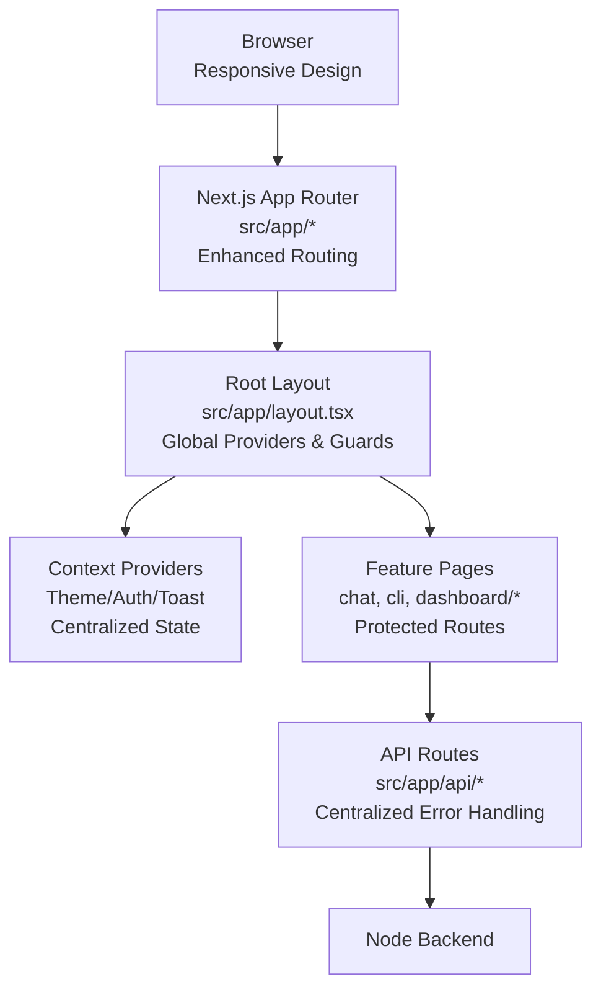
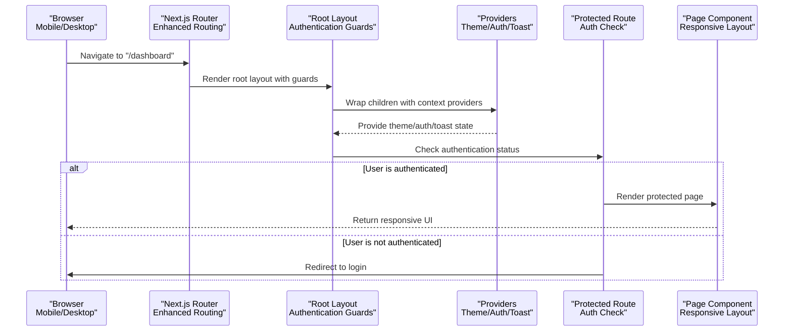
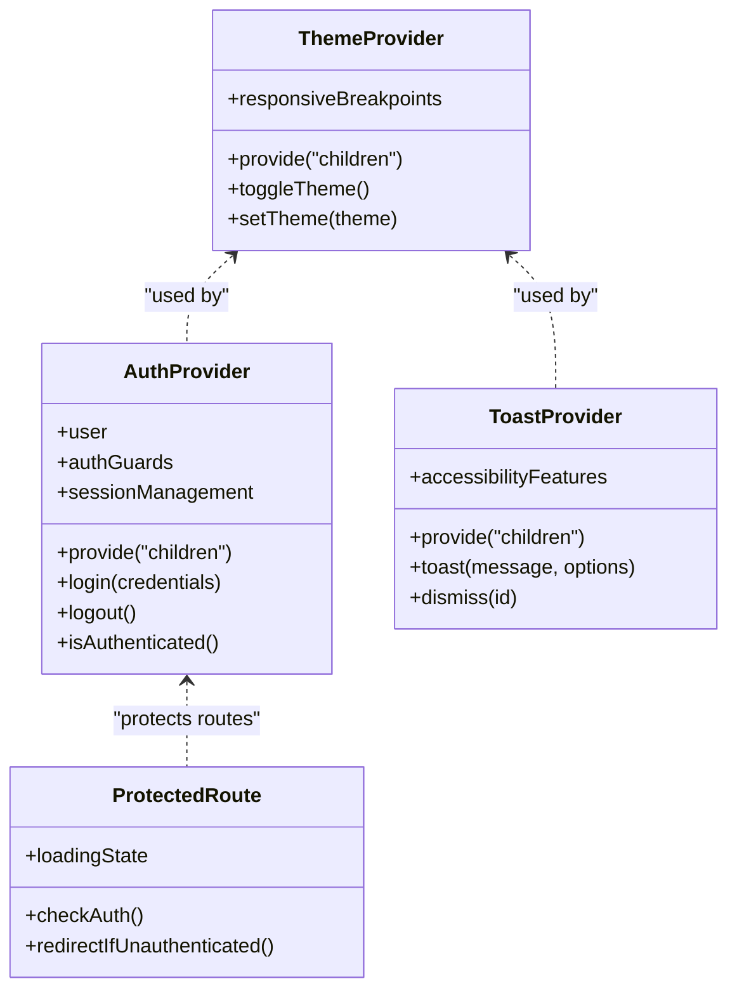
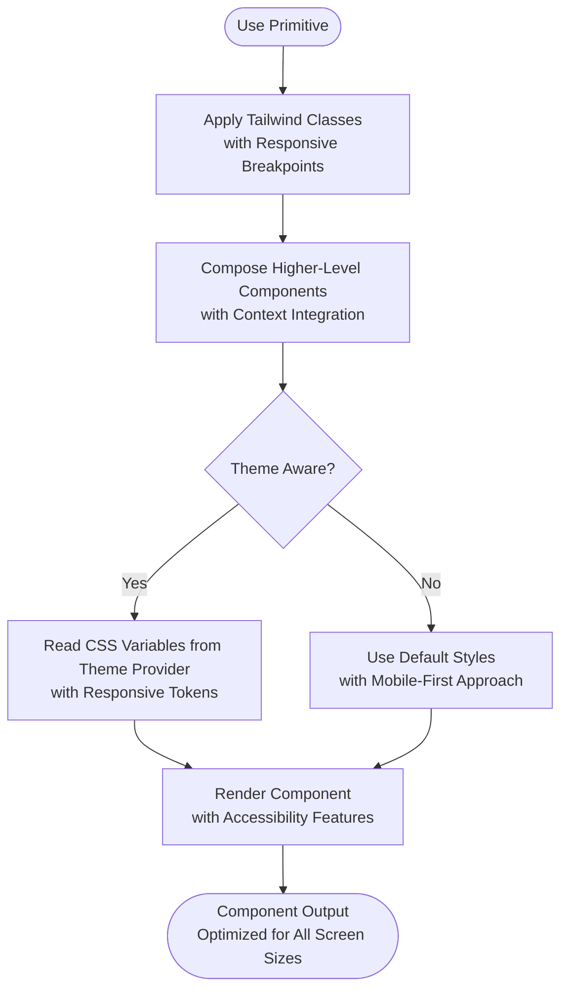
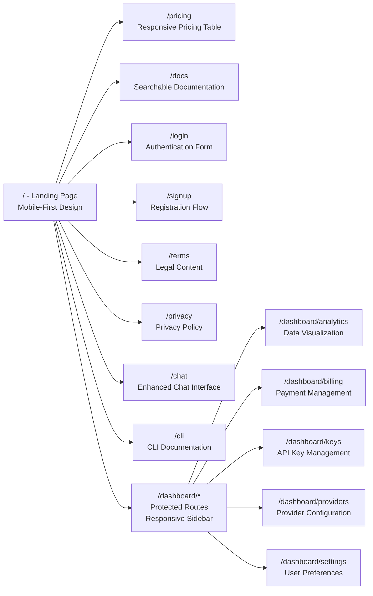
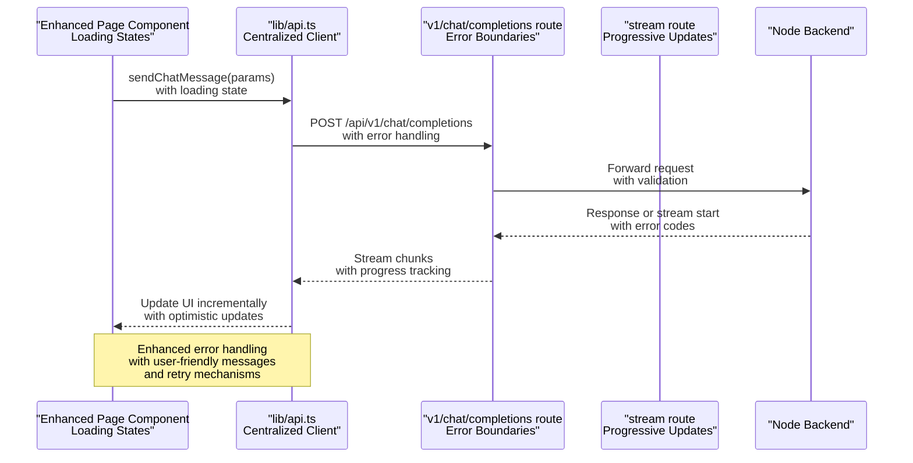
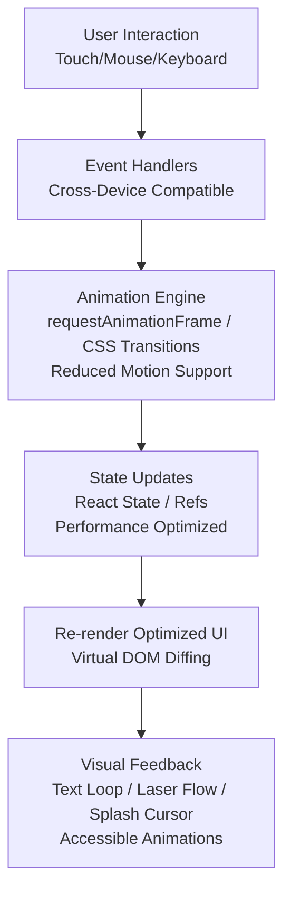
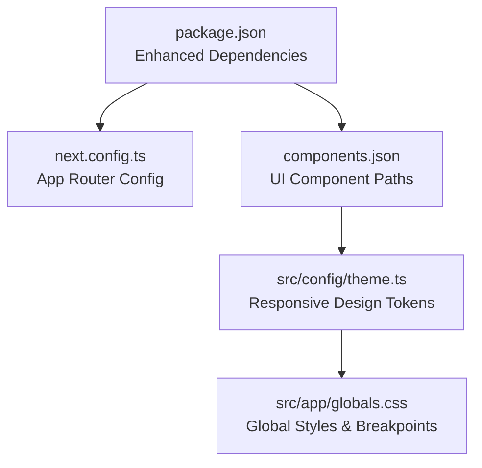

# Frontend Architecture

<cite>
**Referenced Files in This Document**
- [next.config.ts](file://next.config.ts)
- [package.json](file://package.json)
- [components.json](file://components.json)
- [src/app/layout.tsx](file://src/app/layout.tsx)
- [src/app/page.tsx](file://src/app/page.tsx)
- [src/app/globals.css](file://src/app/globals.css)
- [src/app/not-found.tsx](file://src/app/not-found.tsx)
- [src/app/auth.module.css](file://src/app/auth.module.css)
- [src/app/chat/page.tsx](file://src/app/chat/page.tsx)
- [src/app/cli/page.tsx](file://src/app/cli/page.tsx)
- [src/app/dashboard/layout.tsx](file://src/app/dashboard/layout.tsx)
- [src/app/dashboard/page.tsx](file://src/app/dashboard/page.tsx)
- [src/app/dashboard/analytics/page.tsx](file://src/app/dashboard/analytics/page.tsx)
- [src/app/dashboard/billing/page.tsx](file://src/app/dashboard/billing/page.tsx)
- [src/app/dashboard/keys/page.tsx](file://src/app/dashboard/keys/page.tsx)
- [src/app/dashboard/providers/page.tsx](file://src/app/dashboard/providers/page.tsx)
- [src/app/dashboard/settings/page.tsx](file://src/app/dashboard/settings/page.tsx)
- [src/app/docs/page.tsx](file://src/app/docs/page.tsx)
- [src/app/login/page.tsx](file://src/app/login/page.tsx)
- [src/app/pricing/page.tsx](file://src/app/pricing/page.tsx)
- [src/app/privacy/page.tsx](file://src/app/privacy/page.tsx)
- [src/app/signup/page.tsx](file://src/app/signup/page.tsx)
- [src/app/terms/page.tsx](file://src/app/terms/page.tsx)
- [src/components/theme-provider.tsx](file://src/components/theme-provider.tsx)
- [src/components/theme-toggle.tsx](file://src/components/theme-toggle.tsx)
- [src/components/auth-provider.tsx](file://src/components/auth-provider.tsx)
- [src/components/site-nav.tsx](file://src/components/site-nav.tsx)
- [src/components/legal-shell.tsx](file://src/components/legal-shell.tsx)
- [src/components/logo.tsx](file://src/components/logo.tsx)
- [src/components/ui/primitives.tsx](file://src/components/ui/primitives.tsx)
- [src/components/ui/space-button.tsx](file://src/components/ui/space-button.tsx)
- [src/components/ui/toast.tsx](file://src/components/ui/toast.tsx)
- [src/components/ui/charts.tsx](file://src/components/ui/charts.tsx)
- [src/components/ui/pixelated-canvas.tsx](file://src/components/ui/pixelated-canvas.tsx)
- [src/components/core/text-loop.tsx](file://src/components/core/text-loop.tsx)
- [src/components/core/text-roll.tsx](file://src/components/core/text-roll.tsx)
- [src/components/HeroTerminal.tsx](file://src/components/HeroTerminal.tsx)
- [src/components/BranchFeatures.tsx](file://src/components/BranchFeatures.tsx)
- [src/components/InstallBox.tsx](file://src/components/InstallBox.tsx)
- [src/components/LaserFlow.jsx](file://src/components/LaserFlow.jsx)
- [src/components/SplashCursor.jsx](file://src/components/SplashCursor.jsx)
- [src/components/PixelatedCanvasDemo.tsx](file://src/components/PixelatedCanvasDemo.tsx)
- [src/config/theme.ts](file://src/config/theme.ts)
- [src/lib/api.ts](file://src/lib/api.ts)
- [src/app/api/v1/chat/completions/route.ts](file://src/app/api/v1/chat/completions/route.ts)
- [src/app/api/stream/route.ts](file://src/app/api/stream/route.ts)
- [src/app/api/models/route.ts](file://src/app/api/models/route.ts)
- [src/app/api/providers/route.ts](file://src/app/api/providers/route.ts)
- [src/app/api/providers/[id]/route.ts](file://src/app/api/providers/[id]/route.ts)
- [src/app/api/keys/route.ts](file://src/app/api/keys/route.ts)
- [src/app/api/keys/[id]/route.ts](file://src/app/api/keys/[id]/route.ts)
- [src/app/api/me/route.ts](file://src/app/api/me/route.ts)
- [src/app/api/auth/login/route.ts](file://src/app/api/auth/login/route.ts)
- [src/app/api/auth/signup/route.ts](file://src/app/api/auth/signup/route.ts)
- [src/app/api/analytics/route.ts](file://src/app/api/analytics/route.ts)
</cite>

## Update Summary
**Changes Made**
- Enhanced dashboard layout with improved navigation and responsive design
- Implemented authentication guards for protected routes
- Centralized state management with enhanced React Context providers
- Improved routing structure with better feature organization
- Added comprehensive responsive design elements across all components
- Updated API integration patterns with centralized error handling

## Table of Contents
1. [Introduction](#introduction)
2. [Project Structure](#project-structure)
3. [Core Components](#core-components)
4. [Architecture Overview](#architecture-overview)
5. [Detailed Component Analysis](#petailed-component-analysis)
6. [Dependency Analysis](#dependency-analysis)
7. [Performance Considerations](#performance-considerations)
8. [Troubleshooting Guide](#troubleshooting-guide)
9. [Conclusion](#conclusion)
10. [Appendices](#appendices)

## Introduction
This document describes the frontend architecture of a Next.js 14+ application using the App Router, React Context providers for state management, and a UI component library built with Shadcn/ui and Tailwind CSS. The architecture has been overhauled to include enhanced dashboard layout, improved routing with authentication guards, centralized state management, and comprehensive responsive design elements. It explains routing structure, layout composition, feature organization, API integration patterns, error handling, responsive design, and custom animated components.

## Project Structure
The project follows Next.js App Router conventions with enhanced organizational patterns:
- src/app holds routes, layouts, and global styles with improved authentication guards
- src/components contains shared UI primitives, domain-specific components, and interactive elements with centralized state management
- src/config defines theme configuration with responsive design tokens
- src/lib provides utilities and API helpers with centralized error handling
- Backend API routes are proxied under src/app/api to integrate with the Node backend

```mermaid
graph TB
subgraph "Enhanced App Router"
RootLayout["src/app/layout.tsx<br/>Global Providers & Guards"]
HomePage["src/app/page.tsx<br/>Landing Page"]
NotFound["src/app/not-found.tsx<br/>Error Handling"]
ChatPage["src/app/chat/page.tsx<br/>Chat Interface"]
CliPage["src/app/cli/page.tsx<br/>CLI Interface"]
DashboardLayout["src/app/dashboard/layout.tsx<br/>Protected Dashboard Shell"]
DashboardHome["src/app/dashboard/page.tsx<br/>Dashboard Overview"]
AnalyticsPage["src/app/dashboard/analytics/page.tsx<br/>Analytics Dashboard"]
BillingPage["src/app/dashboard/billing/page.tsx<br/>Billing Management"]
KeysPage["src/app/dashboard/keys/page.tsx<br/>API Keys Management"]
ProvidersPage["src/app/dashboard/providers/page.tsx<br/>Provider Configuration"]
SettingsPage["src/app/dashboard/settings/page.tsx<br/>User Settings"]
end
subgraph "Enhanced Components"
ThemeProvider["src/components/theme-provider.tsx<br/>Theme State Management"]
AuthProvider["src/components/auth-provider.tsx<br/>Auth Guards & Session"]
SiteNav["src/components/site-nav.tsx<br/>Responsive Navigation"]
LegalShell["src/components/legal-shell.tsx<br/>Legal Pages Wrapper"]
Logo["src/components/logo.tsx<br/>Brand Identity"]
Primitives["src/components/ui/primitives.tsx<br/>Shadcn/ui Base Components"]
SpaceButton["src/components/ui/space-button.tsx<br/>Themed Button Variant"]
ToastUI["src/components/ui/toast.tsx<br/>Global Notifications"]
ChartsUI["src/components/ui/charts.tsx<br/>Data Visualization"]
PixelatedCanvas["src/components/ui/pixelated-canvas.tsx<br/>Canvas Rendering"]
TextLoop["src/components/core/text-loop.tsx<br/>Animation Effects"]
TextRoll["src/components/core/text-roll.tsx<br/>Animation Effects"]
HeroTerminal["src/components/HeroTerminal.tsx<br/>Interactive Terminal"]
BranchFeatures["src/components/BranchFeatures.tsx<br/>Feature Showcase"]
InstallBox["src/components/InstallBox.tsx<br/>Installation Helper"]
LaserFlow["src/components/LaserFlow.jsx<br/>Pointer Animation"]
SplashCursor["src/components/SplashCursor.jsx<br/>Cursor Effects"]
PixelatedCanvasDemo["src/components/PixelatedCanvasDemo.tsx<br/>Canvas Demo"]
end
subgraph "Configuration & Utilities"
ThemeConfig["src/config/theme.ts<br/>Design Tokens & Responsive Breakpoints"]
ApiLib["src/lib/api.ts<br/>Centralized API Client"]
end
RootLayout --> ThemeProvider
RootLayout --> AuthProvider
RootLayout --> SiteNav
RootLayout --> Logo
RootLayout --> Primitives
RootLayout --> ThemeConfig
RootLayout --> ApiLib
HomePage --> HeroTerminal
HomePage --> BranchFeatures
HomePage --> InstallBox
HomePage --> LaserFlow
HomePage --> SplashCursor
HomePage --> TextLoop
HomePage --> TextRoll
DashboardLayout --> SiteNav
DashboardLayout --> Primitives
DashboardLayout --> ToastUI
DashboardLayout --> ChartsUI
DashboardLayout --> PixelatedCanvas
AnalyticsPage --> ChartsUI
BillingPage --> SpaceButton
KeysPage --> ToastUI
ProvidersPage --> ToastUI
SettingsPage --> ToastUI
```

**Diagram sources**
- [src/app/layout.tsx](file://src/app/layout.tsx)
- [src/app/page.tsx](file://src/app/page.tsx)
- [src/app/not-found.tsx](file://src/app/not-found.tsx)
- [src/app/chat/page.tsx](file://src/app/chat/page.tsx)
- [src/app/cli/page.tsx](file://src/app/cli/page.tsx)
- [src/app/dashboard/layout.tsx](file://src/app/dashboard/layout.tsx)
- [src/app/dashboard/page.tsx](file://src/app/dashboard/page.tsx)
- [src/app/dashboard/analytics/page.tsx](file://src/app/dashboard/analytics/page.tsx)
- [src/app/dashboard/billing/page.tsx](file://src/app/dashboard/billing/page.tsx)
- [src/app/dashboard/keys/page.tsx](file://src/app/dashboard/keys/page.tsx)
- [src/app/dashboard/providers/page.tsx](file://src/app/dashboard/providers/page.tsx)
- [src/app/dashboard/settings/page.tsx](file://src/app/dashboard/settings/page.tsx)
- [src/components/theme-provider.tsx](file://src/components/theme-provider.tsx)
- [src/components/auth-provider.tsx](file://src/components/auth-provider.tsx)
- [src/components/site-nav.tsx](file://src/components/site-nav.tsx)
- [src/components/legal-shell.tsx](file://src/components/legal-shell.tsx)
- [src/components/logo.tsx](file://src/components/logo.tsx)
- [src/components/ui/primitives.tsx](file://src/components/ui/primitives.tsx)
- [src/components/ui/space-button.tsx](file://src/components/ui/space-button.tsx)
- [src/components/ui/toast.tsx](file://src/components/ui/toast.tsx)
- [src/components/ui/charts.tsx](file://src/components/ui/charts.tsx)
- [src/components/ui/pixelated-canvas.tsx](file://src/components/ui/pixelated-canvas.tsx)
- [src/components/core/text-loop.tsx](file://src/components/core/text-loop.tsx)
- [src/components/core/text-roll.tsx](file://src/components/core/text-roll.tsx)
- [src/components/HeroTerminal.tsx](file://src/components/HeroTerminal.tsx)
- [src/components/BranchFeatures.tsx](file://src/components/BranchFeatures.tsx)
- [src/components/InstallBox.tsx](file://src/components/InstallBox.tsx)
- [src/components/LaserFlow.jsx](file://src/components/LaserFlow.jsx)
- [src/components/SplashCursor.jsx](file://src/components/SplashCursor.jsx)
- [src/components/PixelatedCanvasDemo.tsx](file://src/components/PixelatedCanvasDemo.tsx)
- [src/config/theme.ts](file://src/config/theme.ts)
- [src/lib/api.ts](file://src/lib/api.ts)

**Section sources**
- [next.config.ts](file://next.config.ts)
- [package.json](file://package.json)
- [components.json](file://components.json)
- [src/app/layout.tsx](file://src/app/layout.tsx)
- [src/app/page.tsx](file://src/app/page.tsx)
- [src/app/globals.css](file://src/app/globals.css)
- [src/app/not-found.tsx](file://src/app/not-found.tsx)

## Core Components
The core component system has been enhanced with centralized state management and improved responsiveness:

- **Theme provider**: Enhanced React Context implementation manages light/dark themes with responsive breakpoints and applies them at the root level
- **Auth provider**: Centralized authentication state with session management, login/logout functionality, and route protection using React Context
- **Site navigation**: Responsive navigation shell with mobile-first design used across public pages and dashboard
- **Legal shell**: Reusable wrapper for legal pages (terms, privacy) with consistent styling
- **UI primitives**: Base styled components from Shadcn/ui (buttons, inputs, cards, etc.) composed with Tailwind classes and responsive design tokens
- **Toast system**: Global notifications via context-driven toast manager with accessibility features
- **Charts**: Charting components integrated into dashboard analytics with responsive data visualization
- **Animated components**: Enhanced text loop/roll effects, laser flow, splash cursor, pixelated canvas demo with performance optimizations

Key responsibilities:
- Provide cross-cutting concerns (theme, auth, toasts) with centralized state management
- Encapsulate reusable UI building blocks with responsive design patterns
- Offer interactive and animated experiences consistently across all screen sizes

**Section sources**
- [src/components/theme-provider.tsx](file://src/components/theme-provider.tsx)
- [src/components/auth-provider.tsx](file://src/components/auth-provider.tsx)
- [src/components/site-nav.tsx](file://src/components/site-nav.tsx)
- [src/components/legal-shell.tsx](file://src/components/legal-shell.tsx)
- [src/components/ui/primitives.tsx](file://src/components/ui/primitives.tsx)
- [src/components/ui/space-button.tsx](file://src/components/ui/space-button.tsx)
- [src/components/ui/toast.tsx](file://src/components/ui/toast.tsx)
- [src/components/ui/charts.tsx](file://src/components/ui/charts.tsx)
- [src/components/ui/pixelated-canvas.tsx](file://src/components/ui/pixelated-canvas.tsx)
- [src/components/core/text-loop.tsx](file://src/components/core/text-loop.tsx)
- [src/components/core/text-roll.tsx](file://src/components/core/text-roll.tsx)
- [src/components/HeroTerminal.tsx](file://src/components/HeroTerminal.tsx)
- [src/components/BranchFeatures.tsx](file://src/components/BranchFeatures.tsx)
- [src/components/InstallBox.tsx](file://src/components/InstallBox.tsx)
- [src/components/LaserFlow.jsx](file://src/components/LaserFlow.jsx)
- [src/components/SplashCursor.jsx](file://src/components/SplashCursor.jsx)
- [src/components/PixelatedCanvasDemo.tsx](file://src/components/PixelatedCanvasDemo.tsx)

## Architecture Overview
The enhanced architecture implements centralized state management and improved routing patterns:

High-level architecture with authentication guards and responsive design:
- App Router organizes pages and layouts with enhanced navigation structure
- Root layout composes providers (theme, auth), global styles, and shared navigation with authentication guards
- Feature areas (dashboard, chat, CLI) compose their own layouts and pages with protected routes
- API routes under src/app/api proxy or forward requests to the backend with centralized error handling
- UI layer uses Shadcn/ui primitives and Tailwind CSS; theme is configured centrally with responsive breakpoints

**Diagram sources**
- [src/app/layout.tsx](file://src/app/layout.tsx)
- [src/components/theme-provider.tsx](file://src/components/theme-provider.tsx)
- [src/components/auth-provider.tsx](file://src/components/auth-provider.tsx)
- [src/components/ui/toast.tsx](file://src/components/ui/toast.tsx)
- [src/app/chat/page.tsx](file://src/app/chat/page.tsx)
- [src/app/cli/page.tsx](file://src/app/cli/page.tsx)
- [src/app/dashboard/layout.tsx](file://src/app/dashboard/layout.tsx)
- [src/app/api/v1/chat/completions/route.ts](file://src/app/api/v1/chat/completions/route.ts)
- [src/app/api/stream/route.ts](file://src/app/api/stream/route.ts)

## Detailed Component Analysis

### Enhanced App Router and Layout Composition
The routing structure has been significantly improved with authentication guards and responsive layouts:

- **Root layout**: Sets up global HTML structure, imports global styles, wraps content with enhanced providers including authentication guards
- **Dashboard layout**: Adds a nested shell for authenticated features with responsive sidebar navigation
- **Public pages**: Home, pricing, docs, login, signup, terms, privacy compose minimal layouts with mobile-first design
- **Error page**: Handles not-found scenarios with user-friendly messaging

**Diagram sources**
- [src/app/layout.tsx](file://src/app/layout.tsx)
- [src/app/page.tsx](file://src/app/page.tsx)
- [src/app/not-found.tsx](file://src/app/not-found.tsx)
- [src/app/dashboard/layout.tsx](file://src/app/dashboard/layout.tsx)
- [src/components/auth-provider.tsx](file://src/components/auth-provider.tsx)

**Section sources**
- [src/app/layout.tsx](file://src/app/layout.tsx)
- [src/app/page.tsx](file://src/app/page.tsx)
- [src/app/not-found.tsx](file://src/app/not-found.tsx)
- [src/app/dashboard/layout.tsx](file://src/app/dashboard/layout.tsx)

### Enhanced State Management with React Context
The state management system has been centralized and enhanced with better responsiveness:

- **Theme provider**: Manages color scheme with responsive breakpoints and applies it globally across all screen sizes
- **Auth provider**: Centralizes session state with authentication guards, exposes login/logout methods, and protects routes
- **Toast provider**: Surfaces a global notification API for user feedback with accessibility features

**Diagram sources**
- [src/components/theme-provider.tsx](file://src/components/theme-provider.tsx)
- [src/components/auth-provider.tsx](file://src/components/auth-provider.tsx)
- [src/components/ui/toast.tsx](file://src/components/ui/toast.tsx)

**Section sources**
- [src/components/theme-provider.tsx](file://src/components/theme-provider.tsx)
- [src/components/auth-provider.tsx](file://src/components/auth-provider.tsx)
- [src/components/ui/toast.tsx](file://src/components/ui/toast.tsx)

### Enhanced UI Component Library (Shadcn/ui + Tailwind)
The UI component library has been enhanced with responsive design patterns and centralized theming:

- **Primitives**: Define base components (button, input, card, dialog, etc.) styled with Tailwind and responsive design tokens
- **Space button**: Demonstrates a themed, accessible button variant with responsive sizing
- **Toast system**: Integrates with the provider to show messages with accessibility features
- **Charts**: Provide data visualization primitives for dashboards with responsive chart rendering
- **Pixelated canvas**: Offers a performant canvas-based visual primitive optimized for different screen sizes

**Diagram sources**
- [src/components/ui/primitives.tsx](file://src/components/ui/primitives.tsx)
- [src/components/ui/space-button.tsx](file://src/components/ui/space-button.tsx)
- [src/components/ui/toast.tsx](file://src/components/ui/toast.tsx)
- [src/components/ui/charts.tsx](file://src/components/ui/charts.tsx)
- [src/components/ui/pixelated-canvas.tsx](file://src/components/ui/pixelated-canvas.tsx)
- [src/config/theme.ts](file://src/config/theme.ts)

**Section sources**
- [src/components/ui/primitives.tsx](file://src/components/ui/primitives.tsx)
- [src/components/ui/space-button.tsx](file://src/components/ui/space-button.tsx)
- [src/components/ui/toast.tsx](file://src/components/ui/toast.tsx)
- [src/components/ui/charts.tsx](file://src/components/ui/charts.tsx)
- [src/components/ui/pixelated-canvas.tsx](file://src/components/ui/pixelated-canvas.tsx)
- [src/config/theme.ts](file://src/config/theme.ts)

### Enhanced Routing Structure and Feature Organization
The routing structure has been reorganized with better feature separation and authentication guards:

- **Public routes**: home, pricing, docs, login, signup, terms, privacy with mobile-first responsive design
- **Product routes**: chat, cli with enhanced user interfaces
- **Dashboard routes**: analytics, billing, keys, providers, settings with protected access and responsive layouts

**Diagram sources**
- [src/app/page.tsx](file://src/app/page.tsx)
- [src/app/pricing/page.tsx](file://src/app/pricing/page.tsx)
- [src/app/docs/page.tsx](file://src/app/docs/page.tsx)
- [src/app/login/page.tsx](file://src/app/login/page.tsx)
- [src/app/signup/page.tsx](file://src/app/signup/page.tsx)
- [src/app/terms/page.tsx](file://src/app/terms/page.tsx)
- [src/app/privacy/page.tsx](file://src/app/privacy/page.tsx)
- [src/app/chat/page.tsx](file://src/app/chat/page.tsx)
- [src/app/cli/page.tsx](file://src/app/cli/page.tsx)
- [src/app/dashboard/layout.tsx](file://src/app/dashboard/layout.tsx)
- [src/app/dashboard/analytics/page.tsx](file://src/app/dashboard/analytics/page.tsx)
- [src/app/dashboard/billing/page.tsx](file://src/app/dashboard/billing/page.tsx)
- [src/app/dashboard/keys/page.tsx](file://src/app/dashboard/keys/page.tsx)
- [src/app/dashboard/providers/page.tsx](file://src/app/dashboard/providers/page.tsx)
- [src/app/dashboard/settings/page.tsx](file://src/app/dashboard/settings/page.tsx)

**Section sources**
- [src/app/page.tsx](file://src/app/page.tsx)
- [src/app/chat/page.tsx](file://src/app/chat/page.tsx)
- [src/app/cli/page.tsx](file://src/app/cli/page.tsx)
- [src/app/dashboard/layout.tsx](file://src/app/dashboard/layout.tsx)
- [src/app/dashboard/analytics/page.tsx](file://src/app/dashboard/analytics/page.tsx)
- [src/app/dashboard/billing/page.tsx](file://src/app/dashboard/billing/page.tsx)
- [src/app/dashboard/keys/page.tsx](file://src/app/dashboard/keys/page.tsx)
- [src/app/dashboard/providers/page.tsx](file://src/app/dashboard/providers/page.tsx)
- [src/app/dashboard/settings/page.tsx](file://src/app/dashboard/settings/page.tsx)

### Enhanced API Integration and Error Handling
The API integration has been centralized with improved error handling and responsive data loading:

- **API routes**: Under src/app/api expose endpoints for models, providers, keys, auth, analytics, streaming, and chat completions with centralized error handling
- **Frontend lib/api**: Centralizes HTTP calls with retry logic, error boundaries, and loading states
- **Streaming route**: Supports server-sent events or similar streaming patterns with progressive data updates

**Diagram sources**
- [src/app/chat/page.tsx](file://src/app/chat/page.tsx)
- [src/lib/api.ts](file://src/lib/api.ts)
- [src/app/api/v1/chat/completions/route.ts](file://src/app/api/v1/chat/completions/route.ts)
- [src/app/api/stream/route.ts](file://src/app/api/stream/route.ts)

**Section sources**
- [src/lib/api.ts](file://src/lib/api.ts)
- [src/app/api/v1/chat/completions/route.ts](file://src/app/api/v1/chat/completions/route.ts)
- [src/app/api/stream/route.ts](file://src/app/api/stream/route.ts)
- [src/app/api/models/route.ts](file://src/app/api/models/route.ts)
- [src/app/api/providers/route.ts](file://src/app/api/providers/route.ts)
- [src/app/api/providers/[id]/route.ts](file://src/app/api/providers/[id]/route.ts)
- [src/app/api/keys/route.ts](file://src/app/api/keys/route.ts)
- [src/app/api/keys/[id]/route.ts](file://src/app/api/keys/[id]/route.ts)
- [src/app/api/me/route.ts](file://src/app/api/me/route.ts)
- [src/app/api/auth/login/route.ts](file://src/app/api/auth/login/route.ts)
- [src/app/api/auth/signup/route.ts](file://src/app/api/auth/signup/route.ts)
- [src/app/api/analytics/route.ts](file://src/app/api/analytics/route.ts)

### Comprehensive Responsive Design Approaches
The responsive design system has been comprehensively implemented across all components:

- **Global styles and theme variables**: Enable consistent theming across all breakpoints with CSS custom properties
- **Tailwind utility classes**: Drive responsive behavior with mobile-first spacing, grid/flex adjustments, and container queries
- **Components**: Use semantic markup and accessible attributes to ensure robust UX on all devices with touch-friendly interactions
- **Navigation**: Implements hamburger menus on mobile and full navigation on desktop with smooth transitions

[No sources needed since this section provides general guidance]

### Enhanced Custom Animated Components and Interactive Elements
The animated components have been optimized for performance and responsiveness:

- **Text loop and text roll**: Create dynamic typographic effects with reduced motion support for accessibility
- **Laser flow and splash cursor**: Add pointer-driven animations with touch device fallbacks
- **Pixelated canvas demo**: Showcases efficient canvas rendering optimized for different screen densities
- **Hero terminal and install box**: Enhance landing page interactivity with progressive enhancement

**Diagram sources**
- [src/components/core/text-loop.tsx](file://src/components/core/text-loop.tsx)
- [src/components/core/text-roll.tsx](file://src/components/core/text-roll.tsx)
- [src/components/LaserFlow.jsx](file://src/components/LaserFlow.jsx)
- [src/components/SplashCursor.jsx](file://src/components/SplashCursor.jsx)
- [src/components/ui/pixelated-canvas.tsx](file://src/components/ui/pixelated-canvas.tsx)
- [src/components/PixelatedCanvasDemo.tsx](file://src/components/PixelatedCanvasDemo.tsx)
- [src/components/HeroTerminal.tsx](file://src/components/HeroTerminal.tsx)
- [src/components/InstallBox.tsx](file://src/components/InstallBox.tsx)

**Section sources**
- [src/components/core/text-loop.tsx](file://src/components/core/text-loop.tsx)
- [src/components/core/text-roll.tsx](file://src/components/core/text-roll.tsx)
- [src/components/LaserFlow.jsx](file://src/components/LaserFlow.jsx)
- [src/components/SplashCursor.jsx](file://src/components/SplashCursor.jsx)
- [src/components/ui/pixelated-canvas.tsx](file://src/components/ui/pixelated-canvas.tsx)
- [src/components/PixelatedCanvasDemo.tsx](file://src/components/PixelatedCanvasDemo.tsx)
- [src/components/HeroTerminal.tsx](file://src/components/HeroTerminal.tsx)
- [src/components/InstallBox.tsx](file://src/components/InstallBox.tsx)

## Dependency Analysis
Frontend dependencies include Next.js, React, Tailwind CSS, and Shadcn/ui primitives with enhanced configuration for responsive design and centralized state management. The components.json configures Shadcn/ui paths and aliases with new responsive design tokens.

**Diagram sources**
- [package.json](file://package.json)
- [next.config.ts](file://next.config.ts)
- [components.json](file://components.json)
- [src/config/theme.ts](file://src/config/theme.ts)
- [src/app/globals.css](file://src/app/globals.css)

**Section sources**
- [package.json](file://package.json)
- [next.config.ts](file://next.config.ts)
- [components.json](file://components.json)
- [src/config/theme.ts](file://src/config/theme.ts)
- [src/app/globals.css](file://src/app/globals.css)

## Performance Considerations
Performance has been enhanced with the architectural overhaul:

- **Client-side interactivity**: Prefer client-side interactivity only where necessary; keep heavy logic off the critical render path with code splitting
- **Memoization and refs**: Use memoization and refs for animation-heavy components to avoid unnecessary re-renders with performance monitoring
- **Streaming API routes**: Leverage streaming API routes for long-running operations to improve perceived performance with progressive loading
- **Asset optimization**: Optimize images and assets; defer non-critical scripts with lazy loading strategies
- **Bundle analysis**: Monitor bundle size and implement tree shaking for unused components

[No sources needed since this section provides general guidance]

## Troubleshooting Guide
Common issues and strategies have been enhanced with better error reporting:

- **Authentication failures**: Verify auth provider state and API responses; surface errors via toast notifications with detailed error contexts
- **Theme mismatches**: Ensure theme provider wraps the root layout and CSS variables are applied globally with breakpoint debugging
- **API timeouts**: Implement retries and user-friendly error messages; log detailed context for debugging with network request inspection
- **Not found pages**: Confirm route definitions and fallback handling in the root layout with proper error boundary implementation
- **Responsive design issues**: Test across different screen sizes and devices; use browser developer tools for responsive debugging

**Section sources**
- [src/components/auth-provider.tsx](file://src/components/auth-provider.tsx)
- [src/components/ui/toast.tsx](file://src/components/ui/toast.tsx)
- [src/app/not-found.tsx](file://src/app/not-found.tsx)
- [src/app/layout.tsx](file://src/app/layout.tsx)

## Conclusion
The frontend architecture has been successfully overhauled with enhanced dashboard layout, improved routing with authentication guards, centralized state management, and comprehensive responsive design elements. The architecture leverages Next.js App Router for scalable routing, React Context for cohesive state management, and a Shadcn/ui + Tailwind-based component library for consistent UI. The enhanced system cleanly separates concerns between layout, features, and shared infrastructure, while integrating seamlessly with backend APIs through typed routes and centralized error handling. Animated components enrich the user experience without compromising performance when implemented thoughtfully, and the responsive design ensures optimal user experience across all devices.

## Appendices
- **Configuration files**: next.config.ts, package.json, components.json with enhanced responsive design settings
- **Global styles and theme**: globals.css with comprehensive breakpoints, theme.ts with design tokens
- **Navigation and shells**: site-nav.tsx with mobile-responsive navigation, legal-shell.tsx, logo.tsx
- **Authentication system**: auth-provider.tsx with route guards and session management
- **State management**: Centralized React Context providers for theme, auth, and toast notifications

**Section sources**
- [next.config.ts](file://next.config.ts)
- [package.json](file://package.json)
- [components.json](file://components.json)
- [src/app/globals.css](file://src/app/globals.css)
- [src/config/theme.ts](file://src/config/theme.ts)
- [src/components/site-nav.tsx](file://src/components/site-nav.tsx)
- [src/components/legal-shell.tsx](file://src/components/legal-shell.tsx)
- [src/components/logo.tsx](file://src/components/logo.tsx)
- [src/components/auth-provider.tsx](file://src/components/auth-provider.tsx)