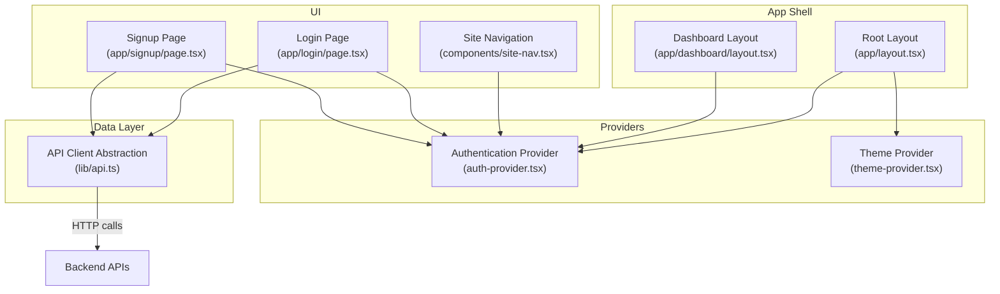
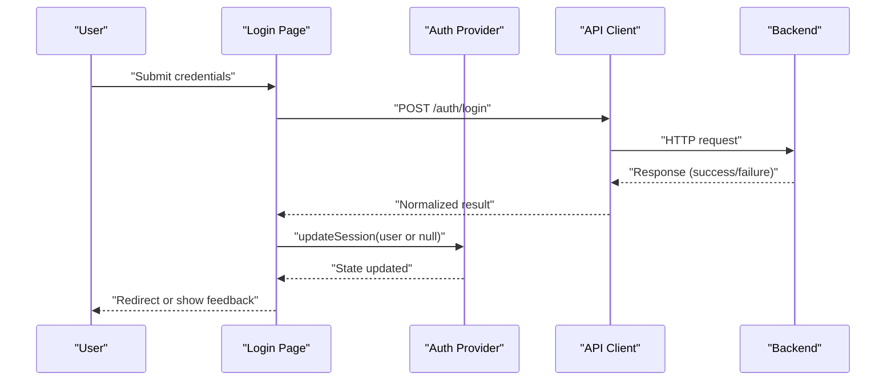
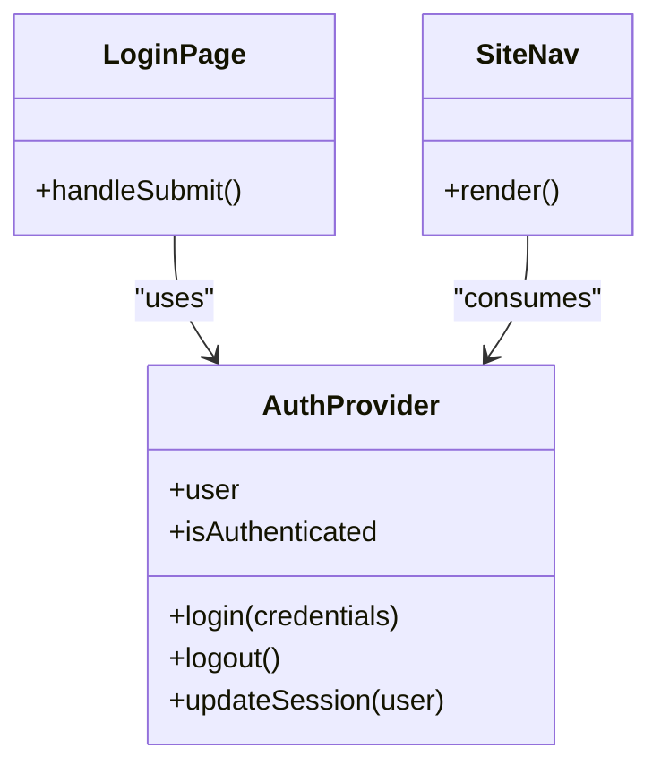
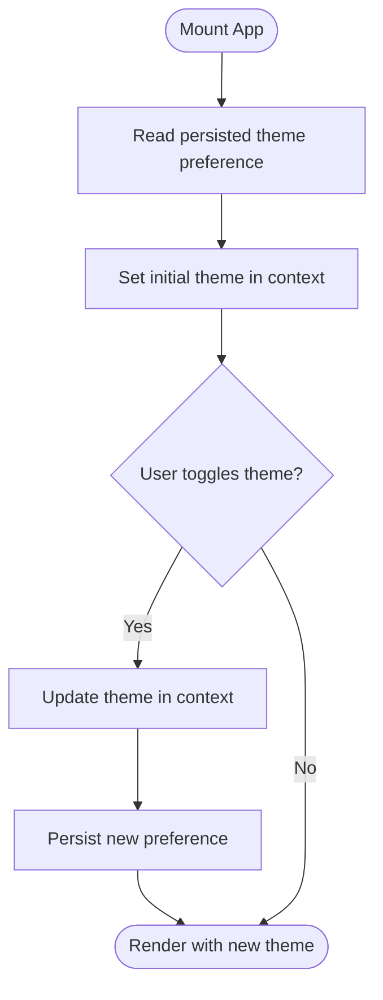
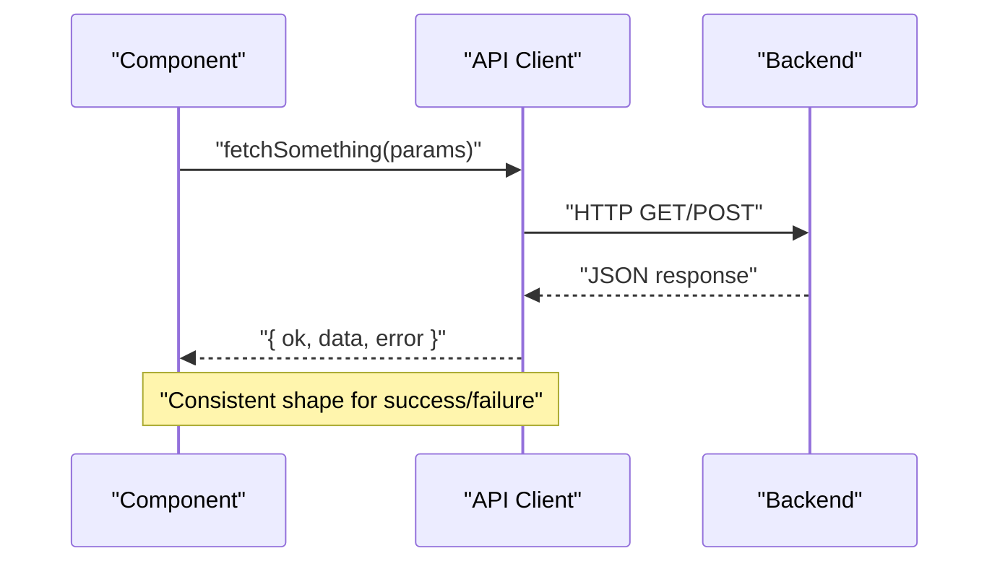
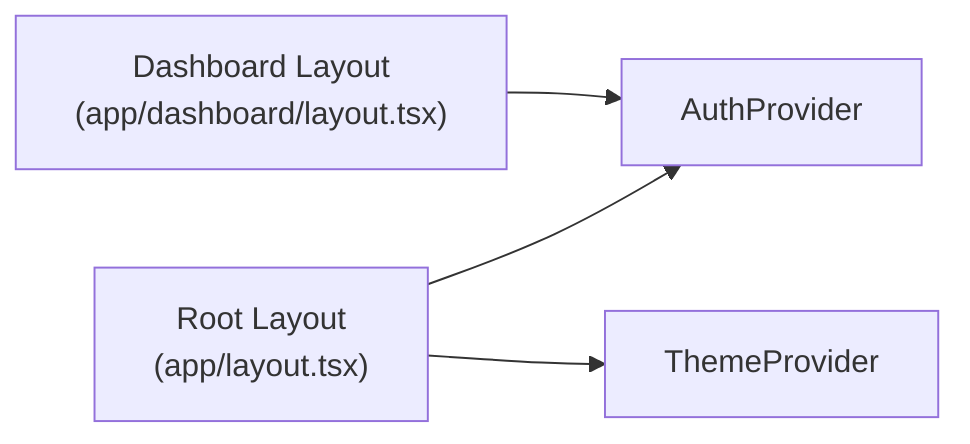
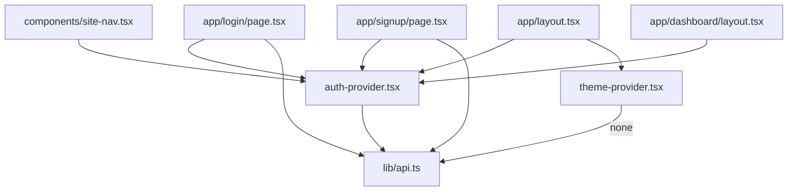

# State Management

<cite>
**Referenced Files in This Document**
- [auth-provider.tsx](file://src/components/auth-provider.tsx)
- [theme-provider.tsx](file://src/components/theme-provider.tsx)
- [api.ts](file://src/lib/api.ts)
- [layout.tsx](file://src/app/layout.tsx)
- [login/page.tsx](file://src/app/login/page.tsx)
- [signup/page.tsx](file://src/app/signup/page.tsx)
- [dashboard/layout.tsx](file://src/app/dashboard/layout.tsx)
- [site-nav.tsx](file://src/components/site-nav.tsx)
</cite>

## Table of Contents
1. [Introduction](#introduction)
2. [Project Structure](#project-structure)
3. [Core Components](#core-components)
4. [Architecture Overview](#architecture-overview)
5. [Detailed Component Analysis](#detailed-component-analysis)
6. [Dependency Analysis](#dependency-analysis)
7. [Performance Considerations](#performance-considerations)
8. [Troubleshooting Guide](#troubleshooting-guide)
9. [Conclusion](#conclusion)

## Introduction
This document explains the React Context-based state management system used in the application, focusing on:
- Authentication context provider and its usage across protected routes and UI
- Theme context implementation for global theme state
- API client abstraction for data fetching and error handling
- Patterns for creating custom providers and managing complex state scenarios
- Performance considerations and best practices for state updates

The goal is to provide a clear mental model of how global state flows through the app, how data is fetched, and how errors are handled consistently.

## Project Structure
At a high level, the state management layer consists of:
- Providers that expose global state via React Context
- A centralized API client for HTTP requests
- Pages and components consuming contexts and invoking API methods

**Diagram sources**
- [auth-provider.tsx](file://src/components/auth-provider.tsx)
- [theme-provider.tsx](file://src/components/theme-provider.tsx)
- [api.ts](file://src/lib/api.ts)
- [layout.tsx](file://src/app/layout.tsx)
- [dashboard/layout.tsx](file://src/app/dashboard/layout.tsx)
- [site-nav.tsx](file://src/components/site-nav.tsx)
- [login/page.tsx](file://src/app/login/page.tsx)
- [signup/page.tsx](file://src/app/signup/page.tsx)

**Section sources**
- [layout.tsx](file://src/app/layout.tsx)
- [auth-provider.tsx](file://src/components/auth-provider.tsx)
- [theme-provider.tsx](file://src/components/theme-provider.tsx)
- [api.ts](file://src/lib/api.ts)

## Core Components
- Authentication Provider: Manages user session state, login/logout actions, and exposes auth status to consumers. It typically wraps the application shell to make auth available globally.
- Theme Provider: Holds current theme (e.g., light/dark), toggles theme, and persists preference where applicable.
- API Client Abstraction: Centralizes HTTP calls, request/response transformations, and consistent error handling.

These components together form the foundation for global state and data access patterns.

**Section sources**
- [auth-provider.tsx](file://src/components/auth-provider.tsx)
- [theme-provider.tsx](file://src/components/theme-provider.tsx)
- [api.ts](file://src/lib/api.ts)

## Architecture Overview
The application composes providers at the root layout to establish global state. Protected areas (like dashboard) rely on authentication context to guard access. UI elements like navigation consume auth state to render appropriate controls. Data fetching is funneled through the API client, which standardizes error handling and response shapes.

**Diagram sources**
- [login/page.tsx](file://src/app/login/page.tsx)
- [auth-provider.tsx](file://src/components/auth-provider.tsx)
- [api.ts](file://src/lib/api.ts)

## Detailed Component Analysis

### Authentication Context Provider
Responsibilities:
- Maintain user session state and derived flags (e.g., isAuthenticated)
- Provide login/logout/update functions
- Integrate with API client for authentication endpoints
- Optionally persist session to storage and hydrate on mount

Typical usage:
- Wrap the app shell so all pages can access auth state
- Guard protected routes by checking auth state
- Update UI based on authentication status (e.g., nav links)

**Diagram sources**
- [auth-provider.tsx](file://src/components/auth-provider.tsx)
- [login/page.tsx](file://src/app/login/page.tsx)
- [site-nav.tsx](file://src/components/site-nav.tsx)

Best practices:
- Keep minimal state in context; derive values when possible
- Normalize API responses before storing them
- Handle network and server errors uniformly via the API client
- Avoid unnecessary re-renders by memoizing context value or splitting contexts

**Section sources**
- [auth-provider.tsx](file://src/components/auth-provider.tsx)
- [login/page.tsx](file://src/app/login/page.tsx)
- [site-nav.tsx](file://src/components/site-nav.tsx)

### Theme Context Implementation
Responsibilities:
- Store current theme value
- Provide toggle function
- Persist theme preference if needed
- Apply theme classes or CSS variables at the root

Usage pattern:
- Wrap the app shell alongside other providers
- Consume in components that need theme-aware styling

**Diagram sources**
- [theme-provider.tsx](file://src/components/theme-provider.tsx)

Best practices:
- Separate theme logic from UI rendering to keep components pure
- Use CSS variables or a theme object for consistent styling
- Debounce or throttle persistence writes if frequently toggling

**Section sources**
- [theme-provider.tsx](file://src/components/theme-provider.tsx)

### API Client Abstraction
Responsibilities:
- Centralize base URL, headers, and common configuration
- Normalize request/response formats
- Implement consistent error handling (network vs. server errors)
- Expose typed methods for domain operations (e.g., auth, models, keys)

Patterns:
- Return structured results with success flag and payload/error
- Surface user-friendly messages while preserving technical details for logs
- Support retries or timeouts where appropriate

**Diagram sources**
- [api.ts](file://src/lib/api.ts)

Best practices:
- Keep API client free of UI concerns
- Centralize error mapping and logging
- Cache read-only data when beneficial (e.g., providers list)
- Use abort controllers for cancellable requests

**Section sources**
- [api.ts](file://src/lib/api.ts)

### Global State Composition and Entry Points
Composition:
- The root layout composes providers to establish global state
- Protected layouts (e.g., dashboard) may enforce authentication checks

**Diagram sources**
- [layout.tsx](file://src/app/layout.tsx)
- [dashboard/layout.tsx](file://src/app/dashboard/layout.tsx)
- [auth-provider.tsx](file://src/components/auth-provider.tsx)
- [theme-provider.tsx](file://src/components/theme-provider.tsx)

**Section sources**
- [layout.tsx](file://src/app/layout.tsx)
- [dashboard/layout.tsx](file://src/app/dashboard/layout.tsx)

### Creating Custom Providers and Managing Complex State
Guidelines:
- Split large contexts into focused ones (e.g., auth, theme, feature flags)
- Derive computed values outside the context value to avoid unnecessary re-renders
- Use stable references for functions and objects passed via context
- For complex state, consider colocating related state in a single provider and exposing only necessary actions

Example scenario:
- A settings provider that manages multiple independent toggles and persisted preferences
- An analytics provider that batches events and flushes periodically

[No sources needed since this section provides general guidance]

## Dependency Analysis
High-level dependencies among state-related modules:

**Diagram sources**
- [auth-provider.tsx](file://src/components/auth-provider.tsx)
- [theme-provider.tsx](file://src/components/theme-provider.tsx)
- [api.ts](file://src/lib/api.ts)
- [login/page.tsx](file://src/app/login/page.tsx)
- [signup/page.tsx](file://src/app/signup/page.tsx)
- [site-nav.tsx](file://src/components/site-nav.tsx)
- [layout.tsx](file://src/app/layout.tsx)
- [dashboard/layout.tsx](file://src/app/dashboard/layout.tsx)

**Section sources**
- [auth-provider.tsx](file://src/components/auth-provider.tsx)
- [theme-provider.tsx](file://src/components/theme-provider.tsx)
- [api.ts](file://src/lib/api.ts)
- [login/page.tsx](file://src/app/login/page.tsx)
- [signup/page.tsx](file://src/app/signup/page.tsx)
- [site-nav.tsx](file://src/components/site-nav.tsx)
- [layout.tsx](file://src/app/layout.tsx)
- [dashboard/layout.tsx](file://src/app/dashboard/layout.tsx)

## Performance Considerations
- Minimize context value size: pass only what consumers need
- Memoize derived values and callbacks to prevent unnecessary re-renders
- Split contexts to limit update scope (e.g., separate auth and theme)
- Prefer local component state for ephemeral UI state
- Batch state updates where possible
- Avoid heavy computations inside render paths; use memoization or lazy initialization
- Defer non-critical work (e.g., analytics) to background tasks

[No sources needed since this section provides general guidance]

## Troubleshooting Guide
Common issues and strategies:
- Authentication not persisting: verify hydration on mount and storage reads/writes
- Infinite re-renders: check for unstable context values or circular dependencies
- API errors not surfaced: ensure the API client normalizes errors and components handle both network and server failures
- Theme not applying: confirm root-level provider composition and CSS variable/class application
- Protected route bypass: validate guards in layout or page-level checks

Action checklist:
- Inspect context value stability and consumer subscriptions
- Log API request/response shapes without sensitive data
- Add explicit loading and error states around data fetches
- Ensure providers wrap the correct parts of the tree

**Section sources**
- [auth-provider.tsx](file://src/components/auth-provider.tsx)
- [api.ts](file://src/lib/api.ts)
- [layout.tsx](file://src/app/layout.tsx)
- [dashboard/layout.tsx](file://src/app/dashboard/layout.tsx)

## Conclusion
The application’s state management relies on focused React Context providers for authentication and theme, combined with a centralized API client for consistent data fetching and error handling. By composing providers at the root, guarding protected routes, and normalizing API interactions, the codebase achieves predictable global state behavior. Following the performance and best practice recommendations will help maintain scalability and responsiveness as the application grows.