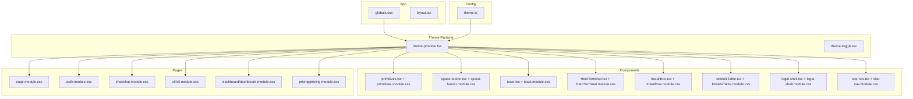
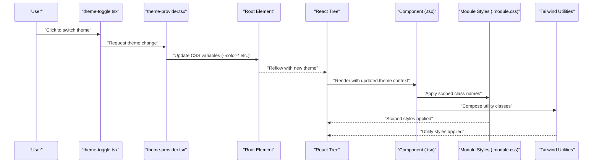
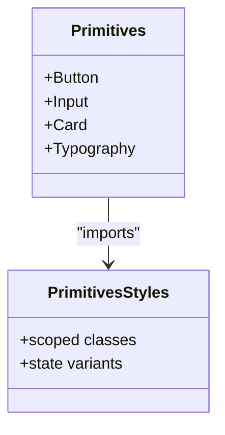
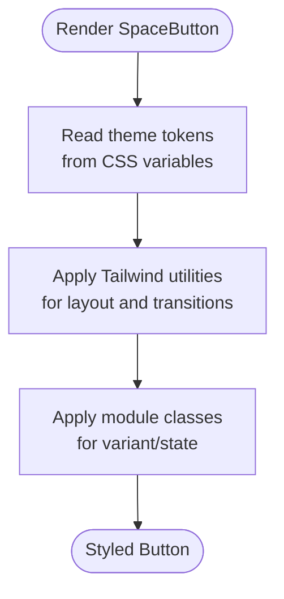
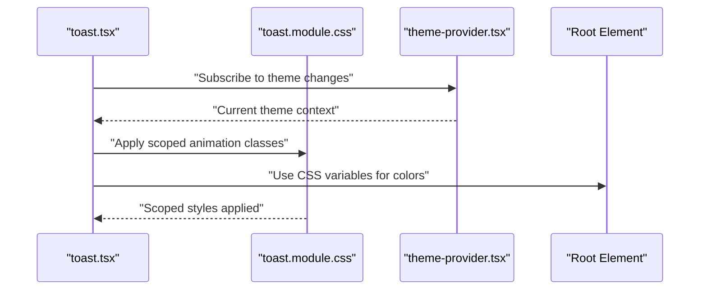
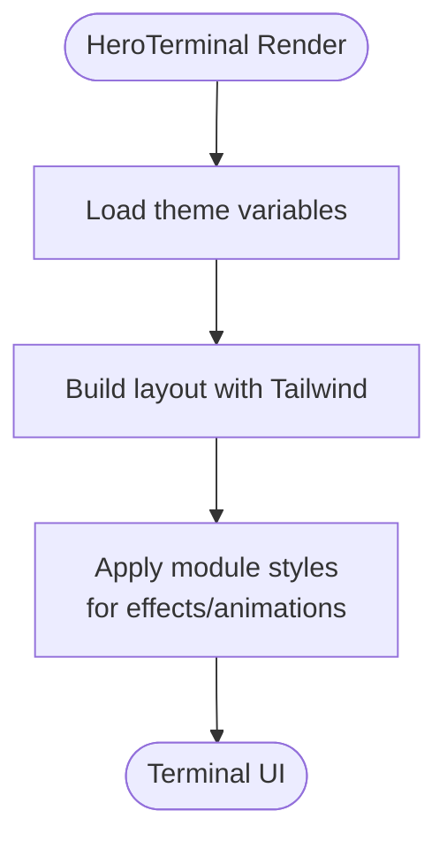
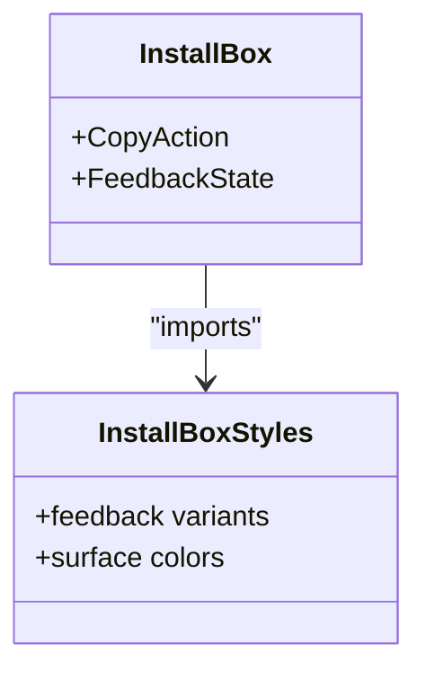
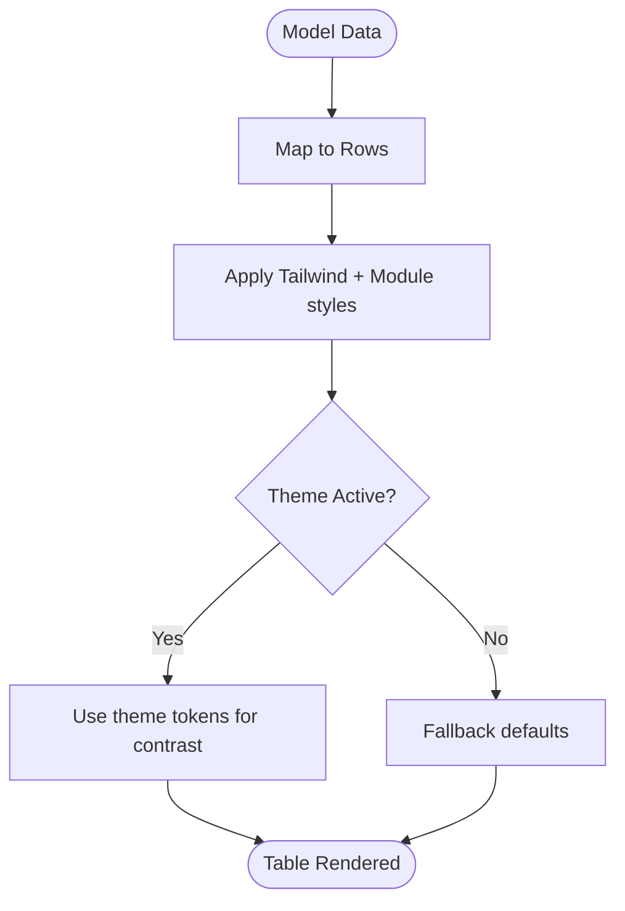
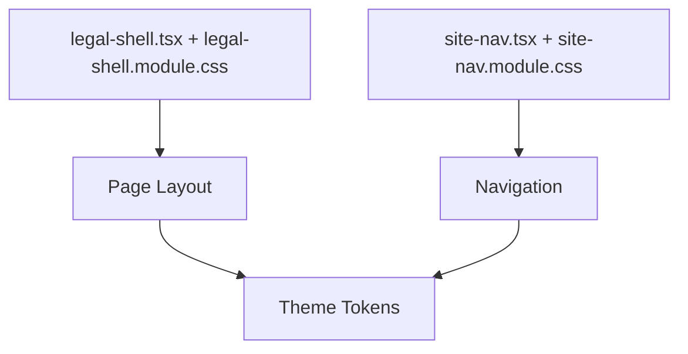
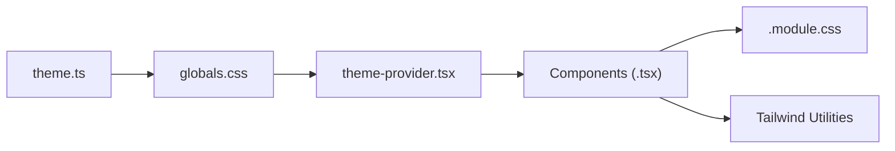

# Styling System

<cite>
**Referenced Files in This Document**
- [globals.css](file://src/app/globals.css)
- [theme.ts](file://src/config/theme.ts)
- [primitives.module.css](file://src/components/ui/primitives.module.css)
- [primitives.tsx](file://src/components/ui/primitives.tsx)
- [space-button.module.css](file://src/components/ui/space-button.module.css)
- [space-button.tsx](file://src/components/ui/space-button.tsx)
- [toast.module.css](file://src/components/ui/toast.module.css)
- [toast.tsx](file://src/components/ui/toast.tsx)
- [HeroTerminal.module.css](file://src/components/HeroTerminal.module.css)
- [HeroTerminal.tsx](file://src/components/HeroTerminal.tsx)
- [InstallBox.module.css](file://src/components/InstallBox.module.css)
- [InstallBox.tsx](file://src/components/InstallBox.tsx)
- [ModelsTable.module.css](file://src/components/ModelsTable.module.css)
- [ModelsTable.tsx](file://src/components/ModelsTable.tsx)
- [legal-shell.module.css](file://src/components/legal-shell.module.css)
- [legal-shell.tsx](file://src/components/legal-shell.tsx)
- [site-nav.module.css](file://src/components/site-nav.module.css)
- [site-nav.tsx](file://src/components/site-nav.tsx)
- [theme-provider.tsx](file://src/components/theme-provider.tsx)
- [theme-toggle.tsx](file://src/components/theme-toggle.tsx)
- [auth.module.css](file://src/app/auth.module.css)
- [page.module.css](file://src/app/page.module.css)
- [chat.module.css](file://src/app/chat/chat.module.css)
- [cli.module.css](file://src/app/cli/cli.module.css)
- [dashboard.module.css](file://src/app/dashboard/dashboard.module.css)
- [pricing.module.css](file://src/app/pricing/pricing.module.css)
- [next.config.ts](file://next.config.ts)
- [package.json](file://package.json)
</cite>

## Table of Contents
1. [Introduction](#introduction)
2. [Project Structure](#project-structure)
3. [Core Components](#core-components)
4. [Architecture Overview](#architecture-overview)
5. [Detailed Component Analysis](#detailed-component-analysis)
6. [Dependency Analysis](#dependency-analysis)
7. [Performance Considerations](#performance-considerations)
8. [Troubleshooting Guide](#troubleshooting-guide)
9. [Conclusion](#conclusion)
10. [Appendices](#appendices)

## Introduction
This document explains the styling architecture that combines Tailwind CSS, CSS Modules, and custom themes. It covers design tokens (colors, typography, spacing), responsive breakpoints, component-scoped styles via CSS Modules, integration with a global theme system, dark mode implementation, and cross-browser compatibility approaches. The goal is to provide clear guidelines for creating consistent styles across the application while maintaining performance and accessibility.

## Project Structure
The styling system is organized around:
- Global styles and theme variables defined at the app level
- A centralized theme configuration file
- Component-scoped styles using CSS Modules
- Theme provider and toggle utilities for runtime theme switching
- Tailwind CSS for utility-first styling and responsive design

**Diagram sources**
- [globals.css](file://src/app/globals.css)
- [theme.ts](file://src/config/theme.ts)
- [primitives.tsx](file://src/components/ui/primitives.tsx)
- [primitives.module.css](file://src/components/ui/primitives.module.css)
- [space-button.tsx](file://src/components/ui/space-button.tsx)
- [space-button.module.css](file://src/components/ui/space-button.module.css)
- [toast.tsx](file://src/components/ui/toast.tsx)
- [toast.module.css](file://src/components/ui/toast.module.css)
- [HeroTerminal.tsx](file://src/components/HeroTerminal.tsx)
- [HeroTerminal.module.css](file://src/components/HeroTerminal.module.css)
- [InstallBox.tsx](file://src/components/InstallBox.tsx)
- [InstallBox.module.css](file://src/components/InstallBox.module.css)
- [ModelsTable.tsx](file://src/components/ModelsTable.tsx)
- [ModelsTable.module.css](file://src/components/ModelsTable.module.css)
- [legal-shell.tsx](file://src/components/legal-shell.tsx)
- [legal-shell.module.css](file://src/components/legal-shell.module.css)
- [site-nav.tsx](file://src/components/site-nav.tsx)
- [site-nav.module.css](file://src/components/site-nav.module.css)
- [theme-provider.tsx](file://src/components/theme-provider.tsx)
- [theme-toggle.tsx](file://src/components/theme-toggle.tsx)
- [page.module.css](file://src/app/page.module.css)
- [auth.module.css](file://src/app/auth.module.css)
- [chat.module.css](file://src/app/chat/chat.module.css)
- [cli.module.css](file://src/app/cli/cli.module.css)
- [dashboard.module.css](file://src/app/dashboard/dashboard.module.css)
- [pricing.module.css](file://src/app/pricing/pricing.module.css)

**Section sources**
- [globals.css](file://src/app/globals.css)
- [theme.ts](file://src/config/theme.ts)
- [next.config.ts](file://next.config.ts)
- [package.json](file://package.json)

## Core Components
- Global theme and base styles:
  - Centralized CSS custom properties define color tokens, typography scales, spacing units, and breakpoints. These are applied globally and consumed by components.
  - Base resets and global layout rules live here to ensure consistency across pages.

- Theme configuration:
  - A single source of truth for semantic tokens (e.g., brand colors, surface tones, text hierarchy).
  - Provides mappings between semantic names and concrete values, enabling easy updates and theming.

- Theme provider and toggle:
  - Provider injects current theme context into the React tree and persists user preference.
  - Toggle component switches between light/dark modes by updating CSS variables on the root element.

- Component-scoped styles (CSS Modules):
  - Each component has a corresponding .module.css file for encapsulated styles.
  - Module classes are imported as objects and composed with Tailwind utilities for predictable, maintainable styling.

- Page-level modules:
  - Pages can include their own module files for page-specific overrides or layouts without leaking styles globally.

**Section sources**
- [globals.css](file://src/app/globals.css)
- [theme.ts](file://src/config/theme.ts)
- [theme-provider.tsx](file://src/components/theme-provider.tsx)
- [theme-toggle.tsx](file://src/components/theme-toggle.tsx)
- [primitives.tsx](file://src/components/ui/primitives.tsx)
- [primitives.module.css](file://src/components/ui/primitives.module.css)
- [space-button.tsx](file://src/components/ui/space-button.tsx)
- [space-button.module.css](file://src/components/ui/space-button.module.css)
- [toast.tsx](file://src/components/ui/toast.tsx)
- [toast.module.css](file://src/components/ui/toast.module.css)
- [HeroTerminal.tsx](file://src/components/HeroTerminal.tsx)
- [HeroTerminal.module.css](file://src/components/HeroTerminal.module.css)
- [InstallBox.tsx](file://src/components/InstallBox.tsx)
- [InstallBox.module.css](file://src/components/InstallBox.module.css)
- [ModelsTable.tsx](file://src/components/ModelsTable.tsx)
- [ModelsTable.module.css](file://src/components/ModelsTable.module.css)
- [legal-shell.tsx](file://src/components/legal-shell.tsx)
- [legal-shell.module.css](file://src/components/legal-shell.module.css)
- [site-nav.tsx](file://src/components/site-nav.tsx)
- [site-nav.module.css](file://src/components/site-nav.module.css)
- [page.module.css](file://src/app/page.module.css)
- [auth.module.css](file://src/app/auth.module.css)
- [chat.module.css](file://src/app/chat/chat.module.css)
- [cli.module.css](file://src/app/cli/cli.module.css)
- [dashboard.module.css](file://src/app/dashboard/dashboard.module.css)
- [pricing.module.css](file://src/app/pricing/pricing.module.css)

## Architecture Overview
The styling architecture layers three systems:
- Design tokens and global variables (CSS custom properties)
- Utility-first styling (Tailwind CSS)
- Component-scoped styles (CSS Modules)

**Diagram sources**
- [theme-toggle.tsx](file://src/components/theme-toggle.tsx)
- [theme-provider.tsx](file://src/components/theme-provider.tsx)
- [globals.css](file://src/app/globals.css)
- [primitives.tsx](file://src/components/ui/primitives.tsx)
- [primitives.module.css](file://src/components/ui/primitives.module.css)

## Detailed Component Analysis

### Primitives Layer
Primitives define foundational UI building blocks (buttons, inputs, cards, typography wrappers). They:
- Consume theme tokens from CSS variables
- Compose Tailwind utilities for layout and spacing
- Use CSS Modules for component-specific overrides and complex states

**Diagram sources**
- [primitives.tsx](file://src/components/ui/primitives.tsx)
- [primitives.module.css](file://src/components/ui/primitives.module.css)

**Section sources**
- [primitives.tsx](file://src/components/ui/primitives.tsx)
- [primitives.module.css](file://src/components/ui/primitives.module.css)

### Space Button
A themed button demonstrating composition of:
- Tailwind utilities for layout, spacing, and transitions
- CSS Modules for variant-specific styles (size, state)
- Theme tokens for colors and focus rings

**Diagram sources**
- [space-button.tsx](file://src/components/ui/space-button.tsx)
- [space-button.module.css](file://src/components/ui/space-button.module.css)

**Section sources**
- [space-button.tsx](file://src/components/ui/space-button.tsx)
- [space-button.module.css](file://src/components/ui/space-button.module.css)

### Toast Notification
Toast uses:
- Scoped animations and positioning via CSS Modules
- Theme-aware colors and contrast for readability
- Tailwind utilities for spacing and alignment

**Diagram sources**
- [toast.tsx](file://src/components/ui/toast.tsx)
- [toast.module.css](file://src/components/ui/toast.module.css)
- [theme-provider.tsx](file://src/components/theme-provider.tsx)

**Section sources**
- [toast.tsx](file://src/components/ui/toast.tsx)
- [toast.module.css](file://src/components/ui/toast.module.css)

### Hero Terminal
Demonstrates complex component styling:
- CSS Modules for terminal-like visuals and animations
- Tailwind utilities for responsive layout
- Theme tokens for background and text contrast

**Diagram sources**
- [HeroTerminal.tsx](file://src/components/HeroTerminal.tsx)
- [HeroTerminal.module.css](file://src/components/HeroTerminal.module.css)

**Section sources**
- [HeroTerminal.tsx](file://src/components/HeroTerminal.tsx)
- [HeroTerminal.module.css](file://src/components/HeroTerminal.module.css)

### Install Box
Shows how to style interactive elements:
- Module classes for copy-to-clipboard feedback
- Tailwind utilities for spacing and typography
- Theme tokens for surface and border colors

**Diagram sources**
- [InstallBox.tsx](file://src/components/InstallBox.tsx)
- [InstallBox.module.css](file://src/components/InstallBox.module.css)

**Section sources**
- [InstallBox.tsx](file://src/components/InstallBox.tsx)
- [InstallBox.module.css](file://src/components/InstallBox.module.css)

### Models Table
Data presentation pattern:
- Module classes for table structure and hover states
- Tailwind utilities for responsive columns and spacing
- Theme tokens for borders and alternating rows

**Diagram sources**
- [ModelsTable.tsx](file://src/components/ModelsTable.tsx)
- [ModelsTable.module.css](file://src/components/ModelsTable.module.css)

**Section sources**
- [ModelsTable.tsx](file://src/components/ModelsTable.tsx)
- [ModelsTable.module.css](file://src/components/ModelsTable.module.css)

### Legal Shell and Site Navigation
Shell and navigation patterns:
- Legal shell provides consistent page scaffolding with module-based layout
- Site navigation uses module classes for active states and responsive behavior
- Both consume theme tokens for consistent contrast and surfaces

**Diagram sources**
- [legal-shell.tsx](file://src/components/legal-shell.tsx)
- [legal-shell.module.css](file://src/components/legal-shell.module.css)
- [site-nav.tsx](file://src/components/site-nav.tsx)
- [site-nav.module.css](file://src/components/site-nav.module.css)

**Section sources**
- [legal-shell.tsx](file://src/components/legal-shell.tsx)
- [legal-shell.module.css](file://src/components/legal-shell.module.css)
- [site-nav.tsx](file://src/components/site-nav.tsx)
- [site-nav.module.css](file://src/components/site-nav.module.css)

### Page-Level Modules
Pages may include their own module files for specific layouts or overrides:
- Home page module
- Authentication page module
- Chat and CLI page modules
- Dashboard and pricing page modules

These modules compose with Tailwind utilities and theme tokens to maintain consistency while allowing page-specific customization.

**Section sources**
- [page.module.css](file://src/app/page.module.css)
- [auth.module.css](file://src/app/auth.module.css)
- [chat.module.css](file://src/app/chat/chat.module.css)
- [cli.module.css](file://src/app/cli/cli.module.css)
- [dashboard.module.css](file://src/app/dashboard/dashboard.module.css)
- [pricing.module.css](file://src/app/pricing/pricing.module.css)

## Dependency Analysis
Styling dependencies flow from global tokens to components:
- Global CSS defines CSS custom properties for tokens
- Theme configuration centralizes token definitions
- Components import module styles and use Tailwind utilities
- Theme provider updates root variables at runtime

**Diagram sources**
- [theme.ts](file://src/config/theme.ts)
- [globals.css](file://src/app/globals.css)
- [theme-provider.tsx](file://src/components/theme-provider.tsx)
- [primitives.tsx](file://src/components/ui/primitives.tsx)
- [primitives.module.css](file://src/components/ui/primitives.module.css)

**Section sources**
- [theme.ts](file://src/config/theme.ts)
- [globals.css](file://src/app/globals.css)
- [theme-provider.tsx](file://src/components/theme-provider.tsx)
- [primitives.tsx](file://src/components/ui/primitives.tsx)
- [primitives.module.css](file://src/components/ui/primitives.module.css)

## Performance Considerations
- Prefer Tailwind utilities for common layout and spacing to reduce custom CSS.
- Keep CSS Modules small and focused; avoid duplicating utilities already provided by Tailwind.
- Use CSS variables for frequently changing values (colors, radii) to minimize reflows during theme switches.
- Avoid heavy animations in critical paths; prefer transform and opacity for smoothness.
- Defer non-critical styles where possible to improve initial paint.

[No sources needed since this section provides general guidance]

## Troubleshooting Guide
Common issues and resolutions:
- Theme not applying:
  - Ensure the theme provider wraps the application tree and root variables are updated.
  - Verify that components read CSS variables rather than hard-coded values.

- Module styles not taking effect:
  - Confirm correct import of module classes and no naming conflicts.
  - Check specificity; Tailwind utilities should be composed before module overrides when necessary.

- Dark mode contrast problems:
  - Validate token mappings for dark mode; ensure sufficient contrast ratios.
  - Test with browser dev tools’ color contrast checker.

- Responsive layout breaks:
  - Review breakpoint usage; align with Tailwind’s default breakpoints or custom configuration.
  - Inspect computed styles to verify variable resolution.

**Section sources**
- [theme-provider.tsx](file://src/components/theme-provider.tsx)
- [theme-toggle.tsx](file://src/components/theme-toggle.tsx)
- [globals.css](file://src/app/globals.css)
- [primitives.module.css](file://src/components/ui/primitives.module.css)

## Conclusion
This styling system unifies Tailwind CSS, CSS Modules, and a robust theme layer through design tokens and CSS variables. By centralizing tokens, scoping component styles, and composing utilities, the application achieves consistency, maintainability, and flexibility. The provider/toggle mechanism enables seamless dark mode support, while careful attention to performance and accessibility ensures a high-quality user experience across devices and browsers.

[No sources needed since this section summarizes without analyzing specific files]

## Appendices

### Design Token Guidelines
- Colors:
  - Define semantic tokens (e.g., primary, secondary, surface, text) in global CSS variables.
  - Provide light and dark variants under a theme context.
- Typography:
  - Establish type scale tokens (font sizes, line heights, weights) for headings and body text.
  - Use CSS variables for font families and fallback stacks.
- Spacing:
  - Standardize spacing units (e.g., 4px base) and expose as variables for margins and paddings.
- Breakpoints:
  - Align with Tailwind’s breakpoints; define CSS variables if needed for media queries in custom styles.

**Section sources**
- [globals.css](file://src/app/globals.css)
- [theme.ts](file://src/config/theme.ts)

### Creating Consistent Styles
- Prefer Tailwind utilities for layout, spacing, and typography.
- Use CSS Modules only for component-specific logic (variants, complex states, animations).
- Reference theme tokens via CSS variables instead of hard-coded values.
- Maintain a shared primitives layer to enforce consistency across components.

**Section sources**
- [primitives.tsx](file://src/components/ui/primitives.tsx)
- [primitives.module.css](file://src/components/ui/primitives.module.css)
- [space-button.tsx](file://src/components/ui/space-button.tsx)
- [space-button.module.css](file://src/components/ui/space-button.module.css)

### Dark Mode Implementation
- Update root CSS variables when toggling themes.
- Ensure all components consume variables for colors and surfaces.
- Test contrast and legibility in both modes.
- Persist user preference via local storage or cookies.

**Section sources**
- [theme-provider.tsx](file://src/components/theme-provider.tsx)
- [theme-toggle.tsx](file://src/components/theme-toggle.tsx)
- [globals.css](file://src/app/globals.css)

### Cross-Browser Compatibility Approaches
- Use widely supported CSS features (variables, flexbox, grid).
- Provide fallbacks for advanced features (animations, gradients).
- Validate with browser developer tools and automated checks.
- Keep Tailwind configuration aligned with target environments.

**Section sources**
- [next.config.ts](file://next.config.ts)
- [package.json](file://package.json)