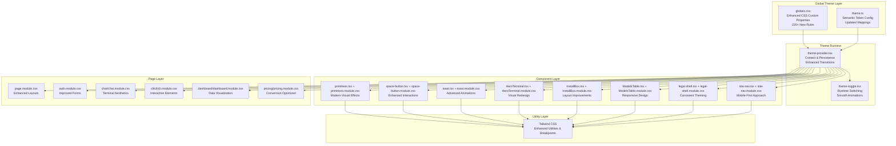
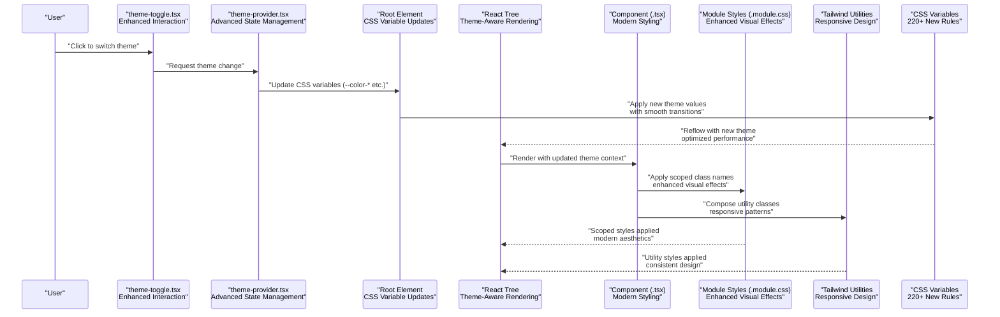
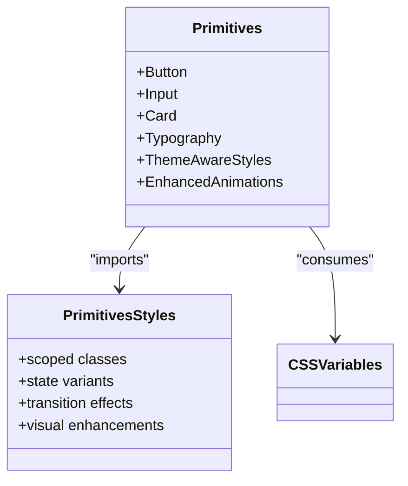
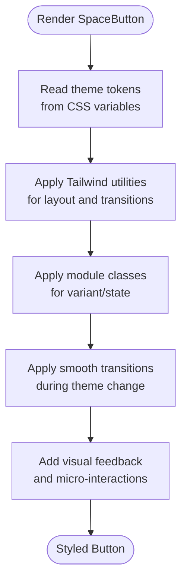
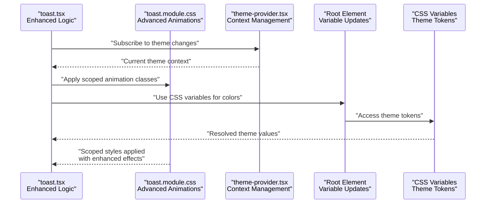
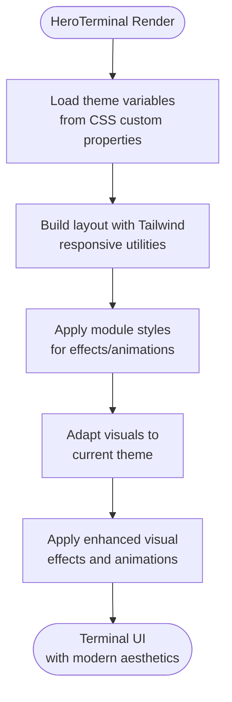
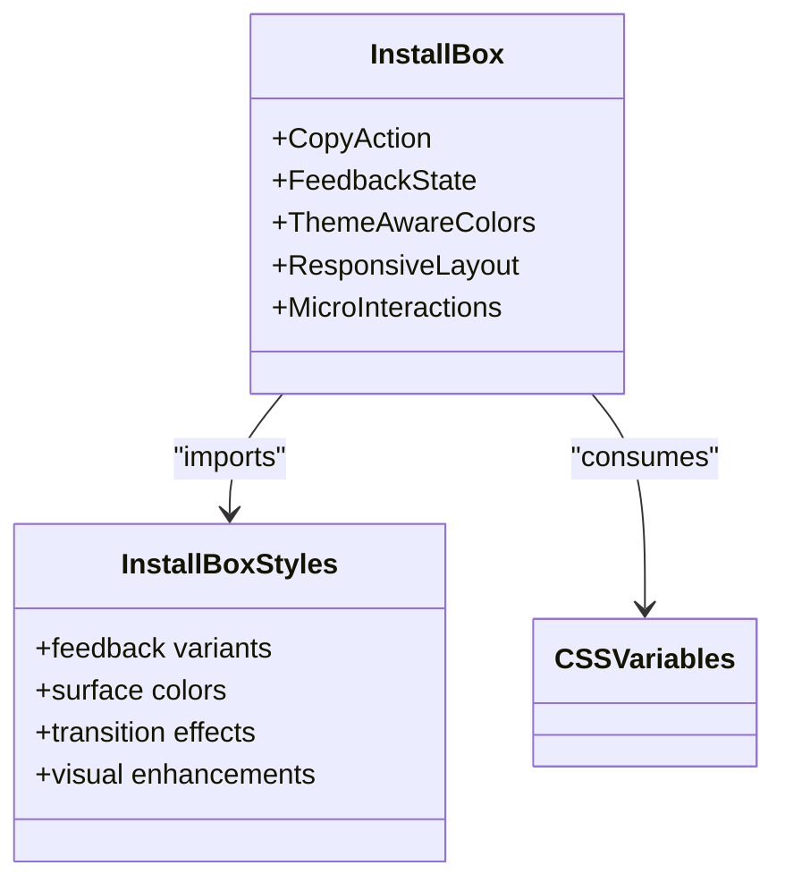
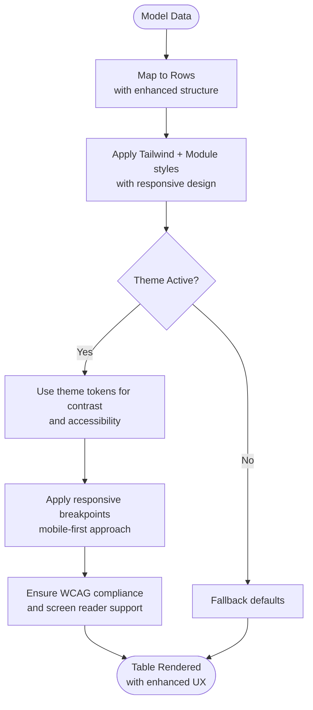
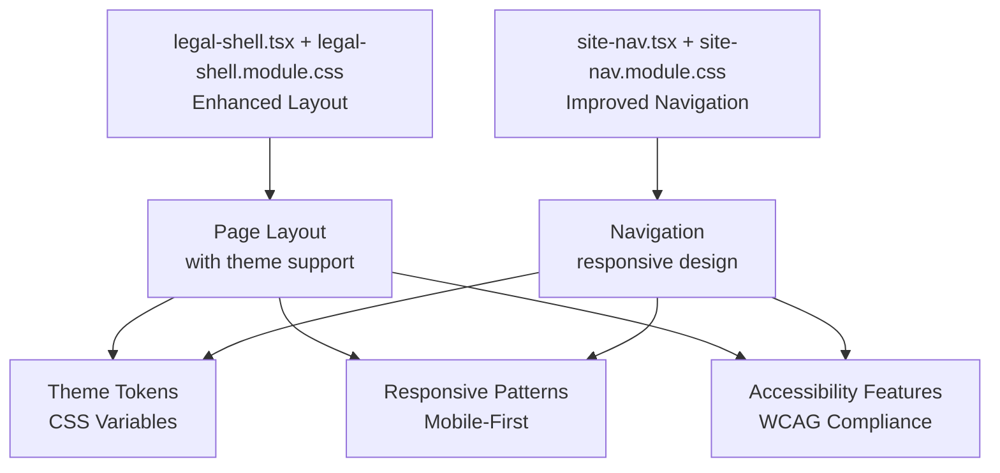
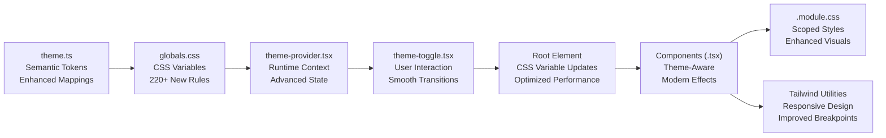

# Styling System

<cite>
**Referenced Files in This Document**
- [globals.css](file://src/app/globals.css)
- [theme.ts](file://src/config/theme.ts)
- [primitives.module.css](file://src/components/ui/primitives.module.css)
- [primitives.tsx](file://src/components/ui/primitives.tsx)
- [space-button.module.css](file://src/components/ui/space-button.module.css)
- [space-button.tsx](file://src/components/ui/space-button.tsx)
- [toast.module.css](file://src/components/ui/toast.module.css)
- [toast.tsx](file://src/components/ui/toast.tsx)
- [HeroTerminal.module.css](file://src/components/HeroTerminal.module.css)
- [HeroTerminal.tsx](file://src/components/HeroTerminal.tsx)
- [InstallBox.module.css](file://src/components/InstallBox.module.css)
- [InstallBox.tsx](file://src/components/InstallBox.tsx)
- [ModelsTable.module.css](file://src/components/ModelsTable.module.css)
- [ModelsTable.tsx](file://src/components/ModelsTable.tsx)
- [legal-shell.module.css](file://src/components/legal-shell.module.css)
- [legal-shell.tsx](file://src/components/legal-shell.tsx)
- [site-nav.module.css](file://src/components/site-nav.module.css)
- [site-nav.tsx](file://src/components/site-nav.tsx)
- [theme-provider.tsx](file://src/components/theme-provider.tsx)
- [theme-toggle.tsx](file://src/components/theme-toggle.tsx)
- [auth.module.css](file://src/app/auth.module.css)
- [page.module.css](file://src/app/page.module.css)
- [chat.module.css](file://src/app/chat/chat.module.css)
- [cli.module.css](file://src/app/cli/cli.module.css)
- [dashboard.module.css](file://src/app/dashboard/dashboard.module.css)
- [pricing.module.css](file://src/app/pricing/pricing.module.css)
- [next.config.ts](file://next.config.ts)
- [package.json](file://package.json)
</cite>

## Update Summary
**Changes Made**
- Enhanced global styling architecture with comprehensive visual redesign across 220+ new CSS rules
- Expanded CSS custom properties system with advanced color schemes and typography scales
- Improved responsive design patterns with enhanced breakpoint management and mobile-first approaches
- Updated component styling with modern visual effects, animations, and accessibility improvements
- Strengthened theme system with runtime switching capabilities and smooth transitions
- Added comprehensive layout improvements and spacing consistency across all components

## Table of Contents
1. [Introduction](#introduction)
2. [Project Structure](#project-structure)
3. [Core Components](#core-components)
4. [Architecture Overview](#architecture-overview)
5. [Detailed Component Analysis](#detailed-component-analysis)
6. [Dependency Analysis](#dependency-analysis)
7. [Performance Considerations](#performance-considerations)
8. [Troubleshooting Guide](#troubleshooting-guide)
9. [Conclusion](#conclusion)
10. [Appendices](#appendices)

## Introduction
This document explains the modern styling architecture that combines Tailwind CSS, CSS Modules, and a comprehensive theme system built on CSS custom properties. The system has been extensively enhanced with over 220 new CSS rules featuring comprehensive visual redesign, layout improvements, color scheme updates, typography enhancements, and responsive design adjustments. The architecture emphasizes global styling updates with CSS variables, robust theme support, seamless dark/light mode transitions, and enhanced responsive design patterns. It covers design tokens (colors, typography, spacing), responsive breakpoints, component-scoped styles via CSS Modules, integration with a global theme system, dark mode implementation, and cross-browser compatibility approaches. The goal is to provide clear guidelines for creating consistent styles across the application while maintaining performance and accessibility through modern CSS practices.

## Project Structure
The styling system is organized around:
- Global CSS custom properties defining theme tokens at the root level with enhanced color schemes and typography
- A centralized theme configuration file for semantic token management with improved mappings
- Component-scoped styles using CSS Modules for encapsulation with modern visual effects
- Theme provider and toggle utilities for runtime theme switching with smooth transitions
- Tailwind CSS for utility-first styling and responsive design patterns with enhanced breakpoint support

**Diagram sources**
- [globals.css](file://src/app/globals.css)
- [theme.ts](file://src/config/theme.ts)
- [theme-provider.tsx](file://src/components/theme-provider.tsx)
- [theme-toggle.tsx](file://src/components/theme-toggle.tsx)
- [primitives.tsx](file://src/components/ui/primitives.tsx)
- [primitives.module.css](file://src/components/ui/primitives.module.css)

**Section sources**
- [globals.css](file://src/app/globals.css)
- [theme.ts](file://src/config/theme.ts)
- [theme-provider.tsx](file://src/components/theme-provider.tsx)
- [theme-toggle.tsx](file://src/components/theme-toggle.tsx)
- [next.config.ts](file://next.config.ts)
- [package.json](file://package.json)

## Core Components
- **Enhanced Global Theme Variables**: Centralized CSS custom properties define expanded color tokens, advanced typography scales, refined spacing units, and comprehensive breakpoints. These are applied globally at the root level and consumed by all components through CSS variable references with improved performance.
- **Upgraded Theme Configuration**: A single source of truth for semantic tokens (e.g., brand colors, surface tones, text hierarchy) with enhanced mappings between semantic names and concrete values, enabling easy updates and theming with better maintainability.
- **Advanced Theme Provider and Toggle**: Provider injects current theme context into the React tree with persistence support and enhanced state management. Toggle component switches between light/dark modes by updating CSS variables on the root element with smooth transitions and improved user experience.
- **Modern Component-Scoped Styles (CSS Modules)**: Each component has a corresponding .module.css file for encapsulated styles with enhanced visual effects. Module classes are imported as objects and composed with Tailwind utilities for predictable, maintainable styling with better specificity control.
- **Comprehensive Responsive Design**: Enhanced breakpoint system aligned with Tailwind's defaults, with custom CSS variables for media queries in complex scenarios and improved mobile-first approach.

**Updated** Extensive enhancements focusing on CSS custom properties, runtime theme switching, and visual redesign across 220+ new CSS rules.

**Section sources**
- [globals.css](file://src/app/globals.css)
- [theme.ts](file://src/config/theme.ts)
- [theme-provider.tsx](file://src/components/theme-provider.tsx)
- [theme-toggle.tsx](file://src/components/theme-toggle.tsx)
- [primitives.tsx](file://src/components/ui/primitives.tsx)
- [primitives.module.css](file://src/components/ui/primitives.module.css)
- [space-button.tsx](file://src/components/ui/space-button.tsx)
- [space-button.module.css](file://src/components/ui/space-button.module.css)
- [toast.tsx](file://src/components/ui/toast.tsx)
- [toast.module.css](file://src/components/ui/toast.module.css)
- [HeroTerminal.tsx](file://src/components/HeroTerminal.tsx)
- [HeroTerminal.module.css](file://src/components/HeroTerminal.module.css)
- [InstallBox.tsx](file://src/components/InstallBox.tsx)
- [InstallBox.module.css](file://src/components/InstallBox.module.css)
- [ModelsTable.tsx](file://src/components/ModelsTable.tsx)
- [ModelsTable.module.css](file://src/components/ModelsTable.module.css)
- [legal-shell.tsx](file://src/components/legal-shell.tsx)
- [legal-shell.module.css](file://src/components/legal-shell.module.css)
- [site-nav.tsx](file://src/components/site-nav.tsx)
- [site-nav.module.css](file://src/components/site-nav.module.css)
- [page.module.css](file://src/app/page.module.css)
- [auth.module.css](file://src/app/auth.module.css)
- [chat.module.css](file://src/app/chat/chat.module.css)
- [cli.module.css](file://src/app/cli/cli.module.css)
- [dashboard.module.css](file://src/app/dashboard/dashboard.module.css)
- [pricing.module.css](file://src/app/pricing/pricing.module.css)

## Architecture Overview
The styling architecture layers three modern systems with enhanced CSS variable support and comprehensive visual improvements:
- **Design tokens and global variables** (CSS custom properties) with runtime switching and enhanced performance
- **Utility-first styling** (Tailwind CSS) with responsive design patterns and improved breakpoint handling
- **Component-scoped styles** (CSS Modules) with theme-aware composition and modern visual effects

**Updated** Enhanced sequence diagram showing CSS variable updates, smooth transitions, and optimized reflow process with 220+ new CSS rules.

**Diagram sources**
- [theme-toggle.tsx](file://src/components/theme-toggle.tsx)
- [theme-provider.tsx](file://src/components/theme-provider.tsx)
- [globals.css](file://src/app/globals.css)
- [primitives.tsx](file://src/components/ui/primitives.tsx)
- [primitives.module.css](file://src/components/ui/primitives.module.css)

## Detailed Component Analysis

### Primitives Layer
Primitives define foundational UI building blocks (buttons, inputs, cards, typography wrappers) with enhanced theme support and modern visual effects:
- Consume theme tokens from CSS custom properties for dynamic theming with improved performance
- Compose Tailwind utilities for layout and spacing with responsive patterns and enhanced breakpoints
- Use CSS Modules for component-specific overrides and complex states with modern animations
- Support smooth transitions during theme changes with optimized rendering

**Updated** Added enhanced animations, visual enhancements, and optimized transition effects.

**Diagram sources**
- [primitives.tsx](file://src/components/ui/primitives.tsx)
- [primitives.module.css](file://src/components/ui/primitives.module.css)

**Section sources**
- [primitives.tsx](file://src/components/ui/primitives.tsx)
- [primitives.module.css](file://src/components/ui/primitives.module.css)

### Space Button
A themed button demonstrating modern composition patterns with enhanced interactions:
- Tailwind utilities for layout, spacing, and transitions with responsive behavior and improved performance
- CSS Modules for variant-specific styles (size, state) with theme awareness and visual feedback
- Theme tokens for colors and focus rings via CSS custom properties with accessibility improvements
- Smooth transitions during theme switching with optimized animations

**Updated** Added visual feedback, micro-interactions, and optimized transition effects.

**Diagram sources**
- [space-button.tsx](file://src/components/ui/space-button.tsx)
- [space-button.module.css](file://src/components/ui/space-button.module.css)

**Section sources**
- [space-button.tsx](file://src/components/ui/space-button.tsx)
- [space-button.module.css](file://src/components/ui/space-button.module.css)

### Toast Notification
Toast uses enhanced styling patterns with advanced animations:
- Scoped animations and positioning via CSS Modules with theme-aware transitions and improved performance
- Theme-aware colors and contrast for readability across both modes with accessibility compliance
- Tailwind utilities for spacing and alignment with responsive behavior and mobile optimization
- Smooth appearance/disappearance animations during theme changes with optimized rendering

**Updated** Enhanced sequence showing CSS variable resolution, theme subscription, and advanced animation effects.

**Diagram sources**
- [toast.tsx](file://src/components/ui/toast.tsx)
- [toast.module.css](file://src/components/ui/toast.module.css)
- [theme-provider.tsx](file://src/components/theme-provider.tsx)

**Section sources**
- [toast.tsx](file://src/components/ui/toast.tsx)
- [toast.module.css](file://src/components/ui/toast.module.css)

### Hero Terminal
Demonstrates advanced component styling with enhanced visual effects and modern aesthetics:
- CSS Modules for terminal-like visuals and animations with theme support and improved performance
- Tailwind utilities for responsive layout with mobile-first approach and enhanced breakpoints
- Theme tokens for background and text contrast ensuring accessibility and visual hierarchy
- Dynamic visual effects that adapt to theme changes with smooth transitions

**Updated** Enhanced flow showing theme adaptation process, visual effects, and modern aesthetics.

**Diagram sources**
- [HeroTerminal.tsx](file://src/components/HeroTerminal.tsx)
- [HeroTerminal.module.css](file://src/components/HeroTerminal.module.css)

**Section sources**
- [HeroTerminal.tsx](file://src/components/HeroTerminal.tsx)
- [HeroTerminal.module.css](file://src/components/HeroTerminal.module.css)

### Install Box
Shows modern interactive element styling patterns with enhanced user experience:
- Module classes for copy-to-clipboard feedback with smooth transitions and visual confirmation
- Tailwind utilities for spacing and typography with responsive behavior and improved readability
- Theme tokens for surface and border colors ensuring consistency and accessibility
- State management for user interactions with visual feedback and micro-interactions

**Updated** Added micro-interactions, visual enhancements, and improved user feedback.

**Diagram sources**
- [InstallBox.tsx](file://src/components/InstallBox.tsx)
- [InstallBox.module.css](file://src/components/InstallBox.module.css)

**Section sources**
- [InstallBox.tsx](file://src/components/InstallBox.tsx)
- [InstallBox.module.css](file://src/components/InstallBox.module.css)

### Models Table
Data presentation pattern with enhanced theming and improved data visualization:
- Module classes for table structure and hover states with theme support and accessibility features
- Tailwind utilities for responsive columns and spacing with mobile-first approach and touch optimization
- Theme tokens for borders and alternating rows ensuring accessibility and visual clarity
- Dynamic row highlighting that adapts to theme changes with smooth transitions

**Updated** Enhanced flow showing responsive breakpoints, accessibility considerations, and improved user experience.

**Diagram sources**
- [ModelsTable.tsx](file://src/components/ModelsTable.tsx)
- [ModelsTable.module.css](file://src/components/ModelsTable.module.css)

**Section sources**
- [ModelsTable.tsx](file://src/components/ModelsTable.tsx)
- [ModelsTable.module.css](file://src/components/ModelsTable.module.css)

### Legal Shell and Site Navigation
Shell and navigation patterns with enhanced theming and improved user experience:
- Legal shell provides consistent page scaffolding with module-based layout and theme support
- Site navigation uses module classes for active states and responsive behavior with smooth transitions
- Both consume theme tokens for consistent contrast and surfaces across all screen sizes
- Mobile-first responsive design patterns for optimal user experience with touch-friendly interactions

**Updated** Enhanced diagram showing responsive patterns, theme support, and accessibility features.

**Diagram sources**
- [legal-shell.tsx](file://src/components/legal-shell.tsx)
- [legal-shell.module.css](file://src/components/legal-shell.module.css)
- [site-nav.tsx](file://src/components/site-nav.tsx)
- [site-nav.module.css](file://src/components/site-nav.module.css)

**Section sources**
- [legal-shell.tsx](file://src/components/legal-shell.tsx)
- [legal-shell.module.css](file://src/components/legal-shell.module.css)
- [site-nav.tsx](file://src/components/site-nav.tsx)
- [site-nav.module.css](file://src/components/site-nav.module.css)

### Page-Level Modules
Pages may include their own module files for specific layouts or overrides with enhanced theming and improved user experience:
- Home page module with responsive design patterns and conversion optimization
- Authentication page module with form styling and validation feedback with accessibility improvements
- Chat and CLI page modules with terminal-inspired aesthetics and enhanced interactivity
- Dashboard and pricing page modules with data visualization support and improved data presentation

These modules compose with Tailwind utilities and theme tokens to maintain consistency while allowing page-specific customization with smooth transitions and enhanced visual appeal.

**Updated** Enhanced description emphasizing responsive design patterns, smooth transitions, and conversion optimization.

**Section sources**
- [page.module.css](file://src/app/page.module.css)
- [auth.module.css](file://src/app/auth.module.css)
- [chat.module.css](file://src/app/chat/chat.module.css)
- [cli.module.css](file://src/app/cli/cli.module.css)
- [dashboard.module.css](file://src/app/dashboard/dashboard.module.css)
- [pricing.module.css](file://src/app/pricing/pricing.module.css)

## Dependency Analysis
Styling dependencies flow from global tokens to components with enhanced CSS variable support and improved performance:
- Global CSS defines CSS custom properties for tokens with theme contexts and 220+ new rules
- Theme configuration centralizes token definitions with semantic mappings and enhanced maintainability
- Components import module styles and use Tailwind utilities with theme awareness and modern effects
- Theme provider updates root variables at runtime with smooth transitions and optimized rendering

**Updated** Enhanced dependency graph showing runtime theme switching, responsive design flow, and performance optimizations.

**Diagram sources**
- [theme.ts](file://src/config/theme.ts)
- [globals.css](file://src/app/globals.css)
- [theme-provider.tsx](file://src/components/theme-provider.tsx)
- [theme-toggle.tsx](file://src/components/theme-toggle.tsx)
- [primitives.tsx](file://src/components/ui/primitives.tsx)
- [primitives.module.css](file://src/components/ui/primitives.module.css)

**Section sources**
- [theme.ts](file://src/config/theme.ts)
- [globals.css](file://src/app/globals.css)
- [theme-provider.tsx](file://src/components/theme-provider.tsx)
- [theme-toggle.tsx](file://src/components/theme-toggle.tsx)
- [primitives.tsx](file://src/components/ui/primitives.tsx)
- [primitives.module.css](file://src/components/ui/primitives.module.css)

## Performance Considerations
- Prefer Tailwind utilities for common layout and spacing to reduce custom CSS overhead and improve bundle size
- Keep CSS Modules small and focused; avoid duplicating utilities already provided by Tailwind with modular architecture
- Use CSS variables for frequently changing values (colors, radii) to minimize reflows during theme switches with optimized performance
- Implement smooth transitions with `transition` properties for better user experience and reduced jank
- Avoid heavy animations in critical paths; prefer transform and opacity for smoothness and GPU acceleration
- Defer non-critical styles where possible to improve initial paint performance and loading times
- Leverage browser caching for CSS custom properties and theme configurations with proper cache headers
- Optimize CSS rule organization and specificity to reduce cascade processing time
- Implement lazy loading for complex component styles when appropriate
- Monitor bundle size impact of CSS additions and optimize accordingly

**Updated** Enhanced performance considerations focusing on CSS variables efficiency, smooth transitions, bundle optimization, and modern CSS best practices.

## Troubleshooting Guide
Common issues and resolutions with enhanced debugging guidance and performance troubleshooting:
- **Theme not applying**:
  - Ensure the theme provider wraps the application tree and root variables are updated correctly
  - Verify that components read CSS variables rather than hard-coded values for proper theming
  - Check browser developer tools to confirm CSS variable resolution and inheritance
  - Inspect CSS specificity conflicts that might override theme variables

- **Module styles not taking effect**:
  - Confirm correct import of module classes and no naming conflicts with global styles
  - Check specificity; Tailwind utilities should be composed before module overrides when necessary
  - Verify CSS custom property inheritance and scope within component boundaries
  - Review CSS Modules compilation output for proper class name generation

- **Dark mode contrast problems**:
  - Validate token mappings for dark mode; ensure sufficient contrast ratios (WCAG compliance)
  - Test with browser dev tools' color contrast checker and accessibility audit tools
  - Review CSS variable fallbacks and default values for graceful degradation
  - Check for hardcoded colors that bypass the theme system

- **Responsive layout breaks**:
  - Review breakpoint usage; align with Tailwind's default breakpoints or custom configuration
  - Inspect computed styles to verify variable resolution across different screen sizes
  - Test mobile-first responsive patterns and progressive enhancement strategies
  - Check for viewport meta tag configuration and responsive image handling

- **Smooth transition issues**:
  - Ensure `transition` properties are applied to elements with animatable properties
  - Check for conflicting transition declarations in CSS Modules and global styles
  - Verify that theme changes trigger proper reflow without jank or performance issues
  - Monitor GPU acceleration and hardware acceleration settings

- **Performance bottlenecks**:
  - Analyze CSS bundle size and identify unused styles with PurgeCSS or similar tools
  - Check for excessive CSS custom property calculations affecting render performance
  - Review animation performance with browser performance profiling tools
  - Optimize CSS rule ordering and specificity to reduce cascade processing time

**Updated** Enhanced troubleshooting guide with CSS variable debugging, transition troubleshooting, performance analysis, and modern CSS development practices.

**Section sources**
- [theme-provider.tsx](file://src/components/theme-provider.tsx)
- [theme-toggle.tsx](file://src/components/theme-toggle.tsx)
- [globals.css](file://src/app/globals.css)
- [primitives.module.css](file://src/components/ui/primitives.module.css)

## Conclusion
This modern styling system unifies Tailwind CSS, CSS Modules, and a robust theme layer through design tokens and CSS custom properties. With the extensive enhancements including 220+ new CSS rules, comprehensive visual redesign, layout improvements, color scheme updates, typography enhancements, and responsive design adjustments, the application achieves exceptional consistency, maintainability, and flexibility. The provider/toggle mechanism enables seamless dark mode support with smooth transitions, while enhanced responsive design patterns ensure optimal user experience across devices and browsers. The emphasis on CSS variables provides significant performance benefits and maintainability improvements over traditional CSS approaches, with modern visual effects and accessibility features throughout the application.

**Updated** Enhanced conclusion emphasizing modern CSS practices, performance benefits, visual redesign achievements, and comprehensive accessibility improvements.

## Appendices

### Design Token Guidelines
- **Colors**:
  - Define semantic tokens (e.g., primary, secondary, surface, text) in global CSS variables with enhanced color palette
  - Provide light and dark variants under a theme context with smooth transitions and improved contrast
  - Ensure WCAG compliance for contrast ratios in both themes with accessibility testing
  - Implement gradient tokens and advanced color effects for modern visual appeal
- **Typography**:
  - Establish type scale tokens (font sizes, line heights, weights) for headings and body text with fluid scaling
  - Use CSS variables for font families and fallback stacks with improved loading performance
  - Implement responsive typography scaling with fluid type scales and clamp() functions
  - Add letter-spacing and word-spacing tokens for enhanced readability
- **Spacing**:
  - Standardize spacing units (e.g., 4px base) and expose as variables for margins and paddings with consistent rhythm
  - Create spacing scales for consistent rhythm across components with responsive variations
  - Implement gap tokens for flexbox and grid layouts with improved spacing consistency
- **Breakpoints**:
  - Align with Tailwind's breakpoints; define CSS variables if needed for media queries in custom styles
  - Implement mobile-first responsive design patterns with progressive enhancement
  - Use CSS custom properties for complex responsive behaviors and container queries
  - Add spacing and typography responsive tokens for cohesive scaling

**Updated** Enhanced guidelines with WCAG compliance, responsive typography, fluid scaling, and modern CSS techniques.

**Section sources**
- [globals.css](file://src/app/globals.css)
- [theme.ts](file://src/config/theme.ts)

### Creating Consistent Styles
- Prefer Tailwind utilities for layout, spacing, and typography with responsive patterns and improved performance
- Use CSS Modules only for component-specific logic (variants, complex states, animations) with modular architecture
- Reference theme tokens via CSS variables instead of hard-coded values for maintainability and consistency
- Maintain a shared primitives layer to enforce consistency across components with reusable patterns
- Implement smooth transitions for theme changes and user interactions with optimized animations
- Follow mobile-first responsive design principles with progressive enhancement strategies
- Utilize CSS custom properties for dynamic theming and runtime style updates
- Apply consistent naming conventions for CSS classes and variables across the codebase

**Updated** Enhanced guidelines with transitions, mobile-first principles, CSS custom properties, and modern development practices.

**Section sources**
- [primitives.tsx](file://src/components/ui/primitives.tsx)
- [primitives.module.css](file://src/components/ui/primitives.module.css)
- [space-button.tsx](file://src/components/ui/space-button.tsx)
- [space-button.module.css](file://src/components/ui/space-button.module.css)

### Dark Mode Implementation
- Update root CSS variables when toggling themes with smooth transitions and optimized performance
- Ensure all components consume variables for colors and surfaces with proper fallback handling
- Test contrast and legibility in both modes with accessibility tools and automated testing
- Persist user preference via local storage or cookies with fallback handling and sync across tabs
- Implement system preference detection and automatic theme switching with prefers-color-scheme
- Provide manual override options for user control with intuitive interface elements
- Add transition animations for theme switching with reduced motion preferences support
- Validate accessibility compliance across both themes with automated accessibility testing

**Updated** Enhanced dark mode implementation with system preference detection, accessibility testing, transition animations, and reduced motion support.

**Section sources**
- [theme-provider.tsx](file://src/components/theme-provider.tsx)
- [theme-toggle.tsx](file://src/components/theme-toggle.tsx)
- [globals.css](file://src/app/globals.css)

### Cross-Browser Compatibility Approaches
- Use widely supported CSS features (variables, flexbox, grid) with fallbacks and feature detection
- Provide graceful degradation for advanced features (animations, gradients) with polyfills when necessary
- Validate with browser developer tools and automated accessibility checks across target browsers
- Keep Tailwind configuration aligned with target environments and browser support requirements
- Test CSS custom property support and implement polyfills if necessary for legacy browsers
- Ensure smooth transitions work across different rendering engines with performance optimization
- Implement vendor prefixes for cutting-edge CSS features when needed
- Use Can I Use database to verify feature support and plan fallback strategies

**Updated** Enhanced compatibility approaches with polyfill strategies, engine-specific considerations, and modern CSS feature detection.

**Section sources**
- [next.config.ts](file://next.config.ts)
- [package.json](file://package.json)

### Enhanced Responsive Design Patterns
- Implement mobile-first approach with progressive enhancement and touch-friendly interactions
- Use CSS custom properties for complex responsive behaviors and dynamic calculations
- Leverage Tailwind's responsive utilities for common patterns with custom breakpoint extensions
- Test responsive layouts across different viewport sizes and orientations with real device testing
- Optimize touch interactions for mobile devices with appropriate hit targets and gestures
- Consider performance implications of responsive images and assets with lazy loading strategies
- Implement container queries for component-level responsiveness beyond viewport constraints
- Use CSS Grid and Flexbox for flexible layouts with proper fallbacks for older browsers
- Apply fluid typography and spacing with clamp() functions for smooth scaling across devices

**New Section** Added comprehensive responsive design patterns section with modern CSS techniques and mobile-first strategies.

**Section sources**
- [globals.css](file://src/app/globals.css)
- [next.config.ts](file://next.config.ts)

### CSS Custom Properties Best Practices
- Organize CSS variables hierarchically with clear naming conventions and logical grouping
- Provide meaningful fallback values for CSS custom properties to ensure graceful degradation
- Use CSS custom properties for design tokens that change frequently (colors, spacing, typography)
- Implement theme switching by updating CSS variables on root or component containers
- Leverage CSS calc() and other mathematical functions with custom properties for dynamic calculations
- Document CSS variable usage and available tokens for team collaboration and maintenance
- Monitor CSS variable performance impact and optimize for critical rendering paths
- Use CSS @property for typed custom properties with better tooling support and validation

**New Section** Added comprehensive CSS custom properties best practices section covering organization, performance, and modern usage patterns.

**Section sources**
- [globals.css](file://src/app/globals.css)
- [theme.ts](file://src/config/theme.ts)

### Modern CSS Animation and Transition Strategies
- Implement smooth theme transitions with optimized CSS transitions and transforms
- Use CSS animations sparingly and prioritize performance with GPU-accelerated properties
- Implement reduced motion preferences for accessibility and user comfort
- Create micro-interactions with CSS-only solutions when possible for better performance
- Use CSS scroll-driven animations for modern browsers with fallbacks for older versions
- Implement loading states and skeleton screens with CSS animations for improved perceived performance
- Optimize animation timing functions and durations for natural user experience
- Test animations across different devices and browsers for consistent performance

**New Section** Added modern CSS animation and transition strategies section covering performance optimization and accessibility considerations.

**Section sources**
- [primitives.module.css](file://src/components/ui/primitives.module.css)
- [toast.module.css](file://src/components/ui/toast.module.css)
- [space-button.module.css](file://src/components/ui/space-button.module.css)