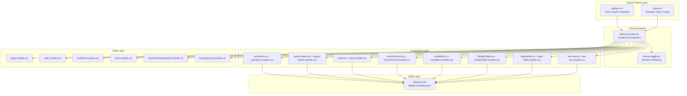
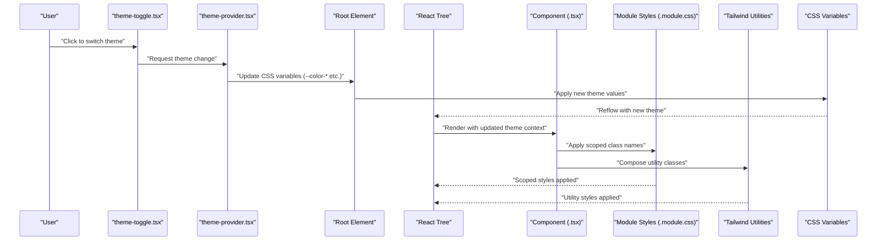
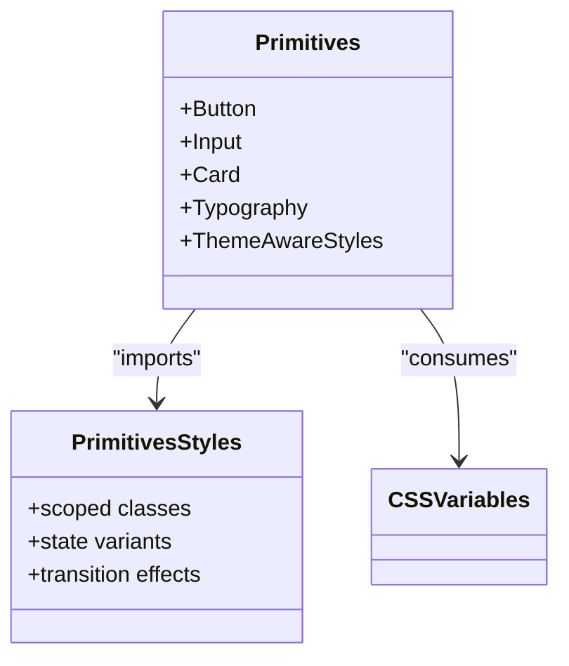
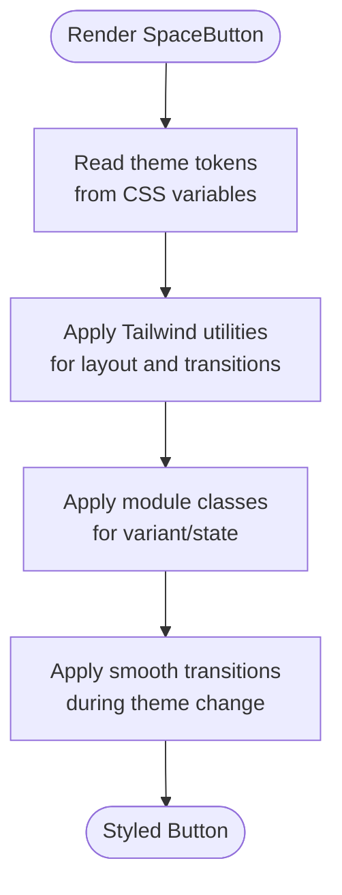
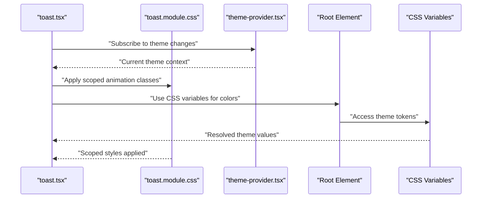
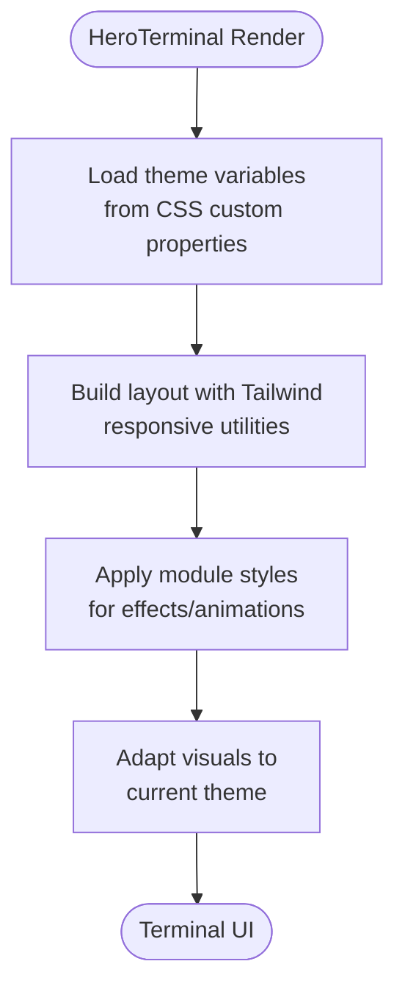
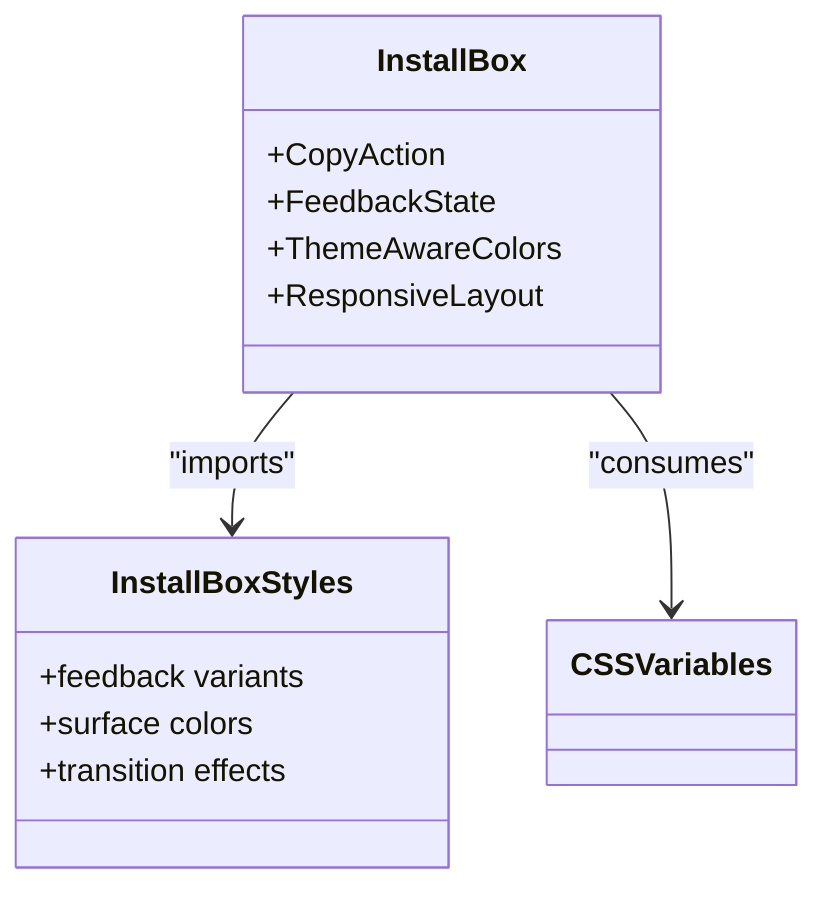
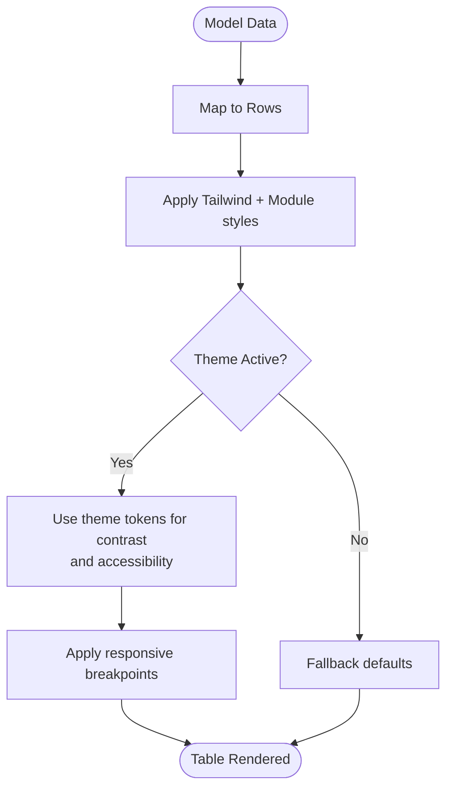
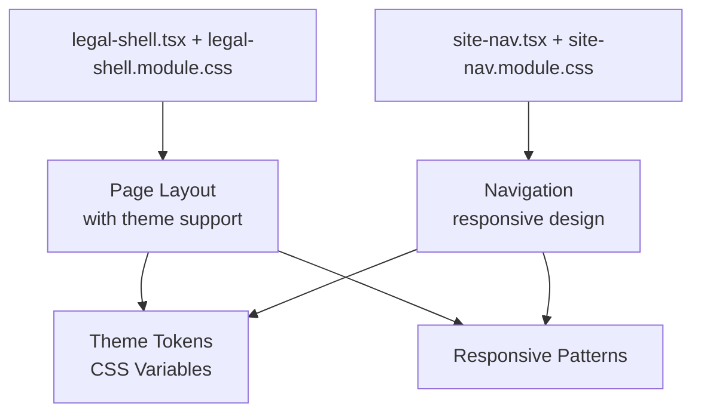
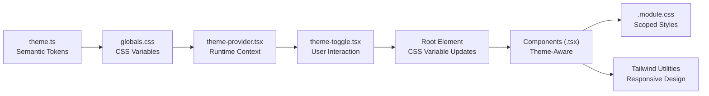

# Styling System

<cite>
**Referenced Files in This Document**
- [globals.css](file://src/app/globals.css)
- [theme.ts](file://src/config/theme.ts)
- [primitives.module.css](file://src/components/ui/primitives.module.css)
- [primitives.tsx](file://src/components/ui/primitives.tsx)
- [space-button.module.css](file://src/components/ui/space-button.module.css)
- [space-button.tsx](file://src/components/ui/space-button.tsx)
- [toast.module.css](file://src/components/ui/toast.module.css)
- [toast.tsx](file://src/components/ui/toast.tsx)
- [HeroTerminal.module.css](file://src/components/HeroTerminal.module.css)
- [HeroTerminal.tsx](file://src/components/HeroTerminal.tsx)
- [InstallBox.module.css](file://src/components/InstallBox.module.css)
- [InstallBox.tsx](file://src/components/InstallBox.tsx)
- [ModelsTable.module.css](file://src/components/ModelsTable.module.css)
- [ModelsTable.tsx](file://src/components/ModelsTable.tsx)
- [legal-shell.module.css](file://src/components/legal-shell.module.css)
- [legal-shell.tsx](file://src/components/legal-shell.tsx)
- [site-nav.module.css](file://src/components/site-nav.module.css)
- [site-nav.tsx](file://src/components/site-nav.tsx)
- [theme-provider.tsx](file://src/components/theme-provider.tsx)
- [theme-toggle.tsx](file://src/components/theme-toggle.tsx)
- [auth.module.css](file://src/app/auth.module.css)
- [page.module.css](file://src/app/page.module.css)
- [chat.module.css](file://src/app/chat/chat.module.css)
- [cli.module.css](file://src/app/cli/cli.module.css)
- [dashboard.module.css](file://src/app/dashboard/dashboard.module.css)
- [pricing.module.css](file://src/app/pricing/pricing.module.css)
- [next.config.ts](file://next.config.ts)
- [package.json](file://package.json)
</cite>

## Update Summary
**Changes Made**
- Updated global styling architecture to emphasize CSS variables and theme system
- Enhanced documentation of dark/light mode transitions and runtime theme switching
- Expanded responsive design patterns and breakpoint management
- Added detailed coverage of CSS custom properties usage throughout the application
- Updated component examples to reflect modern styling practices with CSS variables

## Table of Contents
1. [Introduction](#introduction)
2. [Project Structure](#project-structure)
3. [Core Components](#core-components)
4. [Architecture Overview](#architecture-overview)
5. [Detailed Component Analysis](#detailed-component-analysis)
6. [Dependency Analysis](#dependency-analysis)
7. [Performance Considerations](#performance-considerations)
8. [Troubleshooting Guide](#troubleshooting-guide)
9. [Conclusion](#conclusion)
10. [Appendices](#appendices)

## Introduction
This document explains the modern styling architecture that combines Tailwind CSS, CSS Modules, and a comprehensive theme system built on CSS custom properties. The system emphasizes global styling updates with CSS variables, robust theme support, seamless dark/light mode transitions, and enhanced responsive design patterns. It covers design tokens (colors, typography, spacing), responsive breakpoints, component-scoped styles via CSS Modules, integration with a global theme system, dark mode implementation, and cross-browser compatibility approaches. The goal is to provide clear guidelines for creating consistent styles across the application while maintaining performance and accessibility through modern CSS practices.

## Project Structure
The styling system is organized around:
- Global CSS custom properties defining theme tokens at the root level
- A centralized theme configuration file for semantic token management
- Component-scoped styles using CSS Modules for encapsulation
- Theme provider and toggle utilities for runtime theme switching with smooth transitions
- Tailwind CSS for utility-first styling and responsive design patterns

**Diagram sources**
- [globals.css](file://src/app/globals.css)
- [theme.ts](file://src/config/theme.ts)
- [theme-provider.tsx](file://src/components/theme-provider.tsx)
- [theme-toggle.tsx](file://src/components/theme-toggle.tsx)
- [primitives.tsx](file://src/components/ui/primitives.tsx)
- [primitives.module.css](file://src/components/ui/primitives.module.css)

**Section sources**
- [globals.css](file://src/app/globals.css)
- [theme.ts](file://src/config/theme.ts)
- [theme-provider.tsx](file://src/components/theme-provider.tsx)
- [theme-toggle.tsx](file://src/components/theme-toggle.tsx)
- [next.config.ts](file://next.config.ts)
- [package.json](file://package.json)

## Core Components
- **Global Theme Variables**: Centralized CSS custom properties define color tokens, typography scales, spacing units, and breakpoints. These are applied globally at the root level and consumed by all components through CSS variable references.
- **Theme Configuration**: A single source of truth for semantic tokens (e.g., brand colors, surface tones, text hierarchy) with mappings between semantic names and concrete values, enabling easy updates and theming.
- **Theme Provider and Toggle**: Provider injects current theme context into the React tree with persistence support. Toggle component switches between light/dark modes by updating CSS variables on the root element with smooth transitions.
- **Component-Scoped Styles (CSS Modules)**: Each component has a corresponding .module.css file for encapsulated styles. Module classes are imported as objects and composed with Tailwind utilities for predictable, maintainable styling.
- **Enhanced Responsive Design**: Comprehensive breakpoint system aligned with Tailwind's defaults, with custom CSS variables for media queries in complex scenarios.

**Updated** Enhanced focus on CSS custom properties and runtime theme switching capabilities.

**Section sources**
- [globals.css](file://src/app/globals.css)
- [theme.ts](file://src/config/theme.ts)
- [theme-provider.tsx](file://src/components/theme-provider.tsx)
- [theme-toggle.tsx](file://src/components/theme-toggle.tsx)
- [primitives.tsx](file://src/components/ui/primitives.tsx)
- [primitives.module.css](file://src/components/ui/primitives.module.css)
- [space-button.tsx](file://src/components/ui/space-button.tsx)
- [space-button.module.css](file://src/components/ui/space-button.module.css)
- [toast.tsx](file://src/components/ui/toast.tsx)
- [toast.module.css](file://src/components/ui/toast.module.css)
- [HeroTerminal.tsx](file://src/components/HeroTerminal.tsx)
- [HeroTerminal.module.css](file://src/components/HeroTerminal.module.css)
- [InstallBox.tsx](file://src/components/InstallBox.tsx)
- [InstallBox.module.css](file://src/components/InstallBox.module.css)
- [ModelsTable.tsx](file://src/components/ModelsTable.tsx)
- [ModelsTable.module.css](file://src/components/ModelsTable.module.css)
- [legal-shell.tsx](file://src/components/legal-shell.tsx)
- [legal-shell.module.css](file://src/components/legal-shell.module.css)
- [site-nav.tsx](file://src/components/site-nav.tsx)
- [site-nav.module.css](file://src/components/site-nav.module.css)
- [page.module.css](file://src/app/page.module.css)
- [auth.module.css](file://src/app/auth.module.css)
- [chat.module.css](file://src/app/chat/chat.module.css)
- [cli.module.css](file://src/app/cli/cli.module.css)
- [dashboard.module.css](file://src/app/dashboard/dashboard.module.css)
- [pricing.module.css](file://src/app/pricing/pricing.module.css)

## Architecture Overview
The styling architecture layers three modern systems with enhanced CSS variable support:
- **Design tokens and global variables** (CSS custom properties) with runtime switching
- **Utility-first styling** (Tailwind CSS) with responsive design patterns
- **Component-scoped styles** (CSS Modules) with theme-aware composition

**Updated** Enhanced sequence diagram showing CSS variable updates and reflow process.

**Diagram sources**
- [theme-toggle.tsx](file://src/components/theme-toggle.tsx)
- [theme-provider.tsx](file://src/components/theme-provider.tsx)
- [globals.css](file://src/app/globals.css)
- [primitives.tsx](file://src/components/ui/primitives.tsx)
- [primitives.module.css](file://src/components/ui/primitives.module.css)

## Detailed Component Analysis

### Primitives Layer
Primitives define foundational UI building blocks (buttons, inputs, cards, typography wrappers) with enhanced theme support:
- Consume theme tokens from CSS custom properties for dynamic theming
- Compose Tailwind utilities for layout and spacing with responsive patterns
- Use CSS Modules for component-specific overrides and complex states
- Support smooth transitions during theme changes

**Updated** Added theme-aware styling and transition effects support.

**Diagram sources**
- [primitives.tsx](file://src/components/ui/primitives.tsx)
- [primitives.module.css](file://src/components/ui/primitives.module.css)

**Section sources**
- [primitives.tsx](file://src/components/ui/primitives.tsx)
- [primitives.module.css](file://src/components/ui/primitives.module.css)

### Space Button
A themed button demonstrating modern composition patterns:
- Tailwind utilities for layout, spacing, and transitions with responsive behavior
- CSS Modules for variant-specific styles (size, state) with theme awareness
- Theme tokens for colors and focus rings via CSS custom properties
- Smooth transitions during theme switching

**Updated** Added transition effects during theme changes.

**Diagram sources**
- [space-button.tsx](file://src/components/ui/space-button.tsx)
- [space-button.module.css](file://src/components/ui/space-button.module.css)

**Section sources**
- [space-button.tsx](file://src/components/ui/space-button.tsx)
- [space-button.module.css](file://src/components/ui/space-button.module.css)

### Toast Notification
Toast uses enhanced styling patterns:
- Scoped animations and positioning via CSS Modules with theme-aware transitions
- Theme-aware colors and contrast for readability across both modes
- Tailwind utilities for spacing and alignment with responsive behavior
- Smooth appearance/disappearance animations during theme changes

**Updated** Enhanced sequence showing CSS variable resolution and theme subscription.

**Diagram sources**
- [toast.tsx](file://src/components/ui/toast.tsx)
- [toast.module.css](file://src/components/ui/toast.module.css)
- [theme-provider.tsx](file://src/components/theme-provider.tsx)

**Section sources**
- [toast.tsx](file://src/components/ui/toast.tsx)
- [toast.module.css](file://src/components/ui/toast.module.css)

### Hero Terminal
Demonstrates advanced component styling with enhanced visual effects:
- CSS Modules for terminal-like visuals and animations with theme support
- Tailwind utilities for responsive layout with mobile-first approach
- Theme tokens for background and text contrast ensuring accessibility
- Dynamic visual effects that adapt to theme changes

**Updated** Enhanced flow showing theme adaptation process.

**Diagram sources**
- [HeroTerminal.tsx](file://src/components/HeroTerminal.tsx)
- [HeroTerminal.module.css](file://src/components/HeroTerminal.module.css)

**Section sources**
- [HeroTerminal.tsx](file://src/components/HeroTerminal.tsx)
- [HeroTerminal.module.css](file://src/components/HeroTerminal.module.css)

### Install Box
Shows modern interactive element styling patterns:
- Module classes for copy-to-clipboard feedback with smooth transitions
- Tailwind utilities for spacing and typography with responsive behavior
- Theme tokens for surface and border colors ensuring consistency
- State management for user interactions with visual feedback

**Updated** Added theme-aware colors and transition effects.

**Diagram sources**
- [InstallBox.tsx](file://src/components/InstallBox.tsx)
- [InstallBox.module.css](file://src/components/InstallBox.module.css)

**Section sources**
- [InstallBox.tsx](file://src/components/InstallBox.tsx)
- [InstallBox.module.css](file://src/components/InstallBox.module.css)

### Models Table
Data presentation pattern with enhanced theming:
- Module classes for table structure and hover states with theme support
- Tailwind utilities for responsive columns and spacing with mobile-first approach
- Theme tokens for borders and alternating rows ensuring accessibility
- Dynamic row highlighting that adapts to theme changes

**Updated** Enhanced flow showing responsive breakpoints and accessibility considerations.

**Diagram sources**
- [ModelsTable.tsx](file://src/components/ModelsTable.tsx)
- [ModelsTable.module.css](file://src/components/ModelsTable.module.css)

**Section sources**
- [ModelsTable.tsx](file://src/components/ModelsTable.tsx)
- [ModelsTable.module.css](file://src/components/ModelsTable.module.css)

### Legal Shell and Site Navigation
Shell and navigation patterns with enhanced theming:
- Legal shell provides consistent page scaffolding with module-based layout and theme support
- Site navigation uses module classes for active states and responsive behavior with smooth transitions
- Both consume theme tokens for consistent contrast and surfaces across all screen sizes
- Mobile-first responsive design patterns for optimal user experience

**Updated** Enhanced diagram showing responsive patterns and theme support.

**Diagram sources**
- [legal-shell.tsx](file://src/components/legal-shell.tsx)
- [legal-shell.module.css](file://src/components/legal-shell.module.css)
- [site-nav.tsx](file://src/components/site-nav.tsx)
- [site-nav.module.css](file://src/components/site-nav.module.css)

**Section sources**
- [legal-shell.tsx](file://src/components/legal-shell.tsx)
- [legal-shell.module.css](file://src/components/legal-shell.module.css)
- [site-nav.tsx](file://src/components/site-nav.tsx)
- [site-nav.module.css](file://src/components/site-nav.module.css)

### Page-Level Modules
Pages may include their own module files for specific layouts or overrides with enhanced theming:
- Home page module with responsive design patterns
- Authentication page module with form styling and validation feedback
- Chat and CLI page modules with terminal-inspired aesthetics
- Dashboard and pricing page modules with data visualization support

These modules compose with Tailwind utilities and theme tokens to maintain consistency while allowing page-specific customization with smooth transitions.

**Updated** Enhanced description emphasizing responsive design patterns and smooth transitions.

**Section sources**
- [page.module.css](file://src/app/page.module.css)
- [auth.module.css](file://src/app/auth.module.css)
- [chat.module.css](file://src/app/chat/chat.module.css)
- [cli.module.css](file://src/app/cli/cli.module.css)
- [dashboard.module.css](file://src/app/dashboard/dashboard.module.css)
- [pricing.module.css](file://src/app/pricing/pricing.module.css)

## Dependency Analysis
Styling dependencies flow from global tokens to components with enhanced CSS variable support:
- Global CSS defines CSS custom properties for tokens with theme contexts
- Theme configuration centralizes token definitions with semantic mappings
- Components import module styles and use Tailwind utilities with theme awareness
- Theme provider updates root variables at runtime with smooth transitions

**Updated** Enhanced dependency graph showing runtime theme switching and responsive design flow.

**Diagram sources**
- [theme.ts](file://src/config/theme.ts)
- [globals.css](file://src/app/globals.css)
- [theme-provider.tsx](file://src/components/theme-provider.tsx)
- [theme-toggle.tsx](file://src/components/theme-toggle.tsx)
- [primitives.tsx](file://src/components/ui/primitives.tsx)
- [primitives.module.css](file://src/components/ui/primitives.module.css)

**Section sources**
- [theme.ts](file://src/config/theme.ts)
- [globals.css](file://src/app/globals.css)
- [theme-provider.tsx](file://src/components/theme-provider.tsx)
- [theme-toggle.tsx](file://src/components/theme-toggle.tsx)
- [primitives.tsx](file://src/components/ui/primitives.tsx)
- [primitives.module.css](file://src/components/ui/primitives.module.css)

## Performance Considerations
- Prefer Tailwind utilities for common layout and spacing to reduce custom CSS overhead
- Keep CSS Modules small and focused; avoid duplicating utilities already provided by Tailwind
- Use CSS variables for frequently changing values (colors, radii) to minimize reflows during theme switches
- Implement smooth transitions with `transition` properties for better user experience
- Avoid heavy animations in critical paths; prefer transform and opacity for smoothness
- Defer non-critical styles where possible to improve initial paint performance
- Leverage browser caching for CSS custom properties and theme configurations

**Updated** Enhanced performance considerations focusing on CSS variables efficiency and smooth transitions.

## Troubleshooting Guide
Common issues and resolutions with enhanced debugging guidance:
- **Theme not applying**:
  - Ensure the theme provider wraps the application tree and root variables are updated
  - Verify that components read CSS variables rather than hard-coded values
  - Check browser developer tools to confirm CSS variable resolution

- **Module styles not taking effect**:
  - Confirm correct import of module classes and no naming conflicts
  - Check specificity; Tailwind utilities should be composed before module overrides when necessary
  - Verify CSS custom property inheritance and scope

- **Dark mode contrast problems**:
  - Validate token mappings for dark mode; ensure sufficient contrast ratios (WCAG compliance)
  - Test with browser dev tools' color contrast checker and accessibility audit tools
  - Review CSS variable fallbacks and default values

- **Responsive layout breaks**:
  - Review breakpoint usage; align with Tailwind's default breakpoints or custom configuration
  - Inspect computed styles to verify variable resolution across different screen sizes
  - Test mobile-first responsive patterns and progressive enhancement

- **Smooth transition issues**:
  - Ensure `transition` properties are applied to elements with animatable properties
  - Check for conflicting transition declarations in CSS Modules
  - Verify that theme changes trigger proper reflow without jank

**Updated** Enhanced troubleshooting guide with CSS variable debugging and transition troubleshooting.

**Section sources**
- [theme-provider.tsx](file://src/components/theme-provider.tsx)
- [theme-toggle.tsx](file://src/components/theme-toggle.tsx)
- [globals.css](file://src/app/globals.css)
- [primitives.module.css](file://src/components/ui/primitives.module.css)

## Conclusion
This modern styling system unifies Tailwind CSS, CSS Modules, and a robust theme layer through design tokens and CSS custom properties. By centralizing tokens, scoping component styles, composing utilities, and implementing runtime theme switching with smooth transitions, the application achieves consistency, maintainability, and flexibility. The provider/toggle mechanism enables seamless dark mode support, while enhanced responsive design patterns ensure optimal user experience across devices and browsers. The emphasis on CSS variables provides performance benefits and maintainability improvements over traditional CSS approaches.

**Updated** Enhanced conclusion emphasizing modern CSS practices and performance benefits.

## Appendices

### Design Token Guidelines
- **Colors**:
  - Define semantic tokens (e.g., primary, secondary, surface, text) in global CSS variables
  - Provide light and dark variants under a theme context with smooth transitions
  - Ensure WCAG compliance for contrast ratios in both themes
- **Typography**:
  - Establish type scale tokens (font sizes, line heights, weights) for headings and body text
  - Use CSS variables for font families and fallback stacks
  - Implement responsive typography scaling with fluid type scales
- **Spacing**:
  - Standardize spacing units (e.g., 4px base) and expose as variables for margins and paddings
  - Create spacing scales for consistent rhythm across components
- **Breakpoints**:
  - Align with Tailwind's breakpoints; define CSS variables if needed for media queries in custom styles
  - Implement mobile-first responsive design patterns
  - Use CSS custom properties for complex responsive behaviors

**Updated** Enhanced guidelines with WCAG compliance and responsive typography.

**Section sources**
- [globals.css](file://src/app/globals.css)
- [theme.ts](file://src/config/theme.ts)

### Creating Consistent Styles
- Prefer Tailwind utilities for layout, spacing, and typography with responsive patterns
- Use CSS Modules only for component-specific logic (variants, complex states, animations)
- Reference theme tokens via CSS variables instead of hard-coded values for maintainability
- Maintain a shared primitives layer to enforce consistency across components
- Implement smooth transitions for theme changes and user interactions
- Follow mobile-first responsive design principles

**Updated** Enhanced guidelines with transitions and mobile-first principles.

**Section sources**
- [primitives.tsx](file://src/components/ui/primitives.tsx)
- [primitives.module.css](file://src/components/ui/primitives.module.css)
- [space-button.tsx](file://src/components/ui/space-button.tsx)
- [space-button.module.css](file://src/components/ui/space-button.module.css)

### Dark Mode Implementation
- Update root CSS variables when toggling themes with smooth transitions
- Ensure all components consume variables for colors and surfaces
- Test contrast and legibility in both modes with accessibility tools
- Persist user preference via local storage or cookies with fallback handling
- Implement system preference detection and automatic theme switching
- Provide manual override options for user control

**Updated** Enhanced dark mode implementation with system preference detection and accessibility testing.

**Section sources**
- [theme-provider.tsx](file://src/components/theme-provider.tsx)
- [theme-toggle.tsx](file://src/components/theme-toggle.tsx)
- [globals.css](file://src/app/globals.css)

### Cross-Browser Compatibility Approaches
- Use widely supported CSS features (variables, flexbox, grid) with fallbacks
- Provide graceful degradation for advanced features (animations, gradients)
- Validate with browser developer tools and automated accessibility checks
- Keep Tailwind configuration aligned with target environments
- Test CSS custom property support and implement polyfills if necessary
- Ensure smooth transitions work across different rendering engines

**Updated** Enhanced compatibility approaches with polyfill strategies and engine-specific considerations.

**Section sources**
- [next.config.ts](file://next.config.ts)
- [package.json](file://package.json)

### Enhanced Responsive Design Patterns
- Implement mobile-first approach with progressive enhancement
- Use CSS custom properties for complex responsive behaviors
- Leverage Tailwind's responsive utilities for common patterns
- Test responsive layouts across different viewport sizes and orientations
- Optimize touch interactions for mobile devices
- Consider performance implications of responsive images and assets

**New Section** Added comprehensive responsive design patterns section.

**Section sources**
- [globals.css](file://src/app/globals.css)
- [next.config.ts](file://next.config.ts)