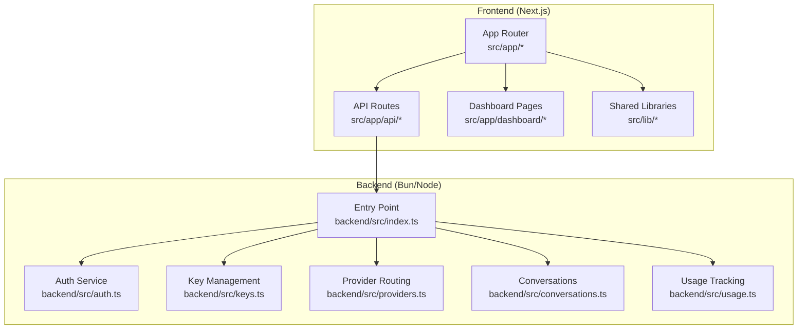
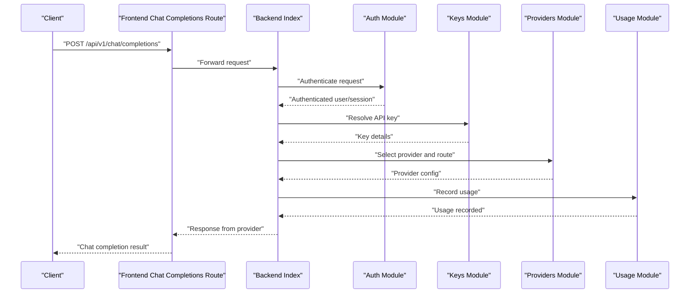
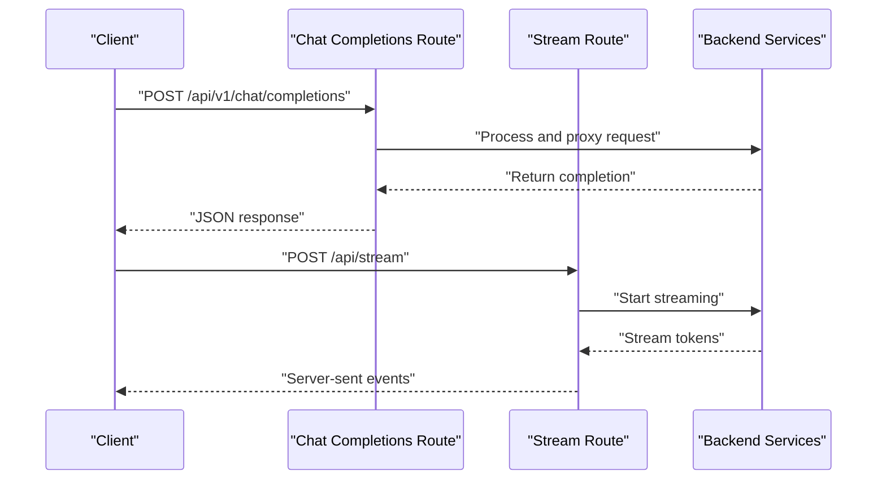
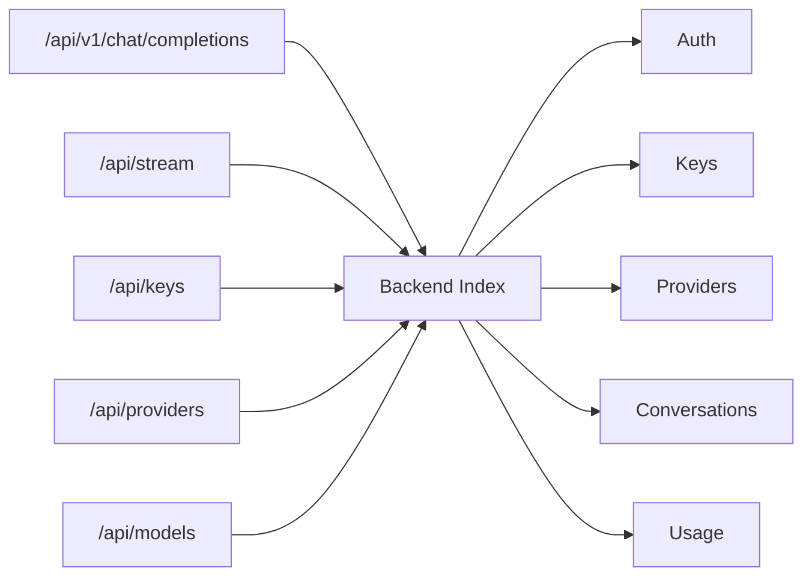

# Getting Started

<cite>
**Referenced Files in This Document**
- [README.md](file://README.md)
- [package.json](file://package.json)
- [backend/package.json](file://backend/package.json)
- [next.config.ts](file://next.config.ts)
- [tsconfig.json](file://tsconfig.json)
- [backend/tsconfig.json](file://backend/tsconfig.json)
- [src/app/layout.tsx](file://src/app/layout.tsx)
- [src/app/page.tsx](file://src/app/page.tsx)
- [src/app/login/page.tsx](file://src/app/login/page.tsx)
- [src/app/signup/page.tsx](file://src/app/signup/page.tsx)
- [src/app/dashboard/layout.tsx](file://src/app/dashboard/layout.tsx)
- [src/app/dashboard/page.tsx](file://src/app/dashboard/page.tsx)
- [src/app/api/auth/login/route.ts](file://src/app/api/auth/login/route.ts)
- [src/app/api/auth/signup/route.ts](file://src/app/api/auth/signup/route.ts)
- [src/app/api/v1/chat/completions/route.ts](file://src/app/api/v1/chat/completions/route.ts)
- [src/app/api/stream/route.ts](file://src/app/api/stream/route.ts)
- [src/app/api/keys/route.ts](file://src/app/api/keys/route.ts)
- [src/app/api/providers/route.ts](file://src/app/api/providers/route.ts)
- [src/app/api/models/route.ts](file://src/app/api/models/route.ts)
- [src/lib/db.ts](file://src/lib/db.ts)
- [src/lib/api.ts](file://src/lib/api.ts)
- [backend/src/index.ts](file://backend/src/index.ts)
- [backend/src/auth.ts](file://backend/src/auth.ts)
- [backend/src/keys.ts](file://backend/src/keys.ts)
- [backend/src/providers.ts](file://backend/src/providers.ts)
- [backend/src/conversations.ts](file://backend/src/conversations.ts)
- [backend/src/usage.ts](file://backend/src/usage.ts)
</cite>

## Table of Contents
1. [Introduction](#introduction)
2. [Project Structure](#project-structure)
3. [Core Components](#core-components)
4. [Architecture Overview](#architecture-overview)
5. [Detailed Component Analysis](#detailed-component-analysis)
6. [Dependency Analysis](#dependency-analysis)
7. [Performance Considerations](#performance-considerations)
8. [Troubleshooting Guide](#troubleshooting-guide)
9. [Conclusion](#conclusion)
10. [Appendices](#appendices)

## Introduction
CheapModels is a unified AI model management platform that provides cost-effective integration with multiple AI providers through a single interface. It offers:
- A Next.js-based frontend dashboard for managing keys, providers, models, and usage analytics
- An OpenAI-compatible API surface for chat completions and streaming
- Optional backend services for authentication, key management, provider routing, conversations, and usage tracking

This guide helps you install both frontend and backend components, set up your environment, configure provider API keys, create your first account, and make your first API call using the OpenAI-compatible endpoints.

## Project Structure
The repository includes:
- Frontend (Next.js App Router): pages, API routes, shared UI components, and configuration
- Backend (Bun/Node service): authentication, keys, providers, conversations, usage, and database access
- Shared configuration files for TypeScript and build settings

**Diagram sources**
- [src/app/layout.tsx](file://src/app/layout.tsx)
- [src/app/page.tsx](file://src/app/page.tsx)
- [src/app/api/v1/chat/completions/route.ts](file://src/app/api/v1/chat/completions/route.ts)
- [backend/src/index.ts](file://backend/src/index.ts)
- [backend/src/auth.ts](file://backend/src/auth.ts)
- [backend/src/keys.ts](file://backend/src/keys.ts)
- [backend/src/providers.ts](file://backend/src/providers.ts)
- [backend/src/conversations.ts](file://backend/src/conversations.ts)
- [backend/src/usage.ts](file://backend/src/usage.ts)

**Section sources**
- [README.md](file://README.md)
- [package.json](file://package.json)
- [backend/package.json](file://backend/package.json)
- [next.config.ts](file://next.config.ts)
- [tsconfig.json](file://tsconfig.json)
- [backend/tsconfig.json](file://backend/tsconfig.json)

## Core Components
- Frontend Application
  - Entry points and layout for the web app
  - Authentication pages for login and signup
  - Dashboard pages for keys, providers, models, analytics, billing, and settings
  - API routes for OpenAI-compatible chat completions and streaming
- Backend Services
  - Server entry point and core modules for auth, keys, providers, conversations, and usage
  - Database access utilities used by backend modules

Key responsibilities:
- Frontend API routes expose OpenAI-compatible endpoints and orchestrate calls to backend services
- Backend modules implement business logic for authentication, key storage, provider selection, conversation history, and usage metrics
- Shared libraries provide database and HTTP client utilities

**Section sources**
- [src/app/layout.tsx](file://src/app/layout.tsx)
- [src/app/page.tsx](file://src/app/page.tsx)
- [src/app/login/page.tsx](file://src/app/login/page.tsx)
- [src/app/signup/page.tsx](file://src/app/signup/page.tsx)
- [src/app/dashboard/layout.tsx](file://src/app/dashboard/layout.tsx)
- [src/app/dashboard/page.tsx](file://src/app/dashboard/page.tsx)
- [src/app/api/v1/chat/completions/route.ts](file://src/app/api/v1/chat/completions/route.ts)
- [src/app/api/stream/route.ts](file://src/app/api/stream/route.ts)
- [src/app/api/keys/route.ts](file://src/app/api/keys/route.ts)
- [src/app/api/providers/route.ts](file://src/app/api/providers/route.ts)
- [src/app/api/models/route.ts](file://src/app/api/models/route.ts)
- [src/lib/db.ts](file://src/lib/db.ts)
- [src/lib/api.ts](file://src/lib/api.ts)
- [backend/src/index.ts](file://backend/src/index.ts)
- [backend/src/auth.ts](file://backend/src/auth.ts)
- [backend/src/keys.ts](file://backend/src/keys.ts)
- [backend/src/providers.ts](file://backend/src/providers.ts)
- [backend/src/conversations.ts](file://backend/src/conversations.ts)
- [backend/src/usage.ts](file://backend/src/usage.ts)

## Architecture Overview
High-level flow for an OpenAI-compatible chat completion request:
- Client sends a POST to the chat completions endpoint
- Frontend route validates input and forwards to backend services
- Backend authenticates the request, resolves provider and key, proxies the call, tracks usage, and returns the response
- Streaming responses are supported via a dedicated stream endpoint

**Diagram sources**
- [src/app/api/v1/chat/completions/route.ts](file://src/app/api/v1/chat/completions/route.ts)
- [backend/src/index.ts](file://backend/src/index.ts)
- [backend/src/auth.ts](file://backend/src/auth.ts)
- [backend/src/keys.ts](file://backend/src/keys.ts)
- [backend/src/providers.ts](file://backend/src/providers.ts)
- [backend/src/usage.ts](file://backend/src/usage.ts)

## Detailed Component Analysis

### Installation and Environment Setup
- Prerequisites
  - Node.js and npm (for frontend)
  - Bun or Node.js (for backend)
  - A database system compatible with the project’s database layer
- Install dependencies
  - Frontend: run the package manager install command defined in the root package.json
  - Backend: run the package manager install command defined in backend/package.json
- Configure environment variables
  - Review next.config.ts for any required runtime configuration
  - Ensure database connection settings are provided where needed (see src/lib/db.ts)
- Build and run
  - Start the development server for the frontend
  - Start the backend service using the entry point in backend/src/index.ts

**Section sources**
- [package.json](file://package.json)
- [backend/package.json](file://backend/package.json)
- [next.config.ts](file://next.config.ts)
- [src/lib/db.ts](file://src/lib/db.ts)
- [backend/src/index.ts](file://backend/src/index.ts)

### Initial Configuration Steps
- Database setup
  - Initialize the database schema if required by the application
  - Verify connectivity using the database utility module
- Provider configuration
  - Use the providers API route to add or update provider configurations
  - Store provider-specific credentials securely
- Key management
  - Create and manage API keys via the keys API route
  - Associate keys with users or sessions as needed

**Section sources**
- [src/lib/db.ts](file://src/lib/db.ts)
- [src/app/api/providers/route.ts](file://src/app/api/providers/route.ts)
- [src/app/api/keys/route.ts](file://src/app/api/keys/route.ts)

### Setting Up API Keys for Different Providers
- Add provider definitions and credentials through the providers API
- Generate and store per-user API keys using the keys API
- Ensure keys are correctly associated with the intended provider and model scope

**Section sources**
- [src/app/api/providers/route.ts](file://src/app/api/providers/route.ts)
- [src/app/api/keys/route.ts](file://src/app/api/keys/route.ts)

### Creating Your First Account
- Navigate to the signup page to register a new account
- Log in using the login page to obtain a session or token for subsequent requests

**Section sources**
- [src/app/signup/page.tsx](file://src/app/signup/page.tsx)
- [src/app/login/page.tsx](file://src/app/login/page.tsx)
- [src/app/api/auth/signup/route.ts](file://src/app/api/auth/signup/route.ts)
- [src/app/api/auth/login/route.ts](file://src/app/api/auth/login/route.ts)

### Making Your First API Call (OpenAI-Compatible Endpoints)
- Use the chat completions endpoint to send a message and receive a response
- Optionally use the streaming endpoint for real-time token delivery

**Diagram sources**
- [src/app/api/v1/chat/completions/route.ts](file://src/app/api/v1/chat/completions/route.ts)
- [src/app/api/stream/route.ts](file://src/app/api/stream/route.ts)
- [backend/src/index.ts](file://backend/src/index.ts)

**Section sources**
- [src/app/api/v1/chat/completions/route.ts](file://src/app/api/v1/chat/completions/route.ts)
- [src/app/api/stream/route.ts](file://src/app/api/stream/route.ts)

### Using the Dashboard Interface
- Access the dashboard layout and main page to navigate features
- Manage keys, providers, models, analytics, billing, and settings from the dashboard pages

**Section sources**
- [src/app/dashboard/layout.tsx](file://src/app/dashboard/layout.tsx)
- [src/app/dashboard/page.tsx](file://src/app/dashboard/page.tsx)

## Dependency Analysis
Frontend and backend modules interact through well-defined API routes and services. The following diagram shows key relationships between frontend API routes and backend modules.

**Diagram sources**
- [src/app/api/v1/chat/completions/route.ts](file://src/app/api/v1/chat/completions/route.ts)
- [src/app/api/stream/route.ts](file://src/app/api/stream/route.ts)
- [src/app/api/keys/route.ts](file://src/app/api/keys/route.ts)
- [src/app/api/providers/route.ts](file://src/app/api/providers/route.ts)
- [src/app/api/models/route.ts](file://src/app/api/models/route.ts)
- [backend/src/index.ts](file://backend/src/index.ts)
- [backend/src/auth.ts](file://backend/src/auth.ts)
- [backend/src/keys.ts](file://backend/src/keys.ts)
- [backend/src/providers.ts](file://backend/src/providers.ts)
- [backend/src/conversations.ts](file://backend/src/conversations.ts)
- [backend/src/usage.ts](file://backend/src/usage.ts)

**Section sources**
- [src/app/api/v1/chat/completions/route.ts](file://src/app/api/v1/chat/completions/route.ts)
- [src/app/api/stream/route.ts](file://src/app/api/stream/route.ts)
- [src/app/api/keys/route.ts](file://src/app/api/keys/route.ts)
- [src/app/api/providers/route.ts](file://src/app/api/providers/route.ts)
- [src/app/api/models/route.ts](file://src/app/api/models/route.ts)
- [backend/src/index.ts](file://backend/src/index.ts)
- [backend/src/auth.ts](file://backend/src/auth.ts)
- [backend/src/keys.ts](file://backend/src/keys.ts)
- [backend/src/providers.ts](file://backend/src/providers.ts)
- [backend/src/conversations.ts](file://backend/src/conversations.ts)
- [backend/src/usage.ts](file://backend/src/usage.ts)

## Performance Considerations
- Prefer streaming for long-running or large responses to improve perceived latency
- Cache frequently accessed provider metadata and model lists at the frontend when appropriate
- Monitor usage metrics to identify heavy consumers and optimize routing strategies
- Keep database queries efficient and avoid unnecessary round-trips in hot paths

[No sources needed since this section provides general guidance]

## Troubleshooting Guide
Common issues and resolutions:
- Authentication failures
  - Ensure login/signup flows complete successfully and that session or token handling is correct
  - Check backend auth module behavior and error responses
- Missing or invalid API keys
  - Verify keys exist and are associated with the correct provider
  - Confirm permissions and scopes match the requested models
- Provider routing errors
  - Validate provider configuration and credentials
  - Inspect provider selection logic and fallback behavior
- Database connectivity problems
  - Confirm database connection settings and availability
  - Review database utility logs and error messages
- CORS or network issues
  - Ensure frontend and backend origins are configured correctly
  - Check firewall rules and proxy settings

**Section sources**
- [src/app/api/auth/login/route.ts](file://src/app/api/auth/login/route.ts)
- [src/app/api/auth/signup/route.ts](file://src/app/api/auth/signup/route.ts)
- [backend/src/auth.ts](file://backend/src/auth.ts)
- [src/app/api/keys/route.ts](file://src/app/api/keys/route.ts)
- [backend/src/keys.ts](file://backend/src/keys.ts)
- [src/app/api/providers/route.ts](file://src/app/api/providers/route.ts)
- [backend/src/providers.ts](file://backend/src/providers.ts)
- [src/lib/db.ts](file://src/lib/db.ts)

## Conclusion
You now have the essentials to install CheapModels, configure providers and keys, create an account, and make your first OpenAI-compatible API call. Use the dashboard to manage resources and monitor usage. For advanced scenarios, explore streaming and analytics features.

[No sources needed since this section summarizes without analyzing specific files]

## Appendices

### Quick Start Examples
- OpenAI-compatible chat completions
  - Send a POST request to the chat completions endpoint with your preferred payload format
  - Receive a JSON response containing the generated content
- Streaming responses
  - Use the streaming endpoint to receive incremental tokens as they are produced
- Dashboard navigation
  - Visit the dashboard to manage keys, providers, models, and view analytics

**Section sources**
- [src/app/api/v1/chat/completions/route.ts](file://src/app/api/v1/chat/completions/route.ts)
- [src/app/api/stream/route.ts](file://src/app/api/stream/route.ts)
- [src/app/dashboard/page.tsx](file://src/app/dashboard/page.tsx)