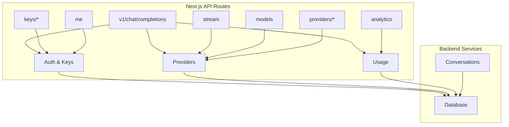
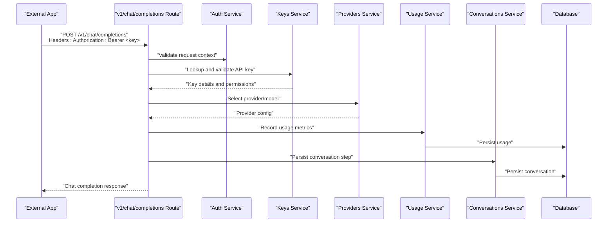
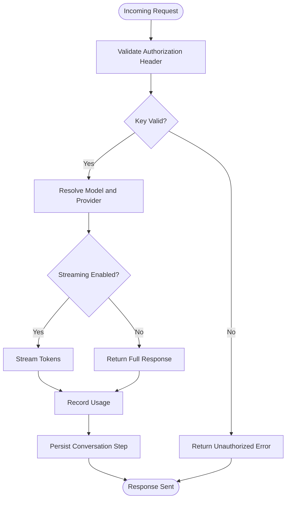
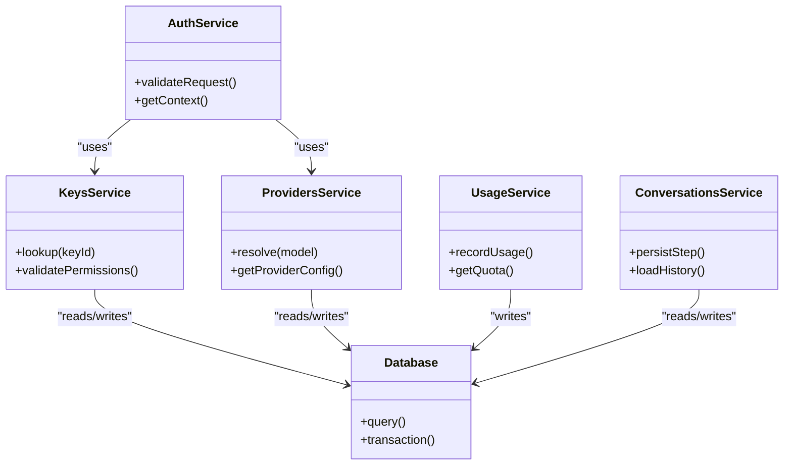
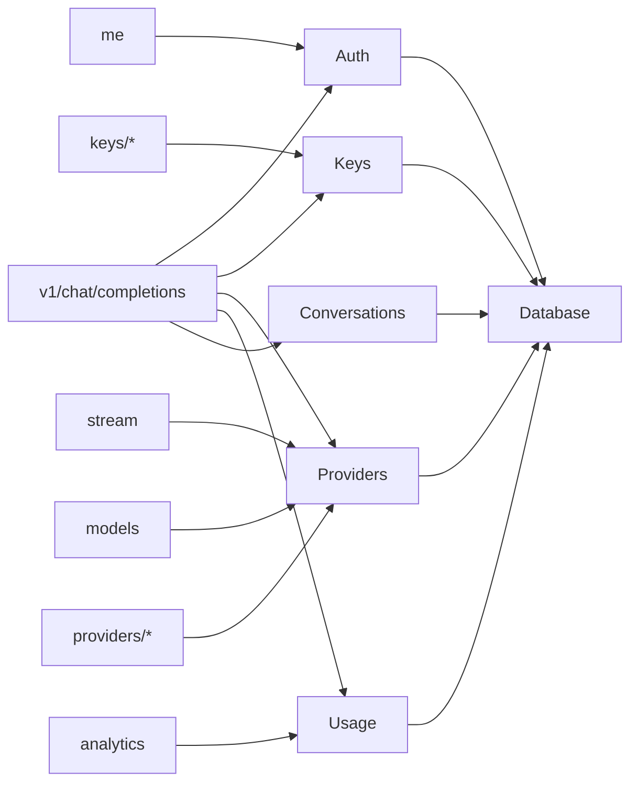

# Integration Guides

<cite>
**Referenced Files in This Document**
- [index.ts](file://backend/src/index.ts)
- [auth.ts](file://backend/src/auth.ts)
- [keys.ts](file://backend/src/keys.ts)
- [providers.ts](file://backend/src/providers.ts)
- [usage.ts](file://backend/src/usage.ts)
- [conversations.ts](file://backend/src/conversations.ts)
- [db.ts](file://backend/src/db.ts)
- [route.ts](file://src/app/api/v1/chat/completions/route.ts)
- [route.ts](file://src/app/api/stream/route.ts)
- [route.ts](file://src/app/api/models/route.ts)
- [route.ts](file://src/app/api/keys/route.ts)
- [route.ts](file://src/app/api/keys/[id]/route.ts)
- [route.ts](file://src/app/api/providers/route.ts)
- [route.ts](file://src/app/api/providers/[id]/route.ts)
- [route.ts](file://src/app/api/me/route.ts)
- [route.ts](file://src/app/api/analytics/route.ts)
- [api.ts](file://src/lib/api.ts)
- [package.json](file://backend/package.json)
</cite>

## Table of Contents
1. [Introduction](#introduction)
2. [Project Structure](#project-structure)
3. [Core Components](#core-components)
4. [Architecture Overview](#architecture-overview)
5. [Detailed Component Analysis](#detailed-component-analysis)
6. [Dependency Analysis](#dependency-analysis)
7. [Performance Considerations](#performance-considerations)
8. [Troubleshooting Guide](#troubleshooting-guide)
9. [Conclusion](#conclusion)
10. [Appendices](#appendices)

## Introduction
This document provides integration guides for connecting external applications to CheapModels. It focuses on:
- OpenAI compatibility layer and migration steps from existing OpenAI clients
- SDK usage patterns across popular languages and frameworks
- Authentication integration, error handling, and retry strategies
- Webhook implementations for real-time notifications and third-party integrations
- Security best practices, rate limiting considerations, and performance optimization techniques for production deployments

The guidance is grounded in the repository’s API routes and backend modules that implement authentication, key management, provider routing, usage tracking, and chat completions.

## Project Structure
CheapModels exposes a Next.js-based API surface under src/app/api and a Node/Bun backend module under backend/src. Key areas relevant to integration include:
- OpenAI-compatible chat completions endpoint
- Streaming support
- Model listing and provider management
- API key lifecycle endpoints
- User context and analytics endpoints
- Backend services for auth, keys, providers, usage, conversations, and database access

**Diagram sources**
- [route.ts](file://src/app/api/v1/chat/completions/route.ts)
- [route.ts](file://src/app/api/stream/route.ts)
- [route.ts](file://src/app/api/models/route.ts)
- [route.ts](file://src/app/api/keys/route.ts)
- [route.ts](file://src/app/api/keys/[id]/route.ts)
- [route.ts](file://src/app/api/providers/route.ts)
- [route.ts](file://src/app/api/providers/[id]/route.ts)
- [route.ts](file://src/app/api/me/route.ts)
- [route.ts](file://src/app/api/analytics/route.ts)
- [index.ts](file://backend/src/index.ts)
- [auth.ts](file://backend/src/auth.ts)
- [keys.ts](file://backend/src/keys.ts)
- [providers.ts](file://backend/src/providers.ts)
- [usage.ts](file://backend/src/usage.ts)
- [conversations.ts](file://backend/src/conversations.ts)
- [db.ts](file://backend/src/db.ts)

**Section sources**
- [index.ts](file://backend/src/index.ts)
- [auth.ts](file://backend/src/auth.ts)
- [keys.ts](file://backend/src/keys.ts)
- [providers.ts](file://backend/src/providers.ts)
- [usage.ts](file://backend/src/usage.ts)
- [conversations.ts](file://backend/src/conversations.ts)
- [db.ts](file://backend/src/db.ts)
- [route.ts](file://src/app/api/v1/chat/completions/route.ts)
- [route.ts](file://src/app/api/stream/route.ts)
- [route.ts](file://src/app/api/models/route.ts)
- [route.ts](file://src/app/api/keys/route.ts)
- [route.ts](file://src/app/api/keys/[id]/route.ts)
- [route.ts](file://src/app/api/providers/route.ts)
- [route.ts](file://src/app/api/providers/[id]/route.ts)
- [route.ts](file://src/app/api/me/route.ts)
- [route.ts](file://src/app/api/analytics/route.ts)

## Core Components
- OpenAI-compatible Chat Completions: The v1/chat/completions route implements an OpenAI-style interface for chat completions, enabling direct drop-in replacement for OpenAI clients by pointing them at CheapModels’ base URL.
- Streaming: The stream route supports server-sent events or streaming responses for real-time token delivery.
- Models and Providers: Endpoints list available models and manage provider configurations.
- API Keys: Endpoints create, list, update, and delete API keys used for client authentication.
- Usage Tracking: Usage counters and quotas are recorded per key/user.
- Conversations: Conversation state and history persistence.
- Database: Shared data access layer for all backend services.

These components collectively provide the foundation for integrating external applications with CheapModels using familiar OpenAI patterns while leveraging CheapModels-specific features like multi-provider routing and usage analytics.

**Section sources**
- [route.ts](file://src/app/api/v1/chat/completions/route.ts)
- [route.ts](file://src/app/api/stream/route.ts)
- [route.ts](file://src/app/api/models/route.ts)
- [route.ts](file://src/app/api/keys/route.ts)
- [route.ts](file://src/app/api/keys/[id]/route.ts)
- [route.ts](file://src/app/api/providers/route.ts)
- [route.ts](file://src/app/api/providers/[id]/route.ts)
- [usage.ts](file://backend/src/usage.ts)
- [conversations.ts](file://backend/src/conversations.ts)
- [db.ts](file://backend/src/db.ts)

## Architecture Overview
The integration architecture centers around an OpenAI-compatible API surface backed by modular services for authentication, key validation, provider selection, usage accounting, and conversation storage.

**Diagram sources**
- [route.ts](file://src/app/api/v1/chat/completions/route.ts)
- [auth.ts](file://backend/src/auth.ts)
- [keys.ts](file://backend/src/keys.ts)
- [providers.ts](file://backend/src/providers.ts)
- [usage.ts](file://backend/src/usage.ts)
- [conversations.ts](file://backend/src/conversations.ts)
- [db.ts](file://backend/src/db.ts)

## Detailed Component Analysis

### OpenAI Compatibility Layer
- Endpoint: POST /v1/chat/completions
- Purpose: Provide an OpenAI-compatible interface for chat completions so existing OpenAI clients can be redirected to CheapModels without code changes beyond base URL and API key configuration.
- Behavior: Validates authorization via API key, selects appropriate provider, streams or returns non-streaming responses, records usage, and persists conversation context.

Migration steps for existing OpenAI clients:
- Change the OpenAI base URL to point to CheapModels’ base URL.
- Replace the OpenAI API key with a CheapModels API key created via the keys endpoints.
- Keep request payloads identical to OpenAI format (messages, model, temperature, etc.).
- For streaming, ensure your client handles server-sent events or chunked responses as supported by the stream route.

**Diagram sources**
- [route.ts](file://src/app/api/v1/chat/completions/route.ts)
- [auth.ts](file://backend/src/auth.ts)
- [keys.ts](file://backend/src/keys.ts)
- [providers.ts](file://backend/src/providers.ts)
- [usage.ts](file://backend/src/usage.ts)
- [conversations.ts](file://backend/src/conversations.ts)

**Section sources**
- [route.ts](file://src/app/api/v1/chat/completions/route.ts)
- [auth.ts](file://backend/src/auth.ts)
- [keys.ts](file://backend/src/keys.ts)
- [providers.ts](file://backend/src/providers.ts)
- [usage.ts](file://backend/src/usage.ts)
- [conversations.ts](file://backend/src/conversations.ts)

### Streaming Support
- Endpoint: /stream
- Purpose: Enable real-time token streaming for long-running generation tasks.
- Behavior: Establishes a streaming connection, emits tokens as they become available, and ensures proper termination and error signaling.

Integration notes:
- Configure your client to handle streaming responses.
- Implement backpressure handling if needed to avoid overwhelming downstream consumers.
- Ensure timeouts and retries are configured for network interruptions.

**Section sources**
- [route.ts](file://src/app/api/stream/route.ts)

### Models and Providers Management
- Models endpoint: Lists available models exposed through CheapModels.
- Providers endpoints: Manage provider configurations and associations.

Integration notes:
- Use the models endpoint to discover supported models dynamically.
- Use providers endpoints to configure which underlying providers are active and how requests are routed.

**Section sources**
- [route.ts](file://src/app/api/models/route.ts)
- [route.ts](file://src/app/api/providers/route.ts)
- [route.ts](file://src/app/api/providers/[id]/route.ts)
- [providers.ts](file://backend/src/providers.ts)

### API Key Lifecycle
- Endpoints: Create, list, update, and delete API keys.
- Purpose: Securely manage client credentials for external applications.

Security notes:
- Store API keys securely in environment variables or secret managers.
- Rotate keys periodically and revoke compromised keys immediately.
- Scope keys to specific models or providers where possible.

**Section sources**
- [route.ts](file://src/app/api/keys/route.ts)
- [route.ts](file://src/app/api/keys/[id]/route.ts)
- [keys.ts](file://backend/src/keys.ts)

### User Context and Analytics
- Me endpoint: Returns authenticated user context.
- Analytics endpoint: Provides usage analytics and reporting.

Integration notes:
- Use the me endpoint to verify identity and fetch user-scoped settings.
- Use analytics to monitor usage trends and optimize cost/performance.

**Section sources**
- [route.ts](file://src/app/api/me/route.ts)
- [route.ts](file://src/app/api/analytics/route.ts)
- [usage.ts](file://backend/src/usage.ts)

### Backend Services and Data Access
- Auth service: Handles authentication logic and request context validation.
- Keys service: Manages API key lookup, validation, and permissions.
- Providers service: Resolves provider configurations and routing rules.
- Usage service: Tracks and persists usage metrics.
- Conversations service: Persists conversation history and state.
- Database: Centralized data access layer.

**Diagram sources**
- [auth.ts](file://backend/src/auth.ts)
- [keys.ts](file://backend/src/keys.ts)
- [providers.ts](file://backend/src/providers.ts)
- [usage.ts](file://backend/src/usage.ts)
- [conversations.ts](file://backend/src/conversations.ts)
- [db.ts](file://backend/src/db.ts)

**Section sources**
- [auth.ts](file://backend/src/auth.ts)
- [keys.ts](file://backend/src/keys.ts)
- [providers.ts](file://backend/src/providers.ts)
- [usage.ts](file://backend/src/usage.ts)
- [conversations.ts](file://backend/src/conversations.ts)
- [db.ts](file://backend/src/db.ts)

## Dependency Analysis
The API routes depend on backend services for core functionality. The following diagram shows high-level dependencies between routes and services.

**Diagram sources**
- [route.ts](file://src/app/api/v1/chat/completions/route.ts)
- [route.ts](file://src/app/api/stream/route.ts)
- [route.ts](file://src/app/api/models/route.ts)
- [route.ts](file://src/app/api/keys/route.ts)
- [route.ts](file://src/app/api/keys/[id]/route.ts)
- [route.ts](file://src/app/api/providers/route.ts)
- [route.ts](file://src/app/api/providers/[id]/route.ts)
- [route.ts](file://src/app/api/me/route.ts)
- [route.ts](file://src/app/api/analytics/route.ts)
- [auth.ts](file://backend/src/auth.ts)
- [keys.ts](file://backend/src/keys.ts)
- [providers.ts](file://backend/src/providers.ts)
- [usage.ts](file://backend/src/usage.ts)
- [conversations.ts](file://backend/src/conversations.ts)
- [db.ts](file://backend/src/db.ts)

**Section sources**
- [route.ts](file://src/app/api/v1/chat/completions/route.ts)
- [route.ts](file://src/app/api/stream/route.ts)
- [route.ts](file://src/app/api/models/route.ts)
- [route.ts](file://src/app/api/keys/route.ts)
- [route.ts](file://src/app/api/keys/[id]/route.ts)
- [route.ts](file://src/app/api/providers/route.ts)
- [route.ts](file://src/app/api/providers/[id]/route.ts)
- [route.ts](file://src/app/api/me/route.ts)
- [route.ts](file://src/app/api/analytics/route.ts)
- [auth.ts](file://backend/src/auth.ts)
- [keys.ts](file://backend/src/keys.ts)
- [providers.ts](file://backend/src/providers.ts)
- [usage.ts](file://backend/src/usage.ts)
- [conversations.ts](file://backend/src/conversations.ts)
- [db.ts](file://backend/src/db.ts)

## Performance Considerations
- Connection pooling: Ensure HTTP clients reuse connections to reduce latency.
- Timeouts and deadlines: Set reasonable request timeouts to prevent resource exhaustion.
- Backoff and jitter: Implement exponential backoff with jitter for retries to avoid thundering herds.
- Concurrency limits: Cap concurrent requests per key to protect against overload.
- Caching: Cache model listings and provider configurations where appropriate.
- Streaming efficiency: Process streamed tokens incrementally to minimize memory usage.
- Monitoring: Track latency percentiles and error rates; use analytics endpoints for insights.

[No sources needed since this section provides general guidance]

## Troubleshooting Guide
Common issues and resolutions:
- Authentication failures: Verify API key validity and scope; check authorization header format.
- Rate limiting: Inspect response headers for rate limit indicators; implement client-side throttling.
- Provider errors: Check provider configuration and availability; fallback to alternative providers if configured.
- Streaming interruptions: Handle partial responses and reconnect with idempotent behavior.
- Usage anomalies: Review usage logs and analytics; reconcile discrepancies with billing.

Operational tips:
- Log correlation IDs for request tracing.
- Surface actionable error messages to clients.
- Maintain health checks for dependent services.

**Section sources**
- [auth.ts](file://backend/src/auth.ts)
- [keys.ts](file://backend/src/keys.ts)
- [providers.ts](file://backend/src/providers.ts)
- [usage.ts](file://backend/src/usage.ts)
- [route.ts](file://src/app/api/v1/chat/completions/route.ts)
- [route.ts](file://src/app/api/stream/route.ts)

## Conclusion
CheapModels offers an OpenAI-compatible interface that enables seamless migration of existing clients. By configuring your base URL and API key, you can leverage multi-provider routing, streaming, usage analytics, and robust security controls. Follow the recommended authentication, error handling, retry, and performance practices to ensure reliable production deployments.

[No sources needed since this section summarizes without analyzing specific files]

## Appendices

### SDK Usage Examples and Patterns
- Python (OpenAI SDK):
  - Set OPENAI_BASE_URL to CheapModels base URL.
  - Set OPENAI_API_KEY to a CheapModels API key.
  - Use standard chat.completions.create calls.
- JavaScript/TypeScript (OpenAI SDK):
  - Initialize client with baseURL pointing to CheapModels.
  - Pass apiKey from environment.
  - Call chat.completions.create as usual.
- cURL:
  - Send POST to /v1/chat/completions with Authorization header.
  - Include JSON payload matching OpenAI schema.
- Go:
  - Configure OpenAI client with custom base URL and API key.
  - Invoke chat completions similarly to OpenAI examples.
- Java/Kotlin:
  - Set OpenAI client base URL and API key.
  - Use chat completions API as documented.

Note: These patterns rely on the OpenAI-compatible interface implemented by the v1/chat/completions route.

**Section sources**
- [route.ts](file://src/app/api/v1/chat/completions/route.ts)
- [api.ts](file://src/lib/api.ts)

### Webhook Implementations for Real-Time Notifications
- Event sources:
  - Completion finished
  - Usage threshold reached
  - Provider failure alerts
- Implementation pattern:
  - Register webhook URLs via admin or settings endpoints.
  - Send signed payloads with timestamps and event metadata.
  - Require idempotency keys to handle duplicates.
  - Retry with exponential backoff on transient failures.
- Verification:
  - Validate signatures server-side.
  - Reject expired or malformed requests.

[No sources needed since this section provides general guidance]

### Security Best Practices
- Transport security: Enforce HTTPS everywhere.
- Secret management: Store API keys in secure vaults or environment variables.
- Least privilege: Scope keys to required models and providers.
- Input validation: Sanitize and validate all inputs before forwarding to providers.
- Audit logging: Record access and administrative actions.
- Rotation policy: Automate key rotation and immediate revocation on compromise.

[No sources needed since this section provides general guidance]

### Rate Limiting Considerations
- Server-side:
  - Enforce per-key and per-model limits.
  - Return standardized rate limit headers.
- Client-side:
  - Observe rate limit headers and back off accordingly.
  - Implement circuit breakers for repeated failures.

[No sources needed since this section provides general guidance]

### Environment and Configuration
- Base URL: Point clients to CheapModels’ base URL.
- API keys: Provision via keys endpoints and inject into clients securely.
- Provider configs: Adjust via providers endpoints to control routing and failover.

**Section sources**
- [route.ts](file://src/app/api/keys/route.ts)
- [route.ts](file://src/app/api/providers/route.ts)
- [package.json](file://backend/package.json)