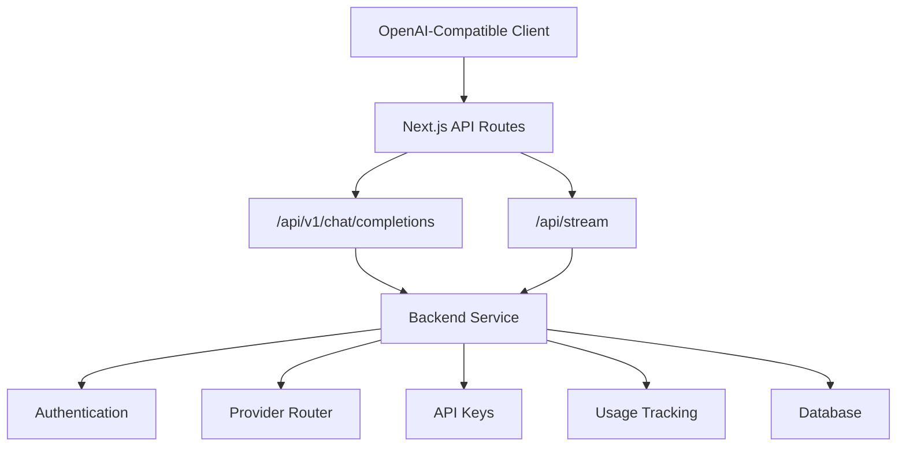
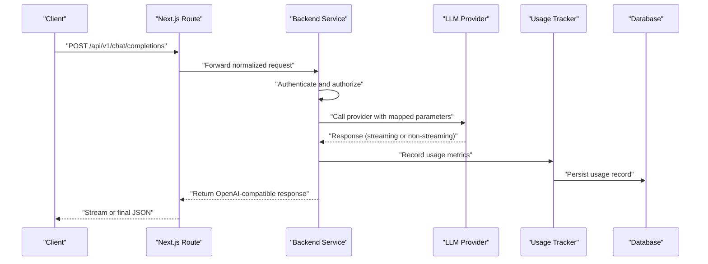
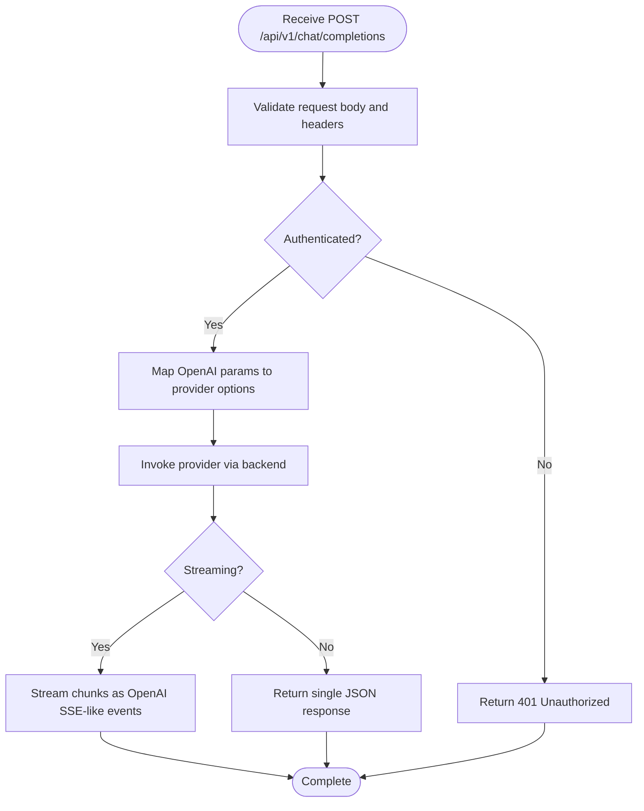
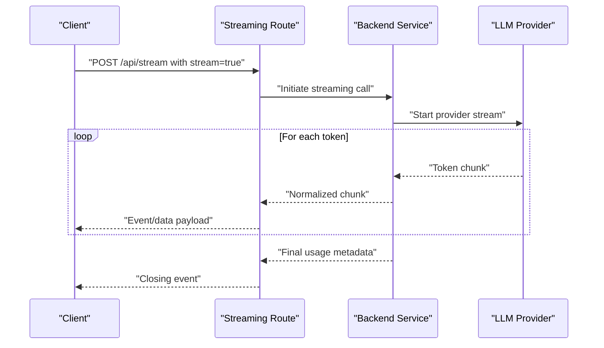
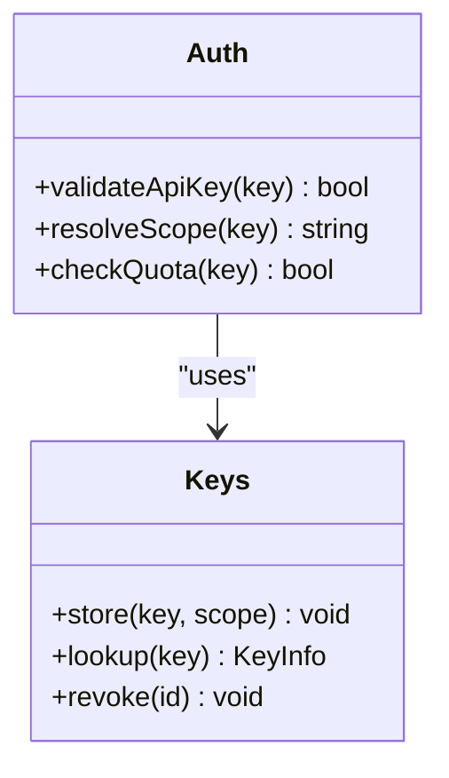
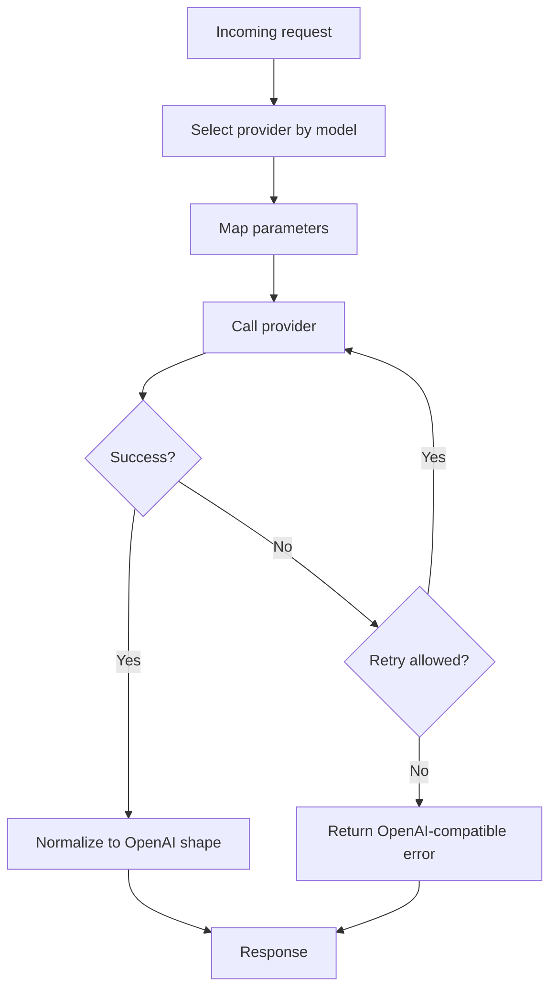
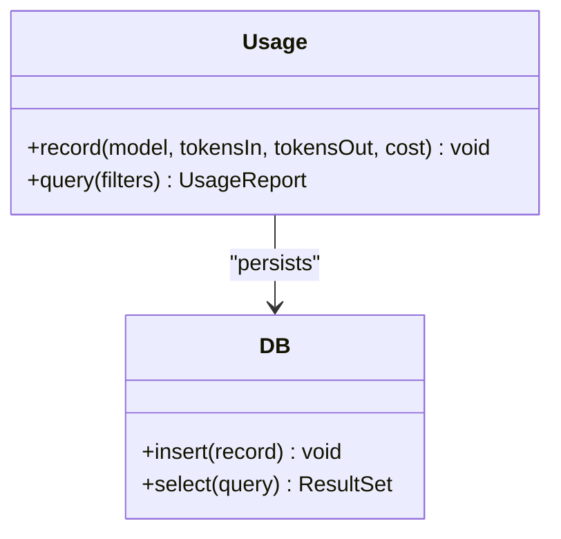
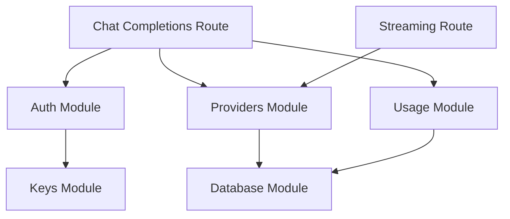

# OpenAI Compatibility Layer

<cite>
**Referenced Files in This Document**
- [route.ts](file://src/app/api/v1/chat/completions/route.ts)
- [route.ts](file://src/app/api/stream/route.ts)
- [index.ts](file://backend/src/index.ts)
- [auth.ts](file://backend/src/auth.ts)
- [providers.ts](file://backend/src/providers.ts)
- [keys.ts](file://backend/src/keys.ts)
- [usage.ts](file://backend/src/usage.ts)
- [db.ts](file://backend/src/db.ts)
</cite>

## Table of Contents
1. [Introduction](#introduction)
2. [Project Structure](#project-structure)
3. [Core Components](#core-components)
4. [Architecture Overview](#architecture-overview)
5. [Detailed Component Analysis](#detailed-component-analysis)
6. [Dependency Analysis](#dependency-analysis)
7. [Performance Considerations](#performance-considerations)
8. [Troubleshooting Guide](#troubleshooting-guide)
9. [Conclusion](#conclusion)
10. [Appendices](#appendices)

## Introduction
This document explains the OpenAI compatibility layer implemented in CheapModels, focusing on how it exposes OpenAI-compatible endpoints to enable seamless migration from existing OpenAI clients. The primary endpoint is /api/v1/chat/completions, which accepts requests following the OpenAI Chat Completions shape and returns responses compatible with OpenAI clients. It also covers authentication differences, error response formats, streaming capabilities, rate limiting considerations, cost optimization strategies when switching providers, and troubleshooting guidance for common migration issues.

## Project Structure
The OpenAI compatibility layer spans both the Next.js frontend API routes and a backend service:
- Next.js route handler for chat completions at src/app/api/v1/chat/completions/route.ts
- Streaming route at src/app/api/stream/route.ts
- Backend entrypoint and core modules (authentication, provider routing, keys, usage tracking, database) under backend/src

**Diagram sources**
- [route.ts](file://src/app/api/v1/chat/completions/route.ts)
- [route.ts](file://src/app/api/stream/route.ts)
- [index.ts](file://backend/src/index.ts)
- [auth.ts](file://backend/src/auth.ts)
- [providers.ts](file://backend/src/providers.ts)
- [keys.ts](file://backend/src/keys.ts)
- [usage.ts](file://backend/src/usage.ts)
- [db.ts](file://backend/src/db.ts)

**Section sources**
- [route.ts](file://src/app/api/v1/chat/completions/route.ts)
- [route.ts](file://src/app/api/stream/route.ts)
- [index.ts](file://backend/src/index.ts)

## Core Components
- Chat Completions Route: Accepts OpenAI-style request payloads and returns OpenAI-compatible responses. It may proxy or transform calls to backend services and supports both non-streaming and streaming modes.
- Streaming Route: Handles server-sent events or chunked responses for real-time token streaming.
- Authentication: Validates client credentials and enforces access control before invoking provider APIs.
- Provider Routing: Selects and forwards requests to configured LLM providers based on model selection or policy.
- API Keys Management: Stores and validates per-user or per-project keys used for billing and access control.
- Usage Tracking: Records tokens consumed and other metrics for analytics and billing.
- Database: Persists keys, usage records, and configuration data.

Key responsibilities:
- Normalize incoming OpenAI requests into internal representations
- Enforce authentication and authorization
- Route to appropriate provider implementations
- Translate provider responses back to OpenAI shapes
- Track usage and apply rate limits where applicable

**Section sources**
- [route.ts](file://src/app/api/v1/chat/completions/route.ts)
- [route.ts](file://src/app/api/stream/route.ts)
- [auth.ts](file://backend/src/auth.ts)
- [providers.ts](file://backend/src/providers.ts)
- [keys.ts](file://backend/src/keys.ts)
- [usage.ts](file://backend/src/usage.ts)
- [db.ts](file://backend/src/db.ts)

## Architecture Overview
The compatibility layer sits between OpenAI clients and multiple LLM providers. Requests flow through the Next.js API routes, which authenticate and validate inputs, then forward to the backend service that handles provider selection, execution, and response normalization.

**Diagram sources**
- [route.ts](file://src/app/api/v1/chat/completions/route.ts)
- [route.ts](file://src/app/api/stream/route.ts)
- [index.ts](file://backend/src/index.ts)
- [auth.ts](file://backend/src/auth.ts)
- [providers.ts](file://backend/src/providers.ts)
- [usage.ts](file://backend/src/usage.ts)
- [db.ts](file://backend/src/db.ts)

## Detailed Component Analysis

### Chat Completions Endpoint (/api/v1/chat/completions)
- Purpose: Provide an OpenAI-compatible Chat Completions interface.
- Request format: Follows OpenAI’s Chat Completions schema, including fields such as model, messages, temperature, max_tokens, stream, and others.
- Response format: Returns OpenAI-compatible JSON objects, including choices, message content, usage statistics, and optional streaming chunks when enabled.
- Parameter mapping: Maps OpenAI parameters to provider-specific options within the backend provider router.
- Error handling: Converts provider errors into OpenAI-compatible error structures with appropriate status codes.

**Diagram sources**
- [route.ts](file://src/app/api/v1/chat/completions/route.ts)
- [auth.ts](file://backend/src/auth.ts)
- [providers.ts](file://backend/src/providers.ts)

**Section sources**
- [route.ts](file://src/app/api/v1/chat/completions/route.ts)

### Streaming Support (/api/stream)
- Purpose: Enable real-time token streaming for long-running generations.
- Mechanism: Uses server-sent events or chunked transfer encoding to deliver incremental updates.
- Client behavior: Clients should handle partial responses and assemble them into complete outputs.
- Backpressure: Ensure proper flow control to avoid overwhelming downstream providers or clients.

**Diagram sources**
- [route.ts](file://src/app/api/stream/route.ts)
- [index.ts](file://backend/src/index.ts)
- [providers.ts](file://backend/src/providers.ts)

**Section sources**
- [route.ts](file://src/app/api/stream/route.ts)

### Authentication and Authorization
- Credentials: Supports API key-based authentication; ensure clients send the correct header format expected by the platform.
- Scope and permissions: Keys can be scoped to projects or users; enforce quotas and access controls.
- Differences from OpenAI: Verify whether the platform requires a different header name or prefix compared to OpenAI’s standard.

**Diagram sources**
- [auth.ts](file://backend/src/auth.ts)
- [keys.ts](file://backend/src/keys.ts)

**Section sources**
- [auth.ts](file://backend/src/auth.ts)
- [keys.ts](file://backend/src/keys.ts)

### Provider Routing and Parameter Mapping
- Model selection: Determines which provider to use based on the requested model or policy rules.
- Parameter translation: Converts OpenAI parameters to provider-specific options (e.g., temperature, top_p, max_tokens).
- Fallbacks and retries: Implements resilience patterns for provider outages or transient errors.

**Diagram sources**
- [providers.ts](file://backend/src/providers.ts)

**Section sources**
- [providers.ts](file://backend/src/providers.ts)

### Usage Tracking and Billing
- Metrics: Tracks tokens consumed, request counts, latency, and provider costs.
- Persistence: Stores usage records for analytics and billing reconciliation.
- Integration: Provides hooks for exporting usage data to external systems.

**Diagram sources**
- [usage.ts](file://backend/src/usage.ts)
- [db.ts](file://backend/src/db.ts)

**Section sources**
- [usage.ts](file://backend/src/usage.ts)
- [db.ts](file://backend/src/db.ts)

## Dependency Analysis
The compatibility layer depends on several modules:
- Next.js routes depend on backend services for authentication, provider routing, and usage tracking.
- Backend modules are cohesive around their responsibilities (auth, keys, providers, usage, db).
- Potential circular dependencies should be avoided by keeping clear boundaries between routes and backend logic.

**Diagram sources**
- [route.ts](file://src/app/api/v1/chat/completions/route.ts)
- [route.ts](file://src/app/api/stream/route.ts)
- [auth.ts](file://backend/src/auth.ts)
- [providers.ts](file://backend/src/providers.ts)
- [usage.ts](file://backend/src/usage.ts)
- [db.ts](file://backend/src/db.ts)
- [keys.ts](file://backend/src/keys.ts)

**Section sources**
- [route.ts](file://src/app/api/v1/chat/completions/route.ts)
- [route.ts](file://src/app/api/stream/route.ts)
- [auth.ts](file://backend/src/auth.ts)
- [providers.ts](file://backend/src/providers.ts)
- [usage.ts](file://backend/src/usage.ts)
- [db.ts](file://backend/src/db.ts)
- [keys.ts](file://backend/src/keys.ts)

## Performance Considerations
- Streaming efficiency: Use chunked responses to reduce perceived latency and improve user experience.
- Connection pooling: Reuse connections to providers where possible to minimize overhead.
- Rate limiting: Implement per-key or per-model rate limits to protect backend stability and manage costs.
- Caching: Cache frequent prompts or embeddings if applicable to reduce provider calls.
- Backpressure: Apply flow control to prevent memory spikes during high-throughput streaming.

[No sources needed since this section provides general guidance]

## Troubleshooting Guide
Common migration issues and resolutions:
- Authentication failures:
  - Verify the correct header name and value format required by the platform.
  - Ensure the API key has sufficient scope and is not revoked.
- Parameter mismatches:
  - Confirm that all required fields are present and correctly typed.
  - Check provider-specific parameter mappings for unsupported values.
- Streaming problems:
  - Ensure clients handle partial responses and closing events properly.
  - Inspect network conditions and timeouts for long-running streams.
- Error responses:
  - Map provider error codes to OpenAI-compatible structures.
  - Log detailed diagnostics while preserving sensitive information.

**Section sources**
- [auth.ts](file://backend/src/auth.ts)
- [providers.ts](file://backend/src/providers.ts)
- [route.ts](file://src/app/api/v1/chat/completions/route.ts)
- [route.ts](file://src/app/api/stream/route.ts)

## Conclusion
CheapModels’ OpenAI compatibility layer enables straightforward migration by exposing familiar endpoints and response shapes while abstracting provider complexity. By understanding authentication differences, parameter mappings, streaming behavior, and error formats, teams can switch providers with minimal code changes. Adopting rate limiting, caching, and usage tracking further optimizes performance and cost.

[No sources needed since this section summarizes without analyzing specific files]

## Appendices

### Migration Guides

#### JavaScript (Node.js)
- Before (OpenAI SDK):
  - Configure client with OpenAI API key and base URL.
  - Call chat.completions.create with model, messages, and options.
- After (CheapModels):
  - Update base URL to point to the platform’s /api/v1/chat/completions endpoint.
  - Adjust authentication header if the platform uses a different scheme.
  - Handle streaming responses similarly to OpenAI’s stream mode.

[No sources needed since this section provides conceptual guidance]

#### Python
- Before (OpenAI SDK):
  - Initialize OpenAI client with api_key and optionally base_url.
  - Invoke client.chat.completions.create with parameters.
- After (CheapModels):
  - Set base_url to the platform’s endpoint.
  - Replace or adapt the API key header if required.
  - Process streamed tokens using the same iteration pattern.

[No sources needed since this section provides conceptual guidance]

#### Other Languages
- General steps:
  - Redirect HTTP requests to /api/v1/chat/completions.
  - Match request body structure to OpenAI’s Chat Completions schema.
  - Adapt authentication headers according to platform requirements.
  - Implement streaming handlers if needed.

[No sources needed since this section provides conceptual guidance]

### Authentication Differences
- Header names: Some platforms require a custom header instead of OpenAI’s default.
- Prefixes: Certain schemes prepend prefixes to keys; verify required format.
- Scopes: Keys may be scoped to projects or models; ensure permissions align with usage.

**Section sources**
- [auth.ts](file://backend/src/auth.ts)
- [keys.ts](file://backend/src/keys.ts)

### Error Response Formats
- Status codes: Return standard HTTP codes aligned with OpenAI conventions.
- Error bodies: Include message, type, and code fields similar to OpenAI errors.
- Provider mapping: Translate provider-specific errors into consistent shapes.

**Section sources**
- [providers.ts](file://backend/src/providers.ts)
- [route.ts](file://src/app/api/v1/chat/completions/route.ts)

### Streaming Capabilities
- Event format: Deliver incremental tokens as events or chunks.
- Closing signals: Emit final usage metadata and close the stream cleanly.
- Client expectations: Ensure clients buffer and concatenate tokens appropriately.

**Section sources**
- [route.ts](file://src/app/api/stream/route.ts)

### Rate Limiting and Cost Optimization
- Rate limiting:
  - Implement per-key and per-model throttling.
  - Return appropriate 429 responses with retry-after hints.
- Cost optimization:
  - Choose lower-cost providers for less critical tasks.
  - Cache repeated queries and reuse embeddings.
  - Monitor usage reports to identify expensive patterns.

**Section sources**
- [usage.ts](file://backend/src/usage.ts)
- [providers.ts](file://backend/src/providers.ts)