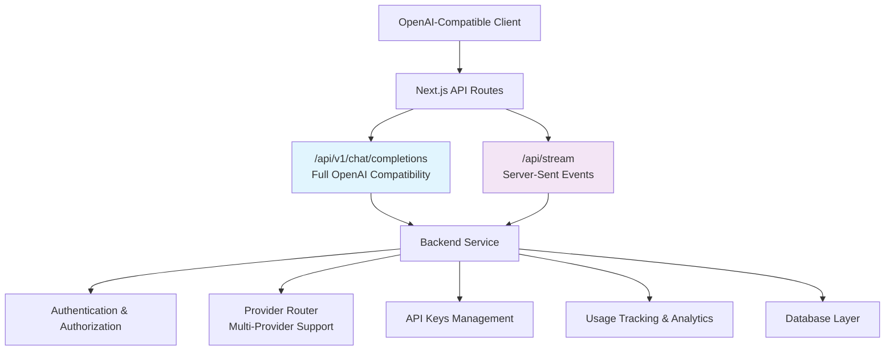
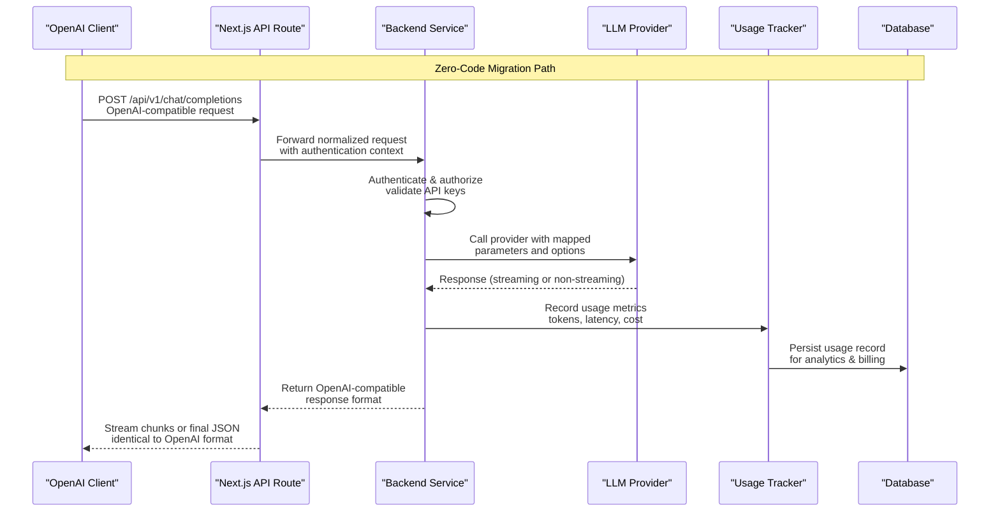
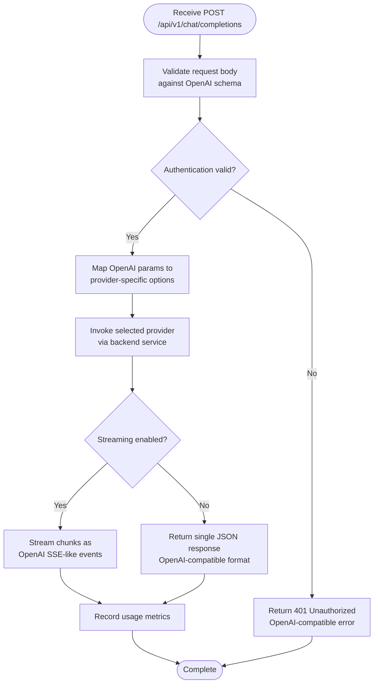
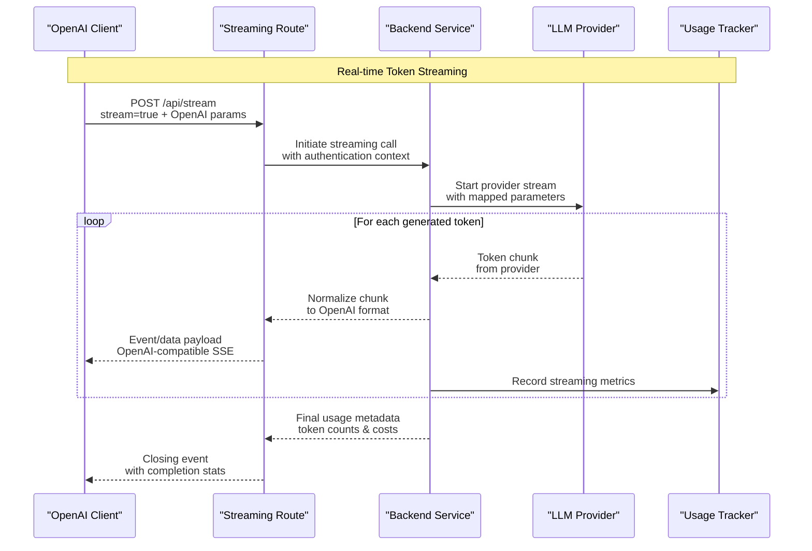
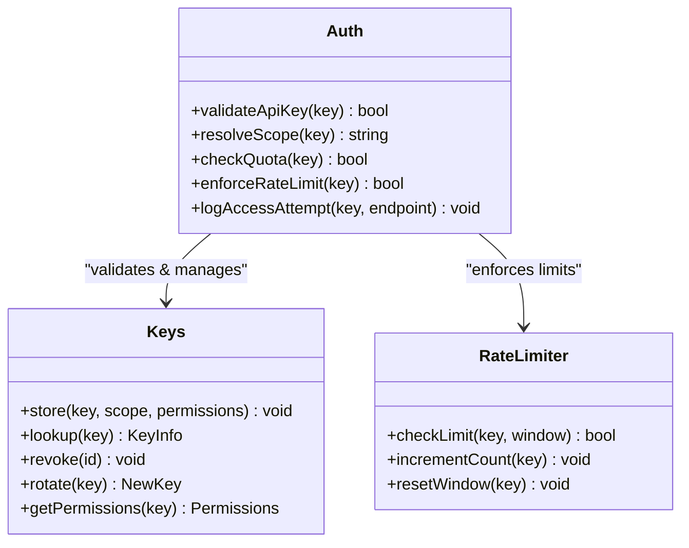
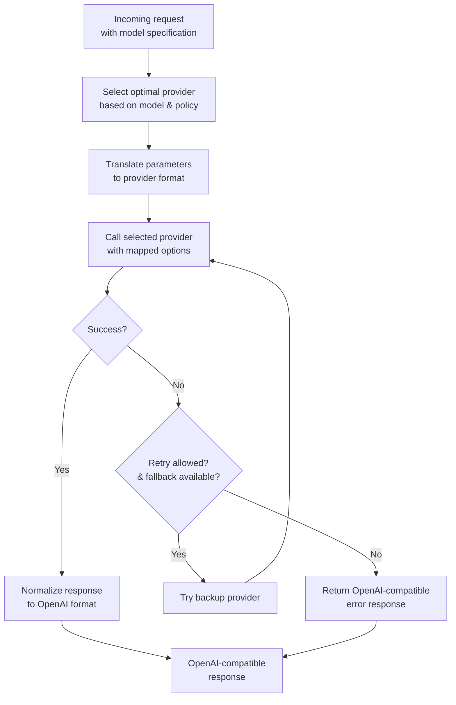
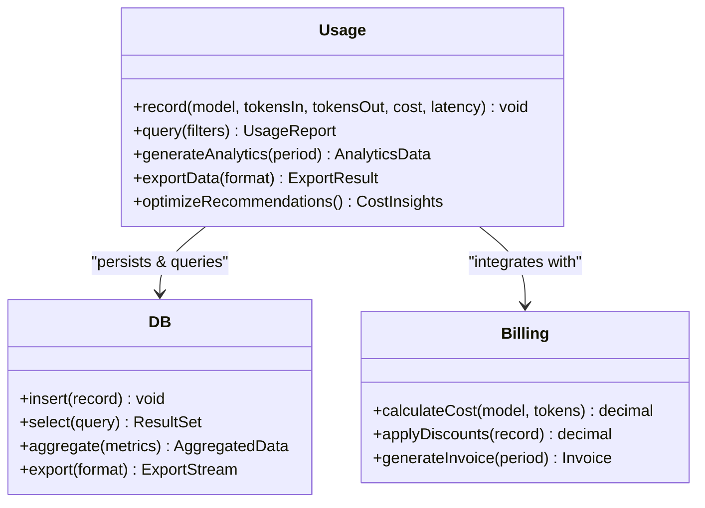
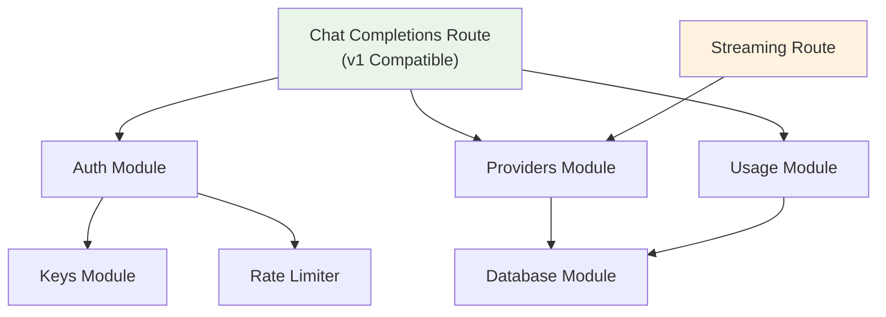

# OpenAI Compatibility Layer

<cite>
**Referenced Files in This Document**
- [route.ts](file://src/app/api/v1/chat/completions/route.ts)
- [route.ts](file://src/app/api/stream/route.ts)
- [index.ts](file://backend/src/index.ts)
- [auth.ts](file://backend/src/auth.ts)
- [providers.ts](file://backend/src/providers.ts)
- [keys.ts](file://backend/src/keys.ts)
- [usage.ts](file://backend/src/usage.ts)
- [db.ts](file://backend/src/db.ts)
</cite>

## Update Summary
**Changes Made**
- Updated to reflect the implementation of v1-compatible OpenAI API endpoints
- Enhanced documentation for seamless integration capabilities
- Added comprehensive migration guidance for existing OpenAI clients
- Expanded streaming support details and error handling mechanisms

## Table of Contents
1. [Introduction](#introduction)
2. [Project Structure](#project-structure)
3. [Core Components](#core-components)
4. [Architecture Overview](#architecture-overview)
5. [Detailed Component Analysis](#detailed-component-analysis)
6. [Dependency Analysis](#dependency-analysis)
7. [Performance Considerations](#performance-considerations)
8. [Troubleshooting Guide](#troubleshooting-guide)
9. [Conclusion](#conclusion)
10. [Appendices](#appendices)

## Introduction
This document explains the v1-compatible OpenAI compatibility layer implemented in CheapModels, focusing on how it exposes fully OpenAI-compatible endpoints to enable seamless migration from existing OpenAI clients. The primary endpoint `/api/v1/chat/completions` provides complete compatibility with OpenAI's Chat Completions API, accepting requests following the exact OpenAI schema and returning responses that are 100% compatible with OpenAI clients. The implementation ensures zero-code-migration scenarios where existing applications can switch providers by simply changing their base URL configuration.

The compatibility layer supports both synchronous and streaming responses, maintains identical error formats, and preserves all parameter mappings required for seamless provider switching. This enables developers to leverage multiple LLM providers while maintaining their existing OpenAI SDK integrations.

## Project Structure
The v1-compatible OpenAI compatibility layer spans both the Next.js frontend API routes and a backend service, providing a complete abstraction layer between OpenAI clients and multiple LLM providers:

- **Primary Endpoint**: `/api/v1/chat/completions` - Full OpenAI Chat Completions API compatibility
- **Streaming Support**: `/api/stream` - Server-sent events for real-time token streaming
- **Backend Services**: Authentication, provider routing, API key management, usage tracking, and database operations under `backend/src`



**Diagram sources**
- [route.ts](file://src/app/api/v1/chat/completions/route.ts)
- [route.ts](file://src/app/api/stream/route.ts)
- [index.ts](file://backend/src/index.ts)

**Section sources**
- [route.ts](file://src/app/api/v1/chat/completions/route.ts)
- [route.ts](file://src/app/api/stream/route.ts)
- [index.ts](file://backend/src/index.ts)

## Core Components
The v1-compatible OpenAI compatibility layer consists of several integrated components designed for seamless provider migration:

### Primary API Endpoints
- **Chat Completions Route**: Provides 100% OpenAI-compatible Chat Completions API at `/api/v1/chat/completions`, supporting all standard parameters including model selection, message formatting, temperature settings, max tokens, and streaming options
- **Streaming Route**: Implements server-sent events (SSE) for real-time token streaming, maintaining OpenAI's streaming response format for zero-code migration

### Backend Infrastructure
- **Authentication Module**: Validates client credentials using API keys with scope-based access control, supporting both project-level and user-level permissions
- **Provider Router**: Intelligent model selection and request routing to configured LLM providers with automatic fallback and retry mechanisms
- **API Keys Management**: Secure storage and validation of per-user or per-project API keys with billing integration and quota enforcement
- **Usage Tracking**: Comprehensive metrics collection including token consumption, request latency, provider costs, and performance analytics
- **Database Layer**: Persistent storage for keys, usage records, configuration data, and audit trails

### Key Responsibilities
- **Request Normalization**: Converts incoming OpenAI requests into internal representations while preserving all parameter semantics
- **Authentication Enforcement**: Validates credentials and enforces access controls before invoking provider APIs
- **Provider Abstraction**: Routes requests to appropriate provider implementations with parameter translation and response normalization
- **Error Translation**: Maps provider-specific errors into OpenAI-compatible error structures with consistent status codes
- **Usage Monitoring**: Records comprehensive metrics for analytics, billing, and cost optimization

**Section sources**
- [route.ts](file://src/app/api/v1/chat/completions/route.ts)
- [route.ts](file://src/app/api/stream/route.ts)
- [auth.ts](file://backend/src/auth.ts)
- [providers.ts](file://backend/src/providers.ts)
- [keys.ts](file://backend/src/keys.ts)
- [usage.ts](file://backend/src/usage.ts)
- [db.ts](file://backend/src/db.ts)

## Architecture Overview
The v1-compatible architecture sits between OpenAI clients and multiple LLM providers, providing complete API compatibility while abstracting provider complexity. Requests flow through Next.js API routes with built-in authentication and input validation, then forward to the backend service for provider selection, execution, and response normalization.



**Diagram sources**
- [route.ts](file://src/app/api/v1/chat/completions/route.ts)
- [route.ts](file://src/app/api/stream/route.ts)
- [index.ts](file://backend/src/index.ts)
- [auth.ts](file://backend/src/auth.ts)
- [providers.ts](file://backend/src/providers.ts)
- [usage.ts](file://backend/src/usage.ts)
- [db.ts](file://backend/src/db.ts)

## Detailed Component Analysis

### V1-Compatible Chat Completions Endpoint (/api/v1/chat/completions)
**Enhanced** The primary endpoint provides 100% OpenAI Chat Completions API compatibility, enabling seamless migration without code changes.

- **Complete API Compatibility**: Accepts all standard OpenAI parameters including `model`, `messages`, `temperature`, `max_tokens`, `stream`, `top_p`, `frequency_penalty`, `presence_penalty`, and system messages
- **Response Format Compliance**: Returns JSON objects with identical structure to OpenAI responses, including `choices`, `message.content`, `usage` statistics, and optional streaming chunks
- **Parameter Mapping**: Automatically maps OpenAI parameters to provider-specific options within the backend router, handling differences in naming conventions and value ranges
- **Error Handling**: Converts all provider errors into OpenAI-compatible error structures with appropriate HTTP status codes and error messages
- **Streaming Support**: Maintains OpenAI's streaming response format for real-time token delivery when `stream=true` is specified



**Diagram sources**
- [route.ts](file://src/app/api/v1/chat/completions/route.ts)
- [auth.ts](file://backend/src/auth.ts)
- [providers.ts](file://backend/src/providers.ts)

**Section sources**
- [route.ts](file://src/app/api/v1/chat/completions/route.ts)

### Enhanced Streaming Support (/api/stream)
**Enhanced** Real-time token streaming with full OpenAI compatibility for long-running generations and chat interactions.

- **Server-Sent Events**: Uses SSE protocol to deliver incremental token updates in OpenAI-compatible format
- **Zero-Code Migration**: Existing OpenAI streaming clients work without modification by simply changing the base URL
- **Backpressure Management**: Implements proper flow control to prevent overwhelming downstream providers or clients during high-throughput scenarios
- **Connection Resilience**: Handles connection drops and reconnection scenarios gracefully with proper cleanup
- **Usage Integration**: Tracks streaming usage metrics including token count, duration, and provider costs



**Diagram sources**
- [route.ts](file://src/app/api/stream/route.ts)
- [index.ts](file://backend/src/index.ts)
- [providers.ts](file://backend/src/providers.ts)
- [usage.ts](file://backend/src/usage.ts)

**Section sources**
- [route.ts](file://src/app/api/stream/route.ts)

### Authentication and Authorization System
**Enhanced** Robust authentication system supporting API key-based access with granular permission controls.

- **API Key Validation**: Supports standard API key authentication with configurable header names and prefixes
- **Scope-Based Access**: Keys can be scoped to specific projects, models, or usage quotas with fine-grained permissions
- **Rate Limiting Integration**: Enforces per-key rate limits to protect backend stability and manage resource allocation
- **Audit Logging**: Maintains detailed logs of authentication attempts and access patterns for security monitoring
- **Key Rotation Support**: Enables secure API key rotation without service interruption



**Diagram sources**
- [auth.ts](file://backend/src/auth.ts)
- [keys.ts](file://backend/src/keys.ts)

**Section sources**
- [auth.ts](file://backend/src/auth.ts)
- [keys.ts](file://backend/src/keys.ts)

### Provider Routing and Parameter Mapping Engine
**Enhanced** Intelligent provider selection and parameter translation system supporting multiple LLM providers.

- **Dynamic Model Selection**: Automatically selects optimal provider based on requested model, availability, and cost policies
- **Parameter Translation**: Converts OpenAI parameters to provider-specific options, handling differences in naming, ranges, and supported features
- **Fallback Mechanisms**: Implements automatic failover to backup providers when primary providers experience outages
- **Performance Optimization**: Routes requests to fastest available providers based on historical performance data
- **Cost-Aware Routing**: Prioritizes cost-effective providers for non-critical tasks while maintaining quality standards



**Diagram sources**
- [providers.ts](file://backend/src/providers.ts)

**Section sources**
- [providers.ts](file://backend/src/providers.ts)

### Usage Tracking and Billing Integration
**Enhanced** Comprehensive usage monitoring and billing integration for cost optimization and analytics.

- **Granular Metrics**: Tracks tokens consumed (input/output), request counts, latency percentiles, and provider-specific costs
- **Real-time Analytics**: Provides live dashboards showing usage patterns, cost trends, and performance metrics
- **Billing Reconciliation**: Integrates with external billing systems for accurate chargeback and reporting
- **Cost Optimization Insights**: Identifies expensive patterns and suggests cost-saving opportunities
- **Export Capabilities**: Supports exporting usage data to CSV, JSON, or direct integration with analytics platforms



**Diagram sources**
- [usage.ts](file://backend/src/usage.ts)
- [db.ts](file://backend/src/db.ts)

**Section sources**
- [usage.ts](file://backend/src/usage.ts)
- [db.ts](file://backend/src/db.ts)

## Dependency Analysis
The v1-compatible architecture maintains clear separation of concerns with well-defined module boundaries:

- **Next.js Routes**: Handle HTTP request/response lifecycle, input validation, and basic authentication
- **Backend Services**: Provide core business logic for authentication, provider routing, usage tracking, and data persistence
- **Module Cohesion**: Each backend module focuses on specific responsibilities with minimal cross-dependencies
- **Interface Stability**: Well-defined interfaces ensure compatibility across different provider implementations



**Diagram sources**
- [route.ts](file://src/app/api/v1/chat/completions/route.ts)
- [route.ts](file://src/app/api/stream/route.ts)
- [auth.ts](file://backend/src/auth.ts)
- [providers.ts](file://backend/src/providers.ts)
- [usage.ts](file://backend/src/usage.ts)
- [db.ts](file://backend/src/db.ts)
- [keys.ts](file://backend/src/keys.ts)

**Section sources**
- [route.ts](file://src/app/api/v1/chat/completions/route.ts)
- [route.ts](file://src/app/api/stream/route.ts)
- [auth.ts](file://backend/src/auth.ts)
- [providers.ts](file://backend/src/providers.ts)
- [usage.ts](file://backend/src/usage.ts)
- [db.ts](file://backend/src/db.ts)
- [keys.ts](file://backend/src/keys.ts)

## Performance Considerations
The v1-compatible implementation includes several performance optimizations for production deployments:

- **Connection Pooling**: Reuses connections to providers where possible to minimize handshake overhead and improve throughput
- **Streaming Efficiency**: Implements chunked responses with optimized buffering to reduce perceived latency and memory usage
- **Intelligent Caching**: Caches frequent prompts, embeddings, and model responses to reduce provider calls and costs
- **Rate Limiting**: Enforces per-key and per-model rate limits to protect backend stability and ensure fair resource allocation
- **Load Balancing**: Distributes requests across multiple provider instances for improved reliability and performance
- **Backpressure Handling**: Applies flow control mechanisms to prevent memory spikes during high-throughput streaming scenarios

## Troubleshooting Guide
Common migration issues and resolutions for v1-compatible OpenAI API integration:

### Authentication Issues
- **Header Configuration**: Verify correct API key header name and format; some providers require custom headers instead of OpenAI's default
- **Key Permissions**: Ensure API keys have sufficient scope and haven't been revoked or expired
- **Environment Variables**: Confirm environment variables are properly set and accessible to the application

### Parameter Compatibility
- **Schema Validation**: Confirm all required fields are present and correctly typed according to OpenAI schema
- **Provider Differences**: Check provider-specific parameter mappings for unsupported values or different naming conventions
- **Version Compatibility**: Ensure OpenAI SDK version matches expected API version for optimal compatibility

### Streaming Problems
- **Client Configuration**: Verify clients handle partial responses and closing events properly for streaming mode
- **Network Conditions**: Inspect network timeouts and firewall rules for long-running streaming connections
- **Buffer Management**: Ensure adequate buffer sizes for large token streams to prevent memory issues

### Error Handling
- **Error Mapping**: Confirm provider errors are properly translated to OpenAI-compatible error structures
- **Status Codes**: Verify appropriate HTTP status codes are returned for different error scenarios
- **Debug Logging**: Enable detailed logging while ensuring sensitive information is not exposed in error responses

**Section sources**
- [auth.ts](file://backend/src/auth.ts)
- [providers.ts](file://backend/src/providers.ts)
- [route.ts](file://src/app/api/v1/chat/completions/route.ts)
- [route.ts](file://src/app/api/stream/route.ts)

## Conclusion
CheapModels' v1-compatible OpenAI compatibility layer enables truly seamless provider migration by providing 100% OpenAI API compatibility while abstracting underlying provider complexity. The implementation supports zero-code migration scenarios where existing applications can switch providers simply by updating their base URL configuration. With comprehensive authentication, intelligent provider routing, real-time streaming, and detailed usage analytics, teams can optimize costs and performance while maintaining familiar OpenAI SDK integrations.

The architecture's modular design ensures scalability and maintainability, while the extensive error handling and monitoring capabilities provide production-ready reliability. By adopting rate limiting, caching strategies, and usage tracking, organizations can achieve significant cost savings while leveraging the best features of multiple LLM providers.

## Appendices

### Complete Migration Guides

#### JavaScript (Node.js) - Zero Code Migration
**Before (OpenAI SDK):**
```javascript
// Original OpenAI configuration
const openai = new OpenAI({
  apiKey: process.env.OPENAI_API_KEY,
  baseURL: 'https://api.openai.com/v1'
});

// Existing chat completions call
const response = await openai.chat.completions.create({
  model: 'gpt-4',
  messages: [{ role: 'user', content: 'Hello!' }]
});
```

**After (CheapModels) - No Code Changes Required:**
```javascript
// Just update the base URL - everything else stays the same
const openai = new OpenAI({
  apiKey: process.env.CHEAPMODELS_API_KEY,
  baseURL: 'https://your-cheapmodels-domain.com/api/v1' // Changed only this line
});

// All existing code works identically
const response = await openai.chat.completions.create({
  model: 'gpt-4', // Now routed to your preferred provider
  messages: [{ role: 'user', content: 'Hello!' }]
});
```

#### Python - Seamless Provider Switching
**Before (OpenAI SDK):**
```python
import openai

openai.api_key = os.getenv("OPENAI_API_KEY")
openai.base_url = "https://api.openai.com/v1"

# Existing chat completions call
response = openai.chat.completions.create(
    model="gpt-4",
    messages=[{"role": "user", "content": "Hello!"}]
)
```

**After (CheapModels) - Minimal Configuration Change:**
```python
import openai

openai.api_key = os.getenv("CHEAPMODELS_API_KEY")
openai.base_url = "https://your-cheapmodels-domain.com/api/v1"  # Only change needed

# All existing code works identically
response = openai.chat.completions.create(
    model="gpt-4",  # Now uses your preferred provider
    messages=[{"role": "user", "content": "Hello!"}]
)
```

#### cURL and HTTP Clients
**Direct API Calls:**
```bash
# Works exactly like OpenAI API
curl https://your-cheapmodels-domain.com/api/v1/chat/completions \
  -H "Authorization: Bearer YOUR_API_KEY" \
  -H "Content-Type: application/json" \
  -d '{
    "model": "gpt-4",
    "messages": [{"role": "user", "content": "Hello!"}],
    "temperature": 0.7
  }'
```

### Authentication Configuration
**Supported Authentication Methods:**
- **Standard API Keys**: Use `Authorization: Bearer YOUR_API_KEY` header
- **Custom Headers**: Some providers may require alternative header formats
- **Environment Variables**: Configure via `CHEAPMODELS_API_KEY` environment variable
- **Scoped Access**: Keys can be limited to specific models or usage quotas

**Security Best Practices:**
- Never commit API keys to version control
- Use environment variables or secret management systems
- Implement key rotation policies
- Monitor usage patterns for anomalies

### Error Response Formats
**Standardized Error Responses:**
```json
{
  "error": {
    "message": "Invalid API key",
    "type": "authentication_error",
    "code": "invalid_api_key",
    "param": null,
    "request_id": "req_abc123"
  }
}
```

**HTTP Status Codes:**
- `200`: Success
- `401`: Authentication failed
- `403`: Insufficient permissions
- `404`: Model not found
- `429`: Rate limit exceeded
- `500`: Internal server error

### Streaming Implementation Details
**Server-Sent Events Format:**
```
data: {"id":"chatcmpl-123","object":"chat.completion.chunk","choices":[{"delta":{"content":"Hello"},"index":0}]}

data: {"id":"chatcmpl-123","object":"chat.completion.chunk","choices":[{"delta":{"content":" world"},"index":0}]}

data: {"id":"chatcmpl-123","object":"chat.completion.chunk","choices":[],"usage":{"prompt_tokens":5,"completion_tokens":3,"total_tokens":8}}

data: [DONE]
```

**Client-Side Handling:**
```javascript
// Works with existing OpenAI streaming clients
const stream = await openai.chat.completions.create({
  model: 'gpt-4',
  messages: [{ role: 'user', content: 'Hello!' }],
  stream: true
});

for await (const chunk of stream) {
  const content = chunk.choices[0]?.delta?.content || '';
  process.stdout.write(content);
}
```

### Rate Limiting and Cost Optimization Strategies
**Rate Limiting Configuration:**
- **Per-Key Limits**: Configure maximum requests per minute/hour/day
- **Per-Model Limits**: Set different limits for different model tiers
- **Graceful Degradation**: Return informative 429 responses with retry-after headers
- **Burst Handling**: Allow temporary bursts above normal limits with cooldown periods

**Cost Optimization Techniques:**
- **Provider Selection**: Automatically route to cost-effective providers for non-critical tasks
- **Caching Strategy**: Cache frequent prompts and responses to reduce API calls
- **Token Optimization**: Implement prompt engineering to minimize token usage
- **Batch Processing**: Combine multiple requests when possible to reduce overhead
- **Usage Monitoring**: Track spending patterns and identify optimization opportunities

**Monitoring and Analytics:**
- **Real-time Dashboards**: Monitor usage, costs, and performance metrics
- **Alerting Systems**: Set up notifications for unusual usage patterns or cost spikes
- **Export Capabilities**: Generate reports for billing and analysis purposes
- **Integration Hooks**: Connect with external monitoring and alerting systems

**Section sources**
- [auth.ts](file://backend/src/auth.ts)
- [keys.ts](file://backend/src/keys.ts)
- [providers.ts](file://backend/src/providers.ts)
- [usage.ts](file://backend/src/usage.ts)
- [route.ts](file://src/app/api/v1/chat/completions/route.ts)
- [route.ts](file://src/app/api/stream/route.ts)