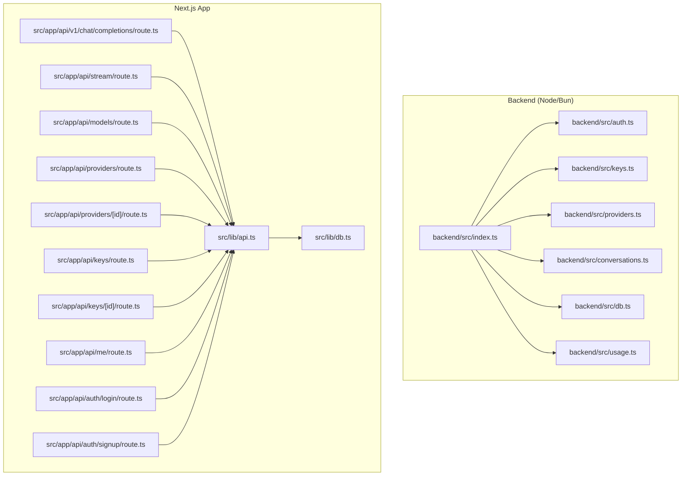
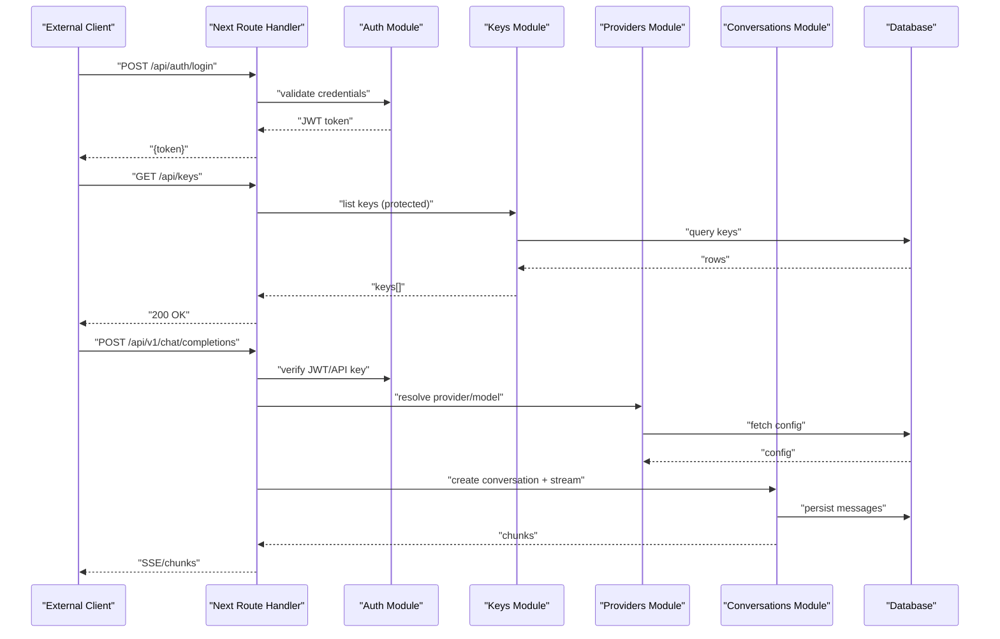
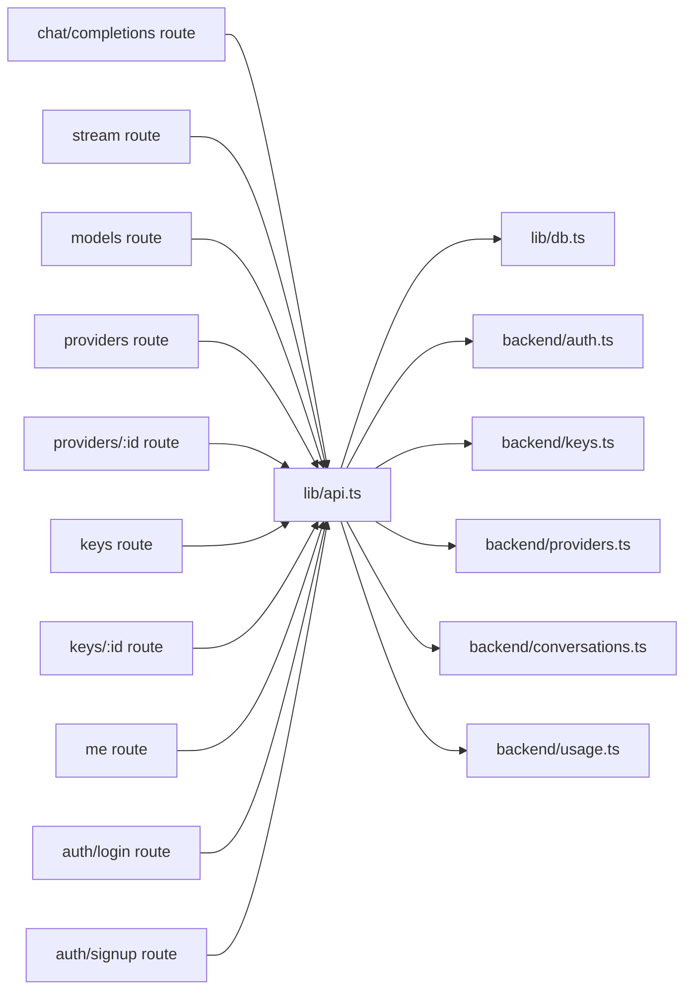

# SDK Integration Examples

<cite>
**Referenced Files in This Document**
- [backend/src/index.ts](file://backend/src/index.ts)
- [backend/src/auth.ts](file://backend/src/auth.ts)
- [backend/src/keys.ts](file://backend/src/keys.ts)
- [backend/src/providers.ts](file://backend/src/providers.ts)
- [backend/src/conversations.ts](file://backend/src/conversations.ts)
- [backend/src/db.ts](file://backend/src/db.ts)
- [backend/src/usage.ts](file://backend/src/usage.ts)
- [src/app/api/v1/chat/completions/route.ts](file://src/app/api/v1/chat/completions/route.ts)
- [src/app/api/stream/route.ts](file://src/app/api/stream/route.ts)
- [src/app/api/models/route.ts](file://src/app/api/models/route.ts)
- [src/app/api/providers/[id]/route.ts](file://src/app/api/providers/[id]/route.ts)
- [src/app/api/providers/route.ts](file://src/app/api/providers/route.ts)
- [src/app/api/keys/route.ts](file://src/app/api/keys/route.ts)
- [src/app/api/keys/[id]/route.ts](file://src/app/api/keys/[id]/route.ts)
- [src/app/api/me/route.ts](file://src/app/api/me/route.ts)
- [src/app/api/auth/login/route.ts](file://src/app/api/auth/login/route.ts)
- [src/app/api/auth/signup/route.ts](file://src/app/api/auth/signup/route.ts)
- [src/lib/api.ts](file://src/lib/api.ts)
- [src/lib/db.ts](file://src/lib/db.ts)
- [package.json](file://package.json)
</cite>

## Table of Contents
1. [Introduction](#introduction)
2. [Project Structure](#project-structure)
3. [Core Components](#core-components)
4. [Architecture Overview](#architecture-overview)
5. [Detailed Component Analysis](#detailed-component-analysis)
6. [Dependency Analysis](#dependency-analysis)
7. [Performance Considerations](#performance-considerations)
8. [Troubleshooting Guide](#troubleshooting-guide)
9. [Conclusion](#conclusion)
10. [Appendices](#appendices)

## Introduction
This document provides practical SDK integration examples for connecting external applications to CheapModels. It covers authentication with JWT tokens, API key configuration, client initialization patterns, error handling, retries, connection pooling, synchronous and asynchronous calls, streaming responses, batch operations, environment configuration, security considerations, and production deployment patterns. The guidance is grounded in the repository’s backend routes, middleware, and library modules.

## Project Structure
The project exposes a Next.js frontend and a Node/Bun backend. Backend endpoints handle authentication, keys, providers, models, chat completions, and streaming. Shared libraries manage database access and utilities.

**Diagram sources**
- [backend/src/index.ts](file://backend/src/index.ts)
- [backend/src/auth.ts](file://backend/src/auth.ts)
- [backend/src/keys.ts](file://backend/src/keys.ts)
- [backend/src/providers.ts](file://backend/src/providers.ts)
- [backend/src/conversations.ts](file://backend/src/conversations.ts)
- [backend/src/db.ts](file://backend/src/db.ts)
- [backend/src/usage.ts](file://backend/src/usage.ts)
- [src/app/api/v1/chat/completions/route.ts](file://src/app/api/v1/chat/completions/route.ts)
- [src/app/api/stream/route.ts](file://src/app/api/stream/route.ts)
- [src/app/api/models/route.ts](file://src/app/api/models/route.ts)
- [src/app/api/providers/route.ts](file://src/app/api/providers/route.ts)
- [src/app/api/providers/[id]/route.ts](file://src/app/api/providers/[id]/route.ts)
- [src/app/api/keys/route.ts](file://src/app/api/keys/route.ts)
- [src/app/api/keys/[id]/route.ts](file://src/app/api/keys/[id]/route.ts)
- [src/app/api/me/route.ts](file://src/app/api/me/route.ts)
- [src/app/api/auth/login/route.ts](file://src/app/api/auth/login/route.ts)
- [src/app/api/auth/signup/route.ts](file://src/app/api/auth/signup/route.ts)
- [src/lib/api.ts](file://src/lib/api.ts)
- [src/lib/db.ts](file://src/lib/db.ts)

**Section sources**
- [backend/src/index.ts](file://backend/src/index.ts)
- [src/lib/api.ts](file://src/lib/api.ts)
- [src/lib/db.ts](file://src/lib/db.ts)

## Core Components
- Authentication: JWT-based auth flows for login/signup and protected routes.
- API Keys: CRUD for API keys used by external clients.
- Providers and Models: Manage provider configurations and available models.
- Chat Completions: Standard chat completion endpoint compatible with common SDKs.
- Streaming: Server-sent events or chunked responses for real-time outputs.
- Usage Tracking: Record usage metrics per key/user.

Key implementation references:
- Auth endpoints: [login](file://src/app/api/auth/login/route.ts), [signup](file://src/app/api/auth/signup/route.ts)
- Protected user info: [me](file://src/app/api/me/route.ts)
- API keys: [list/create](file://src/app/api/keys/route.ts), [update/delete](file://src/app/api/keys/[id]/route.ts)
- Providers: [list](file://src/app/api/providers/route.ts), [get/update](file://src/app/api/providers/[id]/route.ts)
- Models: [list](file://src/app/api/models/route.ts)
- Chat completions: [v1/chat/completions](file://src/app/api/v1/chat/completions/route.ts)
- Streaming: [stream](file://src/app/api/stream/route.ts)
- Shared HTTP client: [api.ts](file://src/lib/api.ts)
- Database helpers: [db.ts](file://src/lib/db.ts)

**Section sources**
- [src/app/api/auth/login/route.ts](file://src/app/api/auth/login/route.ts)
- [src/app/api/auth/signup/route.ts](file://src/app/api/auth/signup/route.ts)
- [src/app/api/me/route.ts](file://src/app/api/me/route.ts)
- [src/app/api/keys/route.ts](file://src/app/api/keys/route.ts)
- [src/app/api/keys/[id]/route.ts](file://src/app/api/keys/[id]/route.ts)
- [src/app/api/providers/route.ts](file://src/app/api/providers/route.ts)
- [src/app/api/providers/[id]/route.ts](file://src/app/api/providers/[id]/route.ts)
- [src/app/api/models/route.ts](file://src/app/api/models/route.ts)
- [src/app/api/v1/chat/completions/route.ts](file://src/app/api/v1/chat/completions/route.ts)
- [src/app/api/stream/route.ts](file://src/app/api/stream/route.ts)
- [src/lib/api.ts](file://src/lib/api.ts)
- [src/lib/db.ts](file://src/lib/db.ts)

## Architecture Overview
The system follows a layered architecture:
- Client layer: External apps or SDKs call REST endpoints.
- API layer: Next.js route handlers orchestrate requests.
- Service layer: Business logic in backend modules (auth, keys, providers, conversations).
- Data layer: Database access via shared DB module.

**Diagram sources**
- [src/app/api/auth/login/route.ts](file://src/app/api/auth/login/route.ts)
- [src/app/api/keys/route.ts](file://src/app/api/keys/route.ts)
- [src/app/api/v1/chat/completions/route.ts](file://src/app/api/v1/chat/completions/route.ts)
- [src/app/api/stream/route.ts](file://src/app/api/stream/route.ts)
- [backend/src/auth.ts](file://backend/src/auth.ts)
- [backend/src/keys.ts](file://backend/src/keys.ts)
- [backend/src/providers.ts](file://backend/src/providers.ts)
- [backend/src/conversations.ts](file://backend/src/conversations.ts)
- [backend/src/db.ts](file://backend/src/db.ts)

## Detailed Component Analysis

### Authentication Setup (JWT)
- Login flow issues a JWT after validating credentials.
- Signup flow creates a new account and returns a JWT.
- Protected endpoints verify the token or API key before processing.

Recommended client patterns:
- Store the JWT securely (httpOnly cookie on server-side; secure storage on client).
- Attach Authorization header with bearer token for subsequent requests.
- Refresh tokens if applicable at your deployment.

References:
- [Login endpoint](file://src/app/api/auth/login/route.ts)
- [Signup endpoint](file://src/app/api/auth/signup/route.ts)
- [Protected user info](file://src/app/api/me/route.ts)
- [Auth module](file://backend/src/auth.ts)

**Section sources**
- [src/app/api/auth/login/route.ts](file://src/app/api/auth/login/route.ts)
- [src/app/api/auth/signup/route.ts](file://src/app/api/auth/signup/route.ts)
- [src/app/api/me/route.ts](file://src/app/api/me/route.ts)
- [backend/src/auth.ts](file://backend/src/auth.ts)

### API Key Configuration
- Create, list, update, and delete API keys for external clients.
- Use API keys in place of JWT when integrating non-browser clients.

Client patterns:
- Send X-API-Key header or Authorization: Bearer <key>.
- Rotate keys periodically and restrict scopes if supported.

References:
- [Keys list/create](file://src/app/api/keys/route.ts)
- [Keys update/delete](file://src/app/api/keys/[id]/route.ts)
- [Keys module](file://backend/src/keys.ts)

**Section sources**
- [src/app/api/keys/route.ts](file://src/app/api/keys/route.ts)
- [src/app/api/keys/[id]/route.ts](file://src/app/api/keys/[id]/route.ts)
- [backend/src/keys.ts](file://backend/src/keys.ts)

### Provider and Model Management
- List and configure providers (e.g., OpenAI-compatible backends).
- Enumerate available models per provider.

Client patterns:
- Cache model lists locally with short TTL.
- Validate model names before calling chat completions.

References:
- [Providers list](file://src/app/api/providers/route.ts)
- [Provider get/update](file://src/app/api/providers/[id]/route.ts)
- [Models list](file://src/app/api/models/route.ts)
- [Providers module](file://backend/src/providers.ts)

**Section sources**
- [src/app/api/providers/route.ts](file://src/app/api/providers/route.ts)
- [src/app/api/providers/[id]/route.ts](file://src/app/api/providers/[id]/route.ts)
- [src/app/api/models/route.ts](file://src/app/api/models/route.ts)
- [backend/src/providers.ts](file://backend/src/providers.ts)

### Chat Completions (Standard API)
- POST /api/v1/chat/completions accepts standard chat payloads and returns text or streamed chunks.

Client patterns:
- Synchronous: await full response.
- Asynchronous: process partial chunks using streams.

References:
- [Chat completions route](file://src/app/api/v1/chat/completions/route.ts)
- [Conversations module](file://backend/src/conversations.ts)

**Section sources**
- [src/app/api/v1/chat/completions/route.ts](file://src/app/api/v1/chat/completions/route.ts)
- [backend/src/conversations.ts](file://backend/src/conversations.ts)

### Streaming Responses
- Use SSE or chunked transfer for real-time output.
- Handle backpressure and graceful termination.

References:
- [Streaming route](file://src/app/api/stream/route.ts)

**Section sources**
- [src/app/api/stream/route.ts](file://src/app/api/stream/route.ts)

### Batch Operations
- For high-throughput scenarios, group independent requests and send them concurrently.
- Respect rate limits and implement backoff.

References:
- [Shared HTTP client](file://src/lib/api.ts)
- [Database helpers](file://src/lib/db.ts)

**Section sources**
- [src/lib/api.ts](file://src/lib/api.ts)
- [src/lib/db.ts](file://src/lib/db.ts)

### Environment Configuration
- Configure base URL, timeouts, retry policies, and feature flags via environment variables.
- Keep secrets out of source control; use secret managers in production.

References:
- [Package manifest](file://package.json)

**Section sources**
- [package.json](file://package.json)

## Dependency Analysis
The following diagram shows how route handlers depend on shared libraries and backend modules.

**Diagram sources**
- [src/app/api/v1/chat/completions/route.ts](file://src/app/api/v1/chat/completions/route.ts)
- [src/app/api/stream/route.ts](file://src/app/api/stream/route.ts)
- [src/app/api/models/route.ts](file://src/app/api/models/route.ts)
- [src/app/api/providers/route.ts](file://src/app/api/providers/route.ts)
- [src/app/api/providers/[id]/route.ts](file://src/app/api/providers/[id]/route.ts)
- [src/app/api/keys/route.ts](file://src/app/api/keys/route.ts)
- [src/app/api/keys/[id]/route.ts](file://src/app/api/keys/[id]/route.ts)
- [src/app/api/me/route.ts](file://src/app/api/me/route.ts)
- [src/app/api/auth/login/route.ts](file://src/app/api/auth/login/route.ts)
- [src/app/api/auth/signup/route.ts](file://src/app/api/auth/signup/route.ts)
- [src/lib/api.ts](file://src/lib/api.ts)
- [src/lib/db.ts](file://src/lib/db.ts)
- [backend/src/auth.ts](file://backend/src/auth.ts)
- [backend/src/keys.ts](file://backend/src/keys.ts)
- [backend/src/providers.ts](file://backend/src/providers.ts)
- [backend/src/conversations.ts](file://backend/src/conversations.ts)
- [backend/src/usage.ts](file://backend/src/usage.ts)

**Section sources**
- [src/lib/api.ts](file://src/lib/api.ts)
- [src/lib/db.ts](file://src/lib/db.ts)
- [backend/src/auth.ts](file://backend/src/auth.ts)
- [backend/src/keys.ts](file://backend/src/keys.ts)
- [backend/src/providers.ts](file://backend/src/providers.ts)
- [backend/src/conversations.ts](file://backend/src/conversations.ts)
- [backend/src/usage.ts](file://backend/src/usage.ts)

## Performance Considerations
- Connection pooling: Reuse HTTP connections and database connections where possible.
- Timeouts and deadlines: Set request timeouts to avoid hanging connections.
- Backpressure: Stream large responses and consume incrementally.
- Caching: Cache read-only data like models and providers with appropriate TTL.
- Concurrency: Limit parallelism to respect upstream provider quotas.

[No sources needed since this section provides general guidance]

## Troubleshooting Guide
Common issues and resolutions:
- Authentication failures: Verify JWT validity and API key presence. Check token expiry and rotation.
- Rate limiting: Implement exponential backoff and jitter on retries.
- Network errors: Retry transient errors only; do not retry idempotent writes without safeguards.
- Streaming interruptions: Detect broken pipes and reconnect with resume capability if supported.
- Validation errors: Ensure payload schema matches expected fields for chat completions.

References:
- [Auth module](file://backend/src/auth.ts)
- [Keys module](file://backend/src/keys.ts)
- [Conversations module](file://backend/src/conversations.ts)
- [Usage tracking](file://backend/src/usage.ts)

**Section sources**
- [backend/src/auth.ts](file://backend/src/auth.ts)
- [backend/src/keys.ts](file://backend/src/keys.ts)
- [backend/src/conversations.ts](file://backend/src/conversations.ts)
- [backend/src/usage.ts](file://backend/src/usage.ts)

## Conclusion
By following the patterns above—secure authentication, robust API key management, streaming support, and resilient client design—you can integrate external applications with CheapModels effectively. Use the provided references to align your SDK implementations with the actual endpoints and modules in this repository.

[No sources needed since this section summarizes without analyzing specific files]

## Appendices

### SDK Integration Examples

#### JavaScript/Node.js (REST + Streams)
- Initialize client with base URL and auth token or API key.
- Make synchronous calls for simple requests.
- Use fetch with ReadableStream or EventSource for streaming.
- Implement retry with exponential backoff and circuit breaker for critical paths.

References:
- [Chat completions route](file://src/app/api/v1/chat/completions/route.ts)
- [Streaming route](file://src/app/api/stream/route.ts)
- [Shared HTTP client](file://src/lib/api.ts)

**Section sources**
- [src/app/api/v1/chat/completions/route.ts](file://src/app/api/v1/chat/completions/route.ts)
- [src/app/api/stream/route.ts](file://src/app/api/stream/route.ts)
- [src/lib/api.ts](file://src/lib/api.ts)

#### Python (requests/httpx + SSE)
- Use httpx for async I/O and streaming.
- Attach Authorization header or X-API-Key.
- Process Server-Sent Events line-by-line.
- Add retry decorators with backoff for network resilience.

References:
- [Chat completions route](file://src/app/api/v1/chat/completions/route.ts)
- [Streaming route](file://src/app/api/stream/route.ts)

**Section sources**
- [src/app/api/v1/chat/completions/route.ts](file://src/app/api/v1/chat/completions/route.ts)
- [src/app/api/stream/route.ts](file://src/app/api/stream/route.ts)

#### React (Browser Client)
- Store JWT in memory or secure storage; attach headers to fetch calls.
- Use AbortController for cancellations.
- Render streaming tokens progressively.
- Show user-friendly errors and retry prompts.

References:
- [Login endpoint](file://src/app/api/auth/login/route.ts)
- [Chat completions route](file://src/app/api/v1/chat/completions/route.ts)
- [Streaming route](file://src/app/api/stream/route.ts)

**Section sources**
- [src/app/api/auth/login/route.ts](file://src/app/api/auth/login/route.ts)
- [src/app/api/v1/chat/completions/route.ts](file://src/app/api/v1/chat/completions/route.ts)
- [src/app/api/stream/route.ts](file://src/app/api/stream/route.ts)

#### Next.js (Server Routes)
- Proxy sensitive calls from server routes to protect secrets.
- Use server-side streaming to push tokens to the client.
- Cache static data (models, providers) on the server.

References:
- [Chat completions route](file://src/app/api/v1/chat/completions/route.ts)
- [Streaming route](file://src/app/api/stream/route.ts)
- [Models route](file://src/app/api/models/route.ts)
- [Providers route](file://src/app/api/providers/route.ts)

**Section sources**
- [src/app/api/v1/chat/completions/route.ts](file://src/app/api/v1/chat/completions/route.ts)
- [src/app/api/stream/route.ts](file://src/app/api/stream/route.ts)
- [src/app/api/models/route.ts](file://src/app/api/models/route.ts)
- [src/app/api/providers/route.ts](file://src/app/api/providers/route.ts)

### Security and Production Deployment
- Enforce HTTPS and HSTS.
- Use short-lived tokens and refresh mechanisms.
- Restrict API keys by scope and IP allowlists if supported.
- Enable request logging and monitoring; redact secrets.
- Deploy behind a reverse proxy with rate limiting and WAF.

[No sources needed since this section provides general guidance]