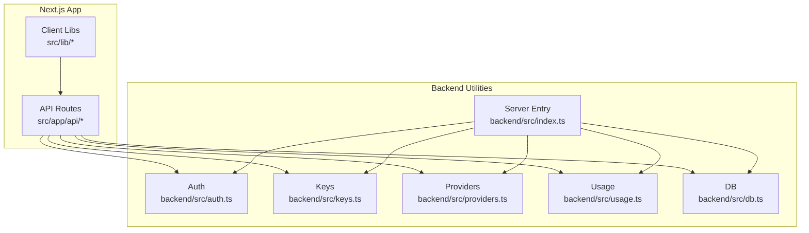
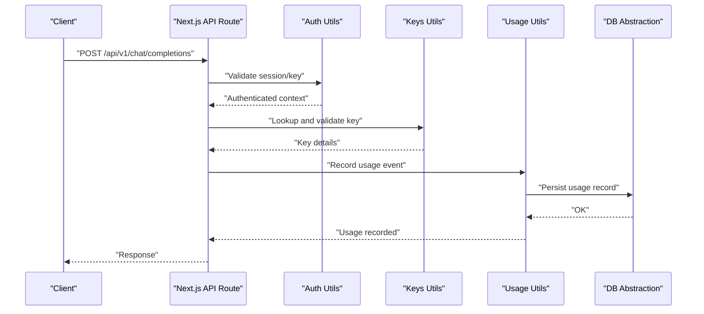
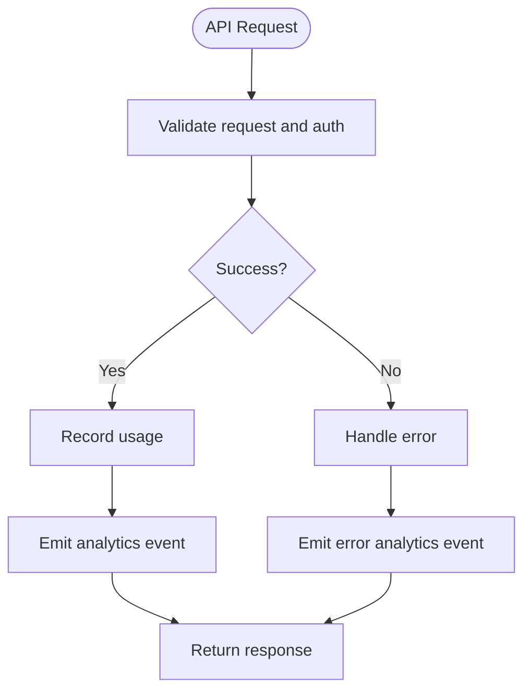
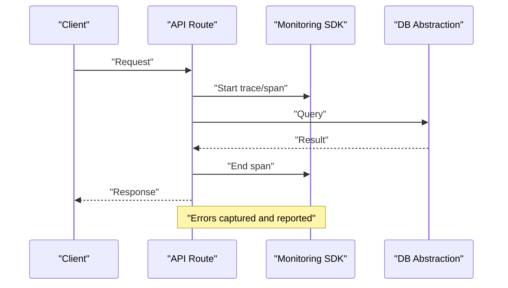
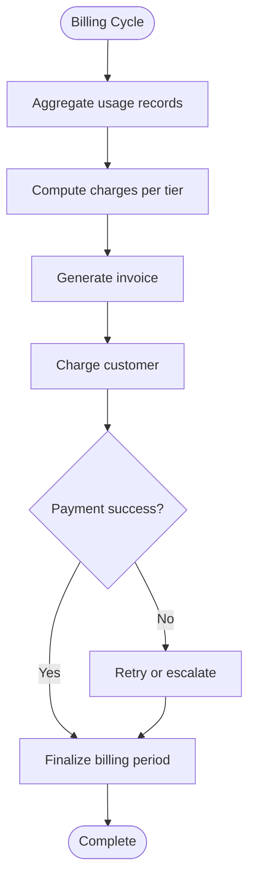
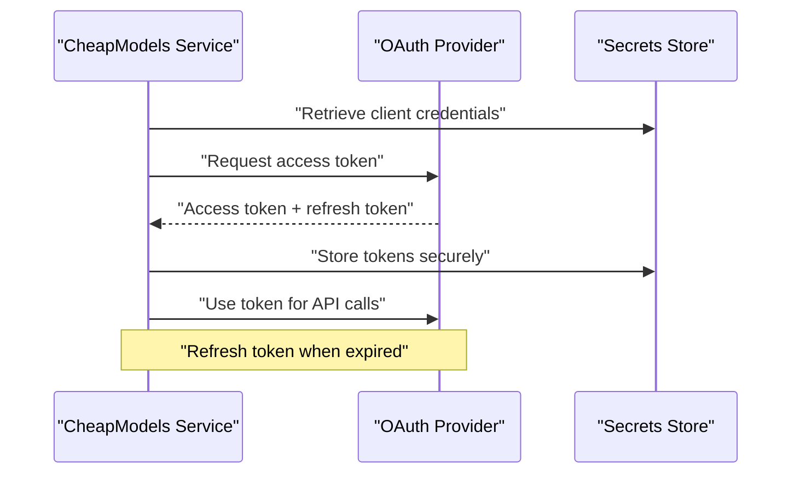
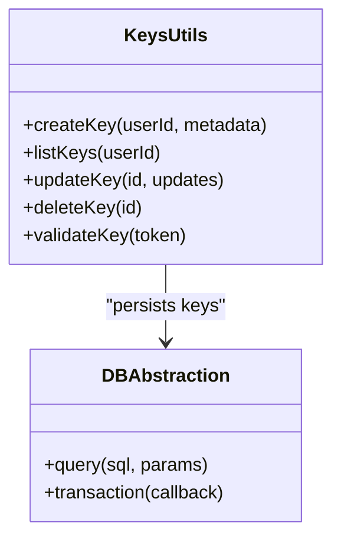
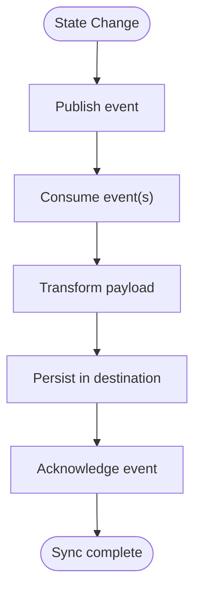
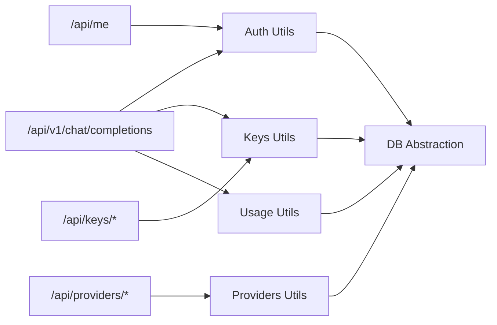

# Third-Party Service Integrations

<cite>
**Referenced Files in This Document**
- [backend/src/index.ts](file://backend/src/index.ts)
- [backend/src/auth.ts](file://backend/src/auth.ts)
- [backend/src/keys.ts](file://backend/src/keys.ts)
- [backend/src/providers.ts](file://backend/src/providers.ts)
- [backend/src/usage.ts](file://backend/src/usage.ts)
- [backend/src/db.ts](file://backend/src/db.ts)
- [src/app/api/analytics/route.ts](file://src/app/api/analytics/route.ts)
- [src/app/api/auth/login/route.ts](file://src/app/api/auth/login/route.ts)
- [src/app/api/auth/signup/route.ts](file://src/app/api/auth/signup/route.ts)
- [src/app/api/keys/route.ts](file://src/app/api/keys/route.ts)
- [src/app/api/keys/[id]/route.ts](file://src/app/api/keys/[id]/route.ts)
- [src/app/api/me/route.ts](file://src/app/api/me/route.ts)
- [src/app/api/models/route.ts](file://src/app/api/models/route.ts)
- [src/app/api/providers/route.ts](file://src/app/api/providers/route.ts)
- [src/app/api/providers/[id]/route.ts](file://src/app/api/providers/[id]/route.ts)
- [src/app/api/stream/route.ts](file://src/app/api/stream/route.ts)
- [src/app/api/v1/chat/completions/route.ts](file://src/app/api/v1/chat/completions/route.ts)
- [src/lib/api.ts](file://src/lib/api.ts)
- [src/lib/db.ts](file://src/lib/db.ts)
- [src/lib/utils.ts](file://src/lib/utils.ts)
</cite>

## Table of Contents
1. [Introduction](#introduction)
2. [Project Structure](#project-structure)
3. [Core Components](#core-components)
4. [Architecture Overview](#architecture-overview)
5. [Detailed Component Analysis](#detailed-component-analysis)
6. [Dependency Analysis](#dependency-analysis)
7. [Performance Considerations](#performance-considerations)
8. [Troubleshooting Guide](#troubleshooting-guide)
9. [Conclusion](#conclusion)
10. [Appendices](#appendices)

## Introduction
This document explains how to integrate CheapModels with popular third-party services and platforms, including analytics (Google Analytics, Mixpanel), monitoring (Sentry, DataDog), logging services, CI/CD pipelines, automated billing integrations, usage reporting exports, alerting systems, OAuth flows for service-to-service authentication, API key management across environments, secure credential storage, data synchronization patterns, conflict resolution, and offline operation considerations. It maps these integration patterns to the existing codebase structure and provides actionable implementation guides.

## Project Structure
CheapModels is a Next.js application with an internal backend layer. Integration points are primarily:
- API routes under src/app/api for HTTP endpoints
- Backend utilities under backend/src for shared logic (auth, keys, providers, usage, db)
- Client libraries under src/lib for reusable helpers

**Diagram sources**
- [backend/src/index.ts](file://backend/src/index.ts)
- [backend/src/auth.ts](file://backend/src/auth.ts)
- [backend/src/keys.ts](file://backend/src/keys.ts)
- [backend/src/providers.ts](file://backend/src/providers.ts)
- [backend/src/usage.ts](file://backend/src/usage.ts)
- [backend/src/db.ts](file://backend/src/db.ts)
- [src/app/api/analytics/route.ts](file://src/app/api/analytics/route.ts)
- [src/app/api/v1/chat/completions/route.ts](file://src/app/api/v1/chat/completions/route.ts)
- [src/lib/api.ts](file://src/lib/api.ts)

**Section sources**
- [backend/src/index.ts](file://backend/src/index.ts)
- [backend/src/auth.ts](file://backend/src/auth.ts)
- [backend/src/keys.ts](file://backend/src/keys.ts)
- [backend/src/providers.ts](file://backend/src/providers.ts)
- [backend/src/usage.ts](file://backend/src/usage.ts)
- [backend/src/db.ts](file://backend/src/db.ts)
- [src/app/api/analytics/route.ts](file://src/app/api/analytics/route.ts)
- [src/app/api/v1/chat/completions/route.ts](file://src/app/api/v1/chat/completions/route.ts)
- [src/lib/api.ts](file://src/lib/api.ts)

## Core Components
- Authentication and authorization: Centralized auth utilities and route handlers for login/signup and session/me endpoints.
- API Key Management: Endpoints and utilities to create, list, update, delete, and validate API keys.
- Provider Configuration: Manage third-party provider credentials and routing.
- Usage Tracking: Record model usage metrics for billing and analytics.
- Database Abstraction: Shared DB access used by backend utilities.

These components form the foundation for integrating external services such as analytics, monitoring, billing, and CI/CD.

**Section sources**
- [backend/src/auth.ts](file://backend/src/auth.ts)
- [backend/src/keys.ts](file://backend/src/keys.ts)
- [backend/src/providers.ts](file://backend/src/providers.ts)
- [backend/src/usage.ts](file://backend/src/usage.ts)
- [backend/src/db.ts](file://backend/src/db.ts)
- [src/app/api/auth/login/route.ts](file://src/app/api/auth/login/route.ts)
- [src/app/api/auth/signup/route.ts](file://src/app/api/auth/signup/route.ts)
- [src/app/api/keys/route.ts](file://src/app/api/keys/route.ts)
- [src/app/api/keys/[id]/route.ts](file://src/app/api/keys/[id]/route.ts)
- [src/app/api/providers/route.ts](file://src/app/api/providers/route.ts)
- [src/app/api/providers/[id]/route.ts](file://src/app/api/providers/[id]/route.ts)
- [src/app/api/me/route.ts](file://src/app/api/me/route.ts)

## Architecture Overview
The system exposes REST APIs via Next.js API routes. These routes call backend utilities for business logic and persist data through a database abstraction. External integrations should be added at well-defined boundaries:
- Analytics: Emit events from API routes or client-side SDKs.
- Monitoring: Wrap critical paths with error tracking and performance instrumentation.
- Billing: Use usage records to generate invoices and metered charges.
- CI/CD: Automate tests, builds, and deployments using environment-scoped secrets.

**Diagram sources**
- [src/app/api/v1/chat/completions/route.ts](file://src/app/api/v1/chat/completions/route.ts)
- [backend/src/auth.ts](file://backend/src/auth.ts)
- [backend/src/keys.ts](file://backend/src/keys.ts)
- [backend/src/usage.ts](file://backend/src/usage.ts)
- [backend/src/db.ts](file://backend/src/db.ts)

## Detailed Component Analysis

### Analytics Integrations (Google Analytics, Mixpanel)
Implementation guide:
- Server-side event emission: Add telemetry calls within relevant API routes after successful operations.
- Client-side event emission: Use the client library in UI components where user actions occur.
- Event schema: Define consistent event names and properties (e.g., user_id, model_id, tokens_used).
- Privacy and consent: Respect user preferences and regional regulations.

Integration points:
- Emit usage events when recording usage metrics.
- Emit authentication events on login/signup success/failure.
- Emit provider configuration changes.

**Diagram sources**
- [src/app/api/analytics/route.ts](file://src/app/api/analytics/route.ts)
- [backend/src/usage.ts](file://backend/src/usage.ts)
- [backend/src/auth.ts](file://backend/src/auth.ts)

**Section sources**
- [src/app/api/analytics/route.ts](file://src/app/api/analytics/route.ts)
- [backend/src/usage.ts](file://backend/src/usage.ts)
- [backend/src/auth.ts](file://backend/src/auth.ts)

### Monitoring Integrations (Sentry, DataDog)
Implementation guide:
- Error tracking: Wrap API route handlers and critical functions with error capture.
- Performance tracing: Add spans/metrics around database queries and external calls.
- Health checks: Expose health endpoints and report uptime.
- Alerting: Configure alerts for error rates, latency, and resource utilization.

Integration points:
- Wrap authentication and key validation paths.
- Instrument usage recording and provider calls.
- Report errors consistently with contextual metadata.

**Diagram sources**
- [backend/src/db.ts](file://backend/src/db.ts)
- [backend/src/auth.ts](file://backend/src/auth.ts)
- [backend/src/keys.ts](file://backend/src/keys.ts)

**Section sources**
- [backend/src/db.ts](file://backend/src/db.ts)
- [backend/src/auth.ts](file://backend/src/auth.ts)
- [backend/src/keys.ts](file://backend/src/keys.ts)

### Logging Services
Implementation guide:
- Structured logs: Include correlation IDs, user identifiers, and operation names.
- Log levels: Use appropriate severity levels (info, warn, error).
- Redaction: Avoid logging sensitive data (tokens, passwords).
- Aggregation: Ship logs to centralized log management systems.

Integration points:
- Log authentication attempts and outcomes.
- Log API key lifecycle events.
- Log usage recording and failures.

**Section sources**
- [backend/src/auth.ts](file://backend/src/auth.ts)
- [backend/src/keys.ts](file://backend/src/keys.ts)
- [backend/src/usage.ts](file://backend/src/usage.ts)

### CI/CD Pipelines
Implementation guide:
- Secrets management: Store environment-specific secrets in CI secret stores.
- Environment scoping: Separate dev, staging, prod configurations.
- Automated testing: Run unit/integration tests on PRs and main branch.
- Deployment: Build artifacts and deploy to target environments.
- Rollback strategy: Maintain versioned releases and quick rollback procedures.

Integration points:
- Inject secrets into runtime via environment variables.
- Run migrations before deployment.
- Trigger smoke tests post-deploy.

[No sources needed since this section provides general guidance]

### Automated Billing Integrations
Implementation guide:
- Metering: Use usage records to compute billable units.
- Invoicing: Generate invoices based on usage thresholds and pricing tiers.
- Webhooks: Subscribe to payment provider webhooks for subscription events.
- Reconciliation: Periodically reconcile usage data with billing statements.

Integration points:
- Export usage data periodically for billing processing.
- Update subscription status based on payment outcomes.

**Diagram sources**
- [backend/src/usage.ts](file://backend/src/usage.ts)

**Section sources**
- [backend/src/usage.ts](file://backend/src/usage.ts)

### Usage Reporting Exports
Implementation guide:
- Scheduled jobs: Export daily/weekly usage reports to CSV or cloud storage.
- Filters: Support filtering by user, model, date range, and provider.
- Security: Encrypt exports and restrict access.
- Delivery: Send via email or push to S3/GCS buckets.

Integration points:
- Query usage records and format outputs.
- Integrate with storage and notification services.

**Section sources**
- [backend/src/usage.ts](file://backend/src/usage.ts)
- [backend/src/db.ts](file://backend/src/db.ts)

### Alerting Systems
Implementation guide:
- Metrics: Track error rates, latency percentiles, and throughput.
- Thresholds: Define alert thresholds per environment.
- Channels: Notify via Slack, PagerDuty, or email.
- Runbooks: Provide remediation steps for common alerts.

Integration points:
- Emit metrics from API routes and backend utilities.
- Report anomalies in authentication and key validation.

**Section sources**
- [backend/src/auth.ts](file://backend/src/auth.ts)
- [backend/src/keys.ts](file://backend/src/keys.ts)
- [backend/src/usage.ts](file://backend/src/usage.ts)

### OAuth Flows for Service-to-Service Authentication
Implementation guide:
- Authorization Code Flow: For user-facing integrations requiring explicit consent.
- Client Credentials Flow: For machine-to-machine authentication without user interaction.
- Token refresh: Implement automatic token renewal and caching.
- Scope minimization: Request only necessary scopes.

Integration points:
- Provider configuration endpoints can store OAuth client secrets securely.
- Use backend utilities to manage tokens and refresh cycles.

**Diagram sources**
- [backend/src/providers.ts](file://backend/src/providers.ts)
- [backend/src/auth.ts](file://backend/src/auth.ts)

**Section sources**
- [backend/src/providers.ts](file://backend/src/providers.ts)
- [backend/src/auth.ts](file://backend/src/auth.ts)

### API Key Management Across Environments
Implementation guide:
- Key lifecycle: Create, rotate, revoke, and audit API keys.
- Environment scoping: Separate keys per environment (dev/staging/prod).
- Access control: Bind keys to users and permissions.
- Rotation policy: Enforce periodic rotation and expiration.

Integration points:
- Use keys utilities for CRUD operations and validation.
- Persist keys securely and avoid logging them.

**Diagram sources**
- [backend/src/keys.ts](file://backend/src/keys.ts)
- [backend/src/db.ts](file://backend/src/db.ts)

**Section sources**
- [backend/src/keys.ts](file://backend/src/keys.ts)
- [backend/src/db.ts](file://backend/src/db.ts)

### Secure Credential Storage
Implementation guide:
- Secrets manager: Use platform-native secret stores (e.g., AWS Secrets Manager, Azure Key Vault).
- Encryption at rest: Ensure all stored secrets are encrypted.
- Least privilege: Restrict access to secrets based on roles.
- Audit trails: Log access to secrets for compliance.

Integration points:
- Load environment-specific secrets at startup.
- Rotate secrets without downtime.

**Section sources**
- [backend/src/index.ts](file://backend/src/index.ts)
- [backend/src/providers.ts](file://backend/src/providers.ts)

### Data Synchronization Patterns
Implementation guide:
- Event-driven sync: Publish events for state changes and consume them downstream.
- Idempotency: Ensure operations are idempotent to handle retries safely.
- Backpressure: Rate-limit producers and consumers to prevent overload.
- Consistency: Choose eventual consistency where appropriate; use transactions for strong consistency.

Integration points:
- Emit usage events and provider change events.
- Sync external billing and analytics systems asynchronously.

[No sources needed since this diagram shows conceptual workflow, not actual code structure]

### Conflict Resolution
Implementation guide:
- Last-write-wins: Simple but may lose updates; suitable for non-critical fields.
- Merge strategies: Combine fields intelligently for complex objects.
- Version vectors: Track versions to detect and resolve conflicts deterministically.
- User intervention: Present conflicts for manual resolution when necessary.

Integration points:
- Apply conflict resolution during provider configuration updates.
- Resolve usage record duplicates gracefully.

**Section sources**
- [backend/src/providers.ts](file://backend/src/providers.ts)
- [backend/src/usage.ts](file://backend/src/usage.ts)

### Offline Operation Considerations
Implementation guide:
- Local queue: Queue requests locally and replay when connectivity resumes.
- Conflict handling: Detect and resolve conflicts upon reconnection.
- State persistence: Persist local state securely and back it up.
- Graceful degradation: Provide limited functionality when offline.

Integration points:
- Cache essential configuration locally.
- Defer analytics and usage emissions until online.

[No sources needed since this section provides general guidance]

## Dependency Analysis
The following diagram highlights core dependencies between API routes and backend utilities.

**Diagram sources**
- [src/app/api/v1/chat/completions/route.ts](file://src/app/api/v1/chat/completions/route.ts)
- [src/app/api/keys/route.ts](file://src/app/api/keys/route.ts)
- [src/app/api/keys/[id]/route.ts](file://src/app/api/keys/[id]/route.ts)
- [src/app/api/providers/route.ts](file://src/app/api/providers/route.ts)
- [src/app/api/providers/[id]/route.ts](file://src/app/api/providers/[id]/route.ts)
- [src/app/api/me/route.ts](file://src/app/api/me/route.ts)
- [backend/src/auth.ts](file://backend/src/auth.ts)
- [backend/src/keys.ts](file://backend/src/keys.ts)
- [backend/src/providers.ts](file://backend/src/providers.ts)
- [backend/src/usage.ts](file://backend/src/usage.ts)
- [backend/src/db.ts](file://backend/src/db.ts)

**Section sources**
- [src/app/api/v1/chat/completions/route.ts](file://src/app/api/v1/chat/completions/route.ts)
- [src/app/api/keys/route.ts](file://src/app/api/keys/route.ts)
- [src/app/api/keys/[id]/route.ts](file://src/app/api/keys/[id]/route.ts)
- [src/app/api/providers/route.ts](file://src/app/api/providers/route.ts)
- [src/app/api/providers/[id]/route.ts](file://src/app/api/providers/[id]/route.ts)
- [src/app/api/me/route.ts](file://src/app/api/me/route.ts)
- [backend/src/auth.ts](file://backend/src/auth.ts)
- [backend/src/keys.ts](file://backend/src/keys.ts)
- [backend/src/providers.ts](file://backend/src/providers.ts)
- [backend/src/usage.ts](file://backend/src/usage.ts)
- [backend/src/db.ts](file://backend/src/db.ts)

## Performance Considerations
- Minimize synchronous I/O in hot paths; prefer async operations.
- Batch usage recordings to reduce database writes.
- Cache frequently accessed provider configurations.
- Use connection pooling for database interactions.
- Instrument critical sections to identify bottlenecks.

[No sources needed since this section provides general guidance]

## Troubleshooting Guide
Common issues and resolutions:
- Authentication failures: Verify session validity and key permissions.
- Key validation errors: Check key existence, scope, and expiration.
- Usage recording failures: Inspect database connectivity and constraints.
- Provider configuration errors: Validate credentials and network reachability.

Debugging tips:
- Enable detailed logs for failed operations.
- Correlate requests using unique IDs.
- Review error traces and metrics dashboards.

**Section sources**
- [backend/src/auth.ts](file://backend/src/auth.ts)
- [backend/src/keys.ts](file://backend/src/keys.ts)
- [backend/src/usage.ts](file://backend/src/usage.ts)
- [backend/src/providers.ts](file://backend/src/providers.ts)
- [backend/src/db.ts](file://backend/src/db.ts)

## Conclusion
By leveraging the existing API routes and backend utilities, CheapModels can integrate seamlessly with analytics, monitoring, logging, billing, and CI/CD ecosystems. Following the patterns outlined here ensures secure, scalable, and maintainable integrations while supporting robust data synchronization, conflict resolution, and offline operation considerations.

[No sources needed since this section summarizes without analyzing specific files]

## Appendices

### API Reference Summary
- Authentication: Login, signup, and current user endpoints.
- API Keys: CRUD operations for managing keys.
- Providers: Manage third-party provider configurations.
- Usage: Record and query usage metrics.
- Chat Completions: Proxy and orchestrate model completions.

**Section sources**
- [src/app/api/auth/login/route.ts](file://src/app/api/auth/login/route.ts)
- [src/app/api/auth/signup/route.ts](file://src/app/api/auth/signup/route.ts)
- [src/app/api/me/route.ts](file://src/app/api/me/route.ts)
- [src/app/api/keys/route.ts](file://src/app/api/keys/route.ts)
- [src/app/api/keys/[id]/route.ts](file://src/app/api/keys/[id]/route.ts)
- [src/app/api/providers/route.ts](file://src/app/api/providers/route.ts)
- [src/app/api/providers/[id]/route.ts](file://src/app/api/providers/[id]/route.ts)
- [src/app/api/v1/chat/completions/route.ts](file://src/app/api/v1/chat/completions/route.ts)

### Client Library Helpers
- API client utilities for making authenticated requests.
- Database helpers for client-side queries (if applicable).
- Utility functions for formatting and validation.

**Section sources**
- [src/lib/api.ts](file://src/lib/api.ts)
- [src/lib/db.ts](file://src/lib/db.ts)
- [src/lib/utils.ts](file://src/lib/utils.ts)