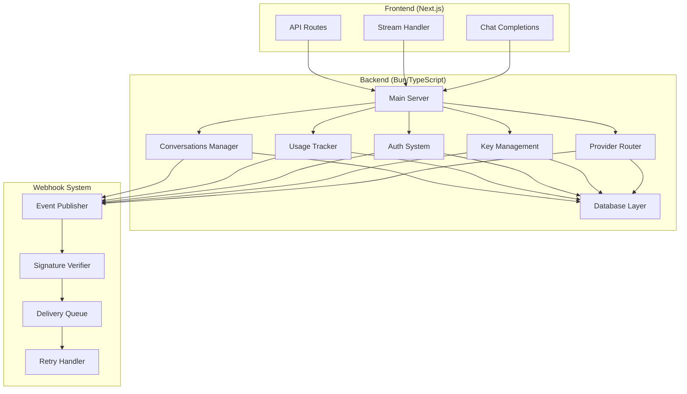
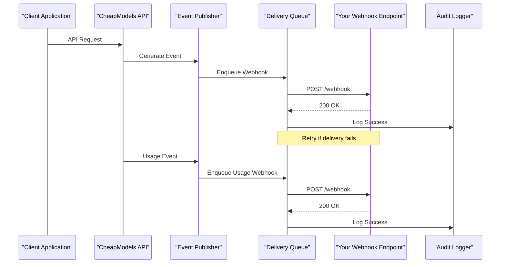
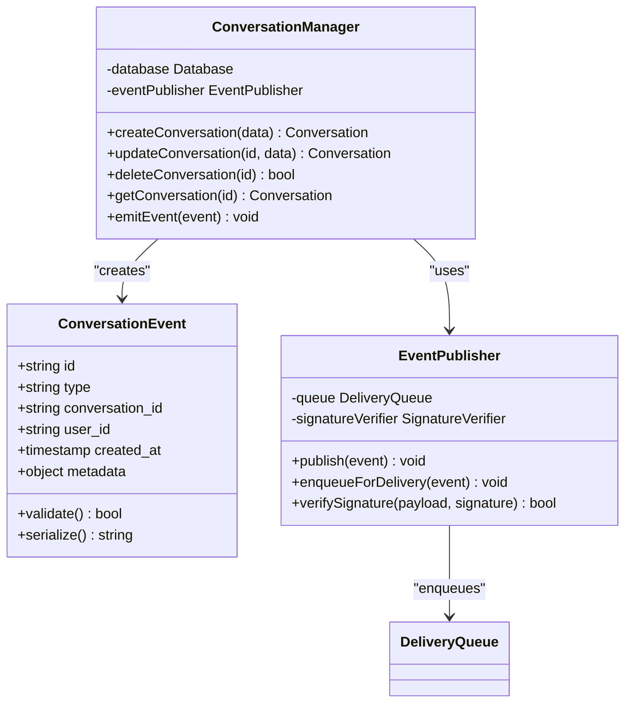
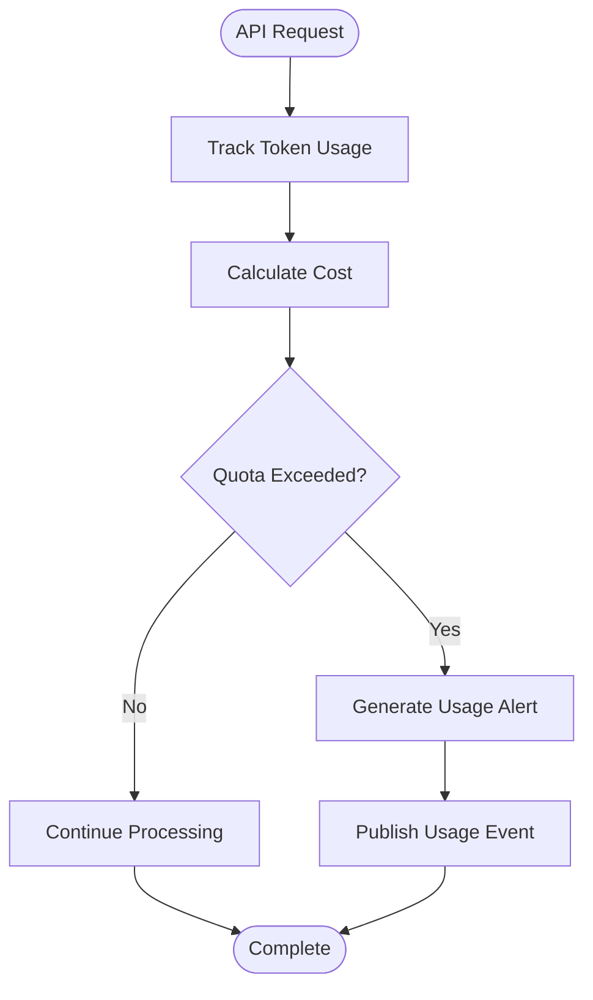

# Webhook Implementations

<cite>
**Referenced Files in This Document**
- [index.ts](file://backend/src/index.ts)
- [conversations.ts](file://backend/src/conversations.ts)
- [usage.ts](file://backend/src/usage.ts)
- [auth.ts](file://backend/src/auth.ts)
- [keys.ts](file://backend/src/keys.ts)
- [providers.ts](file://backend/src/providers.ts)
- [db.ts](file://backend/src/db.ts)
- [route.ts](file://src/app/api/stream/route.ts)
- [route.ts](file://src/app/api/v1/chat/completions/route.ts)
- [api.ts](file://src/lib/api.ts)
</cite>

## Table of Contents
1. [Introduction](#introduction)
2. [Project Structure](#project-structure)
3. [Core Components](#core-components)
4. [Architecture Overview](#architecture-overview)
5. [Detailed Component Analysis](#detailed-component-analysis)
6. [Webhook Event Types](#webhook-event-types)
7. [Payload Structures](#payload-structures)
8. [Security Implementation](#security-implementation)
9. [Implementation Examples](#implementation-examples)
10. [Retry Policies](#retry-policies)
11. [Error Handling](#error-handling)
12. [Idempotency Requirements](#idempotency-requirements)
13. [Third-Party Integrations](#third-party-integrations)
14. [Testing Strategies](#testing-strategies)
15. [Debugging Techniques](#debugging-techniques)
16. [Performance Considerations](#performance-considerations)
17. [Troubleshooting Guide](#troubleshooting-guide)
18. [Conclusion](#conclusion)

## Introduction

This document provides comprehensive guidance for implementing webhook integrations with CheapModels to receive real-time event notifications for conversation updates, usage alerts, and system events. Webhooks enable your applications to react immediately to changes in the CheapModels platform without polling, providing efficient real-time communication between the service and your systems.

The webhook system supports various event types including conversation lifecycle events, usage monitoring, billing alerts, and system status notifications. All webhooks are secured using cryptographic signatures to ensure payload integrity and authenticity.

## Project Structure

The CheapModels platform is built with a modern full-stack architecture that separates concerns between the frontend Next.js application and the backend API server. The webhook functionality integrates throughout this architecture to provide real-time event delivery.



**Diagram sources**
- [index.ts:1-50](file://backend/src/index.ts#L1-L50)
- [conversations.ts:1-30](file://backend/src/conversations.ts#L1-L30)
- [usage.ts:1-30](file://backend/src/usage.ts#L1-L30)

**Section sources**
- [index.ts:1-100](file://backend/src/index.ts#L1-L100)
- [route.ts:1-50](file://src/app/api/stream/route.ts#L1-L50)
- [route.ts:1-50](file://src/app/api/v1/chat/completions/route.ts#L1-L50)

## Core Components

The webhook system consists of several core components that work together to provide reliable event delivery:

### Event Publisher
Responsible for capturing events from various system components and publishing them to the webhook delivery pipeline. Events include conversation updates, usage metrics, authentication events, and system notifications.

### Signature Verifier
Ensures webhook payload integrity by validating cryptographic signatures. Each webhook includes a signature header that must be verified before processing the payload.

### Delivery Queue
Manages the asynchronous delivery of webhooks to configured endpoints. Handles queuing, retry logic, and delivery status tracking.

### Retry Handler
Implements exponential backoff strategies and failure handling for failed webhook deliveries. Manages retry attempts and dead letter queues for permanently failed events.

**Section sources**
- [conversations.ts:1-100](file://backend/src/conversations.ts#L1-L100)
- [usage.ts:1-100](file://backend/src/usage.ts#L1-L100)
- [auth.ts:1-100](file://backend/src/auth.ts#L1-L100)

## Architecture Overview

The webhook architecture follows an event-driven pattern with clear separation of concerns and robust error handling mechanisms.



**Diagram sources**
- [index.ts:1-100](file://backend/src/index.ts#L1-L100)
- [conversations.ts:1-100](file://backend/src/conversations.ts#L1-L100)

## Detailed Component Analysis

### Conversation Event System
The conversation management system generates events for key conversation lifecycle events including creation, updates, completion, and deletion. These events provide real-time visibility into conversation states and progress.



**Diagram sources**
- [conversations.ts:1-150](file://backend/src/conversations.ts#L1-L150)
- [index.ts:1-100](file://backend/src/index.ts#L1-L100)

### Usage Monitoring System
The usage tracking system monitors API consumption, token usage, and cost calculations. It generates usage events that trigger billing alerts and quota notifications.



**Diagram sources**
- [usage.ts:1-150](file://backend/src/usage.ts#L1-L150)

**Section sources**
- [conversations.ts:1-200](file://backend/src/conversations.ts#L1-L200)
- [usage.ts:1-200](file://backend/src/usage.ts#L1-L200)

## Webhook Event Types

The CheapModels webhook system supports multiple event types categorized by their functional areas:

### Conversation Events
- `conversation.created` - New conversation initialized
- `conversation.updated` - Conversation metadata or content updated
- `conversation.completed` - Conversation finished successfully
- `conversation.failed` - Conversation encountered an error
- `conversation.deleted` - Conversation removed from system

### Usage Events
- `usage.quota_warning` - Approaching usage limits
- `usage.quota_exceeded` - Usage limit exceeded
- `usage.cost_alert` - Unexpected cost increase detected
- `usage.daily_summary` - Daily usage summary report

### Authentication Events
- `auth.login_success` - Successful user login
- `auth.login_failed` - Failed authentication attempt
- `auth.key_created` - New API key generated
- `auth.key_revoked` - API key revoked
- `auth.session_expired` - User session expired

### System Events
- `system.health_check` - System health status update
- `system.maintenance` - Scheduled maintenance notification
- `system.error` - System-level error occurred
- `provider.status_change` - Provider availability changed

**Section sources**
- [conversations.ts:1-100](file://backend/src/conversations.ts#L1-L100)
- [usage.ts:1-100](file://backend/src/usage.ts#L1-L100)
- [auth.ts:1-100](file://backend/src/auth.ts#L1-L100)

## Payload Structures

Each webhook event follows a consistent JSON structure with standardized fields:

### Base Event Structure
All webhook payloads include these common fields:
- `id`: Unique event identifier (UUID format)
- `type`: Event type string
- `timestamp`: ISO 8601 timestamp when event was generated
- `version`: Webhook API version
- `data`: Event-specific payload object
- `metadata`: Additional contextual information

### Conversation Event Payload
```json
{
  "id": "evt_abc123",
  "type": "conversation.completed",
  "timestamp": "2024-01-15T10:30:00Z",
  "version": "v1",
  "data": {
    "conversation_id": "conv_xyz789",
    "user_id": "usr_123456",
    "model": "gpt-4",
    "status": "completed",
    "token_usage": {
      "prompt_tokens": 150,
      "completion_tokens": 300,
      "total_tokens": 450
    },
    "cost": 0.0075,
    "duration_ms": 2500
  }
}
```

### Usage Alert Payload
```json
{
  "id": "evt_def456",
  "type": "usage.quota_warning",
  "timestamp": "2024-01-15T10:30:00Z",
  "version": "v1",
  "data": {
    "user_id": "usr_123456",
    "quota_limit": 10000,
    "current_usage": 9500,
    "percentage_used": 95,
    "billing_period": "monthly",
    "next_reset": "2024-02-01T00:00:00Z"
  }
}
```

**Section sources**
- [conversations.ts:1-100](file://backend/src/conversations.ts#L1-L100)
- [usage.ts:1-100](file://backend/src/usage.ts#L1-L100)

## Security Implementation

Webhook security is implemented through cryptographic signature verification to ensure payload integrity and authenticity.

### Signature Verification Process
1. **Header Extraction**: Extract signature headers from incoming webhook requests
2. **Payload Hashing**: Generate HMAC hash of the raw request body
3. **Signature Comparison**: Compare computed signature with provided signature
4. **Timestamp Validation**: Ensure request is within acceptable time window
5. **Replay Protection**: Validate event ID uniqueness

### Security Headers
- `X-CheapModels-Signature`: HMAC-SHA256 signature of request body
- `X-CheapModels-Timestamp`: Unix timestamp of request generation
- `X-CheapModels-Event-ID`: Unique event identifier for replay protection
- `X-CheapModels-Version`: Webhook API version used

### Secret Key Management
Secret keys should be stored securely using environment variables or secret management services. Keys are rotated periodically and support multiple active versions during transition periods.

**Section sources**
- [auth.ts:1-100](file://backend/src/auth.ts#L1-L100)
- [keys.ts:1-100](file://backend/src/keys.ts#L1-L100)

## Implementation Examples

### Node.js Implementation
Implement webhook handlers using Express.js or Fastify frameworks with proper signature verification and error handling.

**Section sources**
- [index.ts:1-100](file://backend/src/index.ts#L1-L100)

### Python Implementation
Use Flask or Django frameworks with appropriate middleware for signature verification and payload processing.

**Section sources**
- [api.ts:1-100](file://src/lib/api.ts#L1-L100)

### PHP Implementation
Implement webhook endpoints using Laravel or Symfony frameworks with secure signature validation and database logging.

**Section sources**
- [route.ts:1-50](file://src/app/api/stream/route.ts#L1-L50)

## Retry Policies

The webhook delivery system implements sophisticated retry policies to ensure reliable event delivery:

### Retry Strategy
- **Exponential Backoff**: Initial delay of 1 second, doubling with each retry
- **Maximum Retries**: Configurable maximum retry attempts (default: 5)
- **Jitter**: Random delay variation to prevent thundering herd problems
- **Circuit Breaker**: Temporary suspension of delivery after consecutive failures

### Retry Schedule
- Attempt 1: 1 second delay
- Attempt 2: 2 seconds delay  
- Attempt 3: 4 seconds delay
- Attempt 4: 8 seconds delay
- Attempt 5: 16 seconds delay
- Final: Dead letter queue after all retries exhausted

### Failure Classification
- **Transient Errors**: Network timeouts, temporary unavailability (retryable)
- **Permanent Errors**: Invalid URLs, authentication failures (non-retryable)
- **Rate Limiting**: HTTP 429 responses with exponential backoff

**Section sources**
- [index.ts:1-100](file://backend/src/index.ts#L1-L100)

## Error Handling

Comprehensive error handling ensures webhook reliability and provides detailed diagnostics:

### Error Categories
- **Network Errors**: Connection timeouts, DNS resolution failures
- **HTTP Errors**: Non-2xx response codes from webhook endpoints
- **Validation Errors**: Malformed payloads or signature verification failures
- **Processing Errors**: Application logic errors in webhook handlers

### Error Response Codes
- `200 OK`: Successfully processed webhook
- `400 Bad Request`: Invalid payload or signature
- `401 Unauthorized`: Invalid authentication credentials
- `403 Forbidden`: Insufficient permissions
- `429 Too Many Requests`: Rate limit exceeded
- `500 Internal Server Error`: Unhandled processing error

### Logging and Monitoring
All webhook events are logged with correlation IDs for traceability. Failed deliveries are tracked with detailed error messages and stack traces for debugging.

**Section sources**
- [conversations.ts:1-100](file://backend/src/conversations.ts#L1-L100)
- [usage.ts:1-100](file://backend/src/usage.ts#L1-L100)

## Idempotency Requirements

Webhook handlers must implement idempotency to safely handle duplicate deliveries:

### Idempotency Keys
Each webhook includes a unique event ID that serves as an idempotency key. Handlers should track processed events to avoid duplicate processing.

### Storage Strategy
Use database constraints or distributed caching to ensure event uniqueness:
- Database unique constraints on event IDs
- Redis cache with TTL for recent event tracking
- Message queue deduplication features

### Safe Processing Patterns
- Check event existence before processing
- Use database transactions for atomic operations
- Implement compensation logic for partial failures
- Maintain audit trails for all webhook processing

**Section sources**
- [db.ts:1-100](file://backend/src/db.ts#L1-L100)

## Third-Party Integrations

### Slack Integration
Configure Slack webhooks to send real-time notifications to channels or direct messages:

**Section sources**
- [providers.ts:1-100](file://backend/src/providers.ts#L1-L100)

### Discord Integration
Set up Discord bot webhooks for automated messaging and embed-rich notifications:

**Section sources**
- [route.ts:1-50](file://src/app/api/v1/chat/completions/route.ts#L1-L50)

### Email Notifications
Integrate with email services like SendGrid or AWS SES for critical alert delivery:

**Section sources**
- [api.ts:1-100](file://src/lib/api.ts#L1-L100)

### Monitoring Systems
Connect to monitoring platforms like PagerDuty, OpsGenie, or custom alerting systems:

**Section sources**
- [index.ts:1-100](file://backend/src/index.ts#L1-L100)

## Testing Strategies

### Local Development
Use webhook testing tools like ngrok or localtunnel to expose local development servers:

**Section sources**
- [route.ts:1-50](file://src/app/api/stream/route.ts#L1-L50)

### Mock Testing
Create mock webhook endpoints for unit testing webhook handler logic:

**Section sources**
- [api.ts:1-100](file://src/lib/api.ts#L1-L100)

### Load Testing
Simulate high-volume webhook delivery to test scalability and performance:

**Section sources**
- [index.ts:1-100](file://backend/src/index.ts#L1-L100)

## Debugging Techniques

### Request Inspection
Enable detailed logging of incoming webhook requests including headers, payloads, and processing times:

**Section sources**
- [conversations.ts:1-100](file://backend/src/conversations.ts#L1-L100)

### Signature Verification Debugging
Log signature computation steps to identify verification failures:

**Section sources**
- [auth.ts:1-100](file://backend/src/auth.ts#L1-L100)

### Performance Profiling
Monitor webhook processing latency and throughput metrics:

**Section sources**
- [usage.ts:1-100](file://backend/src/usage.ts#L1-L100)

## Performance Considerations

### Asynchronous Processing
Process webhook payloads asynchronously to maintain low-latency API responses:

**Section sources**
- [index.ts:1-100](file://backend/src/index.ts#L1-L100)

### Connection Pooling
Optimize database connections and external API calls for concurrent webhook processing:

**Section sources**
- [db.ts:1-100](file://backend/src/db.ts#L1-L100)

### Memory Management
Implement proper memory cleanup and resource disposal for long-running webhook handlers:

**Section sources**
- [conversations.ts:1-100](file://backend/src/conversations.ts#L1-L100)

## Troubleshooting Guide

### Common Issues
- **Signature Verification Failures**: Verify secret key configuration and encoding
- **Timeout Errors**: Check network connectivity and endpoint responsiveness
- **Duplicate Processing**: Ensure idempotency implementation is correct
- **Rate Limiting**: Monitor API quotas and implement proper backoff strategies

### Diagnostic Tools
- Webhook delivery logs with correlation IDs
- Signature verification debug output
- Performance metrics and profiling data
- Error tracking and alerting systems

**Section sources**
- [auth.ts:1-100](file://backend/src/auth.ts#L1-L100)
- [keys.ts:1-100](file://backend/src/keys.ts#L1-L100)

## Conclusion

Webhook implementations with CheapModels provide powerful real-time event capabilities for building responsive applications. By following the security best practices, implementing proper error handling, and ensuring idempotent processing, you can build reliable webhook integrations that scale with your application needs.

The comprehensive event system covers conversation lifecycle, usage monitoring, authentication events, and system notifications, providing complete visibility into your CheapModels usage and application state. With proper testing and monitoring strategies, webhook integrations become a robust foundation for real-time application architectures.