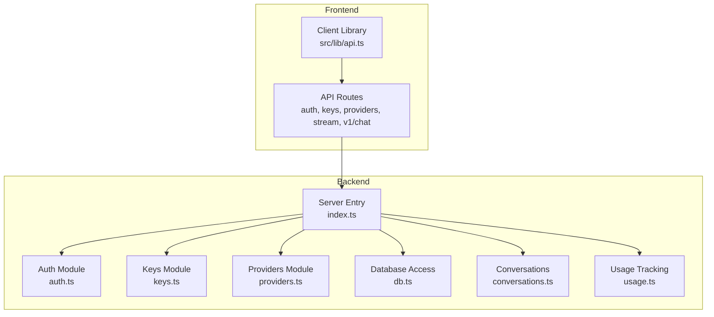
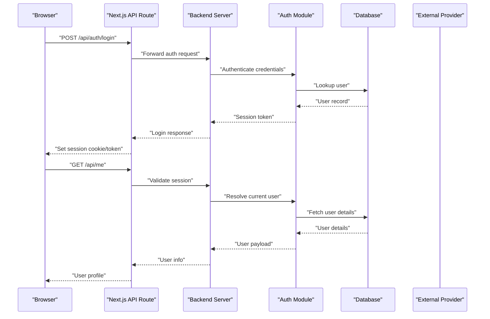
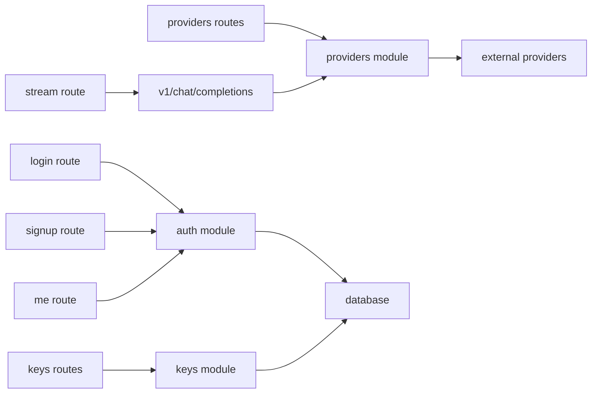

# Troubleshooting

<cite>
**Referenced Files in This Document**
- [backend/src/auth.ts](file://backend/src/auth.ts)
- [backend/src/keys.ts](file://backend/src/keys.ts)
- [backend/src/providers.ts](file://backend/src/providers.ts)
- [backend/src/index.ts](file://backend/src/index.ts)
- [src/app/api/auth/login/route.ts](file://src/app/api/auth/login/route.ts)
- [src/app/api/auth/signup/route.ts](file://src/app/api/auth/signup/route.ts)
- [src/app/api/me/route.ts](file://src/app/api/me/route.ts)
- [src/app/api/keys/route.ts](file://src/app/api/keys/route.ts)
- [src/app/api/keys/[id]/route.ts](file://src/app/api/keys/[id]/route.ts)
- [src/app/api/providers/route.ts](file://src/app/api/providers/route.ts)
- [src/app/api/providers/[id]/route.ts](file://src/app/api/providers/[id]/route.ts)
- [src/app/api/stream/route.ts](file://src/app/api/stream/route.ts)
- [src/app/api/v1/chat/completions/route.ts](file://src/app/api/v1/chat/completions/route.ts)
- [src/lib/api.ts](file://src/lib/api.ts)
- [backend/src/db.ts](file://backend/src/db.ts)
- [backend/src/conversations.ts](file://backend/src/conversations.ts)
- [backend/src/usage.ts](file://backend/src/usage.ts)
</cite>

## Table of Contents
1. Introduction
2. Project Structure
3. Core Components
4. Architecture Overview
5. Detailed Component Analysis
6. Dependency Analysis
7. Performance Considerations
8. Troubleshooting Guide
9. Conclusion
10. Appendices

## Introduction
This document provides a comprehensive troubleshooting guide for the application, focusing on authentication problems, API key configuration errors, provider connection issues, network request debugging, streaming failures, performance bottlenecks, and cross-platform considerations. It includes diagnostic techniques, logging strategies, error code references, log analysis guides, and step-by-step resolution procedures to help identify and resolve root causes quickly.

## Project Structure
The project is a Next.js application with a separate backend module:
- Frontend (Next.js): Pages, API routes, UI components, and client-side utilities
- Backend (Bun/Node): Authentication, keys management, providers, database access, conversations, usage tracking, and server entrypoint

**Diagram sources**
- [backend/src/index.ts](file://backend/src/index.ts)
- [backend/src/auth.ts](file://backend/src/auth.ts)
- [backend/src/keys.ts](file://backend/src/keys.ts)
- [backend/src/providers.ts](file://backend/src/providers.ts)
- [backend/src/db.ts](file://backend/src/db.ts)
- [backend/src/conversations.ts](file://backend/src/conversations.ts)
- [backend/src/usage.ts](file://backend/src/usage.ts)
- [src/app/api/auth/login/route.ts](file://src/app/api/auth/login/route.ts)
- [src/app/api/auth/signup/route.ts](file://src/app/api/auth/signup/route.ts)
- [src/app/api/keys/route.ts](file://src/app/api/keys/route.ts)
- [src/app/api/keys/[id]/route.ts](file://src/app/api/keys/[id]/route.ts)
- [src/app/api/providers/route.ts](file://src/app/api/providers/route.ts)
- [src/app/api/providers/[id]/route.ts](file://src/app/api/providers/[id]/route.ts)
- [src/app/api/stream/route.ts](file://src/app/api/stream/route.ts)
- [src/app/api/v1/chat/completions/route.ts](file://src/app/api/v1/chat/completions/route.ts)
- [src/lib/api.ts](file://src/lib/api.ts)

**Section sources**
- [backend/src/index.ts](file://backend/src/index.ts)
- [src/app/api/auth/login/route.ts](file://src/app/api/auth/login/route.ts)
- [src/app/api/auth/signup/route.ts](file://src/app/api/auth/signup/route.ts)
- [src/app/api/keys/route.ts](file://src/app/api/keys/route.ts)
- [src/app/api/keys/[id]/route.ts](file://src/app/api/keys/[id]/route.ts)
- [src/app/api/providers/route.ts](file://src/app/api/providers/route.ts)
- [src/app/api/providers/[id]/route.ts](file://src/app/api/providers/[id]/route.ts)
- [src/app/api/stream/route.ts](file://src/app/api/stream/route.ts)
- [src/app/api/v1/chat/completions/route.ts](file://src/app/api/v1/chat/completions/route.ts)
- [src/lib/api.ts](file://src/lib/api.ts)

## Core Components
- Authentication endpoints: login and signup flows, session handling, and user context retrieval
- Keys management: create, list, update, delete API keys; validation and scoping
- Providers management: configure external model providers; validate credentials; test connectivity
- Streaming endpoint: server-side streaming for chat completions
- v1/chat/completions proxy: OpenAI-compatible interface that routes requests to configured providers
- Client library: centralized HTTP client used by frontend pages and components

Key responsibilities and interactions are implemented across the following files:
- Authentication: [backend/src/auth.ts](file://backend/src/auth.ts), [src/app/api/auth/login/route.ts](file://src/app/api/auth/login/route.ts), [src/app/api/auth/signup/route.ts](file://src/app/api/auth/signup/route.ts), [src/app/api/me/route.ts](file://src/app/api/me/route.ts)
- Keys: [backend/src/keys.ts](file://backend/src/keys.ts), [src/app/api/keys/route.ts](file://src/app/api/keys/route.ts), [src/app/api/keys/[id]/route.ts](file://src/app/api/keys/[id]/route.ts)
- Providers: [backend/src/providers.ts](file://backend/src/providers.ts), [src/app/api/providers/route.ts](file://src/app/api/providers/route.ts), [src/app/api/providers/[id]/route.ts](file://src/app/api/providers/[id]/route.ts)
- Streaming and Chat: [src/app/api/stream/route.ts](file://src/app/api/stream/route.ts), [src/app/api/v1/chat/completions/route.ts](file://src/app/api/v1/chat/completions/route.ts)
- Client: [src/lib/api.ts](file://src/lib/api.ts)
- Data layer: [backend/src/db.ts](file://backend/src/db.ts), [backend/src/conversations.ts](file://backend/src/conversations.ts), [backend/src/usage.ts](file://backend/src/usage.ts)

**Section sources**
- [backend/src/auth.ts](file://backend/src/auth.ts)
- [backend/src/keys.ts](file://backend/src/keys.ts)
- [backend/src/providers.ts](file://backend/src/providers.ts)
- [backend/src/db.ts](file://backend/src/db.ts)
- [backend/src/conversations.ts](file://backend/src/conversations.ts)
- [backend/src/usage.ts](file://backend/src/usage.ts)
- [src/app/api/auth/login/route.ts](file://src/app/api/auth/login/route.ts)
- [src/app/api/auth/signup/route.ts](file://src/app/api/auth/signup/route.ts)
- [src/app/api/me/route.ts](file://src/app/api/me/route.ts)
- [src/app/api/keys/route.ts](file://src/app/api/keys/route.ts)
- [src/app/api/keys/[id]/route.ts](file://src/app/api/keys/[id]/route.ts)
- [src/app/api/providers/route.ts](file://src/app/api/providers/route.ts)
- [src/app/api/providers/[id]/route.ts](file://src/app/api/providers/[id]/route.ts)
- [src/app/api/stream/route.ts](file://src/app/api/stream/route.ts)
- [src/app/api/v1/chat/completions/route.ts](file://src/app/api/v1/chat/completions/route.ts)
- [src/lib/api.ts](file://src/lib/api.ts)

## Architecture Overview
The system follows a layered architecture:
- Presentation layer: Next.js pages and components
- API layer: Next.js API routes and backend server entrypoint
- Service layer: Auth, Keys, Providers modules
- Data layer: Database access, conversations, usage tracking

**Diagram sources**
- [src/app/api/auth/login/route.ts](file://src/app/api/auth/login/route.ts)
- [src/app/api/auth/signup/route.ts](file://src/app/api/auth/signup/route.ts)
- [src/app/api/me/route.ts](file://src/app/api/me/route.ts)
- [backend/src/auth.ts](file://backend/src/auth.ts)
- [backend/src/db.ts](file://backend/src/db.ts)

## Detailed Component Analysis

### Authentication Flow
- Login: Validates credentials, creates or refreshes session, returns token or sets secure cookies
- Signup: Creates new user account, validates input, persists user data
- Me: Retrieves authenticated user context using session/token

Common issues:
- Invalid credentials or missing fields
- Session expiration or cookie domain/path misconfiguration
- CORS or CSRF restrictions blocking requests from different origins

Resolution steps:
- Verify credentials and required fields
- Check session storage and cookie settings
- Ensure correct origin and headers in client requests

**Section sources**
- [src/app/api/auth/login/route.ts](file://src/app/api/auth/login/route.ts)
- [src/app/api/auth/signup/route.ts](file://src/app/api/auth/signup/route.ts)
- [src/app/api/me/route.ts](file://src/app/api/me/route.ts)
- [backend/src/auth.ts](file://backend/src/auth.ts)

### API Keys Management
- Create: Generate new API key with optional scopes and metadata
- List: Retrieve all keys for the authenticated user
- Update/Delete: Modify or remove existing keys
- Validation: Enforce format, uniqueness, and ownership checks

Common issues:
- Missing or malformed API key header
- Key revoked or expired
- Insufficient permissions or scope mismatch

Resolution steps:
- Confirm key presence and correctness in Authorization header
- Check key status and expiration in dashboard
- Review scope requirements for specific endpoints

**Section sources**
- [backend/src/keys.ts](file://backend/src/keys.ts)
- [src/app/api/keys/route.ts](file://src/app/api/keys/route.ts)
- [src/app/api/keys/[id]/route.ts](file://src/app/api/keys/[id]/route.ts)

### Providers Configuration
- Configure provider credentials (e.g., base URL, API key)
- Validate connectivity and credentials
- Test provider availability before use

Common issues:
- Incorrect provider base URL or API key
- Network firewall or DNS resolution failure
- Rate limiting or quota exceeded by provider

Resolution steps:
- Validate provider configuration values
- Perform connectivity tests from server environment
- Monitor provider rate limits and quotas

**Section sources**
- [backend/src/providers.ts](file://backend/src/providers.ts)
- [src/app/api/providers/route.ts](file://src/app/api/providers/route.ts)
- [src/app/api/providers/[id]/route.ts](file://src/app/api/providers/[id]/route.ts)

### Streaming Endpoint
- Server-side streaming for real-time responses
- Handles backpressure and partial content delivery
- Integrates with provider streaming APIs

Common issues:
- Connection drops or timeouts
- Incompatible browser or client streaming support
- Large payloads causing memory pressure

Resolution steps:
- Enable retry logic and exponential backoff on client
- Monitor server logs for stream interruptions
- Adjust chunk sizes and timeout thresholds

**Section sources**
- [src/app/api/stream/route.ts](file://src/app/api/stream/route.ts)

### v1/chat/completions Proxy
- OpenAI-compatible endpoint that proxies requests to configured providers
- Normalizes request/response formats
- Applies authentication and usage tracking

Common issues:
- Mismatched request schema vs provider expectations
- Unauthorized due to missing or invalid API key
- Provider-specific error codes not mapped correctly

Resolution steps:
- Validate request payload structure
- Ensure correct provider selection and credentials
- Map provider error codes to standardized responses

**Section sources**
- [src/app/api/v1/chat/completions/route.ts](file://src/app/api/v1/chat/completions/route.ts)

### Client Library
- Centralized HTTP client for API calls
- Handles headers, retries, and error normalization
- Provides typed methods for common operations

Common issues:
- Incorrect base URL or missing environment variables
- Headers not attached (e.g., Authorization)
- Response parsing errors

Resolution steps:
- Verify environment configuration and base URL
- Ensure headers are set consistently
- Add detailed logging around request/response lifecycle

**Section sources**
- [src/lib/api.ts](file://src/lib/api.ts)

## Dependency Analysis
The following diagram shows core dependencies between modules and endpoints:

**Diagram sources**
- [src/app/api/auth/login/route.ts](file://src/app/api/auth/login/route.ts)
- [src/app/api/auth/signup/route.ts](file://src/app/api/auth/signup/route.ts)
- [src/app/api/me/route.ts](file://src/app/api/me/route.ts)
- [backend/src/auth.ts](file://backend/src/auth.ts)
- [src/app/api/keys/route.ts](file://src/app/api/keys/route.ts)
- [src/app/api/keys/[id]/route.ts](file://src/app/api/keys/[id]/route.ts)
- [backend/src/keys.ts](file://backend/src/keys.ts)
- [src/app/api/providers/route.ts](file://src/app/api/providers/route.ts)
- [src/app/api/providers/[id]/route.ts](file://src/app/api/providers/[id]/route.ts)
- [backend/src/providers.ts](file://backend/src/providers.ts)
- [src/app/api/stream/route.ts](file://src/app/api/stream/route.ts)
- [src/app/api/v1/chat/completions/route.ts](file://src/app/api/v1/chat/completions/route.ts)
- [backend/src/db.ts](file://backend/src/db.ts)

**Section sources**
- [backend/src/index.ts](file://backend/src/index.ts)
- [backend/src/auth.ts](file://backend/src/auth.ts)
- [backend/src/keys.ts](file://backend/src/keys.ts)
- [backend/src/providers.ts](file://backend/src/providers.ts)
- [backend/src/db.ts](file://backend/src/db.ts)
- [src/app/api/auth/login/route.ts](file://src/app/api/auth/login/route.ts)
- [src/app/api/auth/signup/route.ts](file://src/app/api/auth/signup/route.ts)
- [src/app/api/me/route.ts](file://src/app/api/me/route.ts)
- [src/app/api/keys/route.ts](file://src/app/api/keys/route.ts)
- [src/app/api/keys/[id]/route.ts](file://src/app/api/keys/[id]/route.ts)
- [src/app/api/providers/route.ts](file://src/app/api/providers/route.ts)
- [src/app/api/providers/[id]/route.ts](file://src/app/api/providers/[id]/route.ts)
- [src/app/api/stream/route.ts](file://src/app/api/stream/route.ts)
- [src/app/api/v1/chat/completions/route.ts](file://src/app/api/v1/chat/completions/route.ts)

## Performance Considerations
- Use connection pooling for database and external provider calls
- Implement caching for frequently accessed resources (e.g., provider metadata)
- Stream large responses to reduce memory footprint
- Apply rate limiting at API gateway or server level
- Profile hot paths and optimize serialization/deserialization

[No sources needed since this section provides general guidance]

## Troubleshooting Guide

### Authentication Problems
Symptoms:
- Login fails with invalid credentials
- Session expires unexpectedly
- Protected endpoints return unauthorized errors

Diagnostic steps:
- Inspect login and me endpoints for error responses
- Verify session token or cookie presence and validity
- Check auth module for credential validation logic

Resolution procedures:
- Reset password if credentials are incorrect
- Refresh or re-authenticate to obtain a new session
- Ensure correct headers and cookie settings for cross-origin requests

**Section sources**
- [src/app/api/auth/login/route.ts](file://src/app/api/auth/login/route.ts)
- [src/app/api/auth/signup/route.ts](file://src/app/api/auth/signup/route.ts)
- [src/app/api/me/route.ts](file://src/app/api/me/route.ts)
- [backend/src/auth.ts](file://backend/src/auth.ts)

### API Key Configuration Errors
Symptoms:
- Requests fail with missing or invalid API key
- Key appears valid but lacks required scopes
- Key revocation leads to immediate failures

Diagnostic steps:
- Review keys routes and module for validation and scoping
- Confirm Authorization header format and value
- Check key existence and status in database

Resolution procedures:
- Regenerate API key with appropriate scopes
- Update client configuration to include correct header
- Revoke compromised keys and rotate secrets

**Section sources**
- [backend/src/keys.ts](file://backend/src/keys.ts)
- [src/app/api/keys/route.ts](file://src/app/api/keys/route.ts)
- [src/app/api/keys/[id]/route.ts](file://src/app/api/keys/[id]/route.ts)

### Provider Connection Issues
Symptoms:
- Provider returns connection refused or timeout
- Credentials rejected by provider
- Rate limit or quota exceeded errors

Diagnostic steps:
- Examine providers routes and module for connectivity tests
- Validate base URL and API key configuration
- Monitor external provider status and quotas

Resolution procedures:
- Correct provider configuration values
- Adjust network policies to allow outbound connections
- Implement retry with backoff and circuit breaker patterns

**Section sources**
- [backend/src/providers.ts](file://backend/src/providers.ts)
- [src/app/api/providers/route.ts](file://src/app/api/providers/route.ts)
- [src/app/api/providers/[id]/route.ts](file://src/app/api/providers/[id]/route.ts)

### Debugging Network Requests
Techniques:
- Log request method, URL, headers, and body size
- Capture response status, headers, and error messages
- Use structured logging with correlation IDs

Tools:
- Browser DevTools Network tab
- Server-side request/response logging middleware
- External tracing tools integrated into API routes

Best practices:
- Avoid logging sensitive data (tokens, keys)
- Include timestamps and trace identifiers
- Aggregate logs for analysis and alerting

**Section sources**
- [src/lib/api.ts](file://src/lib/api.ts)
- [src/app/api/v1/chat/completions/route.ts](file://src/app/api/v1/chat/completions/route.ts)

### Streaming Failures
Symptoms:
- Stream terminates prematurely
- Partial chunks received without completion
- High latency or dropped connections

Diagnostic steps:
- Inspect stream endpoint for error handling and backpressure
- Verify client streaming implementation and event listeners
- Monitor server resource usage during long streams

Resolution procedures:
- Implement robust retry and reconnect logic
- Tune chunk sizes and timeouts
- Add health checks and graceful degradation

**Section sources**
- [src/app/api/stream/route.ts](file://src/app/api/stream/route.ts)

### Performance Bottlenecks
Indicators:
- Slow response times under load
- High CPU or memory usage
- Database query latency spikes

Diagnostic steps:
- Profile API routes and service functions
- Analyze database queries and indexes
- Measure external provider call durations

Optimization strategies:
- Cache expensive computations and lookups
- Optimize database queries and add indexes
- Parallelize independent operations where safe

**Section sources**
- [backend/src/db.ts](file://backend/src/db.ts)
- [backend/src/conversations.ts](file://backend/src/conversations.ts)
- [backend/src/usage.ts](file://backend/src/usage.ts)

### Diagnostic Tools and Logging Strategies
Recommendations:
- Centralize logging with structured JSON format
- Integrate metrics collection (latency, error rates)
- Use distributed tracing across frontend and backend

Implementation tips:
- Attach correlation IDs to requests
- Log at appropriate levels (info, warn, error)
- Redact sensitive information automatically

**Section sources**
- [src/lib/api.ts](file://src/lib/api.ts)
- [backend/src/index.ts](file://backend/src/index.ts)

### Error Code References
Common categories:
- Authentication errors: invalid credentials, expired session
- Authorization errors: insufficient permissions, missing API key
- Validation errors: malformed request payload
- Provider errors: connection refused, rate limited, quota exceeded
- Streaming errors: interrupted stream, timeout

Mapping strategy:
- Normalize provider-specific codes to standard codes
- Include human-readable messages and actionable hints
- Return consistent error envelope across endpoints

**Section sources**
- [src/app/api/v1/chat/completions/route.ts](file://src/app/api/v1/chat/completions/route.ts)
- [backend/src/providers.ts](file://backend/src/providers.ts)

### Log Analysis Guides
Approach:
- Filter logs by correlation ID to follow request lifecycle
- Identify error spikes and correlate with deployments
- Track slow endpoints and frequent failures

Patterns to watch:
- Repeated authentication failures
- Provider connectivity warnings
- Database query timeouts

Actions:
- Set up alerts for critical error thresholds
- Maintain runbooks for common failure scenarios
- Periodically review and refine log retention policies

**Section sources**
- [backend/src/index.ts](file://backend/src/index.ts)
- [backend/src/usage.ts](file://backend/src/usage.ts)

### Step-by-Step Resolution Procedures
Authentication:
1. Verify credentials and required fields
2. Check session token or cookie presence
3. Confirm CORS and CSRF settings
4. Re-authenticate if session expired

API Keys:
1. Confirm key exists and is active
2. Validate Authorization header format
3. Ensure required scopes are granted
4. Rotate key if compromised

Providers:
1. Validate base URL and API key
2. Test connectivity from server environment
3. Check provider quotas and rate limits
4. Retry with backoff and fallbacks

Streaming:
1. Inspect stream endpoint logs for interruptions
2. Verify client event listeners and error handlers
3. Adjust chunk sizes and timeouts
4. Implement reconnect logic

**Section sources**
- [src/app/api/auth/login/route.ts](file://src/app/api/auth/login/route.ts)
- [src/app/api/keys/route.ts](file://src/app/api/keys/route.ts)
- [src/app/api/providers/route.ts](file://src/app/api/providers/route.ts)
- [src/app/api/stream/route.ts](file://src/app/api/stream/route.ts)

### Browser Compatibility Issues
Considerations:
- Fetch API availability and polyfills
- Streaming support differences across browsers
- Cookie SameSite and Secure attributes

Mitigations:
- Feature detection and fallbacks
- Graceful degradation for unsupported features
- Clear error messages guiding users to supported browsers

[No sources needed since this section provides general guidance]

### Mobile Responsiveness Problems
Checklist:
- Viewport meta tag configuration
- Touch-friendly controls and spacing
- Adaptive layouts and media queries

Remediation:
- Test on multiple devices and orientations
- Optimize images and assets for mobile networks
- Reduce layout thrashing and repaints

[No sources needed since this section provides general guidance]

### Cross-Platform Considerations
Guidelines:
- Consistent behavior across desktop and mobile
- Platform-specific feature flags
- Environment-aware configuration loading

Validation:
- Automated testing on target platforms
- Manual QA on representative devices
- Monitoring platform-specific error rates

[No sources needed since this section provides general guidance]

## Conclusion
This troubleshooting guide consolidates common issues and their resolutions across authentication, API keys, provider connectivity, networking, streaming, and performance. By applying the diagnostic techniques, logging strategies, and step-by-step procedures outlined here, teams can rapidly identify root causes and restore service reliability. Continuous monitoring, structured logging, and proactive optimization will further enhance stability and user experience.

[No sources needed since this section summarizes without analyzing specific files]

## Appendices

### Quick Reference: Endpoints and Responsibilities
- Authentication: login, signup, me
- Keys: CRUD operations for API keys
- Providers: configuration and connectivity tests
- Streaming: server-side streaming endpoint
- v1/chat/completions: OpenAI-compatible proxy

**Section sources**
- [src/app/api/auth/login/route.ts](file://src/app/api/auth/login/route.ts)
- [src/app/api/auth/signup/route.ts](file://src/app/api/auth/signup/route.ts)
- [src/app/api/me/route.ts](file://src/app/api/me/route.ts)
- [src/app/api/keys/route.ts](file://src/app/api/keys/route.ts)
- [src/app/api/keys/[id]/route.ts](file://src/app/api/keys/[id]/route.ts)
- [src/app/api/providers/route.ts](file://src/app/api/providers/route.ts)
- [src/app/api/providers/[id]/route.ts](file://src/app/api/providers/[id]/route.ts)
- [src/app/api/stream/route.ts](file://src/app/api/stream/route.ts)
- [src/app/api/v1/chat/completions/route.ts](file://src/app/api/v1/chat/completions/route.ts)