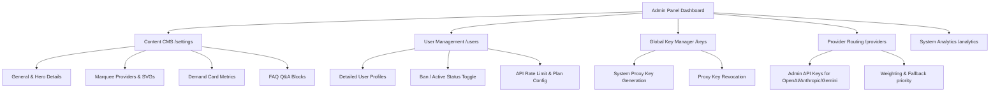

# CheapAgents — Remaining Features & Admin Side A-to-Z Control Plan

This document outlines the remaining features, UI/UX improvements, and the blueprint for the **Admin Side A-to-Z Control Panel** to manage the landing page, users, providers, routing, and system analytics.

---

## 1. Remaining Features & Improvements (All Pages)

| Page / Section | Current Status | Required Action / Feature Details | Priority |
| :--- | :--- | :--- | :--- |
| **Landing Page** | ⚠️ Unaligned Hero | • Fix the vertical alignment of the hero section when the static heading is disabled. • Ensure the `TextLoop` has a stable height to prevent layout shifts. • Add scroll-reveal animations to pricing, features, and FAQs. | High |
| **Login / Signup** | ✅ Good | • Wire up mock or real auth context (NextAuth/Firebase stub). • Create protected client routes for `/dashboard` to prevent unauthenticated jumps. | Medium |
| **Documentation (`/docs`)**| ⚠️ Single-page | • Convert single documentation page into a structured, side-nav tree layout. • Add interactive code blocks with a "Copy to Clipboard" button + Toast notification. | Medium |
| **User Dashboard** | ⚠️ Partial stubs | • `/dashboard/overview`: Wire real summarized user metrics (API calls, balance, active keys). • `/dashboard/keys`: Fully functional key generation, testing, copying (with toast), and revoking. • `/dashboard/settings`: Make the billing, profile, and email preference forms functional. | High |
| **User Playground (`/chat`)**| ❌ Missing | • Create an interactive chat playground where users select a connected model, enter a prompt, and get streamed responses. | High |
| **CLI Page (`/cli`)** | ❌ Missing | • Add installation commands, configurations, and common usage examples for `cheap-cli`. | Medium |
| **Pricing (`/pricing`)** | ❌ Missing | • Build a multi-tier comparison pricing page with upgrade buttons wired to a mock checkout flow. | High |

---

## 2. Admin Side A-to-Z Control Blueprint

To provide complete, real-time control over the application, the **Admin Dashboard** will manage content, user authentication status, database models, global keys, and upstream provider routing.

### A. Dynamic Content CMS (`/admin/settings`)
*Provides full, dynamic CRUD options for the landing page without modifying the source code.*
* **General Identity Settings:** Edit `brandName`, upload site `logoUrl`, and configure custom `faviconUrl`.
* **Hero Content Editor:**
  * **Static Heading Switch:** Toggle static text on/off.
  * **Animated Text Loop:** Manage the scrolling text array (`heroAnimatedTexts`).
  * **Hero Button Controls:** Edit primary/secondary buttons text, links, and detailed tooltips.
* **Marquee Providers Slider:**
  * View list of active providers in the slider.
  * Add custom SVG code or logo images for new providers (e.g. DeepSeek, Meta, Cohere).
* **Demand Section Management:**
  * Edit main Title & Subtitle.
  * Edit individual cards: Customize count/label text (e.g., "10k+ active developers") and pick badge color sstatustatus.
* **FAQs Editor:**
  * Add, edit, reorder, or delete Question/Answer cards shown on the landing page.

### B. User Database Control Panel (`/admin/users`)
*Allows administrator oversight of developers registered on the platform.*
* **Comprehensive Search & Pagination:** Instantly find users by username, email, ID, or subscription plan.
* **Detailed User Profiles (`/admin/users/[id]`):**
  * **Subscription Plan Selector:** Elevate or downgrade users (Free $\rightarrow$ Pro $\rightarrow$ Enterprise).
  * **Action Controls:** Instantly **Ban/Suspend** or **Activate** a user. When suspended, all user keys are immediately deactivated.
  * **Activity Statistics:** View user join date, total API calls made, monthly token usage, and latency averages.

### C. Global Proxy Keys Manager (`/admin/keys` - *NEW*)
*Allows administrators to provision system-wide keys for backend routing.*
* **System Keys Table:** Show active global keys, current call count, and status.
* **Actions:**
  * Generate a new master proxy key.
  * Revoke an active master key in case of security leaks.
  * Adjust rate limits per master key.

### D. Provider Routing & Health Panel (`/admin/providers`)
*Ensures high availability and cost optimization.*
* **Provider Table:** Manage routing status for OpenAI, Anthropic (Claude), Google (Gemini), and ChatGPT.
* **Upstream Key Integration:** Connect administrative API keys to the backend.
* **Routing Controls:**
  * Dynamic toggle to put a provider "offline" or "online" instantly.
  * **Weighting/Fallback Priority:** Adjust weights for cost vs. speed (e.g., route 80% to Gemini for low cost, 20% to Claude for complex queries).
  * Test connectivity status showing latency in milliseconds.

### E. System Analytics & Revenue (`/admin/analytics`)
*Visualizes system-wide usage, costs, and profits.*
* **Usage Charts:** Line charts showing global tokens processed and API request counts daily.
* **Financial Charts:** Revenue vs. Cost breakdown pie charts for each model type.
* **System Activity Log:** Live, scrollable log table showing recent event types (User Signups, API key creations, system warnings).

---

> [!IMPORTANT]
> The admin page links inside the sidebar in `admin/layout.tsx` must be mapped correctly, and missing stubs like `/admin/keys` must be built.
